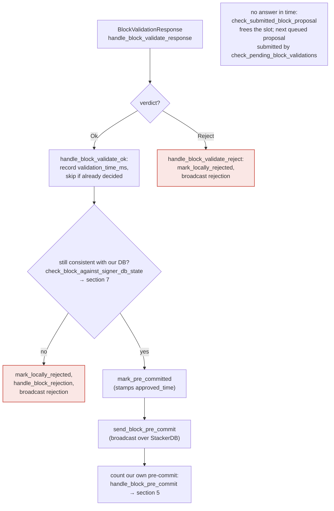

### Title
Non-deterministic wall-clock validation deadlines let a miner split signer verdicts on a valid block, wedging it into permanent global rejection - (File: `stackslib/src/net/api/postblock_proposal.rs`)

### Summary
`NakamotoBlockProposal::validate()` gates transaction execution against **wall-clock** deadlines (`Instant::now()` vs a deadline computed from `block_proposal_validation_timeout_secs`, `block_proposal_max_tx_execution_time_secs`, and `block_proposal_max_tx_analysis_time_secs`) rather than a deterministic cost metric. A miner can craft a block whose transaction execution time sits deliberately close to these thresholds. Because real execution time varies with each signer-node's hardware/load (exactly the same class of "attacker-influenced, resource-dependent decision cost" as the Sablier callback gas-bomb report, where the *cost of a critical operation* is made attacker-controllable and machine/state-dependent), different honest signer nodes validating the identical, otherwise-valid block can independently arrive at `Ok` or `Reject` verdicts. This breaks the assumption that block validation is deterministic across the signer set and can drive a valid block into `GloballyRejected` purely from timing variance, with no signer misbehavior or majority required.

### Finding Description
`validate()` computes:
```
stackslib/src/net/api/postblock_proposal.rs:731-753
let block_deadline = Instant::now() + Duration::from_secs(timeout_secs);
let per_tx_max_execution_time = Duration::from_secs(max_tx_execution_time_secs);
let per_tx_max_analysis_time = Duration::from_secs(max_tx_analysis_time_secs);
...
let resource_budgets = TransactionResourceBudgets::new()
    .with_analysis_budget(ResourceBudget::new().with_max_duration(Some(per_tx_max_analysis_time))...)
    .with_execution_budget(ResourceBudget::new().with_max_duration(Some(per_tx_max_execution_time))...);
``` [1](#0-0) 

and per-transaction, checks the deadline in real time:
```
stackslib/src/net/api/postblock_proposal.rs:755-771
for (i, tx) in self.block.txs.iter().enumerate() {
    if Instant::now() >= block_deadline {
        ...
        return Err(BlockValidateRejectReason { reason_code: ValidateRejectCode::InvalidBlock, ... });
    }
    ...
``` [2](#0-1) 

This is confirmed by design in the test suite: exceeding the per-tx execution budget blames the tx as `ProblematicTransaction` [3](#0-2) , while exceeding the overall block-level wall-clock deadline rejects the whole block as `InvalidBlock` without blaming any tx [4](#0-3) .

The verdict (`BlockValidateOk`/`BlockValidateReject`) is what feeds the signer's `handle_block_validate_response`: `Ok` moves the block toward a pre-commit and eventual signature; `Reject` marks it `LocallyRejected` and broadcasts a rejection [5](#0-4) . Rejections accumulate weight and, once ≥30% of total signing weight rejects (making 70% acceptance impossible), the block is marked `GloballyRejected` — a terminal state [6](#0-5) , matching the conceptual tally rule "over 30% rejected — 70% is now impossible → globally rejected" [7](#0-6) .

Because the deadline/budget comparisons use `Instant::now()` (wall-clock) rather than a deterministic execution-cost metric, the *same* block can legitimately validate as `Ok` on one signer's node (fast/idle hardware) and as `Reject`/`InvalidBlock`/`ProblematicTransaction` on another signer's node (slower/busier hardware), for a block that is fully valid and within Clarity's deterministic `ExecutionCost` limits (tracked separately via `BlockValidateOk.cost` [8](#0-7) ). A miner can deliberately craft transactions whose real running time sits at the edge of `block_proposal_max_tx_execution_time_secs`/`block_proposal_validation_timeout_secs` to maximize the chance of this split, exactly mirroring the external report's bug class: an adversarially-influenced, state/hardware-dependent execution cost is used as a gate for a critical, otherwise-deterministic decision.

### Impact Explanation
This can wedge the signer set's state machine on an entirely valid block: split `Ok`/`Reject` verdicts across honest signers can push accumulated rejection weight past the 30% threshold before acceptance weight reaches 70%, permanently marking a valid block `GloballyRejected` [9](#0-8) . This is a liveness wedge triggerable by a single (one-slot) miner crafting timing-sensitive transactions, requiring no signer collusion or majority, and it directly undermines the intended equality that all signers validating the same block should reach the same verdict.

### Likelihood Explanation
Likelihood depends on real-world variance in signer-node hardware/load and how tightly a miner can tune transaction execution time to the configured thresholds (`block_proposal_validation_timeout_secs`, `block_proposal_max_tx_execution_time_secs`, `block_proposal_max_tx_analysis_time_secs`, all wall-clock-based per `stacks-node/src/tests/signer/v0/mod.rs` and `stackslib/src/net/connection.rs` defaults [10](#0-9) ). Given heterogeneous signer infrastructure (mainnet signers run on operator-controlled machines with varying load), crafting Clarity contracts whose native execution time approaches these seconds-scale budgets is practically feasible for a miner.

### Recommendation
Avoid gating block-proposal correctness on wall-clock execution time for otherwise-deterministic validity determinations. Prefer bounding transaction/block acceptance purely by the deterministic Clarity `ExecutionCost` metric already tracked (`cost` in `BlockValidateOk`), and treat wall-clock timeouts only as an operational safeguard (e.g., "connectivity/timeout" style soft-fail that does not get counted the same as a definitive `InvalidBlock`/`ProblematicTransaction` rejection) so that divergent hardware speed cannot produce divergent, network-visible verdicts on the same block.

### Proof of Concept
1. A miner crafts a Nakamoto block containing a Clarity transaction whose real (non-deterministic) execution time is engineered to sit just under `block_proposal_max_tx_execution_time_secs` (or the overall `block_proposal_validation_timeout_secs`) on average hardware.
2. Fast/idle signer nodes complete validation before the deadline and return `BlockValidateOk`; the signers pre-commit and move toward signing.
3. Slower/busier signer nodes exceed the wall-clock deadline mid-validation, hitting the `Instant::now() >= block_deadline` check [11](#0-10)  (or the per-tx execution budget), returning `BlockValidateReject` with `ValidateRejectCode::InvalidBlock`/`ProblematicTransaction`.
4. Rejecting signers broadcast `BlockResponse::Rejected`, accumulating rejection weight in `handle_block_rejection` [6](#0-5) ; if this crosses the ≥30% threshold before acceptances reach 70%, the block is marked `GloballyRejected`, even though it is a fully valid block that other signers already validated successfully.

### Citations

**File:** stackslib/src/net/api/postblock_proposal.rs (L174-188)
```rust
/// A response for block proposal validation
///  that the stacks-node thinks is acceptable.
#[derive(Debug, Clone, PartialEq, Serialize, Deserialize)]
pub struct BlockValidateOk {
    pub signer_signature_hash: Sha512Trunc256Sum,
    pub cost: ExecutionCost,
    pub size: u64,
    pub validation_time_ms: u64,
    /// If a block was validated by a transaction replay set,
    /// then this returns `Some` with the hash of the replay set.
    pub replay_tx_hash: Option<u64>,
    /// If a block was validated by a transaction replay set,
    /// then this is true if this block exhausted the set of transactions.
    pub replay_tx_exhausted: bool,
}
```

**File:** stackslib/src/net/api/postblock_proposal.rs (L731-753)
```rust
        let block_deadline = Instant::now() + Duration::from_secs(timeout_secs);
        let per_tx_max_execution_time = Duration::from_secs(max_tx_execution_time_secs);
        // Bound the analysis phase during proposal validation by the
        // dedicated per-tx analysis budget, independently of the eval budget above.
        let per_tx_max_analysis_time = Duration::from_secs(max_tx_analysis_time_secs);
        let mut receipts_total = 0u64;

        let max_tx_mem_bytes_opt = if max_tx_mem_bytes > 0 {
            Some(max_tx_mem_bytes)
        } else {
            None
        };
        let resource_budgets = TransactionResourceBudgets::new()
            .with_analysis_budget(
                ResourceBudget::new()
                    .with_max_duration(Some(per_tx_max_analysis_time))
                    .with_max_memory_use(max_tx_mem_bytes_opt),
            )
            .with_execution_budget(
                ResourceBudget::new()
                    .with_max_duration(Some(per_tx_max_execution_time))
                    .with_max_memory_use(max_tx_mem_bytes_opt),
            );
```

**File:** stackslib/src/net/api/postblock_proposal.rs (L755-771)
```rust
        for (i, tx) in self.block.txs.iter().enumerate() {
            // Enforce the overall block validation budget between txs. A tx
            // running over its own per-tx limit is the tx's fault and is
            // handled below; running out of overall budget is the block's
            // fault and shouldn't flag any specific tx as problematic.
            if Instant::now() >= block_deadline {
                warn!(
                    "Rejected block proposal";
                    "reason" => "Block validation timed out",
                    "next_tx_index" => i,
                );
                return Err(BlockValidateRejectReason {
                    reason: format!("Block validation timed out before tx {i} could be processed"),
                    reason_code: ValidateRejectCode::InvalidBlock,
                    failed_txid: None,
                });
            }
```

**File:** stackslib/src/net/api/tests/postblock_proposal.rs (L517-534)
```rust
/// Test that when block validation exceeds the overall block-level deadline
/// (`block_proposal_validation_timeout_secs`), the block is rejected as an
/// `InvalidBlock` without blaming any specific transaction.
#[test]
fn test_block_proposal_validation_timeout() {
    let test_observer = TestEventObserver::new();
    let mut rpc_test = TestRPC::setup_nakamoto(function_name!(), &test_observer);

    rpc_test
        .peer_1
        .network
        .connection_opts
        .block_proposal_validation_timeout_secs = 0;
    rpc_test
        .peer_2
        .network
        .connection_opts
        .block_proposal_validation_timeout_secs = 0;
```

**File:** stackslib/src/net/api/tests/postblock_proposal.rs (L709-734)
```rust
/// Test that when a transaction's execution phase exceeds the dedicated per-tx
/// execution budget (`block_proposal_max_tx_execution_time_secs`) during
/// block-proposal validation, the block is rejected as containing a problematic
/// transaction, and the rejection blames the offending txid so the miner can
/// drop it from the next proposal.
#[test]
fn test_block_proposal_validation_execution_time_expired_blames_tx() {
    let test_observer = TestEventObserver::new();
    let mut rpc_test = TestRPC::setup_nakamoto(function_name!(), &test_observer);

    // Force every tx execution to exceed its budget: a 0s deadline is already
    // elapsed at the first per-node check. The overall validation timeout and
    // the per-tx analysis limit are left at their (non-zero) defaults, so the
    // per-tx execution limit is what fires here, not the block-level deadline
    // nor the analysis budget.
    rpc_test
        .peer_1
        .network
        .connection_opts
        .block_proposal_max_tx_execution_time_secs = 0;
    rpc_test
        .peer_2
        .network
        .connection_opts
        .block_proposal_max_tx_execution_time_secs = 0;

```

**File:** docs/signer-flows.md (L43-44)
```markdown
    TALLY{"meanwhile, every signer's<br/>answer is tallied by everyone"} -- "70% signed" --> PUSH["the signatures are gathered<br/>and the block handed to the node"]:::good
    TALLY -- "over 30% rejected —<br/>70% is now impossible" --> GR(["the block is dead:<br/>globally rejected"]):::bad
```

**File:** docs/signer-flows.md (L205-223)
```markdown
## 4. The node's validation verdict

The stacks-node answers the `/v3/block_proposal` submission. On OK, the signer
re-checks its own DB state and only then advertises willingness to sign by
broadcasting a **pre-commit**. A signature is _not_ produced here.


```

**File:** stacks-signer/src/v0/signer.rs (L2295-2341)
```rust
        // do we have enough signatures to mark a block a globally rejected?
        // i.e. is (set-size) - (threshold) + 1 reached.
        let rejection_addrs = match self.signer_db.get_block_rejection_signer_addrs(block_hash) {
            Ok(addrs) => addrs,
            Err(e) => {
                warn!("{self}: Failed to load block rejection addresses: {e:?}.",);
                return;
            }
        };
        let signature_weight = self.signer_weights.get(signer_address).unwrap_or(&0);
        let total_reject_weight =
            self.compute_signature_signing_weight(rejection_addrs.iter().map(|(addr, _)| addr));
        let total_weight = self.compute_signature_total_weight();

        let min_weight = NakamotoBlockHeader::compute_voting_weight_threshold(total_weight)
            .unwrap_or_else(|_| {
                panic!("{self}: Failed to compute threshold weight for {total_weight}")
            });
        if total_reject_weight.saturating_add(min_weight) <= total_weight {
            // Not enough rejection signatures to make a decision
            info!("{self}: Have not yet received enough block rejections to reach a consensus decision on this block";
                "signer_signature_hash" => %block_hash,
                "signature_weight" => signature_weight,
                "consensus_hash" => %block_info.block.header.consensus_hash,
                "block_height" => block_info.block.header.chain_length,
                "total_weight_rejected" => total_reject_weight,
                "total_weight" => total_weight,
                "percent_rejected" => (total_reject_weight as f64 / total_weight as f64 * 100.0),
            );
            return;
        }
        info!("{self}: have reached the block rejection threshold";
            "signer_signature_hash" => %block_hash,
            "signature_weight" => signature_weight,
            "consensus_hash" => %block_info.block.header.consensus_hash,
            "block_height" => block_info.block.header.chain_length,
            "total_weight_rejected" => total_reject_weight,
            "total_weight" => total_weight,
            "percent_rejected" => (total_reject_weight as f64 / total_weight as f64 * 100.0),
        );
        if let Err(e) = block_info.mark_globally_rejected() {
            warn!("{self}: Failed to mark block as globally rejected: {e:?}",);
        }
        if let Err(e) = self.signer_db.insert_block(block_info) {
            error!("{self}: Failed to update block state: {e:?}",);
            panic!("{self} Failed to update block state: {e}");
        }
```

**File:** stackslib/src/net/connection.rs (L504-525)
```rust
    pub block_proposal_validation_timeout_secs: u64,

    /// Maximum time, in seconds, to spend executing a single transaction
    /// during block proposal validation. A transaction that exceeds this
    /// limit on its own is classified as problematic; a transaction
    /// interrupted because the overall block proposal validation budget was
    /// exceeded is not.
    pub block_proposal_max_tx_execution_time_secs: u64,

    /// Maximum time, in seconds, to spend on the contract-analysis
    /// phase of a single transaction during block proposal validation.
    /// A transaction whose analysis exceeds this on its own is
    /// classified as problematic.
    pub block_proposal_max_tx_analysis_time_secs: u64,

    /// Maximum bytes a single transaction may allocate on the heap during
    /// block-proposal validation before it is rejected. Tracked via
    /// per-thread allocation counters in `TrackingAllocator`. Measured
    /// independently for the analysis phase and the execution phase of
    /// a contract deploy.
    /// A value of `0` disables the limit.
    pub block_proposal_max_tx_mem_bytes: u64,
```
