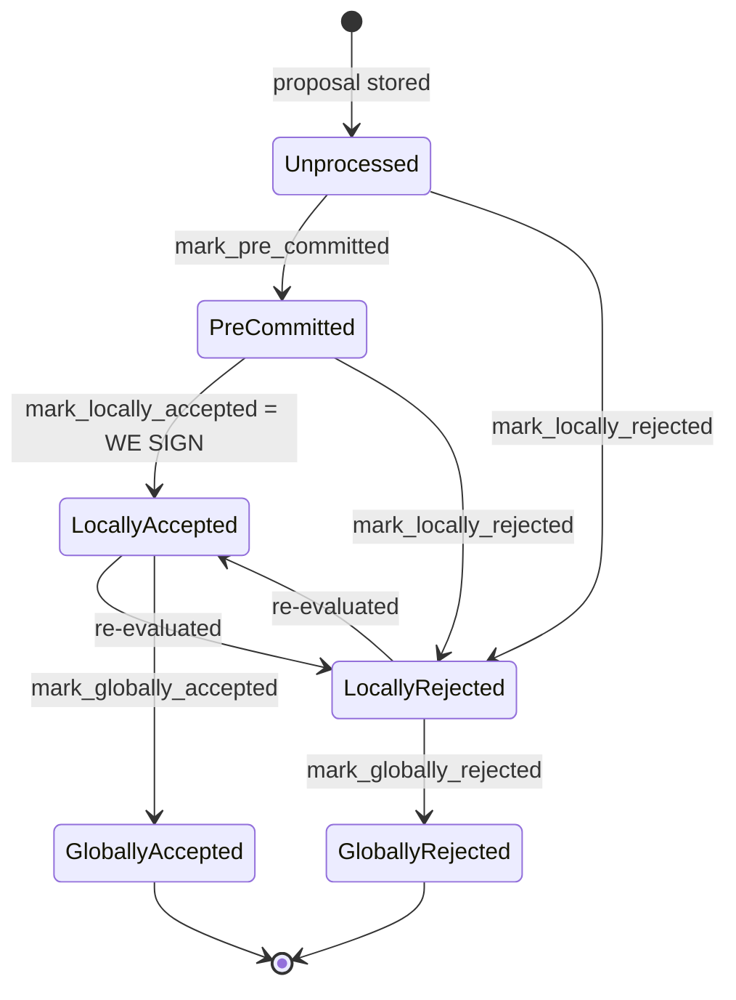

Confirmed: in the pre-commit-threshold "SIGN" branch, the code produces and broadcasts a real cryptographic acceptance signature **unconditionally**, even when the guarded state transition it just attempted has failed.

### Title
Signer produces and broadcasts a signature even when `mark_locally_accepted` fails because the block already reached a terminal (rejected) state - (File: `stacks-signer/src/v0/signer.rs`)

### Summary
`BlockInfo::mark_locally_accepted` mutates `self.valid`, `self.approved_time`, and `self.signed_self` *before* calling `move_to`, and `move_to`'s `Result` is the only thing that reports whether the transition was actually legal. [1](#0-0)  In `handle_block_pre_commit`'s sign path, the `Result` returned by `mark_locally_accepted` is only used to decide whether to *log a warning*; the code falls through unconditionally to `create_block_acceptance`, `handle_block_signature`, and `send_block_response`, which actually produce and gossip a signature over the block. [2](#0-1)  This is the same bug class as the `transferFrom` finding: a side-effecting operation's success/failure is (partially) checked, but the code proceeds to perform the security-relevant action (transfer funds / broadcast a signature) regardless of the checked outcome, and the object's bookkeeping (`timelockERC20Balances` / `BlockInfo.valid`+`signed_self`) is left inconsistent with what actually happened.

### Finding Description
`BlockState::check_state` forbids transitioning into `LocallyAccepted` once a block is already `GloballyRejected` or `GloballyAccepted` [3](#0-2) . `move_to` correctly returns `Err` in that case [4](#0-3) . However, `mark_locally_accepted` already set `self.valid = Some(true)` / `self.signed_self = Some(timestamp)` before that check runs [1](#0-0) , so the in-memory `BlockInfo` is corrupted (marked "signed") independent of whether the transition succeeded.

Worse, the caller in `handle_block_pre_commit`'s sign branch treats the `Err` from `mark_locally_accepted` as merely worth a log line (and only logs if `!has_reached_consensus()`), then unconditionally persists the (already-corrupted) `block_info`, unconditionally calls `create_block_acceptance` to produce a fresh ECDSA signature over the block, unconditionally calls `handle_block_signature` to process it as our own vote, and unconditionally calls `send_block_response` to gossip that acceptance to the rest of the signer set and node: [2](#0-1) 

Nothing in this final segment re-checks `block_info.state` or `has_reached_consensus()` before signing. So if this signer's own `BlockInfo` has already reached `GloballyRejected` (e.g., via a race where a rejection quorum was recorded concurrently, or via `store_and_process_block_rejection` running in between the pre-commit threshold check earlier in the function and this tail), the code still signs and broadcasts an acceptance for a block the signer's own database considers terminally rejected. `store_and_process_block_signature`, which processes the resulting `handle_block_signature` call, only checks `block_info.signed_group.is_some()` before tallying — it does not check `has_reached_consensus()`/`GloballyRejected` either [5](#0-4) , so this freshly minted, out-of-band signature is counted toward the acceptance weight along with everyone else's.

### Impact Explanation
This breaks the "rejection vs. acceptance" equality that the whole pre-commit/threshold design is built to keep terminal: once `GloballyRejected` is reached, the doc explicitly states "Global states are terminal against each other" and no further transition should occur. [6](#0-5)  A single-slot-miner-triggered race (rapid rejection quorum landing between the pre-commit threshold evaluation and the final `mark_locally_accepted` call in the same function) causes the signer to emit and broadcast a genuine, valid signature over a block it has already recorded as globally rejected — i.e. a rejection recounted as an accept vote toward the 70% threshold, one of the explicitly in-scope Critical impacts.

### Likelihood Explanation
The window is narrow (it requires the block to flip to `GloballyRejected`/`GloballyAccepted` between the earlier `check_block_against_signer_db_state` recheck and the final unconditional sign block in the same function invocation, most plausibly via a concurrent `handle_block_response`/`handle_block_rejection` call mutating the same `block_hash`'s row), but it is reachable purely from gossip traffic that a single miner/attacker can help trigger by racing conflicting proposals/pre-commits — no majority collusion is required to *produce* the race, only ordinary concurrent signer traffic.

### Recommendation
- Make `BlockInfo::mark_locally_accepted` (and its siblings `mark_pre_committed`, `mark_globally_accepted`, `mark_locally_rejected`) transactional: only mutate `valid`/`approved_time`/`signed_self`/`signed_group` *after* `move_to` succeeds, mirroring `TransferHelper.safeTransfer`'s "check before effect" pattern from the original report.
- In `handle_block_pre_commit`'s sign branch, treat an `Err` from `mark_locally_accepted` as a hard stop (`return`) whenever the block has reached a terminal state, instead of only logging; do not call `create_block_acceptance`/`handle_block_signature`/`send_block_response` unless the transition actually succeeded.

### Proof of Concept
1. Signer `S` reaches the pre-commit threshold for block `B` and enters the tail of `handle_block_pre_commit` (past all conflict checks).
2. Concurrently, a rejection quorum for `B` arrives and is processed via `handle_block_rejection` → `store_and_process_block_rejection`, calling `block_info.mark_globally_rejected()` and persisting `state = GloballyRejected` for `B` in `signerdb`.
3. `S`'s in-flight call reaches `block_info.mark_locally_accepted(false)`: `self.valid`/`self.signed_self` get set, but `move_to(LocallyAccepted)` returns `Err` because `check_state` forbids `LocallyAccepted` from `GloballyRejected`.
4. The `Err` branch only logs (since `has_reached_consensus()` is true, even the warning is suppressed) and execution falls through.
5. `S` calls `create_block_acceptance(&block_info.block)`, produces a real signature, calls `handle_block_signature`, and `send_block_response` broadcasts a `BlockAccepted` for a block `S`'s own DB already marked `GloballyRejected`. [2](#0-1)

### Citations

**File:** stacks-signer/src/signerdb.rs (L279-289)
```rust
    /// Mark this block as valid and the appropriate timestamps if they aren't already set, and attempt to mark it as locally accepted.
    pub fn mark_locally_accepted(&mut self, group_signed: bool) -> Result<(), String> {
        if group_signed {
            self.signed_group.get_or_insert(get_epoch_time_secs());
        } else {
            self.valid = Some(true);
            self.approved_time.get_or_insert(get_epoch_time_secs());
            self.signed_self.get_or_insert(get_epoch_time_secs());
        }
        self.move_to(BlockState::LocallyAccepted)
    }
```

**File:** stacks-signer/src/signerdb.rs (L313-329)
```rust
    /// Check if the block state transition is valid
    fn check_state(&self, state: BlockState) -> bool {
        let prev_state = &self.state;
        if *prev_state == state {
            return true;
        }
        match state {
            BlockState::Unprocessed => false,
            BlockState::LocallyAccepted | BlockState::LocallyRejected => !matches!(
                prev_state,
                BlockState::GloballyRejected | BlockState::GloballyAccepted
            ),
            BlockState::GloballyAccepted => !matches!(prev_state, BlockState::GloballyRejected),
            BlockState::GloballyRejected => !matches!(prev_state, BlockState::GloballyAccepted),
            BlockState::PreCommitted => matches!(prev_state, BlockState::Unprocessed),
        }
    }
```

**File:** stacks-signer/src/signerdb.rs (L331-341)
```rust
    /// Attempt to transition the block state
    pub fn move_to(&mut self, state: BlockState) -> Result<(), String> {
        if !self.check_state(state) {
            return Err(format!(
                "Invalid state transition from {} to {state}",
                self.state
            ));
        }
        self.state = state;
        Ok(())
    }
```

**File:** stacks-signer/src/v0/signer.rs (L1466-1478)
```rust
        // It is only considered globally accepted IFF we receive a new block event confirming it OR see the chain tip of the node advance to it.
        if let Err(e) = block_info.mark_locally_accepted(false) {
            if !block_info.has_reached_consensus() {
                warn!("{self}: Failed to mark block as locally accepted: {e:?}",);
            }
        }
        self.signer_db
            .insert_block(&block_info)
            .unwrap_or_else(|e| self.handle_insert_block_error(e));
        let accepted = self.create_block_acceptance(&block_info.block);
        // have to save the signature _after_ the block info
        self.handle_block_signature(stacks_client, sortition_state, &accepted);
        self.send_block_response(&block_info.block, accepted.into());
```

**File:** stacks-signer/src/v0/signer.rs (L2442-2471)
```rust
    /// Store the block acceptance signature and check if we have reached a consensus decision on the block because of it. If we have, update the block state accordingly and broadcast the block if accepted.
    fn store_and_process_block_signature(
        &mut self,
        stacks_client: &StacksClient,
        sortition_state: &mut Option<SortitionsView>,
        block_info: &mut BlockInfo,
        signer_address: &StacksAddress,
        signature: &MessageSignature,
    ) {
        let block_hash = &block_info.signer_signature_hash();
        // signature is valid! store it.
        // if this returns false, it means the signature already exists in the DB, so just return.
        if !self
            .signer_db
            .add_block_signature(block_hash, signer_address, signature)
            .unwrap_or_else(|_| panic!("{self}: Failed to save block signature"))
        {
            return;
        }

        // If this isn't our own signature and we haven't seen a pre-commit from this signer yet, try treating it as a pre-commit in case the caller is running an outdated version
        if signer_address != &self.stacks_address && !self.signer_db.has_committed(block_hash, signer_address).inspect_err(|e| warn!("Failed to check if pre-commit message already considered for {signer_address:?} for {block_hash}: {e}")).unwrap_or(false) {
            self.handle_block_pre_commit(stacks_client, sortition_state, signer_address, block_hash);
            return;
        }

        if block_info.signed_group.is_some() {
            // We have already processed this block to the accepted state. Adding more signatures will not change anything so nothing to check.
            return;
        }
```

**File:** docs/signer-flows.md (L130-150)
```markdown
## 2. Block lifecycle (`BlockState`)

Every proposal tracked in the signer DB carries a `BlockState`. **`PreCommitted`
carries no signature**: it means "validated, willing to sign if the pre-commit
threshold is met." The first signature appears at `mark_locally_accepted`.
Global states are terminal against each other.


```
