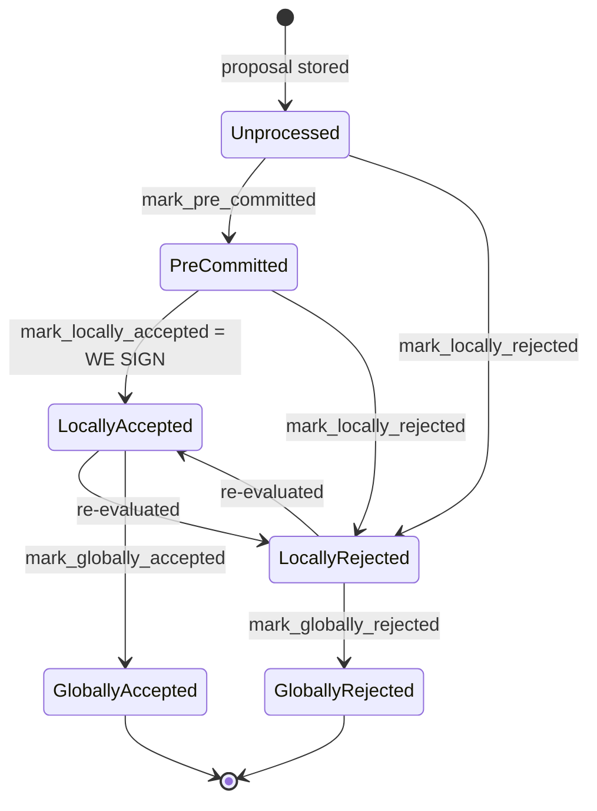

### Title
Miner-side signer-weight tallies double-count a signer that changes its vote — breaks the "aggregated-weight vs verified-accepts" equality (File: `stacks-node/src/nakamoto_node/stackerdb_listener.rs`)

### Summary
This is a structural analog of the amAmm bug: a fee/weight value is accumulated into one bucket, a related event later shifts the same value into a different bucket, but the original bucket is never decremented, so the value is counted twice. In `stackerdb_listener.rs` the miner-side coordinator keeps `total_weight_approved` and `total_weight_rejected` as two independently-incremented counters keyed off two different guard sets (`gathered_signatures` and `responded_signers`). Neither branch ever removes a signer's weight from the other tally, so a signer that legitimately changes its `BlockResponse` verdict for the same block (a transition the signer state machine explicitly supports) has its weight counted in *both* totals simultaneously.

### Finding Description
The miner's `BlockStatus` struct tracks per-block totals independently: [1](#0-0) 

On `BlockResponse::Accepted`, weight is added to `total_weight_approved` gated only on `gathered_signatures` not containing the slot, and the slot is also inserted into `responded_signers`: [2](#0-1) 

On `BlockResponse::Rejected`, weight is added to `total_weight_rejected` gated only on `responded_signers.insert(slot_id)` returning `true` (first time seen): [3](#0-2) 

Sequence that produces double counting:
1. Signer S rejects block B first. `responded_signers.insert(slot)` → `true`, so `total_weight_rejected += w(S)`. `slot` is now in `responded_signers`, but **not** in `gathered_signatures`.
2. S later re-evaluates and accepts the same block B (the signer-side state machine explicitly allows `LocallyRejected -> LocallyAccepted` for a class of "reconsiderable" reject reasons, and vice versa `LocallyAccepted -> LocallyRejected`): [4](#0-3) [5](#0-4) 

3. When the Accepted message arrives, the guard checks `gathered_signatures.contains_key(&slot_id)` — which is still `false` (only `responded_signers` was touched in step 1) — so `total_weight_approved += w(S)` is applied on top of the already-recorded `total_weight_rejected` contribution from the same signer. Nothing in the Accepted path clears or decrements `total_weight_rejected` for S.

The result: `w(S)` is simultaneously present in `total_weight_approved` and `total_weight_rejected`, so `total_weight_approved + total_weight_rejected` can exceed `total_weight` for a set of signers smaller than the full set — an inflation of the aggregated weight that the miner uses to decide whether the network approved or rejected the block, without a matching set of *verified, mutually-exclusive* accepts/rejects. This is the same root-cause shape as the `amAmmFeeAmount` bug: a value is assigned into a bucket (`hookFeesAmount`/`amAmmFeeAmount`, here `total_weight_rejected`), a later step effectively "moves" the underlying claim elsewhere (fee split to referrers / signer flips to accept), but the original bucket is never reduced, so the total tracked across both buckets exceeds the real, non-overlapping total.

Notably, the CHANGELOG shows the project already fixed exactly this class of bug on the *signer's own* local bookkeeping ("Do not count both a block acceptance and a block rejection for the same signer/block"), and `stacks-signer/src/signerdb.rs`'s `reject_then_accept` test confirms `add_block_signature` clears the signer's rejection record in the signer-local DB: [6](#0-5) [7](#0-6) 

That fix, however, is scoped to each signer's local DB used for its own decision-making. It was never mirrored in the *miner-side* `StackerDBListener`'s aggregate tally, which independently re-derives approve/reject totals from the stream of `BlockResponse` messages and has no cross-check between `gathered_signatures` and `responded_signers`.

### Impact Explanation
This breaks the aggregated-weight vs. verified-accepts equality the coordinator relies on in `signer_coordinator.rs::get_block_status` to decide whether to treat a block as network-approved or network-rejected: [8](#0-7) 

Because a flipped signer's weight lingers in whichever tally it first landed in, the miner can hold a stale, inflated `total_weight_rejected` even after the signer legitimately reconsidered and accepted (or the reverse: an inflated `total_weight_approved` including weight from a signer that has since rejected). This can wedge the miner into repeatedly treating a valid, sufficiently-supported block as rejected (a liveness wedge preventing the signer set from ever converging on a decision for that proposal, forcing endless re-proposals) — matching the High-impact category "a signer [set] wedged into never [reaching consensus on] valid blocks" due to a corrupted aggregated-weight/verified-accepts invariant.

### Likelihood Explanation
No majority collusion or malicious behavior is required. A single honest signer following the documented, supported `LocallyRejected <-> LocallyAccepted` re-evaluation paths (e.g. reconsiderable reject reasons such as `NotFoundError`, `UnknownParent`, `ConnectivityIssues`, `NoSortitionView`, or a later-in-time chainstate recheck flipping an accept to a reject) is sufficient to trigger the double count on the miner's listener. This is a normal, expected operational condition (temporary validation failures, re-proposals, chainstate re-checks), not an edge case requiring adversarial input.

### Recommendation
In `stackerdb_listener.rs`, make `total_weight_approved` and `total_weight_rejected` mutually exclusive per signer slot: before adding weight to one tally, check and remove/adjust any prior contribution to the other tally for that same `slot_id` (mirroring the fix already applied to `stacks-signer/src/signerdb.rs`'s `add_block_signature`/rejection bookkeeping). Concretely, track a single "last verdict per slot" and derive `total_weight_approved`/`total_weight_rejected` from that de-duplicated map rather than two independently-guarded running sums.

### Proof of Concept
1. Configure a 2+ signer test network where one signer (S) is made to reject a block due to a reconsiderable reason (e.g. inject a transient `NotFoundError`/`UnknownParent` condition), while S's weight is tracked by the miner's `StackerDBListener`.
2. Confirm via logs/metrics that `total_weight_rejected` includes S's weight after the initial rejection.
3. Trigger the miner to reproduce/re-propose the same block (or await the signer's own re-evaluation) so S subsequently sends `BlockResponse::Accepted` for the same `signer_signature_hash`.
4. Observe that `total_weight_approved` now also includes S's weight, while `total_weight_rejected` still reflects the earlier rejection — i.e. `total_weight_approved + total_weight_rejected > total_weight` for the set of signers that participated, demonstrating the double count that the code in [9](#0-8)  permits.

### Citations

**File:** stacks-node/src/nakamoto_node/stackerdb_listener.rs (L70-82)
```rust
#[derive(Debug, Clone)]
pub struct BlockStatus {
    /// Set of the slot ids of signers who have responded
    pub responded_signers: HashSet<u32>,
    /// Map of the slot id of signers who have signed the block and their signature
    pub gathered_signatures: BTreeMap<u32, MessageSignature>,
    /// Total weight of signers who have signed the block
    pub total_weight_approved: u32,
    /// Total weight of signers who have rejected the block
    pub total_weight_rejected: u32,
    /// Per-txid rejection tracking from signers
    pub failed_txids: HashMap<Txid, FailedTxInfo>,
}
```

**File:** stacks-node/src/nakamoto_node/stackerdb_listener.rs (L443-518)
```rust
                        if !block.gathered_signatures.contains_key(&slot_id) {
                            block.total_weight_approved = block
                                .total_weight_approved
                                .saturating_add(signer_entry.weight);

                            info!("StackerDBListener: Signature Added to block";
                                "signer_signature_hash" => %block_sighash,
                                "signer_pubkey" => signer_pubkey.to_hex(),
                                "signer_slot_id" => slot_id,
                                "signature" => %signature,
                                "signer_weight" => signer_entry.weight,
                                "total_weight_approved" => block.total_weight_approved,
                                "percent_approved" => block.total_weight_approved as f64 / self.total_weight as f64 * 100.0,
                                "total_weight_rejected" => block.total_weight_rejected,
                                "percent_rejected" => block.total_weight_rejected as f64 / self.total_weight as f64 * 100.0,
                                "weight_threshold" => self.weight_threshold,
                                "tenure_extend_timestamp" => tenure_extend_timestamp,
                                "read_count_extend_timestamp" => read_count_extend_timestamp,
                                "server_version" => metadata.server_version,
                            );
                        }
                        block.gathered_signatures.insert(slot_id, signature);
                        block.responded_signers.insert(slot_id);

                        if block.total_weight_approved >= self.weight_threshold {
                            // Signal to anyone waiting on this block that we have enough signatures
                            cvar.notify_all();
                        }

                        // Update the idle timestamp for this signer
                        self.update_idle_timestamp(
                            signer_pubkey.clone(),
                            tenure_extend_timestamp,
                            signer_entry.weight,
                        );

                        // Update the read-count timestamp for this signer
                        self.update_read_count_timestamp(
                            signer_pubkey,
                            read_count_extend_timestamp,
                            signer_entry.weight,
                        );
                    }
                    SignerMessageV0::BlockResponse(BlockResponse::Rejected(rejected_data)) => {
                        let (lock, cvar) = &*self.blocks;
                        let mut blocks = lock.lock().expect("FATAL: failed to lock block status");

                        let Some(block) = blocks.get_mut(&rejected_data.signer_signature_hash)
                        else {
                            info!(
                                "StackerDBListener: Received rejection for block that we did not request. Ignoring.";
                                "signer_signature_hash" => %rejected_data.signer_signature_hash,
                                "slot_id" => slot_id,
                                "signer_set" => self.signer_set,
                            );
                            continue;
                        };

                        let rejected_pubkey = match rejected_data.recover_public_key() {
                            Ok(rejected_pubkey) => {
                                if rejected_pubkey != signer_pubkey {
                                    warn!("StackerDBListener: Recovered public key from rejected data does not match signer's public key. Ignoring.");
                                    continue;
                                }
                                rejected_pubkey
                            }
                            Err(e) => {
                                warn!("StackerDBListener: Failed to recover public key from rejected data: {e:?}. Ignoring.");
                                continue;
                            }
                        };

                        if block.responded_signers.insert(slot_id) {
                            block.total_weight_rejected = block
                                .total_weight_rejected
                                .saturating_add(signer_entry.weight);
```

**File:** docs/signer-flows.md (L137-150)
```markdown

```

**File:** stacks-signer/src/v0/signer.rs (L2705-2739)
```rust
/// Determine if a block should be re-evaluated based on its rejection reason˝
fn should_reevaluate_reject_reason(block_info: &BlockInfo) -> bool {
    if let Some(reject_reason) = &block_info.reject_reason {
        match reject_reason {
            RejectReason::ValidationFailed(ValidateRejectCode::UnknownParent)
            | RejectReason::ValidationFailed(ValidateRejectCode::NotFoundError)
            | RejectReason::NoSortitionView
            | RejectReason::ConnectivityIssues(_)
            | RejectReason::TestingDirective
            | RejectReason::InvalidTenureExtend
            | RejectReason::ConsensusHashMismatch { .. }
            | RejectReason::NoSignerConsensus
            | RejectReason::NotRejected
            | RejectReason::Unknown(_) => true,
            RejectReason::ValidationFailed(_)
            | RejectReason::RejectedInPriorRound
            | RejectReason::SortitionViewMismatch
            | RejectReason::ReorgNotAllowed
            | RejectReason::InvalidBitvec
            | RejectReason::PubkeyHashMismatch
            | RejectReason::InvalidMiner
            | RejectReason::NotLatestSortitionWinner
            | RejectReason::InvalidParentBlock
            | RejectReason::DuplicateBlockFound
            | RejectReason::IrrecoverablePubkeyHash
            | RejectReason::ProblematicTransactions
            | RejectReason::ProposalTooOld => {
                // No need to re-validate these types of rejections.
                false
            }
        }
    } else {
        false
    }
}
```

**File:** stacks-signer/CHANGELOG.md (L132-136)
```markdown
### Changed

- Do not count both a block acceptance and a block rejection for the same signer/block. Also ignore repeated responses (mainly for logging purposes).
- Database schema updated to version 16

```

**File:** stacks-signer/src/signerdb.rs (L3234-3263)
```rust
    #[test]
    fn reject_then_accept() {
        let db_path = tmp_db_path();
        let db = SignerDb::new(db_path).expect("Failed to create signer db");

        let block_id = Sha512Trunc256Sum::from_data("foo".as_bytes());
        let address = StacksAddress::burn_address(false);
        let sig1 = MessageSignature([0x11; 65]);

        assert_eq!(db.get_block_signatures(&block_id).unwrap(), vec![]);

        assert!(db
            .add_block_rejection_signer_addr(
                &block_id,
                &address,
                RejectReasonPrefix::InvalidParentBlock
            )
            .unwrap());
        assert_eq!(
            db.get_block_rejection_signer_addrs(&block_id).unwrap(),
            vec![(address.clone(), RejectReasonPrefix::InvalidParentBlock)]
        );

        assert!(db.add_block_signature(&block_id, &address, &sig1).unwrap());
        assert_eq!(db.get_block_signatures(&block_id).unwrap(), vec![sig1]);
        assert!(db
            .get_block_rejection_signer_addrs(&block_id)
            .unwrap()
            .is_empty());
    }
```

**File:** stacks-node/src/nakamoto_node/signer_coordinator.rs (L509-545)
```rust
            if block_status
                .total_weight_rejected
                .saturating_add(self.weight_threshold)
                > self.total_weight
            {
                info!(
                    "{}/{} signer weight votes to reject block",
                    block_status.total_weight_rejected, self.total_weight;
                    "signer_signature_hash" => %block_signer_sighash,
                );
                counters.bump_naka_rejected_blocks();

                // Only act on failed txids that a blocking minority (>30% weight) agrees on
                let blocking_minority = self.total_weight.saturating_sub(self.weight_threshold);
                let mut temporarily_excluded_txids = HashSet::new();
                let mut permanently_excluded_txids = HashSet::new();
                for (txid, info) in &block_status.failed_txids {
                    if info.total_weight > blocking_minority {
                        // Do not perma ban txids that only a small minority of signers reported as problematic
                        // But make sure its removed from the next block proposal
                        if info.problematic_weight > blocking_minority {
                            permanently_excluded_txids.insert(txid.clone());
                        } else {
                            temporarily_excluded_txids.insert(txid.clone());
                        }
                    }
                }

                return Err(NakamotoNodeError::SignersRejected {
                    temporarily_excluded_txids,
                    permanently_excluded_txids,
                });
            } else if block_status.total_weight_approved >= self.weight_threshold {
                info!("Received enough signatures, block accepted";
                    "signer_signature_hash" => %block_signer_sighash,
                );
                return Ok(block_status.gathered_signatures.values().cloned().collect());
```
