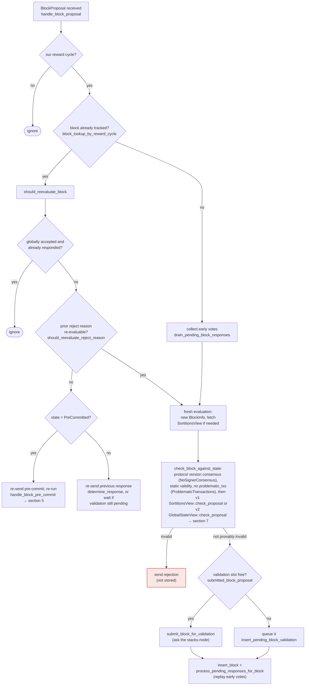

I have confirmed the bug. Here's the finding.

### Title
A single signer's legitimate reject→accept re-evaluation is double-counted, corrupting the miner's approval/rejection weight tally - (File: stacks-node/src/nakamoto_node/stackerdb_listener.rs)

### Summary
`StackerDBListener` tallies signer weight for a block into two separate counters, `total_weight_approved` and `total_weight_rejected`, guarded by two different dedup structures. The `Accepted` path only checks `gathered_signatures` (a map populated exclusively by the `Accepted` branch) before crediting weight, while the `Rejected` path checks the shared `responded_signers` set. Because a signer that has already rejected a block is not present in `gathered_signatures`, a later legitimate `Accepted` message from that same signer is credited to `total_weight_approved` without ever removing its weight from `total_weight_rejected`. The signer's weight ends up counted on both sides of the tally simultaneously.

### Finding Description
`BlockStatus` holds independent counters and dedup sets: [1](#0-0) 

On `Accepted`, the dedup check is scoped to `gathered_signatures`, not to `responded_signers`: [2](#0-1) 

On `Rejected`, the dedup check uses the shared `responded_signers` set: [3](#0-2) 

The asymmetry: if a signer's slot has already voted `Rejected` (so `responded_signers` contains it, but `gathered_signatures` does not), a subsequent `Accepted` from that slot passes the `!gathered_signatures.contains_key(&slot_id)` check and is credited to `total_weight_approved`, while `total_weight_rejected` retains the earlier, now-superseded, weight from the same signer. The reverse direction (`Accepted` then `Rejected`) is properly guarded, since `responded_signers.insert` returns `false` and no new rejected weight is added — only the `Reject`-then-`Accept` direction is unprotected.

This is not a hypothetical byzantine action: the signer-side state machine explicitly documents and implements this exact transition as legitimate re-evaluation of a prior verdict (`LocallyRejected --> LocallyAccepted : re-evaluated`, driven by `should_reevaluate_block`/`should_reevaluate_reject_reason` in `stacks-signer/src/v0/signer.rs`), e.g. a signer that rejected an unvalidated proposal and later validates and signs the same `signer_signature_hash` once the proposal is resubmitted or its rejection reason becomes stale: [4](#0-3) [5](#0-4) 

The result is that `total_weight_approved + total_weight_rejected` for a block can exceed `self.total_weight`, breaking the implicit invariant that each signer's weight counts toward at most one side of the vote. This is used directly by `SignerCoordinator::gather_signatures`'s decision loop, which checks the (stale, inflated) rejection tally before the approval tally: [6](#0-5) 

Because rejection is evaluated first and the rejected weight from a signer who has since flipped to accepted is never retracted, a miner can observe `total_weight_rejected` cross the blocking-minority line (`> total_weight - weight_threshold`) purely from stale votes, and declare `SignersRejected` for a block that a legitimate quorum has, in current state, actually approved (or is trending toward approving). This is a mistallied response: a withdrawn/superseded rejection is still recounted as an active rejection, and the flip to acceptance is layered on top rather than replacing it.

### Impact Explanation
This falls in the "rejection recounted as acceptance" / miscounted-response category: the node's weight bookkeeping does not treat a signer's vote as a single mutable slot but instead accumulates stale and current votes across two independently-guarded counters. This can wedge or falsely fail block gathering (the coordinator returning `NakamotoNodeError::SignersRejected` based on a rejection tally that no longer reflects any actual live rejecting signer), which is a liveness break reachable by a single honest signer's legitimate re-evaluation — no majority collusion required to corrupt the tally, only to make the corrupted tally cross a decision threshold.

### Likelihood Explanation
Re-evaluation from `LocallyRejected` to `LocallyAccepted` is a documented, first-class path in the v0 signer state machine (`should_reevaluate_block`, `should_reevaluate_reject_reason` in `stacks-signer/src/v0/signer.rs`), not an edge case — it is expected to occur whenever a proposal is initially seen as unvalidated/invalid and later re-proposed or found valid after a state change. Any signer whose validation flips during ordinary network conditions (slow validation response races, chain-tip changes, re-proposals) will trigger this path.

### Recommendation
Guard the `Accepted` branch's weight credit against the same shared dedup set used by `Rejected` (i.e., check/update `responded_signers` for both branches, or maintain a single `HashMap<u32, Vote>` recording the signer's current vote per slot), and when a slot's vote flips, subtract its weight from the previous tally before adding it to the new one so `total_weight_approved + total_weight_rejected` for a slot never exceeds that slot's registered weight.

### Proof of Concept
1. Miner proposes block B; `BlockStatus` for B is created with `total_weight_approved = 0`, `total_weight_rejected = 0`, `responded_signers = {}`, `gathered_signatures = {}`.
2. Signer S (slot `k`, weight `w`) sends `BlockResponse::Rejected` for B (e.g. it hadn't yet validated, or hit a transient rejection reason). `StackerDBListener` runs the `Rejected` branch: `responded_signers.insert(k)` succeeds, so `total_weight_rejected += w`.
3. S later re-evaluates B (per `should_reevaluate_reject_reason`/`should_reevaluate_block`) and signs it, sending `BlockResponse::Accepted` for the same `signer_signature_hash`. `StackerDBListener` runs the `Accepted` branch: `gathered_signatures.contains_key(&k)` is `false` (never touched by the rejected path), so the guard passes and `total_weight_approved += w`.
4. Now `total_weight_rejected` still includes `w` from step 2, and `total_weight_approved` also includes `w` from step 3 — S's weight is counted on both sides simultaneously, and `total_weight_approved + total_weight_rejected` exceeds the true distinct-signer weight sum, potentially crossing `SignerCoordinator::gather_signatures`'s rejection-declares-dead threshold (`stacks-node/src/nakamoto_node/signer_coordinator.rs:509-524`) using weight that the signer itself has already withdrawn.

### Citations

**File:** stacks-node/src/nakamoto_node/stackerdb_listener.rs (L70-82)
```rust
#[derive(Debug, Clone)]
pub struct BlockStatus {
    /// Set of the slot ids of signers who have responded
    pub responded_signers: HashSet<u32>,
    /// Map of the slot id of signers who have signed the block and their signature
    pub gathered_signatures: BTreeMap<u32, MessageSignature>,
    /// Total weight of signers who have signed the block
    pub total_weight_approved: u32,
    /// Total weight of signers who have rejected the block
    pub total_weight_rejected: u32,
    /// Per-txid rejection tracking from signers
    pub failed_txids: HashMap<Txid, FailedTxInfo>,
}
```

**File:** stacks-node/src/nakamoto_node/stackerdb_listener.rs (L443-465)
```rust
                        if !block.gathered_signatures.contains_key(&slot_id) {
                            block.total_weight_approved = block
                                .total_weight_approved
                                .saturating_add(signer_entry.weight);

                            info!("StackerDBListener: Signature Added to block";
                                "signer_signature_hash" => %block_sighash,
                                "signer_pubkey" => signer_pubkey.to_hex(),
                                "signer_slot_id" => slot_id,
                                "signature" => %signature,
                                "signer_weight" => signer_entry.weight,
                                "total_weight_approved" => block.total_weight_approved,
                                "percent_approved" => block.total_weight_approved as f64 / self.total_weight as f64 * 100.0,
                                "total_weight_rejected" => block.total_weight_rejected,
                                "percent_rejected" => block.total_weight_rejected as f64 / self.total_weight as f64 * 100.0,
                                "weight_threshold" => self.weight_threshold,
                                "tenure_extend_timestamp" => tenure_extend_timestamp,
                                "read_count_extend_timestamp" => read_count_extend_timestamp,
                                "server_version" => metadata.server_version,
                            );
                        }
                        block.gathered_signatures.insert(slot_id, signature);
                        block.responded_signers.insert(slot_id);
```

**File:** stacks-node/src/nakamoto_node/stackerdb_listener.rs (L515-518)
```rust
                        if block.responded_signers.insert(slot_id) {
                            block.total_weight_rejected = block
                                .total_weight_rejected
                                .saturating_add(signer_entry.weight);
```

**File:** docs/signer-flows.md (L140-149)
```markdown
    Unprocessed --> PreCommitted : mark_pre_committed
    PreCommitted --> LocallyAccepted : mark_locally_accepted = WE SIGN
    Unprocessed --> LocallyRejected : mark_locally_rejected
    PreCommitted --> LocallyRejected : mark_locally_rejected
    LocallyRejected --> LocallyAccepted : re-evaluated
    LocallyAccepted --> LocallyRejected : re-evaluated
    LocallyAccepted --> GloballyAccepted : mark_globally_accepted
    LocallyRejected --> GloballyRejected : mark_globally_rejected
    GloballyAccepted --> [*]
    GloballyRejected --> [*]
```

**File:** docs/signer-flows.md (L164-203)
```markdown
## 3. A block proposal arrives

The miner broadcasts a proposal. If we've seen this exact block before,
`should_reevaluate_block` decides whether the old verdict stands; a block we
only pre-committed to is deliberately routed back through the pre-commit
evaluation so a re-proposal cannot shortcut to a signature. A fresh proposal is
checked against our view of the world _before_ spending a node validation on it.



Early votes: acceptances, rejections, and pre-commits that arrived before the
proposal itself are parked in pending tables and replayed once the proposal is
known.

> Anchors: `handle_block_proposal`, `should_reevaluate_block`,
> `should_reevaluate_reject_reason`, `check_block_against_state`,
> `submit_block_for_validation`, `process_pending_responses_for_block`
> (signer.rs); `check_proposal` (chainstate/v1.rs, v2.rs)
```

**File:** stacks-node/src/nakamoto_node/signer_coordinator.rs (L509-545)
```rust
            if block_status
                .total_weight_rejected
                .saturating_add(self.weight_threshold)
                > self.total_weight
            {
                info!(
                    "{}/{} signer weight votes to reject block",
                    block_status.total_weight_rejected, self.total_weight;
                    "signer_signature_hash" => %block_signer_sighash,
                );
                counters.bump_naka_rejected_blocks();

                // Only act on failed txids that a blocking minority (>30% weight) agrees on
                let blocking_minority = self.total_weight.saturating_sub(self.weight_threshold);
                let mut temporarily_excluded_txids = HashSet::new();
                let mut permanently_excluded_txids = HashSet::new();
                for (txid, info) in &block_status.failed_txids {
                    if info.total_weight > blocking_minority {
                        // Do not perma ban txids that only a small minority of signers reported as problematic
                        // But make sure its removed from the next block proposal
                        if info.problematic_weight > blocking_minority {
                            permanently_excluded_txids.insert(txid.clone());
                        } else {
                            temporarily_excluded_txids.insert(txid.clone());
                        }
                    }
                }

                return Err(NakamotoNodeError::SignersRejected {
                    temporarily_excluded_txids,
                    permanently_excluded_txids,
                });
            } else if block_status.total_weight_approved >= self.weight_threshold {
                info!("Received enough signatures, block accepted";
                    "signer_signature_hash" => %block_signer_sighash,
                );
                return Ok(block_status.gathered_signatures.values().cloned().collect());
```
