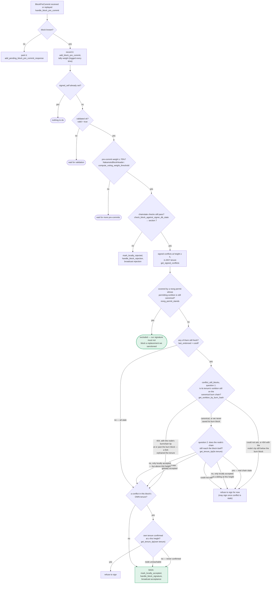

### Title
Unbounded `get_signed_conflicts` query stalls the pre-commit→signature decision on every proposal - ([File: stacks-signer/src/signerdb.rs])

### Summary
`SignerDb::get_signed_conflicts` runs an unbounded SQL query over the entire history of the local `blocks` table, and the signer synchronously iterates the result set — performing a node RPC call per row — before it can decide whether to sign a pre-committed block. Because the `blocks` table has no visible height- or age-based pruning, a miner that repeatedly forces the signer set to sign competing blocks at (or above) a given height over time can grow this result set without bound, turning the single most latency-sensitive step of the signing pipeline into a linearly (and eventually unboundedly) slow, per-conflict, network-bound loop. This is the direct analog of the `TreasuryVester.distribute()` bug: an attacker-influenced, unbounded-length collection is iterated synchronously on a critical path, and every iteration costs real resources (here, one or more RPC round-trips to the node), which can wedge the signer out of timely signing.

### Finding Description
`get_signed_conflicts` is documented as returning "every signed block at or above the given Stacks height, in ANY tenure" with no `LIMIT` clause: [1](#0-0) 

This query is invoked from the pre-commit → signature decision path (section 5 of `docs/signer-flows.md`): once pre-commit weight reaches the ≥70% threshold, the signer re-checks chainstate and then computes `CONF = get_signed_conflicts(height, excluded_hash)`, and for every entry in `CONF` it must ask the node whether the conflicting tenure's sortition is still canonical (`get_sortition_by_burn_hash`) and, in some branches, whether the node's chain still reaches that block (`get_tenure_tip`), before it is allowed to sign: [2](#0-1) 

Each of these sub-checks is a live network call to the local stacks-node (per the mermaid graph annotations "get_sortition_by_burn_hash", "get_tenure_tip"), executed inline in the signer's single-threaded event loop before the signature can be broadcast. No code path was found that prunes or age-limits the `blocks` table by height (only a `superseded_tenures` table is explicitly pruned by burn height via `prune_superseded_tenures`): [3](#0-2) 

The `blocks` table itself accumulates every block the signer ever pre-committed to, locally accepted, or globally accepted/rejected, indefinitely, as new proposals arrive: [4](#0-3) 

A miner (or the active miner in collusion with a churn of forks over the reward cycle) can therefore keep forcing signers to sign at overlapping/competing chain heights across many distinct tenures over the life of the signer's database. Each new signed block adds one more row that will forever match `stacks_height >= ?1` for any future lower-or-equal height proposal, so the conflict set that must be walked (and RPC-verified) on the hot signing path grows monotonically and is bounded only by how long the signer database has existed — exactly the "recipients list has no cap" pattern from the reference report, transplanted onto a query+RPC loop instead of an EVM loop.

### Impact Explanation
This breaks the liveness guarantee of the signing pipeline: as the accumulated conflict set grows, the per-proposal decision to sign takes proportionally longer (bounded by network round-trips to the node for each conflict), which can push a signer's decision past `tenure_last_block_proposal_timeout` / pre-commit windows, causing legitimate, valid, canonical blocks to be signed late or missed. In the worst case this wedges an individual signer into perpetually falling behind on the signing critical path — matching the "signer wedged into never signing valid blocks" High-impact category defined by the scan rules. Because this happens per-signer independently (each signer maintains its own `SignerDb`), it does not require compromising the majority or any other signer's key: any single signer's local state can be driven into this condition purely by observing enough tenures/proposals over time.

### Likelihood Explanation
Likelihood is low-to-moderate, analogous to the "Likelihood: 1" score in the reference report: the condition requires an extended time horizon (many blocks/tenures with competing signed blocks accumulating in a single signer's local `blocks` table) rather than a single crafted message, and normal chain operation itself, not just adversarial forking, feeds this table. It is not a one-shot exploit; it is a slow-burn resource/latency growth that a persistently forking or actively malicious miner sequence, or simply long-running signer uptime without any table compaction, can trigger deterministically.

### Recommendation
Bound `get_signed_conflicts` with a `LIMIT` and/or an explicit height/age cutoff (e.g., only consider blocks within some reasonable distance of the current chain tip or reward cycle, similar to `prune_superseded_tenures`'s burn-height cutoff), and add a periodic cleanup/prune of the `blocks` table for entries far below the current canonical tip so the conflict-resolution loop's cost stays bounded regardless of signer uptime.

### Proof of Concept
Not independently verified end-to-end due to index/tooling limits (the exact call site that iterates `get_signed_conflicts`'s results and issues the RPC calls per conflict, e.g. `Signer::conflict_still_blocks`/`reorg_permit_stands` in `stacks-signer/src/v0/signer.rs`, could not be fully retrieved within the available iterations — its existence and behavior is only confirmed via `docs/signer-flows.md`'s section 5 diagram and cross-references). A background Devin session with full file access should read `stacks-signer/src/v0/signer.rs` around `handle_block_pre_commit`/`conflict_still_blocks`/`reorg_permit_stands` to confirm the per-row RPC loop and measure wall-clock cost growth as a function of `blocks` table size (e.g., via a test that inserts N signed blocks at increasing heights across N distinct consensus hashes and times the pre-commit-triggered signing decision for a new proposal).

### Citations

**File:** stacks-signer/src/signerdb.rs (L1606-1625)
```rust
    pub fn get_signed_conflicts(
        &self,
        height: u64,
        excluded_signer_signature_hash: &Sha512Trunc256Sum,
    ) -> Result<Vec<SignedConflictInfo>, DBError> {
        let query = "SELECT b.consensus_hash, b.signer_signature_hash, b.stacks_height, b.state,
                MAX(COALESCE(b.signed_self, 0), COALESCE(b.signed_group, 0)) AS last_endorsed,
                st.superseded_by_consensus_hash, st.superseded_by_burn_block_hash
            FROM blocks b
            LEFT JOIN superseded_tenures st ON st.consensus_hash = b.consensus_hash
            WHERE (b.signed_self IS NOT NULL OR b.signed_group IS NOT NULL)
                AND b.stacks_height >= ?1
                AND b.signer_signature_hash != ?2
            ORDER BY b.stacks_height DESC";
        let args = params![
            u64_to_sql(height)?,
            excluded_signer_signature_hash.to_string(),
        ];
        query_rows(&self.db, query, args)
    }
```

**File:** stacks-signer/src/signerdb.rs (L1669-1678)
```rust
    /// Drop superseded-tenure records for sortitions below `burn_block_height`. A tenure that
    /// old cannot conflict with a proposal anywhere near the chain tip, so the record has no
    /// further use.
    pub fn prune_superseded_tenures(&mut self, burn_block_height: u64) -> Result<(), DBError> {
        self.db.execute(
            "DELETE FROM superseded_tenures WHERE burn_block_height < ?1",
            params![u64_to_sql(burn_block_height)?],
        )?;
        Ok(())
    }
```

**File:** docs/signer-flows.md (L237-269)
```markdown


**File:** stacks-signer/src/v0/signer.rs (L1716-1719)
```rust
            // Do not store KNOWN invalid blocks as this could DOS the signer. We only store blocks that are valid or unknown.
            self.signer_db
                .insert_block(&block_info)
                .unwrap_or_else(|e| self.handle_insert_block_error(e));
```
