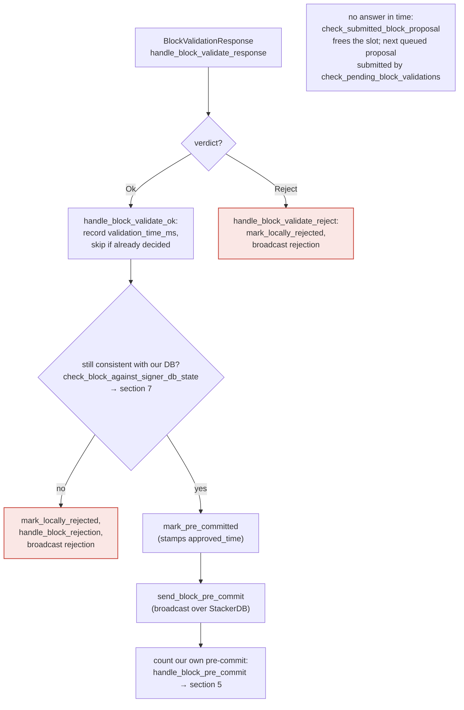

### Title
Signer's event-receiver HTTP endpoints (`/proposal_response`, `/new_burn_block`, `/new_block`, `/stackerdb_chunks`) accept unauthenticated POSTs, letting network attacker forge node validation verdicts - ([File: libsigner/src/events.rs])

### Summary
The `stacks-signer`'s own HTTP listener (`SignerEventReceiver::next_event`) only checks that a request is a `POST` to a recognized path; it performs no authentication/authorization check analogous to the `auth_token`/`Authorization` header check that gates the node's `/v3/block_proposal` endpoint. This is the CSRF-class analog: a state-changing HTTP action ("the node validated this block") is accepted from any caller who can reach the listening port, with no shared-secret or origin check enforced.

### Finding Description
`RPCBlockProposalRequestHandler::try_parse_request` on the node side requires a matching `Authorization` header before it will even parse a block proposal [1](#0-0) . By contrast, the signer's own inbound HTTP server, `SignerEventReceiver::next_event`, only validates the HTTP verb (`POST`) and dispatches purely on URL path — there is no header/token check anywhere in this function or in `process_event`: [2](#0-1) [3](#0-2) 

The `/proposal_response` path deserializes a `BlockValidateResponse` and feeds it straight into the signer's runloop as `SignerEvent::BlockValidationResponse`, which the v0 signer treats as an authoritative verdict from its paired stacks-node (`handle_block_validate_response` / `handle_block_validate_ok`, referenced in `docs/signer-flows.md` section 4) [4](#0-3) . Nothing on the receiving side cryptographically ties this payload to the node process it is supposed to have come from — the only binding is "whoever can open a TCP connection to the configured `endpoint`."

Reference configs and code comments show the operator is expected to bind this endpoint broadly (`endpoint = "0.0.0.0:30000"` in the sample signer config) [5](#0-4) , and the signer binary itself warns at startup that "communicating with an external node... could potentially expose sensitive data or functionalities to security risks if additional proper security checks are not integrated" [6](#0-5) . This acknowledges the gap exists but is documentation-only; the code paths analyzed do not enforce a token.

### Impact Explanation
If the endpoint is reachable by anyone other than the intended node process (which the shipped sample configs and startup warning suggest is a realistic misconfiguration, not a hypothetical), an attacker can forge a `/proposal_response` POST claiming `BlockValidateOk` for a block hash the signer is currently tracking as `Unprocessed`/pending validation. Per the signer-flows documentation, a validate-ok response is only re-checked against the signer's own DB state (`check_block_against_signer_db_state`) before the signer advertises willingness to sign via pre-commit [7](#0-6)  — it does **not** re-derive the verdict from chainstate itself; the node's real validation is trusted implicitly. A forged OK response therefore short-circuits the "submit to node for real validation" step (`submit_block_for_validation`) entirely, potentially causing the signer to pre-commit/sign a block that was never actually validated by the node — i.e., a signer signing a block whose validity was never verified. This maps to the "signer signing an invalid/non-canonical/conflicting block" Critical-impact category in scope.

### Likelihood Explanation
Exploitation requires only network reachability to the signer's configured `endpoint` port with no majority-signer collusion, no possession of `auth_token`, and no local access to the node — matching the "one-slot miner (plus gossip)" threat model. The main mitigating factor is that well-configured deployments bind this to loopback (`127.0.0.1:30000` in most sample configs), which would make this unreachable externally; the risk is concentrated in deployments that follow the `0.0.0.0` binding shown in `mainnet-signer-conf.toml` or otherwise expose the port (cloud/container defaults, NAT misconfig, etc.).

### Recommendation
Add a shared-secret/authentication check to `SignerEventReceiver::next_event` (or `process_event`) mirroring the node's `auth_token`/`Authorization` header check used for `/v3/block_proposal`, so that `/proposal_response`, `/new_burn_block`, `/new_block`, and `/stackerdb_chunks` all require a matching secret before being processed, not just a correct HTTP verb.

### Proof of Concept
1. Deploy a `stacks-signer` using a config where `endpoint` is reachable from an external network (e.g., `endpoint = "0.0.0.0:30000"` as shown in the sample config) [5](#0-4) .
2. Wait for the signer to have a pending/`Unprocessed` block tracked locally (normal miner proposal flow).
3. From an attacker-controlled host with no `auth_token`, send:
```
POST /proposal_response HTTP/1.1
Host: <signer-endpoint>
Content-Type: application/json
Content-Length: <n>

{"Ok": {"signer_signature_hash": "<hash-of-pending-block>", ...}}
```
matching `BlockValidateResponse::Ok(BlockValidateOk)`.
4. Because `next_event` only checks the verb is `POST` [8](#0-7) , this is accepted and forwarded as `SignerEvent::BlockValidationResponse`, driving `handle_block_validate_response`/`handle_block_validate_ok` as though the paired node had actually validated the block.

**Uncertainty**: I could not fully trace `handle_block_validate_response`/`handle_block_validate_ok` bodies (only located their signatures) within the tool budget, so I cannot confirm with full certainty whether `check_block_against_signer_db_state` alone is sufficient to prevent this forged OK from producing a signature on an actually-invalid block, or whether some additional binding (e.g., a nonce/id tying the response to a specific submission) exists that I did not locate. This should be verified directly in `stacks-signer/src/v0/signer.rs` before treating this as fully confirmed.

### Citations

**File:** stackslib/src/net/api/postblock_proposal.rs (L1135-1144)
```rust
        // If no authorization is set, then the block proposal endpoint is not enabled
        let Some(password) = &self.auth else {
            return Err(Error::Http(400, "Bad Request.".into()));
        };
        let Some(auth_header) = preamble.headers.get("authorization") else {
            return Err(Error::Http(401, "Unauthorized".into()));
        };
        if auth_header != password {
            return Err(Error::Http(401, "Unauthorized".into()));
        }
```

**File:** libsigner/src/events.rs (L413-459)
```rust
    fn next_event(&mut self) -> Result<SignerEvent<T>, EventError> {
        self.with_server(|event_receiver, http_server, _is_mainnet| {
            // were we asked to terminate?
            if event_receiver.is_stopped() {
                return Err(EventError::Terminated);
            }
            debug!("Request handling");
            let request = http_server.recv()?;
            debug!("Got request"; "method" => %request.method(), "path" => request.url());

            if request.url() == "/status" {
                request
                .respond(HttpResponse::from_string("OK"))
                .expect("response failed");
                return Ok(SignerEvent::StatusCheck);
            }

            if request.method() != &HttpMethod::Post {
                return Err(EventError::MalformedRequest(format!(
                    "Unrecognized method '{}'",
                    request.method(),
                )));
            }
            debug!("Processing {} event", request.url());
            if request.url() == "/stackerdb_chunks" {
                process_event::<T, StackerDBChunksEvent>(request)
            } else if request.url() == "/proposal_response" {
                process_event::<T, BlockValidateResponse>(request)
            } else if request.url() == "/new_burn_block" {
                process_event::<T, BurnBlockEvent>(request)
            } else if request.url() == "/shutdown" {
                event_receiver.stop_signal.store(true, Ordering::SeqCst);
                Err(EventError::Terminated)
            } else if request.url() == "/new_block" {
                process_event::<T, StacksBlockEvent>(request)
            } else {
                let url = request.url().to_string();
                debug!(
                    "[{:?}] next_event got request with unexpected url {}, return OK so other side doesn't keep sending this",
                    event_receiver.local_addr,
                    url
                );
                ack_dispatcher(request);
                Err(EventError::UnrecognizedEvent(url))
            }
        })?
    }
```

**File:** libsigner/src/events.rs (L519-542)
```rust
fn process_event<T, E>(mut request: HttpRequest) -> Result<SignerEvent<T>, EventError>
where
    T: SignerEventTrait,
    E: serde::de::DeserializeOwned + TryInto<SignerEvent<T>, Error = EventError>,
{
    let mut body = String::new();

    if let Err(e) = request.as_reader().read_to_string(&mut body) {
        error!("Failed to read body: {:?}", &e);
        ack_dispatcher(request);
        return Err(EventError::MalformedRequest(format!(
            "Failed to read body: {:?}",
            e
        )));
    }
    // Regardless of whether we successfully deserialize, we should ack the dispatcher so they don't keep resending it
    ack_dispatcher(request);
    let json_event: E = serde_json::from_slice(body.as_bytes())
        .map_err(|e| EventError::Deserialize(format!("Could not decode body to JSON: {:?}", e)))?;

    let signer_event: SignerEvent<T> = json_event.try_into()?;

    Ok(signer_event)
}
```

**File:** docs/signer-flows.md (L205-227)
```markdown
## 4. The node's validation verdict

The stacks-node answers the `/v3/block_proposal` submission. On OK, the signer
re-checks its own DB state and only then advertises willingness to sign by
broadcasting a **pre-commit**. A signature is _not_ produced here.



> Anchors: `handle_block_validate_response`, `handle_block_validate_ok`,
> `handle_block_validate_reject`, `check_block_against_signer_db_state`,
> `send_block_pre_commit` (signer.rs)
```

**File:** sample/conf/signer/mainnet-signer-conf.toml (L37-39)
```text
# REQUIRED: Local endpoint this signer listens on for events from the node.
# Must match the endpoint in the node's [[events_observer]] section.
endpoint = "0.0.0.0:30000"
```

**File:** stacks-signer/src/lib.rs (L119-132)
```rust
impl<S: Signer<T> + Send + 'static, T: SignerEventTrait + 'static> SpawnedSigner<S, T> {
    /// Create a new spawned signer
    pub fn new(config: GlobalConfig) -> Self {
        let endpoint = config.endpoint;
        info!("Stacks signer version {:?}", VERSION_STRING.as_str());
        info!("Starting signer with config: {:?}", config);
        warn!(
            "Reminder: The signer is primarily designed for use with a local or subnet network stacks node. \
            It's important to exercise caution if you are communicating with an external node, \
            as this could potentially expose sensitive data or functionalities to security risks \
            if additional proper security checks are not integrated in place. \
            For more information, check the documentation at \
            https://docs.stacks.co/guides-and-tutorials/running-a-signer#preflight-setup"
        );
```
