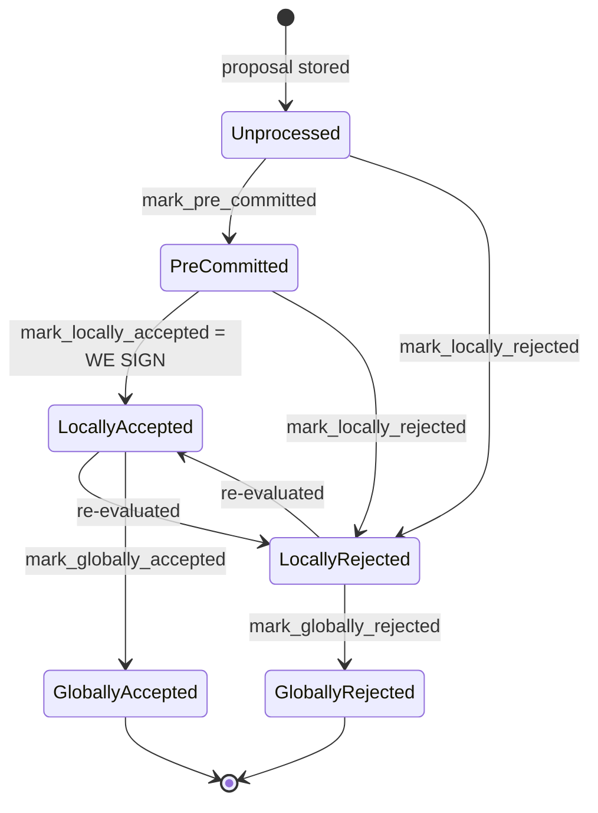
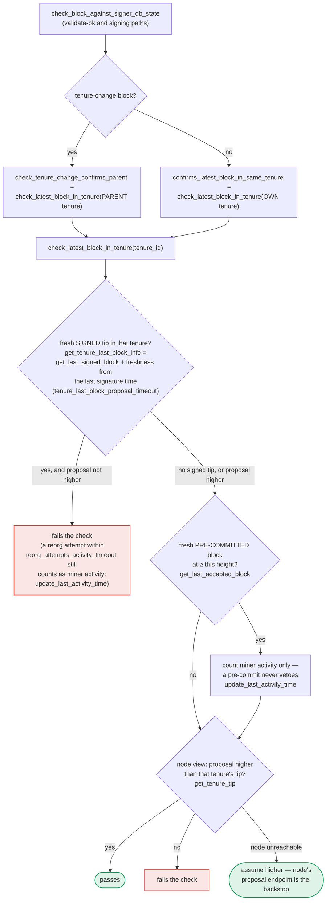

### Title
v1 signer's tenure-change duplicate check misses `LocallyAccepted`/`PreCommitted` blocks, unlike v2 — enabling a signer to be pushed toward signing a conflicting tenure-start block ([File: stacks-signer/src/chainstate/v1.rs])

### Summary
`stacks-signer` has two parallel chainstate validation implementations for the same proposal-time duplicate-tenure-start check: `v1::SortitionState::validate_tenure_change_payload` and `v2::GlobalStateView::validate_tenure_change_payload`. The v2 path was patched to query `SignerDb::get_last_signed_block` (which counts blocks in `LocallyAccepted` **or** `GloballyAccepted` state), while the v1 path still queries only `SignerDb::get_last_globally_accepted_block`. This is documented as a fixed regression in v2 (with an explicit regression test), but the identical fix was never applied to v1, leaving an "incomplete list of disallowed inputs" analogous to the Kubernetes EndpointSlice/Endpoint validation-gap CVE: one of two logically-equivalent validation paths enforces a check the other omits.

### Finding Description
The signer's duplicate-tenure-start guard is meant to enforce: "do not accept/sign a second tenure-change (tenure-start) block for a tenure we have already accepted a block in." This equality/invariant is implemented twice:

- v1 (pre-global-state signers): checks only `get_last_globally_accepted_block(&block.header.consensus_hash)`. [1](#0-0) 

- v2 (global-state signers), fixed via a documented regression: checks `get_last_signed_block(&block.header.consensus_hash)`, which includes both `LocallyAccepted` and `GloballyAccepted` states. [2](#0-1) 

The v2 fix is explicitly validated by a regression test whose comment states the exact bug that remains present in v1 today: [3](#0-2) [4](#0-3) 

The CHANGELOG confirms this was a known, fixed defect for the tenure-change duplicate check ("ensure there are no locally accepted blocks in the tenure, not just globally accepted blocks"), but the fix landed only in the v2/global-state code path, not v1: [5](#0-4) 

The developer-facing docs independently corroborate that this asymmetry is a currently known, deliberate (if unresolved) difference between the two paths rather than an accident I'm inferring: [6](#0-5) 

`BlockInfo::mark_locally_accepted` is what stamps `signed_self` and puts a block into `LocallyAccepted` state — i.e., the signer has already produced and broadcast its own signature over the first tenure-start block, yet `v1::validate_tenure_change_payload`'s duplicate check is blind to this state because it only looks for `GloballyAccepted`. [7](#0-6) 

**Reachable path:** A single miner (one slot) can trigger this with no majority collusion:
1. Miner proposes tenure-start block A for tenure T. A v1 signer validates it (`check_block_against_local_state` → `SortitionsView::check_proposal` → `validate_tenure_change_payload`), finds no globally- or locally-accepted block yet in T, accepts, and eventually signs it (`mark_locally_accepted`, `signed_self` set) before it is globally accepted. [8](#0-7) 
2. Before block A reaches the 70% global-acceptance threshold, the same miner proposes a second, conflicting tenure-start block B for the same tenure T (different transactions/parent choice).
3. `handle_block_proposal` → `check_block_against_state` → (v1 path) `check_block_against_local_state` re-runs `validate_tenure_change_payload`, which only asks `get_last_globally_accepted_block(T)`. Since A is only `LocallyAccepted`, this returns `None`, and the duplicate check for B **passes** — a check that would have correctly rejected B under v2's `get_last_signed_block`. [1](#0-0) 

The docs explicitly state this proposal-time duplicate check "never runs again" at validate-ok or signing time — those stages instead rely on `check_latest_block_in_tenure`/`get_tenure_last_block_info`, which for a *tenure-change* block is evaluated only against the **parent** tenure, never the block's own tenure, and on the height-based cross-tenure conflict scan (`get_signed_conflicts`) in the pre-commit/signing path: [9](#0-8) 

The signing-time conflict scan (`get_signed_conflicts`) does independently return A as a same-height conflict (since `signed_self` is set), so it can still trigger the reorg/liveness deliberation logic before B is actually signed: [10](#0-9) [11](#0-10) 

However, that logic was designed for cross-tenure reorg permitting, not same-tenure duplicate tenure-start detection, and its outcome depends on node reachability/timing (`LIVE`/`SORT` branches), rather than deterministically rejecting B the way the proposal-time `DuplicateBlockFound` check is supposed to. This means the deterministic, purpose-built defense (the duplicate-tenure-start check) is bypassed on v1 signers specifically because of the narrower `get_last_globally_accepted_block` query, and the block is left to a secondary, less-precise conflict-resolution path whose correctness for this exact scenario I could not fully confirm from the available code (e.g., whether `SORT`/`LIVE` reliably treat two same-height tenure-start blocks in the *same* consensus hash as a blocking conflict, since `get_signed_conflicts` is keyed by height and excludes-by-hash across *any* tenure, and the surrounding `reorg_permit_stands`/`conflict_still_blocks` machinery is oriented at burn-fork/tenure-orphaning scenarios).

I was not able to fully determine, from the indexed code alone, whether v1 (`SortitionsView`/pre-global-state) is still reachable/active in the current default deployment (i.e., whether `determine_active_signer_protocol_version`/`uses_global_state()` ever resolves to the v1 path in practice today), since the definitions of `uses_global_state()` and `determine_active_signer_protocol_version` were not returned by the searches performed. If v1 is still selectable (e.g., during a protocol-version transition or for signers running older node/software combinations), this gap is live; if v1 has been fully retired at runtime, the impact is limited to dead code. This should be verified directly in a Devin session against `stacks-signer/src/v0/signer.rs` (`get_signer_protocol_version`, `determine_active_signer_protocol_version`) and `libsigner`'s protocol-version enum.

### Impact Explanation
If v1 remains reachable, this breaks the "one tenure-start block per tenure" equality that the duplicate check exists to enforce at the earliest, most reliable point (proposal time), for a v1 signer specifically. In the worst case this lets a single miner cause a v1 signer to accept and locally sign two conflicting tenure-start blocks for the same tenure, since the second block's proposal-time defense is defeated by the same-tenure blind spot; whether this actually results in a double signature depends on the secondary height-based conflict logic behaving correctly for this scenario, which is a weaker, more timing/node-availability-dependent safety net than the one it is meant to backstop. This falls into the "signer signing a conflicting block" / liveness-wedge category the scan targets, but with residual uncertainty about whether the secondary defense fully closes the gap in all cases.

### Likelihood Explanation
Trivially triggerable by any single miner slot with no signer collusion or majority required: propose one tenure-start block, wait for local acceptance, then propose a second conflicting tenure-start block for the same tenure before global acceptance completes. The only precondition is that the target signer(s) are still running the v1/pre-global-state chainstate path, which I could not confirm or rule out from the indexed code.

### Recommendation
Apply the same fix already validated for v2 to `stacks-signer/src/chainstate/v1.rs::validate_tenure_change_payload`: replace the `get_last_globally_accepted_block` lookup with `get_last_signed_block` (or equivalent), so that a `LocallyAccepted` (signed) block in the tenure also triggers `RejectReason::DuplicateBlockFound`, mirroring `v2.rs` lines 340-357. Confirm (and document) whether v1 is still reachable at runtime; if it is fully retired, consider removing it to eliminate this class of drift between duplicate/parallel validation implementations.

### Proof of Concept
Conceptual PoC, mirroring the existing v2 regression test but run against the v1 path:
1. Boot a signer using the v1/pre-global-state chainstate path (`check_block_against_local_state`).
2. Miner proposes tenure-start block A (tenure T, `TenureChangeCause::BlockFound`); signer validates and locally accepts it (`mark_locally_accepted`, `signed_self` set), before global acceptance.
3. Miner proposes tenure-start block B for the same tenure T (different content/parent choice), before A becomes globally accepted.
4. Observe that `SortitionState::validate_tenure_change_payload` (v1) does not return `RejectReason::DuplicateBlockFound` for B, because `get_last_globally_accepted_block(T)` still returns `None` — contrast with the existing v2 test `check_tenure_change_rejects_when_locally_accepted_block_exists`, which demonstrates the correct rejection using `get_last_signed_block`. [12](#0-11)

### Citations

**File:** stacks-signer/src/chainstate/v1.rs (L505-518)
```rust
        let last_in_current_tenure = signer_db
            .get_last_globally_accepted_block(&block.header.consensus_hash)
            .map_err(|e| {
                SignerChainstateError::from(ClientError::InvalidResponse(e.to_string()))
            })?;
        if let Some(last_in_current_tenure) = last_in_current_tenure {
            warn!(
                "Miner block proposal contains a tenure change, but we've already signed a block in this tenure. Considering proposal invalid.";
                "proposed_block_consensus_hash" => %block.header.consensus_hash,
                "proposed_block_signer_signature_hash" => %block.header.signer_signature_hash(),
                "last_in_tenure_signer_signature_hash" => %last_in_current_tenure.block.header.signer_signature_hash(),
            );
            return Err(RejectReason::DuplicateBlockFound);
        }
```

**File:** stacks-signer/src/chainstate/v2.rs (L340-357)
```rust
        // We already confirmed in check miner activity that the current tenure is valid. So check we are not
        // reorging the tenure blocks. Only blocks we have signed (locally or globally accepted) count
        // here: a block we have merely pre-committed to carries no signature from us, so it is safe to
        // accept a competing tenure-start block in its place if it failed to reach consensus.
        let last_in_current_tenure = signer_db
            .get_last_signed_block(&block.header.consensus_hash)
            .map_err(|e| {
                SignerChainstateError::from(ClientError::InvalidResponse(e.to_string()))
            })?;
        if let Some(last_in_current_tenure) = last_in_current_tenure {
            warn!(
                "Miner block proposal contains a tenure change, but we've already signed a block in this tenure. Considering proposal invalid.";
                "proposed_block_consensus_hash" => %block.header.consensus_hash,
                "proposed_block_signer_signature_hash" => %block.header.signer_signature_hash(),
                "last_in_tenure_signer_signature_hash" => %last_in_current_tenure.block.header.signer_signature_hash(),
            );
            return Err(RejectReason::DuplicateBlockFound);
        }
```

**File:** stacks-signer/src/chainstate/tests/v2.rs (L748-754)
```rust
/// Test that a tenure change proposal is rejected when a locally-accepted
/// (but not globally-accepted) block already exists in the same tenure.
///
/// This is a regression test: previously, the check used
/// `get_last_globally_accepted_block`, which would miss blocks in
/// `LocallyAccepted` or `PreCommitted` state and incorrectly allow
/// a duplicate tenure change.
```

**File:** stacks-signer/src/chainstate/tests/v2.rs (L755-850)
```rust
#[test]
fn check_tenure_change_rejects_when_locally_accepted_block_exists() {
    let MockServerClient {
        server,
        client: stacks_client,
        config: _,
    } = MockServerClient::new();
    let rand_int = server.local_addr().unwrap().port();

    let (_stacks_client, mut signer_db, block_sk, mut block, cur_sortition, _, sortitions_view) =
        setup_test_environment(&format!("{}_{rand_int}", function_name!()));

    // Set up the block in the current tenure
    block.header.consensus_hash = cur_sortition.data.consensus_hash.clone();
    let parent_block_header = make_parent_header_meta(&block_sk, &mut block);
    let response = crate::client::tests::build_get_tenure_tip_response(&parent_block_header);

    // Insert a locally-accepted block in the same tenure (same consensus_hash).
    // This simulates a miner's first tenure-start block that the signer has
    // locally accepted but that hasn't yet gathered enough signatures to be
    // globally accepted. In practice this block would contain a tenure-change
    // and coinbase tx, but we omit them here because `get_last_accepted_block`
    // only queries by consensus_hash and block state — the block's transactions
    // are irrelevant to the duplicate check.
    let existing_block_proposal = BlockProposal {
        block: NakamotoBlock::new(
            NakamotoBlockHeader {
                version: 1,
                chain_length: 10,
                burn_spent: 10,
                consensus_hash: cur_sortition.data.consensus_hash.clone(),
                parent_block_id: StacksBlockId([0; 32]),
                tx_merkle_root: Sha512Trunc256Sum([0; 32]),
                state_index_root: TrieHash([0; 32]),
                timestamp: 11,
                miner_signature: MessageSignature::empty(),
                signer_signature: vec![],
                pox_treatment: BitVec::ones(1).unwrap(),
                problematic_txs: vec![],
            },
            vec![],
        ),
        burn_height: 2,
        reward_cycle: 1,
        block_proposal_data: BlockProposalData::empty(),
    };
    let mut existing_block_info = BlockInfo::from(existing_block_proposal);
    existing_block_info.mark_locally_accepted(false).unwrap();
    signer_db.insert_block(&existing_block_info).unwrap();

    // Now build a *second* tenure-start block proposal for the same tenure.
    // This simulates the miner attempting to replace their first block (e.g.,
    // with different transactions). The tenure change tx must have
    // cause=BlockFound with a coinbase to be recognized as a tenure-start block.
    let tenure_change_payload = TenureChangePayload {
        tenure_consensus_hash: cur_sortition.data.consensus_hash.clone(),
        prev_tenure_consensus_hash: cur_sortition.data.parent_tenure_id.clone(),
        burn_view_consensus_hash: cur_sortition.data.consensus_hash.clone(),
        previous_tenure_end: block.header.parent_block_id.clone(),
        previous_tenure_blocks: 1,
        cause: TenureChangeCause::BlockFound,
        pubkey_hash: Hash160::from_node_public_key(&StacksPublicKey::from_private(&block_sk)),
    };
    let tenure_change_tx = make_tenure_change_tx(tenure_change_payload);
    let coinbase_tx = StacksTransaction::new(
        TransactionVersion::Testnet,
        TransactionAuth::Standard(TransactionSpendingCondition::new_initial_sighash()),
        TransactionPayload::Coinbase(CoinbasePayload([0; 32]), None, Some(VRFProof::empty())),
    );
    *block.executed_and_skipped_txs_mut() = vec![tenure_change_tx, coinbase_tx];
    block.header.sign_miner(&block_sk).unwrap();

    let exit_flag = Arc::new(AtomicBool::new(false));
    let moved_exit_flag = exit_flag.clone();

    let serve = std::thread::spawn(move || {
        crate::client::tests::write_response_nonblockinig(
            &server,
            response.as_bytes(),
            moved_exit_flag,
        );
    });

    let result = sortitions_view.check_proposal(&stacks_client, &mut signer_db, &block);

    exit_flag.store(true, Ordering::SeqCst);
    serve.join().unwrap();

    // The proposal should be rejected because there's already a locally-accepted
    // block in this tenure. Before the fix, this would have incorrectly passed
    // because get_last_globally_accepted_block would not find the locally-accepted block.
    assert!(
        matches!(result, Err(RejectReason::DuplicateBlockFound)),
        "Expected DuplicateBlockFound rejection when a locally-accepted block exists in the tenure, got: {result:?}"
    );
}
```

**File:** stacks-signer/CHANGELOG.md (L46-48)
```markdown
* Fixed an issue in the signer where it would return early if it detected a message from an unrecognized signer.
* Fixed flakiness in `check_capitulate_miner_view` test.
* When checking tenure change blocks, ensure there are no locally accepted blocks in the tenure, not just globally accepted blocks.
```

**File:** docs/signer-flows.md (L130-150)
```markdown
## 2. Block lifecycle (`BlockState`)

Every proposal tracked in the signer DB carries a `BlockState`. **`PreCommitted`
carries no signature**: it means "validated, willing to sign if the pre-commit
threshold is met." The first signature appears at `mark_locally_accepted`.
Global states are terminal against each other.


```

**File:** docs/signer-flows.md (L391-437)
```markdown
`check_latest_block_in_tenure` answers "does this block confirm the tip we
expect?" and it runs in three places: at proposal arrival (inside
`check_proposal`), at validate-ok, and at the moment of signing. _Which_ tenure
it is asked about depends on the block: a tenure-change block is checked against
its **parent** tenure, every other block against its **own**. Never both. The
pivotal helper is `get_tenure_last_block_info`, which considers only blocks that
carry a signature (`get_last_signed_block`): a pre-commit never vetoes anything,
it only counts as miner activity.



A failed check becomes a different rejection depending on who asked.
`check_block_against_signer_db_state` returns `SortitionViewMismatch`, or
`ConnectivityIssues` when the lookup itself errored rather than answering; the v2
`check_proposal` path returns `InvalidParentBlock`.

Two things belong to the proposal path only and are **not** re-run at validate-ok
or at signing:

- `validate_tenure_change_payload` rejects with `DuplicateBlockFound` when we
  have already accepted a block in the tenure a tenure-change block is starting.
  v2 counts locally or globally accepted blocks (`get_last_signed_block`); v1
  counts only globally accepted ones (`get_last_globally_accepted_block`).
- the v2 `check_proposal` wrapper checks miner pubkey hash, consensus hash, the
  pox bitvec, and tenure-extend rules before delegating here.

Because the duplicate check never runs again, a block that crosses the pre-commit
threshold long after it was proposed relies on section 5's own-tenure conflict
guard to cover the same ground.
```

**File:** stacks-signer/src/v0/signer.rs (L872-938)
```rust
    /// Check if block should be rejected based on the local view of the sortition state
    /// Will return a BlockRejection if the block is invalid, none otherwise.
    /// This is the pre-global signer state activation path.
    fn check_block_against_local_state(
        &mut self,
        stacks_client: &StacksClient,
        sortition_state: &mut Option<SortitionsView>,
        block: &NakamotoBlock,
    ) -> Option<BlockRejection> {
        let signer_signature_hash = block.header.signer_signature_hash();
        let block_id = block.block_id();
        // Get sortition view if we don't have it
        if sortition_state.is_none() {
            *sortition_state =
                SortitionsView::fetch_view(self.proposal_config.clone(), stacks_client)
                    .inspect_err(|e| {
                        warn!(
                            "{self}: Failed to update sortition view: {e:?}";
                            "signer_signature_hash" => %signer_signature_hash,
                            "block_id" => %block_id,
                        )
                    })
                    .ok();
        }

        // Check if proposal can be rejected now if not valid against sortition view
        if let Some(sortition_state) = sortition_state {
            match sortition_state.check_proposal(
                stacks_client,
                &mut self.signer_db,
                block,
                true,
                self.global_state_evaluator
                    .get_global_tx_replay_set()
                    .unwrap_or_default(),
            ) {
                // Error validating block
                Err(RejectReason::ConnectivityIssues(e)) => {
                    warn!(
                        "{self}: Error checking block proposal: {e}";
                        "signer_signature_hash" => %signer_signature_hash,
                        "block_id" => %block_id,
                    );
                    Some(self.create_block_rejection(RejectReason::ConnectivityIssues(e), block))
                }
                // Block proposal is bad
                Err(reject_code) => {
                    warn!(
                        "{self}: Block proposal invalid";
                        "signer_signature_hash" => %signer_signature_hash,
                        "block_id" => %block_id,
                        "reject_reason" => %reject_code,
                        "reject_code" => ?reject_code,
                    );
                    Some(self.create_block_rejection(reject_code, block))
                }
                // Block proposal passed check, still don't know if valid
                Ok(_) => None,
            }
        } else {
            warn!(
                "{self}: Cannot validate block, no sortition view";
                "signer_signature_hash" => %signer_signature_hash,
                "block_id" => %block_id,
            );
            Some(self.create_block_rejection(RejectReason::NoSortitionView, block))
        }
```

**File:** stacks-signer/src/v0/signer.rs (L1432-1466)
```rust
        if conflicts.iter().any(|conflict| {
            conflict.consensus_hash == block_info.block.header.consensus_hash
                && !self.reorg_permit_stands(stacks_client, conflict)
        }) {
            match stacks_client.get_tenure_tip(&block_info.block.header.consensus_hash) {
                Ok(tip) => {
                    let tip_height = tip.anchored_header.height();
                    if tip_height >= block_info.block.header.chain_length {
                        warn!(
                            "{self}: Reached the pre-commit threshold for a block that conflicts with previously signed or accepted blocks, and the canonical tip of its tenure is already at or above the proposed height. Refusing to sign.";
                            "signer_signature_hash" => %block_hash,
                            "block_height" => block_info.block.header.chain_length,
                            "canonical_tip_height" => tip_height,
                        );
                        return;
                    }
                }
                Err(e) => {
                    warn!(
                        "{self}: Failed to fetch the canonical tip of the proposed block's tenure: {e:?}. Treating the tenure as unconfirmed.";
                        "signer_signature_hash" => %block_hash,
                        "consensus_hash" => %block_info.block.header.consensus_hash,
                    );
                }
            }
        }
        if !conflicts.is_empty() {
            info!(
                "{self}: Reached the pre-commit threshold for a block that conflicts with previously signed or accepted blocks, but none of those conflicts still blocks it. Signing the replacement.";
                "signer_signature_hash" => %block_hash,
                "block_height" => block_info.block.header.chain_length,
                "num_conflicts" => conflicts.len(),
            );
        }
        // It is only considered globally accepted IFF we receive a new block event confirming it OR see the chain tip of the node advance to it.
```

**File:** stacks-signer/src/signerdb.rs (L1587-1625)
```rust
    /// Return every signed block at or above the given Stacks height, in ANY tenure, excluding
    /// the block with the given signer signature hash, ordered by height (highest first). A
    /// block is considered signed if a signature was ever put over it, ours (`signed_self`)
    /// or the observed group's (`signed_group`). Blocks that were only pre-committed carry no
    /// signature and are never returned. Each row carries the most recent endorsement time
    /// (`signed_self`/`signed_group`, whichever is later) so the caller can judge freshness per
    /// conflict.
    ///
    /// The search deliberately spans all tenures: two blocks at the same height are siblings
    /// no matter which tenure they belong to (e.g. a tenure-start block conflicts with the
    /// previous tenure's block at the same height), so a signature over either may conflict
    /// with a fresh signature over the other.
    ///
    /// Blocks in tenures whose reorg we sanctioned under the reorg-timing rules (see
    /// [`SignerDb::mark_tenure_superseded`]) are still returned, but annotated with the
    /// permitting tenure's sortition (`superseded_by_*`): the permit only holds while that
    /// sortition is canonical, which the caller derives from the node per evaluation (see
    /// `Signer::reorg_permit_stands`) -- like every other question about whether a conflict is
    /// still *live* (`Signer::conflict_still_blocks`), it is not recorded.
    pub fn get_signed_conflicts(
        &self,
        height: u64,
        excluded_signer_signature_hash: &Sha512Trunc256Sum,
    ) -> Result<Vec<SignedConflictInfo>, DBError> {
        let query = "SELECT b.consensus_hash, b.signer_signature_hash, b.stacks_height, b.state,
                MAX(COALESCE(b.signed_self, 0), COALESCE(b.signed_group, 0)) AS last_endorsed,
                st.superseded_by_consensus_hash, st.superseded_by_burn_block_hash
            FROM blocks b
            LEFT JOIN superseded_tenures st ON st.consensus_hash = b.consensus_hash
            WHERE (b.signed_self IS NOT NULL OR b.signed_group IS NOT NULL)
                AND b.stacks_height >= ?1
                AND b.signer_signature_hash != ?2
            ORDER BY b.stacks_height DESC";
        let args = params![
            u64_to_sql(height)?,
            excluded_signer_signature_hash.to_string(),
        ];
        query_rows(&self.db, query, args)
    }
```
