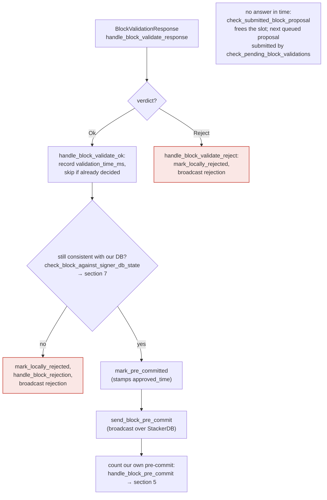
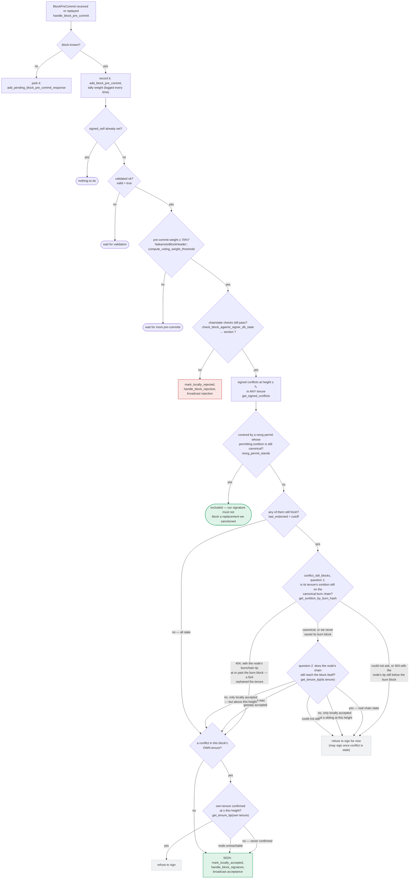

No vulnerability found for this question.

**Reasoning:** The premise of the question does not hold. `stop_and_record` in `stacks-signer/src/monitoring/mod.rs` is merely a Prometheus `HistogramTimer::stop_and_record()` call (or a no-op stub when `monitoring_prom` is disabled), used purely to measure RPC/latency timings after operations like `submit_block_for_validation`, `post_block`, `get_pox_data`, etc. [1](#0-0)  It has no return value, no side effect on any decision variable, and is invoked strictly after the decision (validation result, RPC response) has already been produced. [2](#0-1) 

`monitor_signers.rs` / `SignerMonitor` is an entirely separate, standalone CLI subcommand (`monitor-signers`) that polls StackerDB slots read-only to report missing/stale/unexpected signer messages for human operators; it does not write into any signer's local state machine, `signerdb`, or block-response decision path. [3](#0-2) [4](#0-3)  There is no code path by which `SignerMonitor`'s output feeds back into a running signer's `process_event`/state machine that governs `BlockProposal` validation, pre-commit, or signature decisions (documented in `docs/signer-flows.md`). [5](#0-4) 

Since neither `stop_and_record` nor `monitor_signers.rs` participates in or influences the actual validation/canonical-view decision logic, there is no "monitor feedback loop" that could perturb a signer's decision as claimed. The alleged invariant violation has no corresponding code path.

### Citations

**File:** stacks-signer/src/monitoring/mod.rs (L223-234)
```rust
    /// NoOp timer uses for monitoring when the monitoring feature is not enabled.
    pub struct NoOpTimer;
    impl NoOpTimer {
        /// NoOp method to stop recording when the monitoring feature is not enabled.
        pub fn stop_and_record(&self) {}
    }

    /// Stop and record the no-op timer.
    pub fn new_rpc_call_timer(_full_path: &str, _origin: &str) -> NoOpTimer {
        NoOpTimer
    }

```

**File:** stacks-signer/src/client/stacks_client.rs (L310-316)
```rust
        let response = retry_with_exponential_backoff(send_request)?;
        timer.stop_and_record();
        if !response.status().is_success() {
            return Err(ClientError::RequestFailure(response.status()));
        }
        Ok(())
    }
```

**File:** stacks-signer/src/monitor_signers.rs (L222-332)
```rust
    /// Start monitoring the signers stackerdb slots for expected new messages
    pub fn start(&mut self) -> Result<(), ClientError> {
        self.refresh_state()?;
        let nmb_signers = self.cycle_state.signers_keys.len();
        let interval_ms = self.args.interval * 1000;
        let reward_cycle = self
            .cycle_state
            .reward_cycle
            .expect("BUG: reward cycle not set");
        let contract = MessageSlotID::BlockResponse
            .stacker_db_contract(self.stacks_client.mainnet, reward_cycle);
        info!(
            "Monitoring signers stackerdb. Polling interval: {} secs, Max message age: {} secs, Reward cycle: {reward_cycle}, StackerDB contract: {contract}",
            self.args.interval, self.args.max_age
        );
        let stackerdb_timeout = Duration::from_secs(self.args.stackerdb_timeout_secs);
        let mut session = stackerdb_session(&self.args.host, contract, stackerdb_timeout);
        info!("Confirming messages for {nmb_signers} registered signers";
            "signer_addresses" => self.cycle_state.signers_addresses.values().map(|addr| format!("{addr}")).collect::<Vec<_>>().join(", ")
        );
        let mut last_messages = HashMap::with_capacity(nmb_signers);
        let mut last_updates = HashMap::with_capacity(nmb_signers);
        loop {
            info!("Polling signers stackerdb for new messages...");
            let mut missing_signers = Vec::with_capacity(nmb_signers);
            let mut stale_signers = Vec::with_capacity(nmb_signers);
            let mut unexpected_messages = HashMap::new();

            if self.refresh_state()? {
                let reward_cycle = self
                    .cycle_state
                    .reward_cycle
                    .expect("BUG: reward cycle not set");
                let contract = MessageSlotID::BlockResponse
                    .stacker_db_contract(self.stacks_client.mainnet, reward_cycle);
                info!(
                    "Reward cycle has changed to {reward_cycle}. Updating stacker db session to StackerDB contract {contract}.",
                );
                session = stackerdb_session(&self.args.host, contract, stackerdb_timeout);
                // Clear the last messages and signer last update times.
                last_messages.clear();
                last_updates.clear();
            }
            let new_messages: Vec<_> = session
                .get_latest_chunks(&self.cycle_state.slot_ids)?
                .into_iter()
                .map(|chunk_opt| {
                    chunk_opt.and_then(|data| read_next::<SignerMessage, _>(&mut &data[..]).ok())
                })
                .collect();

            for (signer_message_opt, slot_id) in
                new_messages.into_iter().zip(&self.cycle_state.slot_ids)
            {
                let signer_slot_id = SignerSlotID(*slot_id);
                let signer_address = self
                    .cycle_state
                    .signers_addresses
                    .get(&signer_slot_id)
                    .expect("BUG: missing signer address for given slot id")
                    .clone();
                let Some(signer_message) = signer_message_opt else {
                    missing_signers.push(signer_address);
                    continue;
                };
                if let Some(last_message) = last_messages.get(&signer_slot_id) {
                    if last_message == &signer_message {
                        continue;
                    }
                }
                let epoch = self.stacks_client.get_node_epoch()?;
                if epoch < StacksEpochId::Epoch25 {
                    return Err(ClientError::UnsupportedStacksFeature(format!("Monitoring signers is only supported for Epoch 2.5 and later. Current epoch: {epoch:?}")));
                }
                if (epoch == StacksEpochId::Epoch25
                    && !matches!(signer_message, SignerMessage::MockSignature(_)))
                    || (epoch > StacksEpochId::Epoch25
                        && !matches!(signer_message, SignerMessage::BlockResponse(_)))
                {
                    unexpected_messages.insert(signer_address, (signer_message, signer_slot_id));
                    continue;
                }
                last_messages.insert(signer_slot_id, signer_message);
                last_updates.insert(signer_slot_id, std::time::Instant::now());
            }
            for (slot_id, last_update_time) in last_updates.iter() {
                if last_update_time.elapsed().as_secs() > self.args.max_age {
                    let address = self
                        .cycle_state
                        .signers_addresses
                        .get(slot_id)
                        .expect("BUG: missing signer address for given slot id");
                    stale_signers.push(address.clone());
                }
            }
            if missing_signers.is_empty()
                && stale_signers.is_empty()
                && unexpected_messages.is_empty()
            {
                info!(
                    "All {} signers are sending messages as expected.",
                    nmb_signers
                );
            } else {
                self.print_missing_signers(&missing_signers);
                self.print_stale_signers(&stale_signers);
                self.print_unexpected_messages(&unexpected_messages);
            }
            sleep_ms(interval_ms);
        }
    }
```

**File:** stacks-signer/src/main.rs (L194-206)
```rust
fn handle_monitor_signers(args: MonitorSignersArgs) {
    // Verify that the host is a valid URL
    let mut signer_monitor = SignerMonitor::new(args);
    loop {
        if let Err(e) = signer_monitor.start() {
            error!(
                "Error occurred monitoring signers: {:?}. Waiting and trying again.",
                e
            );
            sleep_ms(1000);
        }
    }
}
```

**File:** docs/signer-flows.md (L211-272)
```markdown


> Anchors: `handle_block_validate_response`, `handle_block_validate_ok`,
> `handle_block_validate_reject`, `check_block_against_signer_db_state`,
> `send_block_pre_commit` (signer.rs)

## 5. Pre-commit threshold → signature

The only place the signer produces a block signature by counting votes.
Pre-commits from peers (and our own) accumulate; at ≥70% weight the signer
decides whether to follow through. Between validation and threshold, we may have
signed a _different_ block at the same height, possibly in another tenure, so
the world must be re-checked before the signature leaves the box.


```
