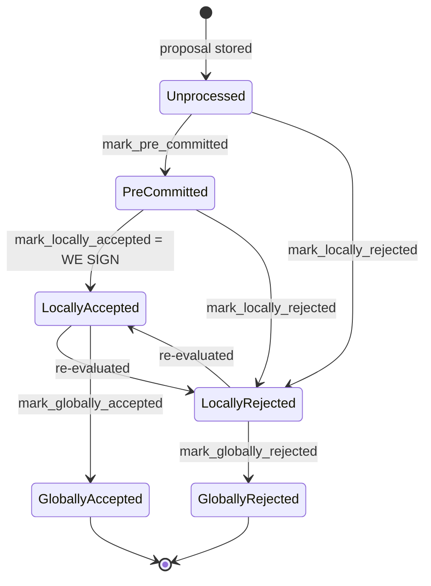

## Analysis

The bug-class analogy from the "unsafe transfer" report — a return value/side-effect not being checked, so a failed operation is treated as success — maps to `BlockInfo::mark_pre_committed` in `stacks-signer/src/signerdb.rs` and its caller `Signer::handle_block_validate_ok` in `stacks-signer/src/v0/signer.rs`.

`mark_pre_committed` mutates `self.valid` and `self.approved_time` **unconditionally**, then calls `move_to(BlockState::PreCommitted)` which can fail (`Err`) without rolling back those mutations: [1](#0-0) 

`check_state` only allows the `PreCommitted` transition from `Unprocessed`; from any other prior state (including the terminal `GloballyRejected`) it returns `Err`, but leaves `self.state` untouched: [2](#0-1) 

The caller's error handling for that `Err` only bails out if the block has *not* reached consensus **and** is not `LocallyAccepted` — meaning if `has_reached_consensus()` is true (i.e. state is `GloballyAccepted` or `GloballyRejected`), execution falls through and continues as if the pre-commit succeeded, persisting the corrupted `valid = Some(true)` and broadcasting a pre-commit / re-entering `handle_block_pre_commit`: [3](#0-2) 

`handle_block_pre_commit` then gates further processing (weight tally, chainstate re-check, conflict checks, and potentially signing) on `block_info.valid.unwrap_or(false)` rather than on `has_reached_consensus()`/terminal state, so the corrupted `valid = true` flag lets a block already recorded as `GloballyRejected` continue through the pre-commit/sign pipeline: [4](#0-3) 

This is the exact equality documented as an invariant in the signer flow ("GloballyRejected --> [*]", terminal), which this side-effect bug can silently violate: [5](#0-4) 

### Title
Unconditional side-effects in `mark_pre_committed` let a late validation response resurrect a `GloballyRejected` block - (File: stacks-signer/src/signerdb.rs, stacks-signer/src/v0/signer.rs)

### Summary
`BlockInfo::mark_pre_committed()` sets `valid = Some(true)` and stamps `approved_time` *before* attempting the state transition via `move_to`. If the transition fails (e.g. the block already reached the terminal `GloballyRejected` state), the function still returns an `Err`, but the `valid`/`approved_time` mutations are **not rolled back**. The caller, `handle_block_validate_ok`, treats "consensus already reached" as a benign reason to ignore the `Err` and falls through to persist the corrupted `BlockInfo` and re-run `send_block_pre_commit` / `handle_block_pre_commit`, which subsequently trusts the now-poisoned `valid == true` flag to proceed toward signing.

### Finding Description
A signer's own submitted block-validation request can be delayed relative to gossip from the rest of the signer set. If enough other signers reject the same proposal, the local `BlockInfo` for that block is driven to `BlockState::GloballyRejected` via rejection-handling paths, while this signer's own `valid` field remains `None` because it never got a validation response yet.

When the delayed `BlockValidateOk` finally arrives, `handle_block_validate_ok`:
1. Passes the `valid.is_some()` early-return check (still `None`).
2. Passes `check_block_against_signer_db_state` (which only checks tenure/parent consistency, not the already-recorded global rejection).
3. Calls `block_info.mark_pre_committed()`, which unconditionally sets `valid = Some(true)` and `approved_time`, then fails to actually move the state to `PreCommitted` because the prior state is `GloballyRejected` (`check_state` forbids `PreCommitted` except from `Unprocessed`).
4. The `Err` handler only returns early if `!has_reached_consensus() && state != LocallyAccepted`; since `has_reached_consensus()` is `true` for `GloballyRejected`, the condition is `false`, so execution proceeds.
5. The corrupted record (`state = GloballyRejected`, `valid = Some(true)`) is persisted, and the signer broadcasts a pre-commit and re-enters `handle_block_pre_commit` for a block the group has already terminally rejected.

`handle_block_pre_commit` gates further work on `block_info.valid.unwrap_or(false)` — now `true` due to the bug — rather than checking `has_reached_consensus()`. It proceeds to tally weight, recheck chainstate (again, not global-rejection state), and can drive the block to the `SIGN` branch (`mark_locally_accepted`, `handle_block_signature`), producing this signer's signature over a block the network already reached rejection consensus on.

### Impact Explanation
This breaks the documented terminal-state invariant ("`GloballyRejected --> [*]`") and lets a signer emit a signature (an accept) for a block that the group has already recorded as rejected — effectively "a rejection recounted as an accept" and a signer signing a non-canonical/conflicting block, both explicitly called out as Critical impacts.

### Likelihood Explanation
Triggering requires only a timing condition reachable by a single miner/proposer plus normal gossip: cause enough of the signer set to reject a proposal (pushing one signer's local record to `GloballyRejected`) while that same signer's own `/v3/block_proposal` validation response is delayed and arrives afterward. No majority of signer keys, StackerDB tampering, or auth-token access is needed — only ordinary network/timing variance plus a proposal designed to be rejected by most signers but still pass the (unrelated) `check_block_against_signer_db_state` check for the slow signer.

### Recommendation
- Make `mark_pre_committed` (and any similar "mark_*" helper) transactional: compute `move_to` first, and only mutate `valid`/`approved_time` if the transition succeeds — mirroring "check effects before applying them," the exact analog of using `safeTransfer`-style all-or-nothing semantics instead of unconditionally mutating state and hoping the subsequent operation succeeds.
- In `handle_block_validate_ok`'s `Err(e)` branch, unconditionally `return` whenever `has_reached_consensus()` is true, regardless of the `LocallyAccepted` special case, and explicitly re-derive `valid` from the persisted terminal state rather than leaving it in whatever state `mark_pre_committed` mutated it to.
- In `handle_block_pre_commit`, gate on `!block_info.has_reached_consensus()` in addition to (or instead of) `block_info.valid`, so a `GloballyRejected`/`GloballyAccepted` block can never re-enter the pre-commit/sign pipeline.

### Proof of Concept
1. Signer S proposes/receives block `B`. S submits `B` to its node for validation but the node response is slow (network delay, node under load, or a malicious/uncooperative miner-adjacent node).
2. Enough other signers in the set reject `B` (for any legitimate reason — e.g. it conflicts with a later canonical proposal) such that `store_and_process_block_rejection` on S's side drives `B`'s local `BlockInfo` for S to `BlockState::GloballyRejected`, while S's own `valid` stays `None` (S never got its own validation answer yet).
3. S's delayed `BlockValidateOk` for `B` finally arrives. `handle_block_validate_ok` runs: `valid.is_some()` is `false` so it proceeds; `check_block_against_signer_db_state` returns `None` (tenure/parent still consistent); `mark_pre_committed()` sets `valid = Some(true)` and fails to transition state (still `GloballyRejected`), returning `Err`.
4. Since `has_reached_consensus()` is `true`, the `Err` branch does not return; S persists `BlockInfo{state: GloballyRejected, valid: Some(true)}`, broadcasts a pre-commit for `B`, and calls `handle_block_pre_commit` on itself.
5. `handle_block_pre_commit` sees `valid.unwrap_or(false) == true`, proceeds through weight/conflict checks, and — if conditions align (e.g. S's own pre-commit plus any stray pre-commits reach threshold, and no live conflict is detected) — reaches the `SIGN` branch, producing S's signature over `B` even though S's own database already recorded `B` as `GloballyRejected`.

### Citations

**File:** stacks-signer/src/signerdb.rs (L272-277)
```rust
    /// Mark this block as valid, record the approved time timestamp if not already set and attempt to mark it as pre-committed.
    pub fn mark_pre_committed(&mut self) -> Result<(), String> {
        self.valid = Some(true);
        self.approved_time.get_or_insert(get_epoch_time_secs());
        self.move_to(BlockState::PreCommitted)
    }
```

**File:** stacks-signer/src/signerdb.rs (L313-329)
```rust
    /// Check if the block state transition is valid
    fn check_state(&self, state: BlockState) -> bool {
        let prev_state = &self.state;
        if *prev_state == state {
            return true;
        }
        match state {
            BlockState::Unprocessed => false,
            BlockState::LocallyAccepted | BlockState::LocallyRejected => !matches!(
                prev_state,
                BlockState::GloballyRejected | BlockState::GloballyAccepted
            ),
            BlockState::GloballyAccepted => !matches!(prev_state, BlockState::GloballyRejected),
            BlockState::GloballyRejected => !matches!(prev_state, BlockState::GloballyAccepted),
            BlockState::PreCommitted => matches!(prev_state, BlockState::Unprocessed),
        }
    }
```

**File:** stacks-signer/src/v0/signer.rs (L1316-1331)
```rust
        if block_info.signed_self.is_some() {
            debug!(
                "{self}: Received pre-commit for a block that we have already signed. Doing nothing...",
            );
            return;
        }

        if !block_info.valid.unwrap_or(false) {
            // We received a pre-commit for a block that we have not validated or we have already marked this block as invalid.
            // We should not do anything further as we do not know what our response should be and we do not change our votes on rejected
            // blocks unless we receive a new block proposal for it and the reject reason allows us to reconsider.
            debug!(
                "{self}: Received a pre-commit for a block that we have not determined to be valid: {:?}. Doing nothing...", block_info.valid
            );
            return;
        }
```

**File:** stacks-signer/src/v0/signer.rs (L1960-1984)
```rust
        } else {
            if let Err(e) = block_info.mark_pre_committed() {
                // The block may have reached enough signatures before we validated the block so should fail to mark pre-committed
                // but still call to make sure the timestamps and validity are updated correctly.
                if !block_info.has_reached_consensus()
                    && block_info.state != BlockState::LocallyAccepted
                {
                    warn!("{self}: Failed to mark block as approved: {e:?}",);
                    return;
                }
            }

            self.signer_db
                .insert_block(&block_info)
                .unwrap_or_else(|e| self.handle_insert_block_error(e));
            self.send_block_pre_commit(signer_signature_hash.clone());
            // have to save the signature _after_ the block info
            let address = self.stacks_address.clone();
            self.handle_block_pre_commit(
                stacks_client,
                sortition_state,
                &address,
                signer_signature_hash,
            );
        }
```

**File:** docs/signer-flows.md (L130-154)
```markdown
## 2. Block lifecycle (`BlockState`)

Every proposal tracked in the signer DB carries a `BlockState`. **`PreCommitted`
carries no signature**: it means "validated, willing to sign if the pre-commit
threshold is met." The first signature appears at `mark_locally_accepted`.
Global states are terminal against each other.



Canonical paths shown; the exact rule in `BlockInfo::check_state` is: either
local state is reachable from anything not yet global, `PreCommitted` only from
`Unprocessed`, and each global state is unreachable from the other.
```
