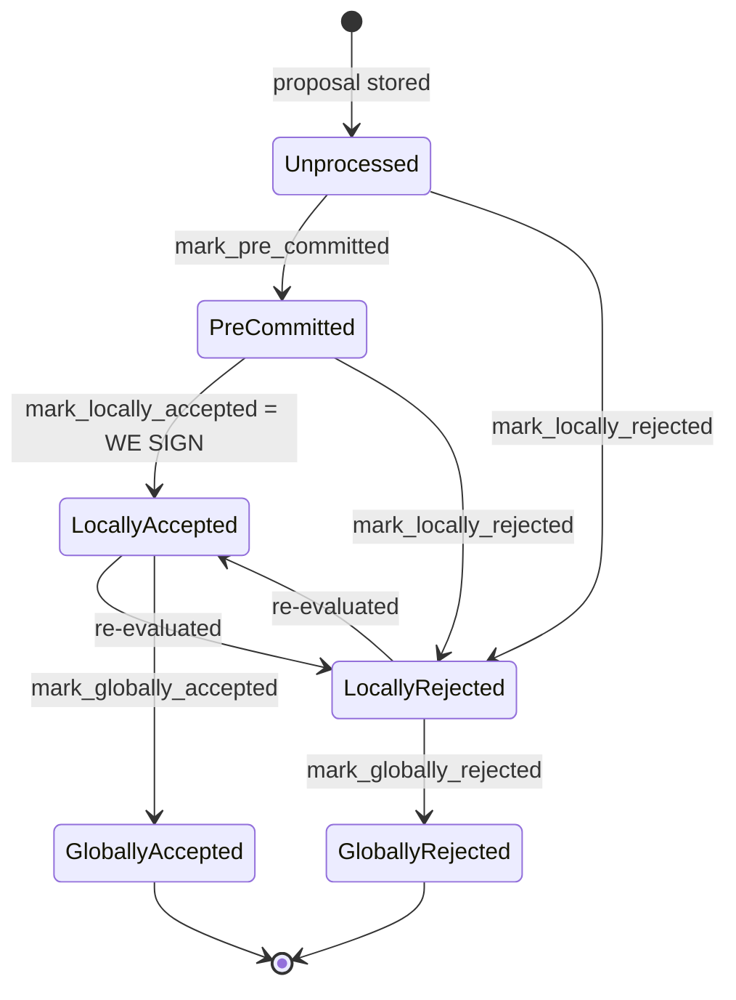
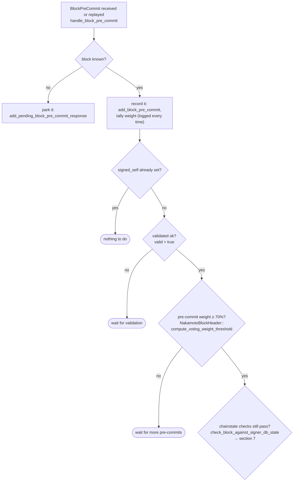

### Title
Signer broadcasts a block-acceptance signature over an already globally-rejected block because `handle_block_pre_commit` ignores the `Err` from `mark_locally_accepted` - (File: `stacks-signer/src/v0/signer.rs`)

### Summary
`BlockInfo::check_state` is designed so that the two global states are terminal and mutually exclusive: a block that is already `GloballyRejected` can never legally transition to `LocallyAccepted` [1](#0-0)  (docs describe this invariant explicitly as "Global states are terminal against each other" [2](#0-1) ). However, in the pre-commit → sign path, the code checks the `Result` of `mark_locally_accepted` only to decide whether to *log a warning* — it never aborts the signing sequence on failure, so the signer proceeds to build and broadcast a real acceptance signature regardless of whether the state transition (and thus the underlying safety guard) actually succeeded.

### Finding Description
In `handle_block_pre_commit`, once pre-commit weight crosses the 70% threshold and the chainstate/conflict re-checks pass, the code does:
```rust
if let Err(e) = block_info.mark_locally_accepted(false) {
    if !block_info.has_reached_consensus() {
        warn!("{self}: Failed to mark block as locally accepted: {e:?}",);
    }
}
self.signer_db.insert_block(&block_info)...;
let accepted = self.create_block_acceptance(&block_info.block);
self.handle_block_signature(stacks_client, sortition_state, &accepted);
self.send_block_response(&block_info.block, accepted.into());
``` [3](#0-2) 

There is **no `return`** after the `Err` branch. If `block_info.state` was already `GloballyRejected` (e.g., recorded earlier via `mark_globally_rejected`), `mark_locally_accepted` legitimately fails per `check_state`'s rule `BlockState::LocallyAccepted ... => !matches!(prev_state, GloballyRejected | GloballyAccepted)` [4](#0-3) . Because `has_reached_consensus()` is true in that case, even the warning is suppressed — yet execution falls straight through to `insert_block`, `create_block_acceptance`, `handle_block_signature`, and `send_block_response`, all of which run unconditionally. The signer therefore produces and gossips a real acceptance/signature message over a block whose `BlockState` guard explicitly forbade this transition.

The same anti-pattern (mutate fields such as `valid`/`approved_time`/`signed_self` before calling `move_to`, then ignore `move_to`'s `Err` and continue) also appears in the `mark_pre_committed` call inside `handle_block_validate_ok`, where the fallthrough condition `!block_info.has_reached_consensus() && block_info.state != LocallyAccepted` again lets an already-`GloballyRejected` block continue on to `send_block_pre_commit`/`handle_block_pre_commit` [5](#0-4) .

This is the direct analog of the Morpho/Aave deadlock: the state-machine guard (`isCollateral`/`check_state`) is supposed to be the single source of truth gating an action (turning collateral on/off vs. signing), but the caller's error handling doesn't actually respect the guard's refusal, so the "off" state (`GloballyRejected`) no longer blocks the "on" action (broadcasting a signature) from happening — exactly the class of equality-breaking bug the prompt is scanning for ("a rejection recounted as an accept").

### Impact Explanation
This is a **Critical** finding under the given classification: a signer signs (and gossips) an acceptance for a block the network has already collectively decided to reject via the `GloballyRejected` consensus state. If enough signers hit the same race (stale/late pre-commit messages processed after their own local `GloballyRejected` record was set — which requires no majority collusion, just ordinary gossip re-delivery/timing), these late signatures could contribute weight toward the same block crossing the signature threshold, directly undermining the invariant that a globally-rejected block can never also accumulate a globally-accepted signature set. It also corrupts `BlockInfo` bookkeeping (`signed_self` gets set on a block still recorded as `GloballyRejected`), which is used elsewhere (`has_signed_block_in_tenure`, tip queries) as ground truth, propagating the inconsistency to other decision points.

### Likelihood Explanation
This does not require a majority of signers or a specific key. It only requires ordinary asynchronous message delivery: a signer's own view records a block as `GloballyRejected` (via observed rejection consensus) before a straggling/late `BlockPreCommit` message for that same block pushes the local pre-commit tally over the 70% weight threshold in `handle_block_pre_commit`. Given normal StackerDB gossip latency and the explicit reliance on tallying "every time" pre-commits arrive [6](#0-5) , this ordering is plausible in the field, not merely theoretical, and the code path that fails to gate on the `Err` is unconditionally reachable.

### Recommendation
In `handle_block_pre_commit` (and the analogous `handle_block_validate_ok` branch), treat a failed `mark_locally_accepted`/`mark_pre_committed` transition as fatal to the *entire* remaining sequence, not just to the log message: `return` immediately whenever `move_to`/`mark_*` returns `Err`, regardless of `has_reached_consensus()`. More robustly, refactor `mark_pre_committed`/`mark_locally_accepted`/etc. to validate the transition with `check_state` *before* mutating any side-effect fields (`valid`, `approved_time`, `signed_self`, `signed_group`), so a rejected transition never leaves partial, inconsistent state in `BlockInfo` even if a future caller makes the same mistake.

### Proof of Concept
1. Block `B` is proposed; some signers pre-commit to it while others independently reject it and enough rejection weight accumulates that this signer marks `B` as `GloballyRejected` (`mark_globally_rejected`).
2. A delayed `BlockPreCommit` for `B` (sent earlier, before the rejecting consensus was reached, and delivered late over StackerDB gossip) arrives and is tallied, pushing this signer's locally observed pre-commit weight for `B` over the 70% threshold.
3. `handle_block_pre_commit`'s re-checks (chainstate check, conflict check) pass, since they do not inspect the signer's own recorded `BlockState`.
4. `block_info.mark_locally_accepted(false)` at `stacks-signer/src/v0/signer.rs:1467` fails (`Err`) because `check_state` forbids `GloballyRejected → LocallyAccepted`; since `has_reached_consensus()` is `true`, the warning is even suppressed.
5. Execution falls through with no `return`; `insert_block`, `create_block_acceptance`, `handle_block_signature`, and `send_block_response` (lines 1472-1478) all run, producing and broadcasting a genuine acceptance/signature message for block `B` — a block already globally rejected by the signer set's own consensus.

### Citations

**File:** stacks-signer/src/signerdb.rs (L313-329)
```rust
    /// Check if the block state transition is valid
    fn check_state(&self, state: BlockState) -> bool {
        let prev_state = &self.state;
        if *prev_state == state {
            return true;
        }
        match state {
            BlockState::Unprocessed => false,
            BlockState::LocallyAccepted | BlockState::LocallyRejected => !matches!(
                prev_state,
                BlockState::GloballyRejected | BlockState::GloballyAccepted
            ),
            BlockState::GloballyAccepted => !matches!(prev_state, BlockState::GloballyRejected),
            BlockState::GloballyRejected => !matches!(prev_state, BlockState::GloballyAccepted),
            BlockState::PreCommitted => matches!(prev_state, BlockState::Unprocessed),
        }
    }
```

**File:** docs/signer-flows.md (L130-150)
```markdown
## 2. Block lifecycle (`BlockState`)

Every proposal tracked in the signer DB carries a `BlockState`. **`PreCommitted`
carries no signature**: it means "validated, willing to sign if the pre-commit
threshold is met." The first signature appears at `mark_locally_accepted`.
Global states are terminal against each other.


```

**File:** docs/signer-flows.md (L237-248)
```markdown


**File:** stacks-signer/src/v0/signer.rs (L1467-1478)
```rust
        if let Err(e) = block_info.mark_locally_accepted(false) {
            if !block_info.has_reached_consensus() {
                warn!("{self}: Failed to mark block as locally accepted: {e:?}",);
            }
        }
        self.signer_db
            .insert_block(&block_info)
            .unwrap_or_else(|e| self.handle_insert_block_error(e));
        let accepted = self.create_block_acceptance(&block_info.block);
        // have to save the signature _after_ the block info
        self.handle_block_signature(stacks_client, sortition_state, &accepted);
        self.send_block_response(&block_info.block, accepted.into());
```

**File:** stacks-signer/src/v0/signer.rs (L1961-1983)
```rust
            if let Err(e) = block_info.mark_pre_committed() {
                // The block may have reached enough signatures before we validated the block so should fail to mark pre-committed
                // but still call to make sure the timestamps and validity are updated correctly.
                if !block_info.has_reached_consensus()
                    && block_info.state != BlockState::LocallyAccepted
                {
                    warn!("{self}: Failed to mark block as approved: {e:?}",);
                    return;
                }
            }

            self.signer_db
                .insert_block(&block_info)
                .unwrap_or_else(|e| self.handle_insert_block_error(e));
            self.send_block_pre_commit(signer_signature_hash.clone());
            // have to save the signature _after_ the block info
            let address = self.stacks_address.clone();
            self.handle_block_pre_commit(
                stacks_client,
                sortition_state,
                &address,
                signer_signature_hash,
            );
```
