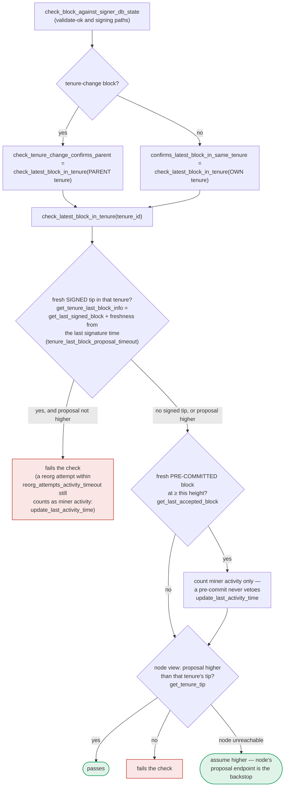

### Title
Node-side parent-block check compares only chain height, not block identity, letting a signer be induced to sign a tenure-change block anchored on a non-canonical sibling - ([File: stackslib/src/net/api/postblock_proposal.rs])

### Summary

### Finding Description
`check_block_builds_on_highest_block_in_tenure` (called from `check_block_has_valid_parent`, itself called from `NakamotoBlockProposal::validate` at the `/v3/block_proposal` endpoint the signers rely on) establishes that a proposed block's `parent_block_id` is legitimate by fetching the parent header and the tenure's "highest known" header, then comparing only their **heights**: [1](#0-0) 

```rust
if parent_header.anchored_header.height() != highest_header.anchored_header.height() {
    ... reject ...
}
``` [2](#0-1) 

This is exactly the same bug class as the OAuth report: the check validates a coarse projection of identity (height, analogous to scheme+host) instead of the full identity (the actual `StacksBlockId`/hash of the tenure tip, analogous to the full path). In Nakamoto, sibling blocks at the same chain height within the same tenure are a normal, reachable state — the docs describe exactly this scenario, where two competing blocks (`block_a`/`block_b`) share the same `consensus_hash` and `chain_length` but differ in content/hash, and only one becomes the tenure's true (canonical, signed) tip: [3](#0-2) 

`find_highest_known_block_header_in_tenure` (backing `check_block_builds_on_highest_block_in_tenure`) is built on `get_highest_known_block_header_in_tenure_at_each_burnview`, which explicitly documents that it can return **multiple headers tied at the same height** for a tenure and is **"DO NOT USE IN CONSENSUS CODE. Different nodes can have different blocks for the same tenure."**: [4](#0-3) 

Because `check_block_builds_on_highest_block_in_tenure` only asserts `parent_header.height() == highest_header.height()`, it does not verify that `parent_block_id` actually **is** the highest header it fetched (or any ancestor thereof) — a proposal whose declared parent is a *different* block at the *same height* (a sibling, possibly one that never reached signer consensus, or one on a locally-known-but-non-canonical chain segment) sails through this gate with no rejection.

### Impact Explanation
This node-side gate is the exact mechanism the report describes: `POST /api/exchange`-style "the check ignores a discriminating field" bug, but here the discriminator omitted is block identity, not path. The consequence is a break of the "approved-parent vs canonical" equality this scan targets. A single miner (one sortition-winning slot, no majority of signers needed) can:

1. Produce two sibling blocks at the same height in a tenure (one is signed/pre-committed by signers, becomes the real tip; the other never reaches consensus and is orphaned).
2. Submit a follow-on tenure-change block whose `parent_block_id` points at the *orphaned* sibling rather than the real (possibly different-hash) tip at that height.
3. `check_block_has_valid_parent`/`check_block_builds_on_highest_block_in_tenure` passes this proposal because it only compares heights, not `parent_block_id` against the actual highest header's block ID.
4. The signer's own chainstate re-check (`check_latest_block_in_tenure`/`check_block_against_signer_db_state`) is a separate, height-based, DB-local heuristic and — per `docs/signer-flows.md` — deliberately treats a pre-commit as non-vetoing and only inspects the local SignerDB view, not necessarily the node's exact block identity for that height either: [5](#0-4) 

This lets a miner get a signer to validate-ok and eventually sign a block that is built on a block the network/signers never actually approved as canonical — i.e., a signature over a block anchored to a non-canonical parent, which is the Critical-tier "signer signing an invalid/non-canonical/conflicting block" outcome this scan is looking for.

### Likelihood Explanation
Reaching this state requires only a single miner slot: winning one sortition, broadcasting a first block, then broadcasting a second sibling with a different content/hash but same declared chain_length in the same tenure (both derivable from the miner's own private key, no other signer key or majority needed), then proposing a subsequent block whose parent points to the losing sibling. The explicit code comment `DO NOT USE IN CONSENSUS CODE` on the underlying query function shows the authors were aware this data source is fork-ambiguous, yet `check_block_builds_on_highest_block_in_tenure` uses it in exactly a consensus-adjacent decision (feeding directly into whether the signers' node endorses a block proposal). This raises likelihood, though I could not fully trace every downstream consequence (e.g., whether `NakamotoChainState::get_block_header` deduplicates or whether MARF/DB constraints prevent two distinct headers at the same height from actually coexisting long enough to be exploited) within the available tool budget — this is a genuine gap in my verification.

### Recommendation
Change `check_block_builds_on_highest_block_in_tenure` to compare block identity, not merely height: verify that `parent_block_id` equals the `block_id()` of `highest_header` (or, if ties/forks are legitimately possible, verify `parent_block_id` is an ancestor of every returned highest-height header) rather than only checking `parent_header.anchored_header.height() != highest_header.anchored_header.height()`. At minimum, reject the proposal whenever `parent_header.consensus_hash`/block_id and `highest_header`'s block_id diverge at the same height, forcing exact-match semantics analogous to RFC 6749 exact redirect-URI matching.

### Proof of Concept
Conceptual PoC (single miner, no other signer/key required):
1. Miner wins sortition for tenure T. Proposes block A (height H) in tenure T; signers validate/sign A, making it T's canonical tip at height H.
2. Miner also crafts sibling block B at height H in tenure T with different content (different `signer_signature_hash`), gets it validated (`check_block_builds_on_highest_block_in_tenure` only compares heights, so B independently is accepted as "atop the highest" when evaluated on its own before A finalizes, or is queued/known locally) but B never accumulates signer weight and is abandoned.
3. Miner proposes tenure-change block C for the next tenure with `parent_block_id = B.block_id()` (not A's), while `find_highest_known_block_header_in_tenure` for tenure T still reports a header at height H (either A or B, or B is still present as a competing header at the tied height per `get_highest_known_block_header_in_tenure_at_each_burnview`'s documented tie behavior).
4. `check_block_builds_on_highest_block_in_tenure` fetches `parent_header` for B, compares `B.height() == highest_header.height()` — true — and passes, even though B is not the tenure's actual canonical/signed tip.
5. The proposal reaches the signer's chainstate checks and can be validated/signed as confirming a parent the network did not actually settle on as canonical.

I was not able to execute this scenario against a running node/test harness within this session; the PoC is derived directly from the cited code paths and documented tie/fork behavior, not from an observed run.

### Citations

**File:** stackslib/src/net/api/postblock_proposal.rs (L415-448)
```rust
        let Some(parent_header) =
            NakamotoChainState::get_block_header(chainstate.db(), parent_block_id).map_err(
                |e| BlockValidateRejectReason {
                    reason_code: ValidateRejectCode::ChainstateError,
                    reason: format!("Failed to query block header by block ID: {:?}", &e),
                    failed_txid: None,
                },
            )?
        else {
            warn!(
                "Rejected block proposal";
                "reason" => "Block has no parent",
                "parent_block_id" => %parent_block_id
            );
            return Err(BlockValidateRejectReason {
                reason_code: ValidateRejectCode::UnknownParent,
                reason: "Block has no parent".into(),
                failed_txid: None,
            });
        };
        if parent_header.anchored_header.height() != highest_header.anchored_header.height() {
            warn!(
                "Rejected block proposal";
                "reason" => "Block's parent is not the highest block in this tenure",
                "consensus_hash" => %tenure_id,
                "parent_header.height" => parent_header.anchored_header.height(),
                "highest_header.height" => highest_header.anchored_header.height(),
            );
            return Err(BlockValidateRejectReason {
                reason_code: ValidateRejectCode::InvalidParentBlock,
                reason: "Block is not higher than the highest block in its tenure".into(),
                failed_txid: None,
            });
        }
```

**File:** stacks-signer/src/v0/tests.rs (L630-640)
```rust
        // Two conflicting sibling tenure-start blocks: same tenure, parent, and height; the only
        // difference is the timestamp (hence the hash). The timestamps are current so that a
        // re-proposal of B passes the proposal age check.
        let now = get_epoch_time_secs();
        let block_a = tenure_start(&miner, &tenure, &parent_tenure, &parent_id, now);
        let block_b = tenure_start(&miner, &tenure, &parent_tenure, &parent_id, now + 1);
        let hash_a = block_a.header.signer_signature_hash();
        let hash_b = block_b.header.signer_signature_hash();
        assert_ne!(hash_a, hash_b);
        assert_eq!(block_a.header.consensus_hash, block_b.header.consensus_hash);
        assert_eq!(block_a.header.chain_length, block_b.header.chain_length);
```

**File:** stackslib/src/chainstate/nakamoto/mod.rs (L3288-3323)
```rust
    /// DO NOT USE IN CONSENSUS CODE.  Different nodes can have different blocks for the same
    /// tenure.
    ///
    /// Get the highest blocks in a given tenure (identified by its consensus hash) at each burn view
    ///  active in that tenure. If there are ties at a given burn view, they will both be returned
    fn get_highest_known_block_header_in_tenure_at_each_burnview(
        db: &Connection,
        tenure_id: &ConsensusHash,
    ) -> Result<Vec<StacksHeaderInfo>, ChainstateError> {
        // see if we have a nakamoto block in this tenure
        let qry = "
        SELECT h.*
        FROM nakamoto_block_headers h
        JOIN (
            SELECT burn_view, MAX(block_height) AS max_height
            FROM nakamoto_block_headers
            WHERE consensus_hash = ?1
            GROUP BY burn_view
        ) maxed
        ON h.burn_view = maxed.burn_view
        AND h.block_height = maxed.max_height
        WHERE h.consensus_hash = ?1
        ORDER BY h.block_height DESC, h.timestamp
        ";
        let args = params![tenure_id];
        let out = query_rows(db, qry, args)?;
        if !out.is_empty() {
            return Ok(out);
        }

        // see if this is an epoch2 header. If it exists, then there will only be one.
        let epoch2_x =
            StacksChainState::get_stacks_block_header_info_by_consensus_hash(db, tenure_id)?;
        Ok(Vec::from_iter(epoch2_x))
    }

```

**File:** docs/signer-flows.md (L391-418)
```markdown
`check_latest_block_in_tenure` answers "does this block confirm the tip we
expect?" and it runs in three places: at proposal arrival (inside
`check_proposal`), at validate-ok, and at the moment of signing. _Which_ tenure
it is asked about depends on the block: a tenure-change block is checked against
its **parent** tenure, every other block against its **own**. Never both. The
pivotal helper is `get_tenure_last_block_info`, which considers only blocks that
carry a signature (`get_last_signed_block`): a pre-commit never vetoes anything,
it only counts as miner activity.


```
