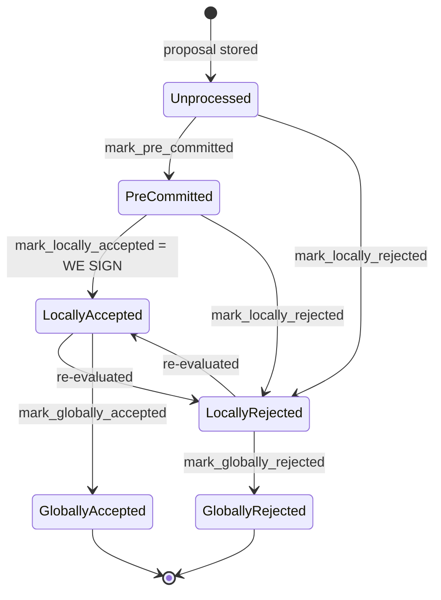

### Title
Re-proposal of a globally-rejected block resets its `BlockInfo` to `Unprocessed`, letting a signer sign a block that already reached terminal rejection - (File: stacks-signer/src/v0/signer.rs)

### Summary
`handle_block_proposal` guards against re-evaluating a block only when it has reached `BlockState::GloballyAccepted` (`globally_approved_and_responded`). For a block that has reached the *other* terminal state, `GloballyRejected`, no equivalent guard exists on the re-proposal path: if `should_reevaluate_reject_reason` deems the recorded reject reason reconsiderable, `handle_block_proposal` builds a brand-new `BlockInfo` from the incoming proposal (`state: BlockState::Unprocessed`, `valid: None`) and evaluates it from scratch, discarding the persisted terminal state instead of consulting it.

### Finding Description
The block lifecycle is intended to be terminal at `GloballyAccepted`/`GloballyRejected`: `BlockInfo::check_state` explicitly forbids leaving either global state for the other or for a local state [1](#0-0) , and the design doc confirms both are meant to be sinks with no outgoing transitions [2](#0-1) .

However, that invariant is only enforced *within a single `BlockInfo` instance* via `move_to`/`check_state`. The re-proposal path in `handle_block_proposal` only special-cases the accepted terminal state:

```
if block_info.globally_approved_and_responded() { ... return false; }
```
and `globally_approved_and_responded` checks only `BlockState::GloballyAccepted` [3](#0-2) . There is no analogous check for `GloballyRejected` in `should_reevaluate_block` [4](#0-3) .

If the prior reject reason is judged "reevaluable" by `should_reevaluate_reject_reason`, `should_reevaluate_block` returns `true`, and `handle_block_proposal` proceeds to construct a completely fresh `BlockInfo` from the incoming (re-)proposal:

```
let mut block_info = BlockInfo::from(block_proposal.clone());
```
which resets `state` to `Unprocessed` and `valid` to `None` by construction [5](#0-4) . This fresh object carries none of the memory that the persisted record for the same `signer_signature_hash` had already reached `GloballyRejected`. It is then run through the normal proposal/validation/pre-commit path, and if it validates and reaches pre-commit threshold, is signed via `mark_locally_accepted` and ultimately persisted with `insert_block`, overwriting the DB row that previously recorded the block as globally rejected [6](#0-5) .

This mirrors the TON bug precisely: one path to a state change (`mark_globally_rejected`, guarded by `check_state`) is safe, while an alternate path to reach the "same" outcome (a re-proposal that reinitializes the tracking object) never consults the guard because it never re-reads the terminal condition it is bypassing.

### Impact Explanation
This is a Critical-class break: a signer could sign a block that the signer set already collectively and terminally rejected (`GloballyRejected` reached via ≥30% rejection weight, meant to be unreachable to acceptance thereafter). That directly violates the "rejection is terminal" / "globally-rejected can never become globally-accepted" equality the whole tallying design depends on, and could let a previously-rejected, non-canonical block accumulate signatures after the fact.

### Likelihood Explanation
Requires: (1) a signer having already recorded a block as `GloballyRejected`, and (2) the miner (or any StackerDB participant able to gossip a `BlockProposal`, which is not exclusively the miner in all configurations) re-broadcasting a `BlockProposal` for the exact same `signer_signature_hash` with a reject reason the signer's `should_reevaluate_reject_reason` logic treats as reconsiderable (e.g., transient/connectivity-style reasons are explicitly designed to be revisited). Because I could not retrieve the full body of `should_reevaluate_reject_reason` in this session, I cannot confirm with certainty which reject-reason categories it treats as reconsiderable, or whether it additionally checks `has_reached_consensus()`/`GloballyRejected` internally before returning `true`. This is the main open uncertainty; the doc's own flow diagram, however, only special-cases "globally accepted and already responded" before consulting reject-reason reconsiderability, suggesting `GloballyRejected` is not separately excluded at that gate [7](#0-6) .

### Recommendation
- **Short term:** In `should_reevaluate_block` (or `handle_block_proposal` before constructing a fresh `BlockInfo`), add an explicit check equivalent to `globally_approved_and_responded` for `BlockState::GloballyRejected` — i.e., `block_info.has_reached_consensus()` should short-circuit re-evaluation for *both* terminal states, not just the accepted one.
- **Long term:** When re-evaluating a tracked block, mutate/carry forward the existing persisted `BlockInfo` (preserving `state`) rather than constructing a brand-new default-initialized `BlockInfo`, so that `BlockInfo::check_state`'s terminal-state invariant is always consulted regardless of entry path. Add a unit test asserting that a `GloballyRejected` block can never be re-signed via a subsequent `BlockProposal` re-evaluation.

### Proof of Concept
1. Signer set drives a block `B` (signature hash `H`) to `GloballyRejected` via ≥30% rejection weight; the signer's local DB row for `H` is `state = GloballyRejected` [8](#0-7) .
2. The corresponding reject reason recorded on that `BlockInfo` is one `should_reevaluate_reject_reason` treats as reconsiderable.
3. The same `BlockProposal` for `H` is re-gossiped over StackerDB.
4. `handle_block_proposal` looks up the prior info, calls `should_reevaluate_block`; `globally_approved_and_responded()` is `false` (state is `GloballyRejected`, not `GloballyAccepted`), and `should_reevaluate_reject_reason` returns `true` → function returns `true`.
5. `handle_block_proposal` builds `let mut block_info = BlockInfo::from(block_proposal.clone())` — a fresh object with `state = Unprocessed` — and reruns the full validation/pre-commit/sign pipeline, ultimately calling `insert_block` and overwriting the previously terminal `GloballyRejected` row for `H` with a newly signed state.

### Citations

**File:** stacks-signer/src/signerdb.rs (L233-250)
```rust
impl From<BlockProposal> for BlockInfo {
    fn from(value: BlockProposal) -> Self {
        Self {
            block: value.block,
            burn_block_height: value.burn_height,
            reward_cycle: value.reward_cycle,
            vote: None,
            valid: None,
            proposed_time: get_epoch_time_secs(),
            approved_time: None,
            signed_self: None,
            signed_group: None,
            ext: ExtraBlockInfo::default(),
            state: BlockState::Unprocessed,
            validation_time_ms: None,
            reject_reason: None,
        }
    }
```

**File:** stacks-signer/src/signerdb.rs (L313-329)
```rust
    /// Check if the block state transition is valid
    fn check_state(&self, state: BlockState) -> bool {
        let prev_state = &self.state;
        if *prev_state == state {
            return true;
        }
        match state {
            BlockState::Unprocessed => false,
            BlockState::LocallyAccepted | BlockState::LocallyRejected => !matches!(
                prev_state,
                BlockState::GloballyRejected | BlockState::GloballyAccepted
            ),
            BlockState::GloballyAccepted => !matches!(prev_state, BlockState::GloballyRejected),
            BlockState::GloballyRejected => !matches!(prev_state, BlockState::GloballyAccepted),
            BlockState::PreCommitted => matches!(prev_state, BlockState::Unprocessed),
        }
    }
```

**File:** stacks-signer/src/signerdb.rs (L359-363)
```rust
    /// Check if the block is globally accepted and this signer has responded to it
    pub fn globally_approved_and_responded(&self) -> bool {
        matches!(self.state, BlockState::GloballyAccepted)
            && (self.signed_self.is_some() || self.valid == Some(false))
    }
```

**File:** docs/signer-flows.md (L137-150)
```markdown

```

**File:** docs/signer-flows.md (L176-184)
```markdown
    RC -- yes --> KNOWN{"block already tracked?<br/>block_lookup_by_reward_cycle"}
    KNOWN -- yes --> REEV["should_reevaluate_block"]
    REEV --> DONE1{"globally accepted and<br/>already responded?"}
    DONE1 -- yes --> IGN2(["ignore"])
    DONE1 -- no --> REASON{"prior reject reason<br/>re-evaluable?<br/>should_reevaluate_reject_reason"}
    REASON -- no --> PC{"state = PreCommitted?"}
    PC -- yes --> RESEND["re-send pre-commit, re-run<br/>handle_block_pre_commit → section 5"]
    PC -- no --> PREV["re-send previous response<br/>determine_response, or wait if<br/>validation still pending"]
    REASON -- yes --> FRESH
```

**File:** stacks-signer/src/v0/signer.rs (L1466-1478)
```rust
        // It is only considered globally accepted IFF we receive a new block event confirming it OR see the chain tip of the node advance to it.
        if let Err(e) = block_info.mark_locally_accepted(false) {
            if !block_info.has_reached_consensus() {
                warn!("{self}: Failed to mark block as locally accepted: {e:?}",);
            }
        }
        self.signer_db
            .insert_block(&block_info)
            .unwrap_or_else(|e| self.handle_insert_block_error(e));
        let accepted = self.create_block_acceptance(&block_info.block);
        // have to save the signature _after_ the block info
        self.handle_block_signature(stacks_client, sortition_state, &accepted);
        self.send_block_response(&block_info.block, accepted.into());
```

**File:** stacks-signer/src/v0/signer.rs (L1483-1572)
```rust
    fn should_reevaluate_block(
        &mut self,
        stacks_client: &StacksClient,
        sortition_state: &mut Option<SortitionsView>,
        block_info: &BlockInfo,
        block_proposal: &BlockProposal,
    ) -> bool {
        let signer_signature_hash = block_info.block.header.signer_signature_hash();
        if block_info.globally_approved_and_responded() {
            info!("{self}: received a block proposal for a globally accepted block to which we have already responded. Ignoring.";
                "signer_signature_hash" => %signer_signature_hash,
                "block_id" => %block_info.block.block_id(),
                "block_height" => block_info.block.header.chain_length,
                "burn_height" => block_proposal.burn_height,
                "consensus_hash" => %block_info.block.header.consensus_hash,
                "timestamp" => block_info.block.header.timestamp,
                "signed_group" => block_info.signed_group,
                "signed_self" => block_info.signed_self,
                "valid" => ?block_info.valid
            );
            return false;
        }
        if !should_reevaluate_reject_reason(block_info) {
            if block_info.state == BlockState::PreCommitted {
                // We validated this block but haven't signed it. Signing requires the
                // pre-commit threshold and the conflict checks in `handle_block_pre_commit`.
                // Re-broadcast our pre-commit and re-run that evaluation instead of
                // responding with a signature directly, so a re-proposed block can't
                // bypass those checks.
                info!(
                    "{self}: received a block proposal for a block we have pre-committed to but not signed. Re-evaluating the pre-commit.";
                    "signer_signature_hash" => %signer_signature_hash,
                    "block_id" => %block_info.block.block_id(),
                    "block_height" => block_info.block.header.chain_length,
                    "burn_height" => block_proposal.burn_height,
                    "consensus_hash" => %block_info.block.header.consensus_hash
                );
                self.send_block_pre_commit(signer_signature_hash.clone());
                let address = self.stacks_address.clone();
                self.handle_block_pre_commit(
                    stacks_client,
                    sortition_state,
                    &address,
                    &signer_signature_hash,
                );
                return false;
            }
            if let Some(block_response) = self.determine_response(block_info) {
                self.send_block_response(&block_info.block, block_response);
                return false;
            } else {
                let is_pending = self
                    .signer_db
                    .has_pending_block_validation(&signer_signature_hash)
                    .unwrap_or_else(|e| {
                        warn!("{self}: Failed to load pending block validations: {e:?}");
                        false
                    });
                if is_pending {
                    debug!(
                        "{self}: received a block proposal for a block for which we is already pending validation. Do nothing.";
                        "signer_signature_hash" => %block_info.block.header.signer_signature_hash(),
                        "block_id" => %block_info.block.block_id()
                    );
                    return false;
                } else {
                    info!(
                        "{self}: received a block proposal for this block before, but we do not have a pending validation for it.";
                        "reject_reason" => ?block_info.reject_reason,
                        "signer_signature_hash" => %signer_signature_hash,
                        "block_id" => %block_info.block.block_id(),
                        "block_height" => block_info.block.header.chain_length,
                        "burn_height" => block_proposal.burn_height,
                        "consensus_hash" => %block_info.block.header.consensus_hash
                    );
                }
            }
        } else {
            info!(
                "{self}: received a block proposal for this block before, but our rejection reason allows us to reconsider";
                "reject_reason" => ?block_info.reject_reason,
                "signer_signature_hash" => %signer_signature_hash,
                "block_id" => %block_proposal.block.block_id(),
                "block_height" => block_proposal.block.header.chain_length,
                "burn_height" => block_proposal.burn_height,
                "consensus_hash" => %block_proposal.block.header.consensus_hash
            );
        }
        true
    }
```

**File:** stacks-signer/src/v0/signer.rs (L2335-2341)
```rust
        if let Err(e) = block_info.mark_globally_rejected() {
            warn!("{self}: Failed to mark block as globally rejected: {e:?}",);
        }
        if let Err(e) = self.signer_db.insert_block(block_info) {
            error!("{self}: Failed to update block state: {e:?}",);
            panic!("{self} Failed to update block state: {e}");
        }
```
