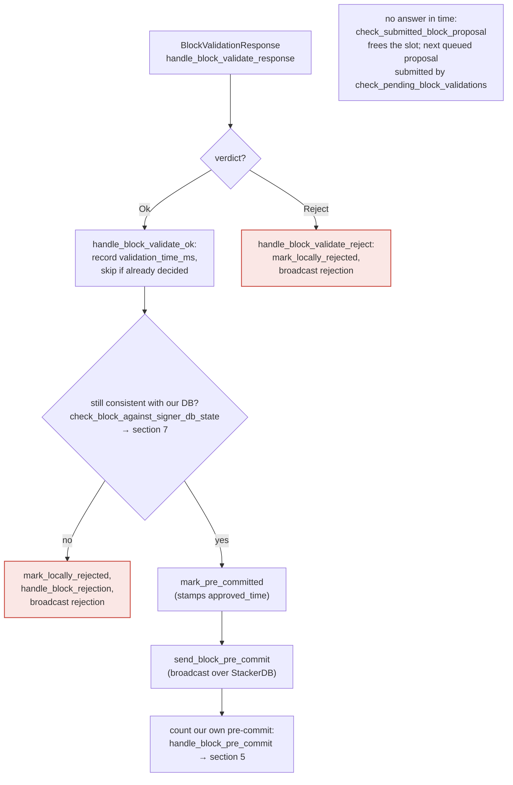
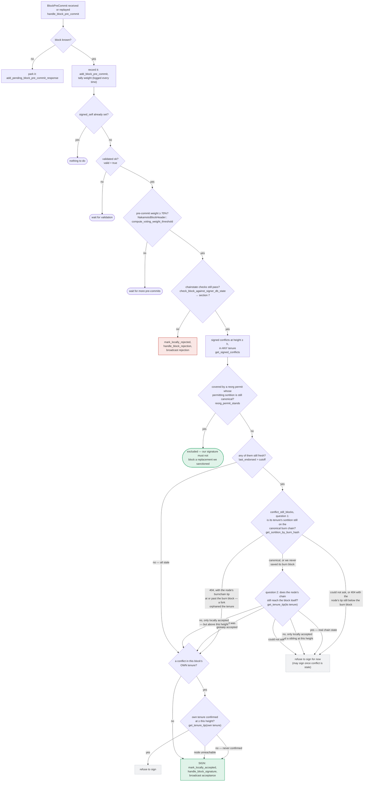

### Title
Tenure-extend eligibility (burn-view/idle-timeout) is validated only at proposal time and never re-checked before signing - (File: `stacks-signer/src/chainstate/v2.rs`)

### Summary
Analogous to the Tigris finding where a stop order's execution price is silently updated without re-validating SL/TP against the new price, the Stacks signer validates a tenure-extend block's eligibility conditions (has the burn view changed / has enough idle time passed) exactly once, at proposal arrival. The result of that one-time check is never re-verified at the two later gates — validate-ok and pre-commit-threshold — before the signer produces its final, irreversible signature.

### Finding Description
`GlobalStateView::check_proposal` (v2) and the analogous v1 check gate a tenure-extend transaction on:
```
let changed_burn_view = tenure_extend.burn_view_consensus_hash != current_burn_view;
...
if !changed_burn_view && !enough_time_passed && !is_in_replay {
    return Err(RejectReason::InvalidTenureExtend);
}
``` [1](#0-0) 

This check queries `client.get_tenure_tip(tenure_id)` and compares against the *current* burn view at the moment the proposal is evaluated, but that check runs only inside `check_proposal`, which is invoked exclusively from `handle_block_proposal` on first arrival of the proposal [2](#0-1) .

Between that moment and the point where the signer actually produces a signature, two more asynchronous gates occur: the node's `/v3/block_proposal` validation round-trip (`handle_block_validate_ok`) and the pre-commit-weight-threshold crossing (`handle_block_pre_commit`). Both gates call `check_block_against_signer_db_state`, but that function only re-runs `check_tenure_change_confirms_parent` / `check_latest_block_in_tenure` — it never re-invokes the tenure-extend-specific eligibility check (burn-view-changed / idle-timeout / replay):
```
fn check_block_against_signer_db_state(...) -> Option<BlockRejection> {
    ...
    if let Some(tenure_change) = proposed_block.get_tenure_change_tx_payload() {
        match SortitionData::check_tenure_change_confirms_parent(...) { ... }
    }
    match SortitionData::check_latest_block_in_tenure(...) { ... }
}
``` [3](#0-2) 

This is documented as deliberate/known scope in `docs/signer-flows.md`: "Two things belong to the proposal path only and are not re-run at validate-ok or at signing: ... the v2 `check_proposal` wrapper checks miner pubkey hash, consensus hash, the pox bitvec, and tenure-extend rules before delegating here." [2](#0-1) 

The gap: at proposal time, `current_burn_view` reflects the burn chain tip as observed then. Node validation (`submit_block_for_validation`/`handle_block_validate_response`) and the pre-commit gossip round needed to cross the 70% weight threshold take real wall-clock time [4](#0-3) [5](#0-4) . If a new Bitcoin block/sortition arrives in that window, the tenure tip's `burn_view` changes — the exact condition the check exists to gate on — yet the signer proceeds straight to `mark_locally_accepted`/signature on the strength of the stale, proposal-time verdict, because the re-checks at validate-ok and at pre-commit-threshold-crossing (`check_block_against_signer_db_state`) never re-run `validate_tenure_change_payload`'s tenure-extend branch.

### Impact Explanation
This lets a miner's tenure-extend block be signed by the signer set even though the burn view it extends against is no longer canonical/current by the time the signature is actually produced — the signer places its irreversible signature on a tenure-extend block whose stated eligibility condition (unchanged burn view, or elapsed idle timeout) is stale relative to the chain state at signing time. This is a "signer signing a non-canonical/stale-justified block" class of issue, matching the Critical impact category (signing a block that is not actually canonical/valid against current chain state at the moment of signing).

### Likelihood Explanation
No majority collusion, no key compromise, and no local/auth-token access is required. Any single miner (the one-slot actor in scope) can trigger the race simply by proposing a tenure-extend block right as it becomes minimally eligible; the natural latency of node validation + StackerDB gossip to reach 70% pre-commit weight is enough window for a new sortition to land before signing completes. This is a timing condition that can occur during ordinary chain operation, not solely under adversarial control, which raises the likelihood further.

### Recommendation
Re-run the tenure-extend-specific eligibility check (`changed_burn_view` / `enough_time_passed` / replay-set) inside `check_block_against_signer_db_state`, using the burn view as observed immediately before signing, at both the validate-ok gate and the pre-commit-threshold-crossing gate — mirroring how `check_tenure_change_confirms_parent`/`check_latest_block_in_tenure` are already re-verified at those points.

### Proof of Concept
1. Miner proposes a full tenure-extend block B at time T0; `GlobalStateView::check_proposal` observes `current_burn_view == B`'s recorded burn view (or idle timeout has just elapsed) and approves it. [6](#0-5) 
2. Signer submits B to the node for validation; while waiting for `BlockValidateOk` and for pre-commit gossip to accumulate 70% weight, a new Bitcoin block triggers a new sortition, changing the canonical burn view. [4](#0-3) 
3. `handle_block_validate_ok` and `handle_block_pre_commit` both call `check_block_against_signer_db_state`, which does not re-examine `get_tenure_extend_tx_payload` / burn-view freshness at all. [7](#0-6) 
4. The signer proceeds to `mark_locally_accepted` and broadcasts its signature on B, even though B's tenure-extend justification is now stale relative to the just-arrived sortition.

### Citations

**File:** stacks-signer/src/chainstate/v2.rs (L199-249)
```rust
        // is there an unsupported tenure extend type?
        if let Some(tenure_extend) = block.get_tenure_extend_tx_payload().filter(|extend| {
            !(extend.cause.is_full_extend() || extend.cause.is_read_count_extend())
        }) {
            warn!(
                "Miner block proposal contains a tenure extend with an unsupported cause";
                "tenure_extend_cause" => %tenure_extend.cause,
            );
            return Err(RejectReason::InvalidTenureExtend);
        }

        // is there a full tenure extend in this block?
        if let Some(tenure_extend) = block
            .get_tenure_extend_tx_payload()
            .filter(|extend| extend.cause.is_full_extend())
        {
            // in full tenure extends, we need to check:
            // (1) if this is the most recent sortition, an extend is allowed if it changes the burnchain view
            // (2) if this is the most recent sortition, an extend is allowed if enough time has passed to refresh the block limit
            // (3) if we are in replay, an extend is allowed
            let tenure_tip = client.get_tenure_tip(tenure_id)
                .map_err(|e| {
                    warn!("Could not load current tenure tip while evaluating a tenure-extend; cannot approve."; "err" => %e);
                    RejectReason::InvalidTenureExtend
                })?;
            let Some(current_burn_view) = tenure_tip.burn_view else {
                warn!("Tenure-extend attempted in tenure without burn-view.");
                return Err(RejectReason::InvalidTenureExtend);
            };
            let changed_burn_view = tenure_extend.burn_view_consensus_hash != current_burn_view;
            let extend_timestamp = signer_db.calculate_full_extend_timestamp(
                self.config.tenure_idle_timeout,
                block,
                false,
            );
            let epoch_time = get_epoch_time_secs();
            let enough_time_passed = epoch_time >= extend_timestamp;
            let is_in_replay = self.signer_state.tx_replay_set.is_some();
            if !changed_burn_view && !enough_time_passed && !is_in_replay {
                warn!(
                    "Miner block proposal contains a tenure extend, but the conditions for allowing a tenure extend are not met. Considering proposal invalid.";
                    "proposed_block_consensus_hash" => %block.header.consensus_hash,
                    "signer_signature_hash" => %block.header.signer_signature_hash(),
                    "extend_timestamp" => extend_timestamp,
                    "epoch_time" => epoch_time,
                    "is_in_replay" => is_in_replay,
                    "changed_burn_view" => changed_burn_view,
                    "enough_time_passed" => enough_time_passed,
                );
                return Err(RejectReason::InvalidTenureExtend);
            }
```

**File:** docs/signer-flows.md (L205-228)
```markdown
## 4. The node's validation verdict

The stacks-node answers the `/v3/block_proposal` submission. On OK, the signer
re-checks its own DB state and only then advertises willingness to sign by
broadcasting a **pre-commit**. A signature is _not_ produced here.



> Anchors: `handle_block_validate_response`, `handle_block_validate_ok`,
> `handle_block_validate_reject`, `check_block_against_signer_db_state`,
> `send_block_pre_commit` (signer.rs)

```

**File:** docs/signer-flows.md (L229-272)
```markdown
## 5. Pre-commit threshold → signature

The only place the signer produces a block signature by counting votes.
Pre-commits from peers (and our own) accumulate; at ≥70% weight the signer
decides whether to follow through. Between validation and threshold, we may have
signed a _different_ block at the same height, possibly in another tenure, so
the world must be re-checked before the signature leaves the box.


```

**File:** docs/signer-flows.md (L425-433)
```markdown
Two things belong to the proposal path only and are **not** re-run at validate-ok
or at signing:

- `validate_tenure_change_payload` rejects with `DuplicateBlockFound` when we
  have already accepted a block in the tenure a tenure-change block is starting.
  v2 counts locally or globally accepted blocks (`get_last_signed_block`); v1
  counts only globally accepted ones (`get_last_globally_accepted_block`).
- the v2 `check_proposal` wrapper checks miner pubkey hash, consensus hash, the
  pox bitvec, and tenure-extend rules before delegating here.
```

**File:** stacks-signer/src/v0/signer.rs (L1799-1880)
```rust
    /// WARNING: This is an incomplete check. Do NOT call this function PRIOR to check_proposal or block_proposal validation succeeds.
    ///
    /// Re-verify a block's chain length against the last signed block within signerdb.
    /// This is required in case a block has been approved since the initial checks of the block validation endpoint.
    fn check_block_against_signer_db_state(
        &mut self,
        stacks_client: &StacksClient,
        proposed_block: &NakamotoBlock,
    ) -> Option<BlockRejection> {
        let signer_signature_hash = proposed_block.header.signer_signature_hash();
        // If this is a tenure change block, ensure that it confirms the correct number of blocks from the parent tenure.
        if let Some(tenure_change) = proposed_block.get_tenure_change_tx_payload() {
            // Ensure that the tenure change block confirms the expected parent block
            match SortitionData::check_tenure_change_confirms_parent(
                tenure_change,
                proposed_block,
                &mut self.signer_db,
                stacks_client,
                self.proposal_config.tenure_last_block_proposal_timeout,
                self.proposal_config.reorg_attempts_activity_timeout,
            ) {
                Ok(true) => return None,
                Ok(false) => {
                    return Some(self.create_block_rejection(
                        RejectReason::SortitionViewMismatch,
                        proposed_block,
                    ))
                }
                Err(e) => {
                    warn!("{self}: Error checking block proposal: {e}";
                        "signer_signature_hash" => %signer_signature_hash,
                        "block_id" => %proposed_block.block_id()
                    );
                    return Some(self.create_block_rejection(
                        RejectReason::ConnectivityIssues(
                            "error checking block proposal".to_string(),
                        ),
                        proposed_block,
                    ));
                }
            }
        }

        // Ensure that the block is the last block in the chain of its current tenure.
        match SortitionData::check_latest_block_in_tenure(
            &proposed_block.header.consensus_hash,
            proposed_block,
            &mut self.signer_db,
            stacks_client,
            self.proposal_config.tenure_last_block_proposal_timeout,
            self.proposal_config.reorg_attempts_activity_timeout,
        ) {
            Ok(is_latest) => {
                if !is_latest {
                    warn!(
                        "Miner's block proposal does not confirm as many blocks as we expect";
                        "proposed_block_consensus_hash" => %proposed_block.header.consensus_hash,
                        "proposed_block_signer_signature_hash" => %signer_signature_hash,
                        "proposed_chain_length" => proposed_block.header.chain_length,
                    );
                    Some(self.create_block_rejection(
                        RejectReason::SortitionViewMismatch,
                        proposed_block,
                    ))
                } else {
                    None
                }
            }
            Err(e) => {
                warn!("{self}: Failed to check block against signer db: {e}";
                    "signer_signature_hash" => %signer_signature_hash,
                    "block_id" => %proposed_block.block_id()
                );
                Some(self.create_block_rejection(
                    RejectReason::ConnectivityIssues(
                        "failed to check block against signer db".to_string(),
                    ),
                    proposed_block,
                ))
            }
        }
    }
```
