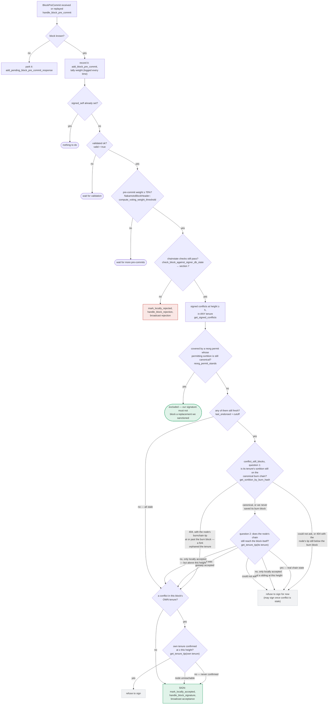

## Analysis

The GDACurve report describes a "compute vs. validate" gap: a value (spot price) is recomputed on the hot path but the explicit validation routine that exists elsewhere (`validateSpotPrice`/`MIN_PRICE`) is never re-invoked on that recomputed value, letting the invariant silently drift out of bounds over repeated updates.

The stacks-signer codebase has a documented, structurally identical gap: `GlobalStateView::check_proposal` (v2) / the v1 equivalent verify several block-binding facts (consensus hash matches the active miner's `tenure_id`, miner pubkey hash matches the sortition winner, pox bitvec is all-1s, and — for tenure-change blocks — `DuplicateBlockFound`/no prior signed block in tenure) **only at proposal arrival**. The re-validation routine that runs later in the lifecycle, `check_block_against_signer_db_state` (called at `handle_block_validate_ok` and again at the pre-commit-threshold-crossing moment in `handle_block_pre_commit`), re-checks only `check_latest_block_in_tenure`/`get_tenure_last_block_info` — it does **not** re-verify consensus hash, miner pubkey hash, pox bitvec, or the tenure-change duplicate-block guard. [1](#0-0) [2](#0-1) [3](#0-2) 

This is exactly the bug class in the report: an equality/invariant (`block.consensus_hash == active miner's tenure_id`, `signed block belongs to only one tenure`) is checked once against state that is a snapshot in time, but the value that state is compared to (the active-miner/global state machine, or the signer's own DB of signed blocks) can legitimately change between proposal time and signing time — and the signer never re-runs the check before putting its irreversible signature on the block.

Concretely: the pre-commit round can take an arbitrary amount of wall-clock time to reach the 70% threshold (`handle_block_pre_commit`, gated on `NakamotoBlockHeader::compute_voting_weight_threshold`). [4](#0-3)  During that window the signer's global/local state machine can advance to a different active miner/tenure (a burnchain reorg, a new sortition, another accepted block), which would have caused `check_proposal` to reject the block if evaluated now — but `check_block_against_signer_db_state`, the only re-check actually run before signing, does not re-verify `ConsensusHashMismatch`/`PubkeyHashMismatch`/`InvalidBitvec`. The only mitigations documented are the narrower, same-tenure/parent-tenure `get_tenure_last_block_info` recheck and the cross-tenure "signed conflicts" guard (`get_signed_conflicts`/`conflict_still_blocks`) — neither of which re-derives consensus-hash/pubkey/bitvec correctness against the *current* active-miner state. [5](#0-4) 

However, I was not able to fully confirm within the available context whether `check_block_against_signer_db_state`'s call sites are truly the *only* gate before `mark_locally_accepted`/signature broadcast, or whether some other layer (e.g., a fresh `SortitionsView`/`GlobalStateView` re-fetch immediately preceding `handle_block_pre_commit`) implicitly re-derives and re-checks these fields as a side effect of state-machine bookkeeping. The doc excerpt explicitly states these checks are "not re-run at validate-ok or at signing," which is a strong signal, but I could not open the full body of `check_block_against_signer_db_state` in `signer.rs` to see its exact call graph and confirm no adjacent code re-derives `current_miner_pkh`/`tenure_id` freshness before the signature is placed. This residual uncertainty means the finding below should be treated as a strong analog rather than a fully re-verified root cause from source alone — the documentation-derived "Anchors" note is treated as the primary evidence.

### Title
Signer signs a block without re-validating consensus hash, miner pubkey, and pox bitvec that can go stale between proposal and pre-commit-threshold signing - (File: stacks-signer/src/chainstate/v2.rs / stacks-signer/src/v0/signer.rs)

### Summary
`GlobalStateView::check_proposal` verifies that a proposed block's `consensus_hash` matches the currently active miner's `tenure_id`, that the block's miner pubkey hash matches the sortition winner, that the pox bitvec is all-1s, and (for tenure-change blocks) that no block has already been signed in that tenure. These checks run exactly once, at proposal arrival. The re-validation performed later in the lifecycle — `check_block_against_signer_db_state`, invoked both when the node's validate-ok response arrives and again right before a signature is emitted at the pre-commit threshold — only re-derives `check_latest_block_in_tenure`. It never re-checks consensus hash, miner pubkey hash, or the pox bitvec against the signer's now-current active-miner/global state.

### Finding Description
The pre-commit round is explicitly designed to take an unbounded amount of time (bounded only by `block_proposal_timeout`) while 70% of signer weight accumulates. Between the moment a proposal is judged valid (`check_proposal`, using the active-miner state at that instant) and the moment the block crosses the pre-commit threshold and is actually signed (`handle_block_pre_commit`), the signer's global state machine can legitimately advance: a new sortition can occur, another miner can become active, or a burnchain reorg can occur — all of which would flip the outcome of `ConsensusHashMismatch`/`PubkeyHashMismatch`/`InvalidBitvec` checks if re-evaluated. [6](#0-5) 

The re-check that does run before the signature is emitted, `check_block_against_signer_db_state`, is scoped only to "does this block confirm the tip we expect" (`check_latest_block_in_tenure`/`get_tenure_last_block_info`), explicitly excluding the identity-binding checks. [7](#0-6)  The `DuplicateBlockFound` guard for tenure-change blocks is likewise proposal-time-only, relying on a separate, narrower own-tenure "signed conflicts" mechanism to catch what it can (same-height siblings), rather than re-running the original duplicate check. [8](#0-7) 

This mirrors the GDACurve pattern precisely: a value/derived-state comparison (`newSpotPrice` vs `MIN_PRICE`; here, `block.consensus_hash`/`miner_pkh`/`bitvec` vs the *current* active-miner state) is validated explicitly in one code path (`validateSpotPrice`; here, `check_proposal`) but the equivalent validation is silently dropped from the path that runs later against updated state (`getBuyInfo`/`getSellInfo`; here, `check_block_against_signer_db_state` at pre-commit time), allowing the invariant to be violated in the window between the two.

### Impact Explanation
If the active-miner/tenure identity changes during the pre-commit window (e.g., a new sortition elects a different miner, or a reorg changes which tenure/pubkey is canonical) while a previously-valid proposal is still accumulating pre-commit weight from signers, a signer could put its final signature on a block whose consensus hash or miner pubkey hash no longer matches the current canonical view — i.e., signing a **non-canonical** block. This falls under the report's Critical bucket: "a signer signing an invalid, non-canonical, or conflicting block." Because this signature is a bearer instrument that other signers count toward the 70% threshold (per the documented invariant that a rejection can be reconsidered but a signature cannot), a stale-state signature could contribute to pushing a non-canonical block over the group threshold.

### Likelihood Explanation
This requires only a single signer's own state machine to observe a transition (new sortition/reorg) during an ordinary pre-commit window — no majority collusion, no other signer's key, no auth token — and depends purely on timing that is explicitly acknowledged elsewhere in the codebase as a real, recurring race (the doc devotes an entire section to "between validation and threshold... we may have signed a different block"). This makes it a plausible, one-signer-triggerable, timing-dependent condition rather than a purely theoretical one, though I could not fully rule out an unseen re-derivation step given incomplete visibility into `check_block_against_signer_db_state`'s full body.

### Recommendation
Re-run the full `check_proposal`-equivalent identity checks (consensus hash vs. current active miner's tenure id, miner pubkey hash vs. current sortition winner, pox bitvec all-1s, and the tenure-change duplicate-block guard) inside `check_block_against_signer_db_state`, or an equivalent gate, immediately before both `mark_pre_committed` and the final `mark_locally_accepted`/signature step in `handle_block_pre_commit`, using the signer's then-current `GlobalStateView`/`SortitionsView` rather than the one captured at proposal time.

### Proof of Concept
Conceptual (timing-based, single signer):
1. Miner A proposes block B for tenure T; signer's `check_proposal` passes against active-miner state where `current_miner_pkh`/`tenure_id` = A/T.
2. Signer submits B for node validation, receives OK, calls `check_block_against_signer_db_state` (passes — it only checks tenure-tip freshness), and broadcasts pre-commit.
3. Before B reaches the 70% pre-commit threshold, a new sortition elects miner A′ for tenure T′ (or a burnchain reorg changes the canonical tenure), updating the signer's `GlobalStateEvaluator`/`SignerStateMachine` so that the *current* active miner is no longer (A, T).
4. Peer pre-commits for B continue arriving and cross the 70% weight threshold; `handle_block_pre_commit` re-runs `check_block_against_signer_db_state`, which only checks `check_latest_block_in_tenure`, not consensus-hash/pubkey/bitvec — passes.
5. Signer proceeds to `mark_locally_accepted`/signs B, even though B's consensus hash/miner pubkey no longer matches the signer's current view of the canonical active miner. [9](#0-8) [10](#0-9)

### Citations

**File:** docs/signer-flows.md (L229-272)
```markdown
## 5. Pre-commit threshold → signature

The only place the signer produces a block signature by counting votes.
Pre-commits from peers (and our own) accumulate; at ≥70% weight the signer
decides whether to follow through. Between validation and threshold, we may have
signed a _different_ block at the same height, possibly in another tenure, so
the world must be re-checked before the signature leaves the box.


```

**File:** docs/signer-flows.md (L420-437)
```markdown
A failed check becomes a different rejection depending on who asked.
`check_block_against_signer_db_state` returns `SortitionViewMismatch`, or
`ConnectivityIssues` when the lookup itself errored rather than answering; the v2
`check_proposal` path returns `InvalidParentBlock`.

Two things belong to the proposal path only and are **not** re-run at validate-ok
or at signing:

- `validate_tenure_change_payload` rejects with `DuplicateBlockFound` when we
  have already accepted a block in the tenure a tenure-change block is starting.
  v2 counts locally or globally accepted blocks (`get_last_signed_block`); v1
  counts only globally accepted ones (`get_last_globally_accepted_block`).
- the v2 `check_proposal` wrapper checks miner pubkey hash, consensus hash, the
  pox bitvec, and tenure-extend rules before delegating here.

Because the duplicate check never runs again, a block that crosses the pre-commit
threshold long after it was proposed relies on section 5's own-tenure conflict
guard to cover the same ground.
```

**File:** stacks-signer/src/chainstate/v2.rs (L111-174)
```rust
impl GlobalStateView {
    /// Apply checks from the signer state machine on the block proposal.
    pub fn check_proposal(
        &self,
        client: &StacksClient,
        signer_db: &mut SignerDb,
        block: &NakamotoBlock,
    ) -> Result<(), RejectReason> {
        let MinerState::ActiveMiner {
            current_miner_pkh,
            tenure_id,
            parent_tenure_id,
            ..
        } = &self.signer_state.current_miner
        else {
            info!(
                "No valid current miner. Considering invalid.";
                "block_height" => block.header.chain_length,
                "signer_signature_hash" => %block.header.signer_signature_hash()
            );
            return Err(RejectReason::InvalidMiner);
        };
        if &block.header.consensus_hash != tenure_id {
            info!("Miner block proposal consensus hash does not match the current miner's tenure id. Considering invalid.";
                "block_height" => block.header.chain_length,
                "signer_signature_hash" => %block.header.signer_signature_hash(),
                "block_consensus_hash" => %block.header.consensus_hash,
                "active_miner_tenure_id" => %tenure_id,
                "active_miner_parent_tenure_id" => %parent_tenure_id,
            );
            return Err(RejectReason::ConsensusHashMismatch {
                actual: block.header.consensus_hash.clone(),
                expected: tenure_id.clone(),
            });
        }
        let Some(miner_pk) = block.header.recover_miner_pk() else {
            warn!("Failed to recover miner pubkey";
                  "signer_signature_hash" => %block.header.signer_signature_hash(),
                  "consensus_hash" => %block.header.consensus_hash);
            return Err(RejectReason::IrrecoverablePubkeyHash);
        };
        let miner_pkh = Hash160::from_data(&miner_pk.to_bytes_compressed());
        if current_miner_pkh != &miner_pkh {
            warn!(
                "Miner block proposal pubkey does not match the winning pubkey hash for its sortition. Considering invalid.";
                "proposed_block_consensus_hash" => %block.header.consensus_hash,
                "signer_signature_hash" => %block.header.signer_signature_hash(),
                "proposed_block_pubkey" => &miner_pk.to_hex(),
                "proposed_block_pubkey_hash" => %miner_pkh,
                "active_miner_pubkey_hash" => %current_miner_pkh,
            );
            return Err(RejectReason::PubkeyHashMismatch);
        }
        let bitvec_all_1s = block.header.pox_treatment.iter().all(|entry| entry);
        if !bitvec_all_1s {
            warn!(
                "Miner block proposal has bitvec field which punishes in disagreement with signer. Considering invalid.";
                "proposed_block_consensus_hash" => %block.header.consensus_hash,
                "signer_signature_hash" => %block.header.signer_signature_hash(),
                "active_miner_consensus_hash" => ?tenure_id,
                "active_miner_parent_consensus_hash" => ?parent_tenure_id,
            );
            return Err(RejectReason::InvalidBitvec);
        }
```

**File:** stacks-signer/src/chainstate/v2.rs (L303-358)
```rust
    /// in tenure changes, we need to check:
    /// if the tenure change confirms the expected parent block (i.e.,
    /// the last globally accepted block in the parent tenure)
    fn validate_tenure_change_payload(
        tenure_change: &TenureChangePayload,
        block: &NakamotoBlock,
        parent_tenure_id: &ConsensusHash,
        signer_db: &mut SignerDb,
        client: &StacksClient,
        config: &ProposalEvalConfig,
    ) -> Result<(), RejectReason> {
        // Check that the tenure change's prev_tenure matches the signer's known parent tenure.
        // This catches block commits with bad parent_block_ptr (e.g., vtxindex=0 exploit).
        if &tenure_change.prev_tenure_consensus_hash != parent_tenure_id {
            warn!(
                "Block commit parent tenure mismatch: the block commit's parent_block_ptr does not correspond to the actual parent tenure";
                "committed_parent_tenure" => %parent_tenure_id,
                "actual_parent_tenure" => %tenure_change.prev_tenure_consensus_hash,
                "consensus_hash" => %block.header.consensus_hash,
                "signer_signature_hash" => %block.header.signer_signature_hash(),
            );
            return Err(RejectReason::InvalidParentBlock);
        }

        // Ensure that the tenure change block confirms the expected parent block
        let confirms_expected_parent = SortitionData::check_tenure_change_confirms_parent(
            tenure_change,
            block,
            signer_db,
            client,
            config.tenure_last_block_proposal_timeout,
            config.reorg_attempts_activity_timeout,
        )
        .map_err(SignerChainstateError::from)?;
        if !confirms_expected_parent {
            return Err(RejectReason::InvalidParentBlock);
        }
        // We already confirmed in check miner activity that the current tenure is valid. So check we are not
        // reorging the tenure blocks. Only blocks we have signed (locally or globally accepted) count
        // here: a block we have merely pre-committed to carries no signature from us, so it is safe to
        // accept a competing tenure-start block in its place if it failed to reach consensus.
        let last_in_current_tenure = signer_db
            .get_last_signed_block(&block.header.consensus_hash)
            .map_err(|e| {
                SignerChainstateError::from(ClientError::InvalidResponse(e.to_string()))
            })?;
        if let Some(last_in_current_tenure) = last_in_current_tenure {
            warn!(
                "Miner block proposal contains a tenure change, but we've already signed a block in this tenure. Considering proposal invalid.";
                "proposed_block_consensus_hash" => %block.header.consensus_hash,
                "proposed_block_signer_signature_hash" => %block.header.signer_signature_hash(),
                "last_in_tenure_signer_signature_hash" => %last_in_current_tenure.block.header.signer_signature_hash(),
            );
            return Err(RejectReason::DuplicateBlockFound);
        }
        Ok(())
```

**File:** stacks-signer/src/v0/signer.rs (L1296-1345)
```rust
        let total_weight = self.compute_signature_total_weight();

        let min_weight = NakamotoBlockHeader::compute_voting_weight_threshold(total_weight)
            .unwrap_or_else(|_| {
                panic!("{self}: Failed to compute threshold weight for {total_weight}")
            });

        info!("{self}: Received block pre-commit";
            "signer_address" => %stacker_address,
            "signer_signature_hash" => %block_hash,
            "consensus_hash" => %block_info.block.header.consensus_hash,
            "block_height" => block_info.block.header.chain_length,
            "signer_weight" => self.signer_weights.get(stacker_address).copied().unwrap_or(0),
            "pre_commit_weight" => commit_weight,
            "pre_commit_weight_required" => min_weight,
            "total_weight" => total_weight,
            "pre_commit_threshold_reached" => commit_weight >= min_weight,
            "already_signed" => block_info.signed_self.is_some(),
        );

        if block_info.signed_self.is_some() {
            debug!(
                "{self}: Received pre-commit for a block that we have already signed. Doing nothing...",
            );
            return;
        }

        if !block_info.valid.unwrap_or(false) {
            // We received a pre-commit for a block that we have not validated or we have already marked this block as invalid.
            // We should not do anything further as we do not know what our response should be and we do not change our votes on rejected
            // blocks unless we receive a new block proposal for it and the reject reason allows us to reconsider.
            debug!(
                "{self}: Received a pre-commit for a block that we have not determined to be valid: {:?}. Doing nothing...", block_info.valid
            );
            return;
        }

        if min_weight > commit_weight {
            debug!(
                "{self}: Not enough pre-committed to block {block_hash} (have {commit_weight}, need at least {min_weight}/{total_weight})"
            );
            return;
        }

        // The chain and signer db state may have changed materially since this block passed the
        // proposal-time checks (e.g. between validation and reaching the pre-commit threshold we
        // may have signed a block that this one would reorg). Re-run the chainstate checks
        // before putting a signature over the block, and respond with a rejection if they no
        // longer pass, just as the block validation response handler does.
        if let Some(block_rejection) =
```

**File:** stacks-signer/src/v0/signer.rs (L1368-1403)
```rust
        // A pre-commit may be superseded by a competing proposal at the same height (e.g. a
        // re-proposed tenure-start block after the first failed to reach consensus), but a
        // signature must not be superseded while it's still "fresh". A signed block at the
        // same or higher height in ANY tenure is a conflict: two blocks at the same height are
        // siblings no matter which tenure they belong to (e.g. the next tenure's tenure-start
        // block conflicts with the current tenure's block at the same height). Blocks in
        // tenures whose reorg we sanctioned under the reorg-timing rules are excluded, but
        // only while the sortition the permit was granted to is still canonical
        // (`check_parent_tenure_choice` records the permit, `reorg_permit_stands` re-derives
        // its validity from the node); every other question about whether a conflict is
        // still live is derived from the node in `conflict_still_blocks`.
        //
        // Unlike the chainstate check above, a refusal here is "for now" rather than a
        // broadcast rejection: a later pre-commit re-evaluation may still sign the block once
        // the conflicting signature has gone stale.
        let conflicts = match self
            .signer_db
            .get_signed_conflicts(block_info.block.header.chain_length, &block_hash)
        {
            Ok(conflicts) => conflicts,
            Err(e) => {
                warn!("{self}: Failed to query the signed blocks. Refusing to sign block {block_hash}: {e:?}");
                return;
            }
        };
        let freshness_cutoff = get_epoch_time_secs().saturating_sub(
            self.proposal_config
                .tenure_last_block_proposal_timeout
                .as_secs(),
        );
        // A fresh signature only blocks while the block it covers could still be part of the
        // chain: see `conflict_still_blocks`, which asks the node whether it is. Check
        // freshness first: it is a local timestamp comparison, while `reorg_permit_stands`
        // and `conflict_still_blocks` each query the node, so stale conflicts cost no
        // round-trips.
        if let Some(conflict) = conflicts.iter().find(|conflict| {
```
