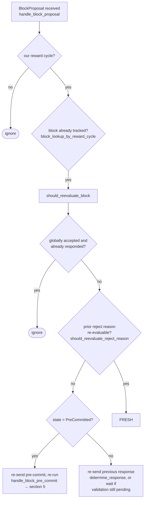

### Title
Stale rejection weight is never retracted when a signer flips to Accept, letting `total_weight_rejected` alone kill a block that has real ≥70% support - ([File: stacks-node/src/nakamoto_node/stackerdb_listener.rs])

### Summary
The block-tallying analog of the reported bug ("no existence check before appending → duplicate/duplicated state") appears in the miner-side StackerDB listener that tallies signer `Accepted`/`Rejected` weight for a proposed block. When a signer's message for a block flips from `Rejected` to `Accepted` (a documented, legitimate behavior of the v0 signer), the listener adds the signer's weight to `total_weight_approved` but never removes it from `total_weight_rejected`. The sum of the two tallies is therefore not bounded by `total_weight`, and the coordinator's rejection check treats the never-decremented `total_weight_rejected` as ground truth, so it can permanently abort a mining round for a block that in fact has enough real, distinct approving weight.

### Finding Description
`StackerDBListener` maintains a `BlockStatus` per proposed block with `total_weight_approved`, `total_weight_rejected`, `gathered_signatures` (keyed by slot id) and a shared `responded_signers: HashSet<u32>` used by *both* the accept and reject branches. [1](#0-0) 

On `Accepted`, weight is added exactly once per slot id, guarded by `gathered_signatures.contains_key(&slot_id)`: [2](#0-1) 

On `Rejected`, weight is added exactly once per slot id, guarded by inserting into the *same* `responded_signers` set: [3](#0-2) 

The "existence check" here is scoped to the wrong dimension, mirroring the reported bug class: instead of checking "does this signer already have a *current* opinion recorded, and should the old one be superseded," each branch only checks "have I already recorded *this* opinion type for this slot." Nothing clears a slot's earlier contribution to `total_weight_rejected` when that same slot later sends an `Accepted` message (and vice versa). Consequently a single signer can simultaneously count toward both `total_weight_approved` and `total_weight_rejected` for the same block, so `total_weight_approved + total_weight_rejected` is no longer bounded by `total_weight`.

The coordinator polling loop treats `total_weight_rejected` as authoritative and returns early once it crosses the blocking-minority threshold, before ever checking `total_weight_approved`: [4](#0-3) 

This flip-flop is explicitly a supported behavior in the signer's own state machine — a signer that rejected a proposal for a reason that "has since gone away" is expected to re-evaluate and can go on to sign it: [5](#0-4) 

So the scenario is not exotic misuse of the protocol; it is the intended path for late/slow signers, re-proposals, and reason-reevaluation (`should_reevaluate_reject_reason`), all of which the coordinator's stale-rejection accounting fails to account for.

### Impact Explanation
This breaks the "aggregated-weight vs verified-accepts" equality the coordinator relies on to decide between accepting and killing a block. Once a slot's rejection weight is latched into `total_weight_rejected`, it is never retracted, so:
- The `SignersRejected` blocking-minority check can fire using stale weight from signers who have since accepted, permanently aborting the mining attempt for that block (`return Err(NakamotoNodeError::SignersRejected {...})`), even though a supermajority (including those "still-rejected-on-paper" signers) actually now supports the block.
- Because the coordinator function returns as soon as this condition is hit, the loop stops polling entirely for this block — the miner gives up on a block it could have completed, a direct block-production liveness wedge, not merely a delayed retry.

This matches the "wedge the state machine" / liveness class called out in scope (a miner is prevented from ever completing a validly-supported block due to miscounted response weight), and is reachable by a single slow/borderline signer or normal signer set behavior — no majority collusion or key compromise is required, only a benign flip from reject to accept during the natural pre-commit/validation window.

### Likelihood Explanation
The flip from `Rejected` to `Accepted` for the same `signer_signature_hash` is a normal, expected event: `should_reevaluate_reject_reason` and the pre-commit re-proposal path are designed to let a signer reconsider a rejection and later sign the same block. Any tenure with even one signer whose validation is transiently delayed, or that initially rejects on a since-resolved condition (chain tip lag, stale sortition view, etc.), can trigger this. No adversarial coordination, majority control, or forged signatures are needed — only ordinary timing/latency in a live network, making this readily triggerable in normal operation, not just a crafted attack.

### Recommendation
When processing an `Accepted` message for a slot id that is already present in `responded_signers` as a rejection (and vice-versa for `Rejected` after a prior `Accepted`), retract the stale contribution from the opposing tally before/while adding the new one, e.g. track each slot's *current* verdict and weight in a single map (`slot_id -> (verdict, weight)`) and recompute `total_weight_approved`/`total_weight_rejected` from that map, rather than accumulating both counters independently and never decrementing either.

### Proof of Concept
1. Reward set: 5 signers, weight 20 each (`total_weight = 100`), `weight_threshold = 70` (blocking minority = 30).
2. Signer A (slot 0) is briefly desynced and sends `Rejected` for block `H`. `stackerdb_listener` sets `responded_signers = {0}`, `total_weight_rejected = 20`.
3. Signer A resyncs, re-evaluates, and legitimately sends `Accepted` for the same `H` (supported per `should_reevaluate_reject_reason`). `gathered_signatures.contains_key(&0)` is `false`, so `total_weight_approved` becomes `20`. `total_weight_rejected` remains `20` — never cleared.
4. Signers B, C (slots 1, 2) also reject `H` for unrelated, transient reasons, each weight 20: `total_weight_rejected = 20(stale A) + 20 + 20 = 60`.
5. In `signer_coordinator.rs`, `total_weight_rejected.saturating_add(weight_threshold) = 60 + 70 = 130 > total_weight (100)` triggers the `SignersRejected` branch and the coordinator returns `Err(NakamotoNodeError::SignersRejected {...})`, aborting the mining round for `H` — even though signer A (now a genuine accepter) plus D and E (weight 20+20+20=60, still short of 70 alone) could still reach threshold if their timing had lined up, and even though A's rejection is no longer A's actual opinion. The stale weight in `total_weight_rejected` was the deciding factor in killing the block.

### Citations

**File:** stacks-node/src/nakamoto_node/stackerdb_listener.rs (L70-82)
```rust
#[derive(Debug, Clone)]
pub struct BlockStatus {
    /// Set of the slot ids of signers who have responded
    pub responded_signers: HashSet<u32>,
    /// Map of the slot id of signers who have signed the block and their signature
    pub gathered_signatures: BTreeMap<u32, MessageSignature>,
    /// Total weight of signers who have signed the block
    pub total_weight_approved: u32,
    /// Total weight of signers who have rejected the block
    pub total_weight_rejected: u32,
    /// Per-txid rejection tracking from signers
    pub failed_txids: HashMap<Txid, FailedTxInfo>,
}
```

**File:** stacks-node/src/nakamoto_node/stackerdb_listener.rs (L443-465)
```rust
                        if !block.gathered_signatures.contains_key(&slot_id) {
                            block.total_weight_approved = block
                                .total_weight_approved
                                .saturating_add(signer_entry.weight);

                            info!("StackerDBListener: Signature Added to block";
                                "signer_signature_hash" => %block_sighash,
                                "signer_pubkey" => signer_pubkey.to_hex(),
                                "signer_slot_id" => slot_id,
                                "signature" => %signature,
                                "signer_weight" => signer_entry.weight,
                                "total_weight_approved" => block.total_weight_approved,
                                "percent_approved" => block.total_weight_approved as f64 / self.total_weight as f64 * 100.0,
                                "total_weight_rejected" => block.total_weight_rejected,
                                "percent_rejected" => block.total_weight_rejected as f64 / self.total_weight as f64 * 100.0,
                                "weight_threshold" => self.weight_threshold,
                                "tenure_extend_timestamp" => tenure_extend_timestamp,
                                "read_count_extend_timestamp" => read_count_extend_timestamp,
                                "server_version" => metadata.server_version,
                            );
                        }
                        block.gathered_signatures.insert(slot_id, signature);
                        block.responded_signers.insert(slot_id);
```

**File:** stacks-node/src/nakamoto_node/stackerdb_listener.rs (L515-519)
```rust
                        if block.responded_signers.insert(slot_id) {
                            block.total_weight_rejected = block
                                .total_weight_rejected
                                .saturating_add(signer_entry.weight);

```

**File:** stacks-node/src/nakamoto_node/signer_coordinator.rs (L509-541)
```rust
            if block_status
                .total_weight_rejected
                .saturating_add(self.weight_threshold)
                > self.total_weight
            {
                info!(
                    "{}/{} signer weight votes to reject block",
                    block_status.total_weight_rejected, self.total_weight;
                    "signer_signature_hash" => %block_signer_sighash,
                );
                counters.bump_naka_rejected_blocks();

                // Only act on failed txids that a blocking minority (>30% weight) agrees on
                let blocking_minority = self.total_weight.saturating_sub(self.weight_threshold);
                let mut temporarily_excluded_txids = HashSet::new();
                let mut permanently_excluded_txids = HashSet::new();
                for (txid, info) in &block_status.failed_txids {
                    if info.total_weight > blocking_minority {
                        // Do not perma ban txids that only a small minority of signers reported as problematic
                        // But make sure its removed from the next block proposal
                        if info.problematic_weight > blocking_minority {
                            permanently_excluded_txids.insert(txid.clone());
                        } else {
                            temporarily_excluded_txids.insert(txid.clone());
                        }
                    }
                }

                return Err(NakamotoNodeError::SignersRejected {
                    temporarily_excluded_txids,
                    permanently_excluded_txids,
                });
            } else if block_status.total_weight_approved >= self.weight_threshold {
```

**File:** docs/signer-flows.md (L164-184)
```markdown
## 3. A block proposal arrives

The miner broadcasts a proposal. If we've seen this exact block before,
`should_reevaluate_block` decides whether the old verdict stands; a block we
only pre-committed to is deliberately routed back through the pre-commit
evaluation so a re-proposal cannot shortcut to a signature. A fresh proposal is
checked against our view of the world _before_ spending a node validation on it.


