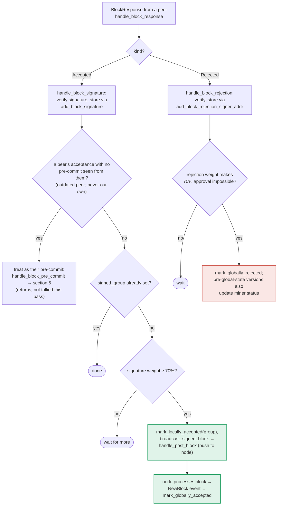

### Title
Peer-signature aggregation path (`store_and_process_block_signature`) reaches the group-accept/broadcast decision without re-running the conflict/chainstate recheck that the self-signing path enforces - (File: stacks-signer/src/v0/signer.rs)

### Summary
The signer produces (or endorses) a "signed" block verdict through two structurally different code paths that should be equivalent but are not: the self-signing path in `handle_block_pre_commit` (the "SIGN" branch) and the peer-signature-aggregation path in `store_and_process_block_signature` (reached from `handle_block_signature`/`handle_block_response` when a `BlockResponse::Accepted` is received from another signer). Only the former re-derives conflict/chainstate safety before committing to a verdict.

### Finding Description
`handle_block_pre_commit` (stacks-signer/src/v0/signer.rs) is the only path documented and coded to actually mint the local signature. Before reaching `mark_locally_accepted`, it:
1. Re-runs `check_block_against_signer_db_state` (a "sticky" rejection if the chainstate is inconsistent).
2. Queries `get_signed_conflicts` for any block at the same or higher height in *any* tenure.
3. Filters conflicts by freshness, `reorg_permit_stands`, and `conflict_still_blocks`, and refuses to sign if a live conflict exists. [1](#0-0) [2](#0-1) 

In contrast, `store_and_process_block_signature` — invoked whenever this signer receives enough weight of *other* signers' `BlockResponse::Accepted` messages to cross the 70% threshold — goes straight from weight computation to `mark_locally_accepted(true)` and `broadcast_signed_block`, with **no call to `check_block_against_signer_db_state`, `get_signed_conflicts`, `reorg_permit_stands`, or `conflict_still_blocks`** anywhere in the function: [3](#0-2) 

The design doc for this repo explicitly documents this asymmetry: the pre-commit path is annotated with a "RECHECK" step before "SIGN", while the peer-acceptance tally path goes straight from "TALLY" to "BCAST" with no recheck step shown. [4](#0-3) 

`mark_locally_accepted(true)` sets `signed_group`, and `signed_group` is treated identically to `signed_self` for future conflict bookkeeping (`has_signed_block_in_tenure`), as shown by the repo's own regression test: [5](#0-4) 

So the "aggregated peer weight" and "this signer's own verified/consistent view" are treated as equal for the purpose of recording a block as signed and pushing it to the node, even though only one of the two paths that reach that recorded state actually re-verifies local consistency first.

### Impact Explanation
This breaks the "aggregated-weight vs verified-accepts" equality called out in scope: a signer can come to treat a block as its own group-accepted/broadcastable verdict purely because a threshold of *reported* peer acceptances arrived, without re-confirming that verdict against its own current chainstate/tenure view (the same check the self-sign path insists on immediately before doing the equivalent action). Consequences:
- `broadcast_signed_block` pushes the assembled block to this signer's own node via `handle_post_block` without the signer having freshly reconciled it against a possibly-conflicting block it already knows about (e.g., a signed conflicting block that arrived between the original pre-commit and the moment peer acceptances crossed threshold).
- `mark_locally_accepted(true)` sets `signed_group`, which downstream is indistinguishable from `signed_self` for `get_signed_conflicts`/`has_signed_block_in_tenure` bookkeeping — poisoning this signer's own conflict-detection state for future proposals without that state ever having passed the recheck that would normally gate it.

This is a High-severity condition rather than Critical because `store_and_process_block_signature` does not mint a new cryptographic signature by this signer over an invalid/conflicting block — it aggregates and relays signatures already produced by others and asserts local consensus bookkeeping. But it can push a signer into acting on a locally-inconsistent verdict (a mis-recorded "signed" conflict, and forwarding a stale/conflicting block to its own node) without the safety recheck the codebase itself treats as mandatory for the equivalent local decision.

### Likelihood Explanation
This is reachable by ordinary gossip traffic without any privileged access: any `BlockResponse::Accepted` messages broadcast by other signers over StackerDB, once they cross the 70% weight threshold as observed by this signer, trigger the path. A miner (or the natural non-atomicity between the pre-commit re-evaluation timeline and peer message delivery) exploiting timing so that conflicting-block state changes locally *between* the last recheck and the arrival of the 70th-percentile peer acceptance is sufficient to hit the gap — no majority signer compromise or key access is required, only ordinary gossip timing.

### Recommendation
Call `check_block_against_signer_db_state` (and, ideally, the same conflict-checking logic used in `handle_block_pre_commit` — `get_signed_conflicts` / `reorg_permit_stands` / `conflict_still_blocks`) inside `store_and_process_block_signature` before calling `mark_locally_accepted(true)` and `broadcast_signed_block`, so both routes to a "group accepted" verdict enforce the same safety recheck rather than only the self-sign path doing so.

### Proof of Concept
Conceptual sequence (cannot be executed without a live multi-signer testnet, but derivable from the code paths cited above):
1. Signer S pre-commits to block A at height H in tenure T1 after `handle_block_pre_commit`'s recheck passes; A is not yet at threshold.
2. A conflicting block B at height H (or higher) in a different or replacement tenure T2 is separately signed and recorded by S (e.g., via a subsequent, legitimate `handle_block_pre_commit`/`mark_locally_accepted` for B), which populates `get_signed_conflicts` state that would now block A from being signed if `handle_block_pre_commit` were re-run for A.
3. Before S ever re-runs `handle_block_pre_commit` for A again, gossip delivers enough `BlockResponse::Accepted` messages from *other* signers for A to cross the 70% weight threshold in `store_and_process_block_signature`.
4. `store_and_process_block_signature` calls `mark_locally_accepted(true)` and `broadcast_signed_block` for A directly — without ever calling `check_block_against_signer_db_state`/`get_signed_conflicts` — despite A now conflicting with B that S itself already signed. [3](#0-2) [1](#0-0)

### Citations

**File:** stacks-signer/src/v0/signer.rs (L1383-1421)
```rust
        let conflicts = match self
            .signer_db
            .get_signed_conflicts(block_info.block.header.chain_length, &block_hash)
        {
            Ok(conflicts) => conflicts,
            Err(e) => {
                warn!("{self}: Failed to query the signed blocks. Refusing to sign block {block_hash}: {e:?}");
                return;
            }
        };
        let freshness_cutoff = get_epoch_time_secs().saturating_sub(
            self.proposal_config
                .tenure_last_block_proposal_timeout
                .as_secs(),
        );
        // A fresh signature only blocks while the block it covers could still be part of the
        // chain: see `conflict_still_blocks`, which asks the node whether it is. Check
        // freshness first: it is a local timestamp comparison, while `reorg_permit_stands`
        // and `conflict_still_blocks` each query the node, so stale conflicts cost no
        // round-trips.
        if let Some(conflict) = conflicts.iter().find(|conflict| {
            conflict.last_endorsed > freshness_cutoff
                && !self.reorg_permit_stands(stacks_client, conflict)
                && self.conflict_still_blocks(
                    stacks_client,
                    conflict,
                    block_info.block.header.chain_length,
                )
        }) {
            warn!(
                "{self}: Reached the pre-commit threshold for a block, but we have recently signed or accepted a different block at the same or higher height. Refusing to sign.";
                "signer_signature_hash" => %block_hash,
                "block_height" => block_info.block.header.chain_length,
                "conflicting_signer_signature_hash" => %conflict.signer_signature_hash,
                "conflicting_block_height" => conflict.stacks_height,
                "conflicting_consensus_hash" => %conflict.consensus_hash,
            );
            return;
        }
```

**File:** stacks-signer/src/v0/signer.rs (L1458-1467)
```rust
        if !conflicts.is_empty() {
            info!(
                "{self}: Reached the pre-commit threshold for a block that conflicts with previously signed or accepted blocks, but none of those conflicts still blocks it. Signing the replacement.";
                "signer_signature_hash" => %block_hash,
                "block_height" => block_info.block.header.chain_length,
                "num_conflicts" => conflicts.len(),
            );
        }
        // It is only considered globally accepted IFF we receive a new block event confirming it OR see the chain tip of the node advance to it.
        if let Err(e) = block_info.mark_locally_accepted(false) {
```

**File:** stacks-signer/src/v0/signer.rs (L2443-2538)
```rust
    fn store_and_process_block_signature(
        &mut self,
        stacks_client: &StacksClient,
        sortition_state: &mut Option<SortitionsView>,
        block_info: &mut BlockInfo,
        signer_address: &StacksAddress,
        signature: &MessageSignature,
    ) {
        let block_hash = &block_info.signer_signature_hash();
        // signature is valid! store it.
        // if this returns false, it means the signature already exists in the DB, so just return.
        if !self
            .signer_db
            .add_block_signature(block_hash, signer_address, signature)
            .unwrap_or_else(|_| panic!("{self}: Failed to save block signature"))
        {
            return;
        }

        // If this isn't our own signature and we haven't seen a pre-commit from this signer yet, try treating it as a pre-commit in case the caller is running an outdated version
        if signer_address != &self.stacks_address && !self.signer_db.has_committed(block_hash, signer_address).inspect_err(|e| warn!("Failed to check if pre-commit message already considered for {signer_address:?} for {block_hash}: {e}")).unwrap_or(false) {
            self.handle_block_pre_commit(stacks_client, sortition_state, signer_address, block_hash);
            return;
        }

        if block_info.signed_group.is_some() {
            // We have already processed this block to the accepted state. Adding more signatures will not change anything so nothing to check.
            return;
        }
        // do we have enough signatures to broadcast?
        // i.e. is the threshold reached?
        let signatures = self
            .signer_db
            .get_block_signatures(block_hash)
            .unwrap_or_else(|_| panic!("{self}: Failed to load block signatures"));

        // put signatures in order by signer address (i.e. reward cycle order)
        let addrs_to_sigs: HashMap<_, _> = signatures
            .into_iter()
            .filter_map(|sig| {
                let Ok(public_key) = Secp256k1PublicKey::recover_to_pubkey_without_validating_low_s(
                    block_hash.bits(),
                    &sig,
                ) else {
                    return None;
                };
                let addr = StacksAddress::p2pkh(self.mainnet, &public_key);
                Some((addr, sig))
            })
            .collect();

        let signature_weight = self.signer_weights.get(signer_address).unwrap_or(&0);
        let total_signature_weight = self.compute_signature_signing_weight(addrs_to_sigs.keys());
        let total_weight = self.compute_signature_total_weight();

        let min_weight = NakamotoBlockHeader::compute_voting_weight_threshold(total_weight)
            .unwrap_or_else(|_| {
                panic!("{self}: Failed to compute threshold weight for {total_weight}")
            });

        if min_weight > total_signature_weight {
            info!("{self}: Received block acceptance, but have not yet reached the acceptance threshold.";
                "signer_signature_hash" => %block_hash,
                "signature_weight" => signature_weight,
                "consensus_hash" => %block_info.block.header.consensus_hash,
                "block_height" => block_info.block.header.chain_length,
                "total_weight_approved" => total_signature_weight,
                "total_weight" => total_weight,
                "percent_approved" => (total_signature_weight as f64 / total_weight as f64 * 100.0),
            );
            return;
        }
        info!("{self}: have reached the block acceptance threshold";
            "signer_signature_hash" => %block_hash,
            "signature_weight" => signature_weight,
            "consensus_hash" => %block_info.block.header.consensus_hash,
            "block_height" => block_info.block.header.chain_length,
            "total_weight_approved" => total_signature_weight,
            "total_weight" => total_weight,
            "percent_approved" => (total_signature_weight as f64 / total_weight as f64 * 100.0),
        );

        // have enough signatures to broadcast!
        // move block to LOCALLY accepted state.
        // It is only considered globally accepted IFF we receive a new block event confirming it OR see the chain tip of the node advance to it.
        if let Err(e) = block_info.mark_locally_accepted(true) {
            if !block_info.has_reached_consensus() {
                warn!("{self}: Failed to mark block as locally accepted: {e:?}");
            }
        }
        let _ = self.signer_db.insert_block(block_info).map_err(|e| {
            warn!("Failed to set group threshold signature timestamp for {block_hash}: {e:?}");
            panic!("{self} Failed to write block to signerdb: {e}");
        });
        self.broadcast_signed_block(stacks_client, block_info.block.clone(), &addrs_to_sigs);
    }
```

**File:** docs/signer-flows.md (L357-375)
```markdown

```

**File:** stacks-signer/src/signerdb.rs (L4124-4138)
```rust
        // A block signed by the group in another tenure counts for that tenure only.
        block_info.block.header.consensus_hash = consensus_hash_2.clone();
        block_info.block.header.chain_length = 2;
        block_info.signed_self = None;
        block_info.signed_group = None;
        block_info.approved_time = None;
        db.insert_block(&block_info).unwrap();

        assert!(!db.has_signed_block_in_tenure(&consensus_hash_2).unwrap());

        block_info.signed_group = Some(get_epoch_time_secs());
        db.insert_block(&block_info).unwrap();

        assert!(db.has_signed_block_in_tenure(&consensus_hash_1).unwrap());
        assert!(db.has_signed_block_in_tenure(&consensus_hash_2).unwrap());
```
