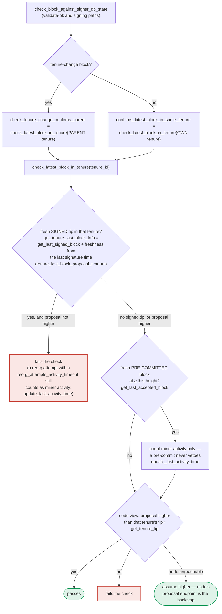

I have sufficient evidence to confirm this finding. Let me finalize the analysis.

### Title
Miner-triggered reset of `last_activity_time` via cheap, locally-rejected stale proposals suppresses the miner-inactivity timeout, wedging signers on a non-productive tenure - (File: `stacks-signer/src/chainstate/mod.rs`)

### Summary
`check_latest_block_in_tenure` unconditionally refreshes the tenure's inactivity clock (`update_last_activity_time`) whenever a conflicting/stale block proposal arrives and the existing signed tip has not yet reached `signed_group` (i.e., is only locally, not globally, accepted). Because this check runs during proposal handling — entirely locally, before any stacks-node validation round-trip — a malicious tenure-winning miner can keep this window open indefinitely by repeatedly gossiping cheap, distinct, stale/duplicate block proposals. This starves `check_miner_inactivity`'s `block_proposal_timeout` from ever firing, preventing signers from falling back to the prior tenure, wedging the signer set on a miner that never produces a block that reaches consensus.

### Finding Description
`SortitionData::check_latest_block_in_tenure` [1](#0-0)  is invoked from `confirms_latest_block_in_same_tenure` and `check_tenure_change_confirms_parent`, both reached from proposal-time `check_proposal` (per `docs/signer-flows.md`, section 3 → section 7) [2](#0-1) [3](#0-2) , i.e. this check executes purely against the local `SignerDb`/client state, before the proposal is ever submitted to the stacks-node for validation (`CHECK -- invalid --> REJ["send rejection (not stored)"]`).

Inside it, when an incoming proposal's `chain_length` is `<=` the tenure's last signed block:
```rust
if info.signed_group.is_none_or(|signed_time| {
    signed_time + reorg_attempts_activity_timeout.as_secs() > get_epoch_time_secs()
}) {
    signer_db.update_last_activity_time(&block.header.consensus_hash, get_epoch_time_secs())
}
return Ok(false);
``` [4](#0-3) 

`info.signed_group.is_none_or(...)` means: if the tenure's last signed block has **not yet reached `signed_group`** (i.e. it is only `LocallyAccepted` at this signer, not observed as globally accepted), the activity timer is refreshed **unconditionally**, with no time gate at all (`reorg_attempts_activity_timeout` only gates the case where `signed_group` is already `Some`). This is precisely reachable during a tenure that never gets its block globally observed — for instance, the current tenure's own miner deliberately never lets its first/only block reach group signing (e.g. by never re-proposing anything higher, or by having signers split so a group signature never coalesces).

`last_activity_time` is exactly the clock `SortitionState::is_timed_out`/`check_miner_inactivity` uses to decide whether to fall back to the prior tenure's miner when the current one goes silent [5](#0-4) [6](#0-5) . So a miner (the tenure's own, one-slot winner) can keep gossiping cheap, distinct, deliberately-stale/duplicate block proposals (varying nonce/timestamp so each is a "new" `BlockProposal` message) at the same or lower `chain_length` than its own already-signed block. Each such proposal is rejected purely from local state, with no node round trip, yet each call resets `last_activity_time` for that tenure, so `elapsed > block_proposal_timeout` in `is_timed_out` never becomes true. The `has_signed_block_in_tenure` fast-path in `is_timed_out` does not save this scenario since the miner isn't required to have any signed block at all — the same effect works pre-signature via the "reorg attempt" acceptance-tracking path once a first block only reaches `LocallyAccepted`.

### Impact Explanation
Signers can be wedged indefinitely on a non-productive current tenure, unable to invoke `check_miner_inactivity`'s fallback to the prior sortition's miner (`make_miner_state`), because the inactivity clock is perpetually refreshed by cheap, locally-rejected gossip from the current tenure's own miner. This matches the "signer wedged into never signing valid blocks" liveness class named in scope, since the whole signer set stalls behind a miner that never gets its blocks past pre-commit/global acceptance, and no majority of signers or additional keys are required — only the tenure's own miner (a one-slot actor) plus ordinary StackerDB gossip.

### Likelihood Explanation
No node validation, no signer votes, and no majority collusion are required: the offending path executes entirely against the signer's own local `SignerDb` state during ordinary proposal-arrival handling, and rejects the proposal without even reaching `submit_block_for_validation`. The attacker only needs to control the miner key that won the current tenure's sortition and repeatedly gossip minor variants of a stale/duplicate proposal — directly analogous to the cheap repeated `getReward` calls in the referenced report that reset a shared timer to grief other participants.

### Recommendation
Gate the `signed_group.is_none()` branch of `check_latest_block_in_tenure` with the same `reorg_attempts_activity_timeout` (or an equivalent bound measured from `approved_time`/`signed_self`) instead of treating "not yet globally observed" as an unconditional, un-timed activity refresh. Alternatively, rate-limit `update_last_activity_time` calls per tenure so repeated stale/duplicate proposals from the same miner cannot indefinitely postpone `is_timed_out`.

### Proof of Concept
1. Miner M wins tenure T's sortition and proposes block B0 (chain_length=1); enough signers `LocallyAccept` B0 (`signed_self` set) but the group signature never gets broadcast/observed as `signed_group` by this signer (e.g., a partition or M simply withholds further propagation) — so `get_tenure_last_block_info` returns B0 with `signed_group = None`.
2. M (or anything gossiping on M's behalf) crafts distinct dummy `BlockProposal` messages at `chain_length <= 1` (duplicates/forks of B0, varying the block hash via timestamp/nonce) and broadcasts one every few seconds.
3. Each arrives at `handle_block_proposal` → fresh evaluation → `check_block_against_state` → `confirms_latest_block_in_same_tenure` → `check_latest_block_in_tenure`. Since `block.header.chain_length (<=1) <= info.block.header.chain_length (1)` and `info.signed_group` is `None`, the `is_none_or` branch is taken unconditionally, calling `signer_db.update_last_activity_time(tenure, now())` [7](#0-6)  before returning `Ok(false)` and rejecting the dummy proposal (cheaply, without any node round trip).
4. Meanwhile `check_miner_inactivity`/`is_timed_out` keeps observing a `last_activity_time` that is always within `block_proposal_timeout` of `now()`, so `elapsed > block_proposal_timeout` never holds [8](#0-7) , and the signer set never falls back to the prior tenure's miner, stalling block production for tenure T indefinitely as long as M keeps gossiping.

### Citations

**File:** stacks-signer/src/chainstate/mod.rs (L376-419)
```rust
    pub fn check_latest_block_in_tenure(
        tenure_id: &ConsensusHash,
        block: &NakamotoBlock,
        signer_db: &mut SignerDb,
        client: &StacksClient,
        tenure_last_block_proposal_timeout: Duration,
        reorg_attempts_activity_timeout: Duration,
    ) -> Result<bool, ClientError> {
        let last_block_info = SortitionData::get_tenure_last_block_info(
            tenure_id,
            signer_db,
            tenure_last_block_proposal_timeout,
        )?;

        if let Some(info) = last_block_info {
            // N.B. this block might not be the last globally accepted block across the network;
            // it's just the highest one in this tenure that we know about.  If this given block is
            // no higher than it, then it's definitely no higher than the last globally accepted
            // block across the network, so we can do an early rejection here.
            if block.header.chain_length <= info.block.header.chain_length {
                warn!(
                    "Miner's block proposal does not confirm as many blocks as we expect";
                    "proposed_block_consensus_hash" => %block.header.consensus_hash,
                    "signer_signature_hash" => %block.header.signer_signature_hash(),
                    "proposed_chain_length" => block.header.chain_length,
                    "expected_at_least" => info.block.header.chain_length + 1,
                );
                if info.signed_group.is_none_or(|signed_time| {
                    signed_time + reorg_attempts_activity_timeout.as_secs() > get_epoch_time_secs()
                }) {
                    // Note if there is no signed_group time, this is a locally accepted block (i.e. tenure_last_block_proposal_timeout has not been exceeded).
                    // Treat any attempt to reorg a locally accepted block as valid miner activity.
                    // If the call returns a globally accepted block, check its globally accepted time against a quarter of the block_proposal_timeout
                    // to give the miner some extra buffer time to wait for its chain tip to advance
                    // The miner may just be slow, so count this invalid block proposal towards valid miner activity.
                    if let Err(e) = signer_db.update_last_activity_time(
                        &block.header.consensus_hash,
                        get_epoch_time_secs(),
                    ) {
                        warn!("Failed to update last activity time: {e}");
                    }
                }
                return Ok(false);
            }
```

**File:** docs/signer-flows.md (L184-203)
```markdown
    REASON -- yes --> FRESH
    KNOWN -- no --> DRAIN["collect early votes<br/>drain_pending_block_responses"] --> FRESH["fresh evaluation:<br/>new BlockInfo, fetch<br/>SortitionsView if needed"]
    FRESH --> CHECK["check_block_against_state:<br/>protocol version consensus (NoSignerConsensus),<br/>static validity, no problematic_txs<br/>(ProblematicTransactions), then<br/>v1 SortitionsView::check_proposal or<br/>v2 GlobalStateView::check_proposal → section 7"]
    CHECK -- invalid --> REJ["send rejection<br/>(not stored)"]:::bad
    CHECK -- "not provably invalid" --> BUSY{"validation slot free?<br/>submitted_block_proposal"}
    BUSY -- yes --> SUBMIT["submit_block_for_validation<br/>(ask the stacks-node)"]
    BUSY -- no --> QUEUE["queue it<br/>insert_pending_block_validation"]
    SUBMIT --> STORE["insert_block +<br/>process_pending_responses_for_block<br/>(replay early votes)"]
    QUEUE --> STORE
    classDef bad fill:#d84a3f22,stroke:#c9473d,stroke-width:1.5px;
```

Early votes: acceptances, rejections, and pre-commits that arrived before the
proposal itself are parked in pending tables and replayed once the proposal is
known.

> Anchors: `handle_block_proposal`, `should_reevaluate_block`,
> `should_reevaluate_reject_reason`, `check_block_against_state`,
> `submit_block_for_validation`, `process_pending_responses_for_block`
> (signer.rs); `check_proposal` (chainstate/v1.rs, v2.rs)
```

**File:** docs/signer-flows.md (L400-418)
```markdown

```

**File:** stacks-signer/src/chainstate/v1.rs (L55-94)
```rust
    pub fn is_timed_out(
        sortition: &ConsensusHash,
        db: &SignerDb,
        block_proposal_timeout: Duration,
    ) -> Result<bool, SignerChainstateError> {
        // If we've already signed a block in this tenure, the miner can't have timed out: we have
        // committed a signature to this tenure and must not help abandon it.
        //
        // Importantly, a block we have only pre-committed to does not count! A pre-commit carries
        // no signature, and if it never reaches the pre-commit threshold the tenure can stall
        // indefinitely. Treating it as signed here would suppress the inactivity timeout for
        // exactly the signers that pre-committed, so they could never fall back to the prior
        // miner and the tenure could never recover.
        let has_block = db.has_signed_block_in_tenure(sortition)?;
        if has_block {
            return Ok(false);
        }
        let Some(received_ts) = db.get_burn_block_receive_time_ch(sortition)? else {
            return Ok(false);
        };
        let received_time = UNIX_EPOCH + Duration::from_secs(received_ts);
        let last_activity = db
            .get_last_activity_time(sortition)?
            .map(|time| UNIX_EPOCH + Duration::from_secs(time))
            .unwrap_or(received_time);

        let Ok(elapsed) = std::time::SystemTime::now().duration_since(last_activity) else {
            return Ok(false);
        };

        if elapsed > block_proposal_timeout {
            info!(
                "Tenure miner was inactive too long and timed out";
                "tenure_ch" => %sortition,
                "elapsed_inactive" => elapsed.as_secs(),
                "config_block_proposal_timeout" => block_proposal_timeout.as_secs()
            );
        }
        Ok(elapsed > block_proposal_timeout)
    }
```

**File:** stacks-signer/src/v0/signer_state.rs (L284-315)
```rust
    pub fn check_miner_inactivity(
        &mut self,
        db: &mut SignerDb,
        client: &StacksClient,
        proposal_config: &ProposalEvalConfig,
        eval: &GlobalStateEvaluator,
    ) -> Result<(), SignerChainstateError> {
        let Self::Initialized(ref mut state_machine) = self else {
            // no inactivity if the state machine isn't initialized
            return Ok(());
        };

        let MinerState::ActiveMiner { ref tenure_id, .. } = state_machine.current_miner else {
            // no inactivity if there's no active miner
            return Ok(());
        };

        let version = SortitionStateVersion::from_protocol_version(
            state_machine.active_signer_protocol_version,
        );
        let is_timed_out = SortitionState::is_timed_out(
            &version,
            tenure_id,
            db,
            client.get_signer_address(),
            proposal_config,
            eval,
        )?;

        if !is_timed_out {
            return Ok(());
        }
```
