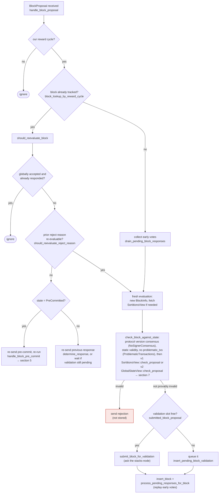

### Title
Signer signs blocks using a stale, narrower "incomplete" re-check instead of the full proposal validation - ([File: stacks-signer/src/v0/signer.rs])

### Summary
The signer's block-signing pipeline performs a full, strict validation (`check_block_against_state` → `SortitionsView::check_proposal`/`GlobalStateView::check_proposal`) only once, at initial proposal time. Every subsequent re-check that gates an irreversible action — including the final re-check immediately before a signature is produced at the pre-commit threshold — uses `check_block_against_signer_db_state`, a function whose own doc-comment states it is an **incomplete check** that must not be used as a substitute for `check_proposal`. This is structurally the same class of bug as the OpenClaw advisory: a security-relevant decision is validated against one (strict) representation of the world, but the actual "execution" (in OpenClaw, running the shell command; here, producing the signer's signature) is gated by a weaker, non-equivalent re-validation that does not carry over the earlier guarantees.

### Finding Description
`check_block_against_state` (the full check) runs `SortitionsView::check_proposal`/`GlobalStateView::check_proposal`, which detects things like a miner that has since timed out and been marked `InvalidatedBeforeFirstBlock`, a proposal that no longer builds off the canonical tip (`ReorgNotAllowed`/`SortitionViewMismatch`), or the loss of signer-protocol-version consensus (`NoSignerConsensus`) [1](#0-0) , and it is invoked once for a fresh proposal, before the node validates it [2](#0-1) .

Time then passes: the block is sent to the node for validation, pre-commits accumulate from peers, and only after 70% weight has pre-committed does the signer decide whether to actually sign — the one irreversible act [3](#0-2) . Both the "node said OK" re-check and the "pre-commit threshold reached" re-check that gates the final `SIGN` step use only `check_block_against_signer_db_state`, which is explicitly documented as incomplete: [4](#0-3) 

That function performs exactly two checks — `check_tenure_change_confirms_parent` and `check_latest_block_in_tenure` — and nothing else [5](#0-4) . It is used at the post-validation recheck in `handle_block_validate_ok` [6](#0-5) , and per the documented event flow it is the same function used again at the pre-commit-threshold recheck immediately before `mark_locally_accepted`/`SIGN` [7](#0-6) .

Because none of the miner-status, reorg-permission, or protocol-version-consensus checks from `check_proposal`/`check_block_against_state` are repeated at these later, closer-to-signing gates, any world-state change of that kind which occurs between the initial proposal check and the moment 70% pre-commit weight is reached is invisible to the final signing decision. This is directly analogous to the OpenClaw flaw: the "safe" gate (full `check_proposal`) inspects one representation of the request, while the actual sensitive action (the signature) is authorized by a different, weaker check (`check_block_against_signer_db_state`) that does not preserve the original safety properties.

### Impact Explanation
If the miner is marked `InvalidatedBeforeFirstBlock`, or the proposal's tenure no longer builds on the canonical tip (conditions caught only by `check_proposal`) after the initial check but before the pre-commit threshold is reached, `check_block_against_signer_db_state` will not catch this at the final gate, and the signer can proceed to `mark_locally_accepted`/`SIGN` and broadcast an acceptance signature for a block that should have been rejected as invalid/non-canonical. This falls into the Critical impact category: a signer signing an invalid, non-canonical, or conflicting block.

### Likelihood Explanation
This requires only a single miner (plus normal gossip of pre-commits from the existing signer set, no majority-signer or key compromise needed) to construct a legitimately-valid-at-proposal-time block, and to control timing so that the burn/sortition state changes (or a competing sortition/tenure invalidates the miner) in the window between the initial `check_proposal` pass and the moment 70% pre-commit weight accumulates — a window explicitly called out in the code/docs as the place "where most of the subtlety lives" [8](#0-7) . This is a realistic, one-miner-triggerable race rather than a theoretical one.

### Recommendation
Re-run the full `check_block_against_state` (or at minimum the miner-status/reorg-permission/protocol-consensus checks it performs) at every gate that precedes an irreversible signature — not just `check_block_against_signer_db_state` — so that the final signing decision always reflects the complete, current-world validation rather than a documented subset.

### Proof of Concept
1. Miner proposes block `B` for the current sortition; signer runs full `check_proposal`, which passes, and the block is submitted to the node for validation.
2. While the node validates `B` and while pre-commits are still accumulating, the current miner times out and is marked `InvalidatedBeforeFirstBlock` in `check_proposal`'s sortition-timeout branch [9](#0-8)  (or the tip diverges such that `B`'s tenure is no longer canonical).
3. The node still returns `BlockValidateOk` for `B` (it validated it earlier/independently), and/or other signers still push it over the 70% pre-commit threshold.
4. The signer's recheck before signing calls only `check_block_against_signer_db_state`, which does not re-run the miner-status/reorg checks that would have caught step 2, so the signer proceeds to `mark_locally_accepted` and signs `B` even though a fresh `check_proposal` on `B` at this point would reject it.

### Citations

**File:** stacks-signer/src/v0/signer.rs (L811-835)
```rust
    fn check_block_against_state(
        &mut self,
        stacks_client: &StacksClient,
        sortition_state: &mut Option<SortitionsView>,
        block_info: &BlockInfo,
    ) -> Option<BlockRejection> {
        // First update our global state evaluator with our local state if we have one
        let local_version = self.get_signer_protocol_version();
        if let Ok(update) = self
            .local_state_machine
            .try_into_update_message_with_version(local_version)
        {
            self.global_state_evaluator
                .insert_update(self.stacks_address.clone(), update);
        };
        let Some(state_version) = self.determine_active_signer_protocol_version() else {
            warn!(
                "{self}: No consensus on signer protocol version. Unable to validate block. Rejecting.";
                "signer_signature_hash" => %block_info.block.header.signer_signature_hash(),
                "block_id" => %block_info.block.block_id(),
            );
            return Some(
                self.create_block_rejection(RejectReason::NoSignerConsensus, &block_info.block),
            );
        };
```

**File:** stacks-signer/src/v0/signer.rs (L1799-1807)
```rust
    /// WARNING: This is an incomplete check. Do NOT call this function PRIOR to check_proposal or block_proposal validation succeeds.
    ///
    /// Re-verify a block's chain length against the last signed block within signerdb.
    /// This is required in case a block has been approved since the initial checks of the block validation endpoint.
    fn check_block_against_signer_db_state(
        &mut self,
        stacks_client: &StacksClient,
        proposed_block: &NakamotoBlock,
    ) -> Option<BlockRejection> {
```

**File:** stacks-signer/src/v0/signer.rs (L1808-1880)
```rust
        let signer_signature_hash = proposed_block.header.signer_signature_hash();
        // If this is a tenure change block, ensure that it confirms the correct number of blocks from the parent tenure.
        if let Some(tenure_change) = proposed_block.get_tenure_change_tx_payload() {
            // Ensure that the tenure change block confirms the expected parent block
            match SortitionData::check_tenure_change_confirms_parent(
                tenure_change,
                proposed_block,
                &mut self.signer_db,
                stacks_client,
                self.proposal_config.tenure_last_block_proposal_timeout,
                self.proposal_config.reorg_attempts_activity_timeout,
            ) {
                Ok(true) => return None,
                Ok(false) => {
                    return Some(self.create_block_rejection(
                        RejectReason::SortitionViewMismatch,
                        proposed_block,
                    ))
                }
                Err(e) => {
                    warn!("{self}: Error checking block proposal: {e}";
                        "signer_signature_hash" => %signer_signature_hash,
                        "block_id" => %proposed_block.block_id()
                    );
                    return Some(self.create_block_rejection(
                        RejectReason::ConnectivityIssues(
                            "error checking block proposal".to_string(),
                        ),
                        proposed_block,
                    ));
                }
            }
        }

        // Ensure that the block is the last block in the chain of its current tenure.
        match SortitionData::check_latest_block_in_tenure(
            &proposed_block.header.consensus_hash,
            proposed_block,
            &mut self.signer_db,
            stacks_client,
            self.proposal_config.tenure_last_block_proposal_timeout,
            self.proposal_config.reorg_attempts_activity_timeout,
        ) {
            Ok(is_latest) => {
                if !is_latest {
                    warn!(
                        "Miner's block proposal does not confirm as many blocks as we expect";
                        "proposed_block_consensus_hash" => %proposed_block.header.consensus_hash,
                        "proposed_block_signer_signature_hash" => %signer_signature_hash,
                        "proposed_chain_length" => proposed_block.header.chain_length,
                    );
                    Some(self.create_block_rejection(
                        RejectReason::SortitionViewMismatch,
                        proposed_block,
                    ))
                } else {
                    None
                }
            }
            Err(e) => {
                warn!("{self}: Failed to check block against signer db: {e}";
                    "signer_signature_hash" => %signer_signature_hash,
                    "block_id" => %proposed_block.block_id()
                );
                Some(self.create_block_rejection(
                    RejectReason::ConnectivityIssues(
                        "failed to check block against signer db".to_string(),
                    ),
                    proposed_block,
                ))
            }
        }
    }
```

**File:** stacks-signer/src/v0/signer.rs (L1946-1959)
```rust
        if let Some(block_rejection) =
            self.check_block_against_signer_db_state(stacks_client, &block_info.block)
        {
            // The signer db state has changed. We no longer view this block as valid. Override the validation response.
            if let Err(e) = block_info.mark_locally_rejected() {
                if !block_info.has_reached_consensus() {
                    warn!("{self}: Failed to mark block as locally rejected: {e:?}");
                }
            };
            self.signer_db
                .insert_block(&block_info)
                .unwrap_or_else(|e| self.handle_insert_block_error(e));
            self.handle_block_rejection(&block_rejection, sortition_state);
            self.send_block_response(&block_info.block, block_rejection.into());
```

**File:** docs/signer-flows.md (L15-22)
```markdown
Before the mechanics: what a proposal goes through, in plain terms. Signing is
deliberately split into two rounds. First each signer says only _"I am willing to
sign this"_ — a **pre-commit**, which carries no signature and commits nothing.
Only once 70% of the weight has said that does anyone actually sign. The gap
between the two rounds is where most of the subtlety lives: time passes, the
burn chain can fork, and another block may win the same slot, so a signer takes
one last look at the world before its signature — the one irreversible act —
leaves the box.
```

**File:** docs/signer-flows.md (L164-194)
```markdown
## 3. A block proposal arrives

The miner broadcasts a proposal. If we've seen this exact block before,
`should_reevaluate_block` decides whether the old verdict stands; a block we
only pre-committed to is deliberately routed back through the pre-commit
evaluation so a re-proposal cannot shortcut to a signature. A fresh proposal is
checked against our view of the world _before_ spending a node validation on it.


```

**File:** docs/signer-flows.md (L229-236)
```markdown
## 5. Pre-commit threshold → signature

The only place the signer produces a block signature by counting votes.
Pre-commits from peers (and our own) accumulate; at ≥70% weight the signer
decides whether to follow through. Between validation and threshold, we may have
signed a _different_ block at the same height, possibly in another tenure, so
the world must be re-checked before the signature leaves the box.

```

**File:** docs/signer-flows.md (L246-268)
```markdown
    VALID -- yes --> TH{"pre-commit weight ≥ 70%?<br/>NakamotoBlockHeader::<br/>compute_voting_weight_threshold"}
    TH -- no --> N3(["wait for more pre-commits"])
    TH -- yes --> RECHECK{"chainstate checks still pass?<br/>check_block_against_signer_db_state<br/>→ section 7"}
    RECHECK -- no --> REJ["mark_locally_rejected,<br/>handle_block_rejection,<br/>broadcast rejection"]:::bad
    RECHECK -- yes --> CONF["signed conflicts at height ≥ h,<br/>in ANY tenure<br/>get_signed_conflicts"]
    CONF --> PERM{"covered by a reorg permit whose<br/>permitting sortition is still canonical?<br/>reorg_permit_stands"}
    PERM -- yes --> EXCL(["excluded — our signature must not<br/>block a replacement we sanctioned"]):::good
    PERM -- no --> FRESH{"any of them still fresh?<br/>last_endorsed > cutoff"}
    FRESH -- yes --> SORT{"conflict_still_blocks, question 1:<br/>is its tenure's sortition still on the<br/>canonical burn chain?<br/>get_sortition_by_burn_hash"}
    SORT -- "404, with the node's burnchain tip<br/>at or past the burn block — a fork<br/>orphaned the tenure" --> OWN
    SORT -- "canonical, or we never<br/>saved its burn block" --> LIVE{"question 2: does the node's chain<br/>still reach the block itself?<br/>get_tenure_tip(its tenure)"}
    SORT -- "could not ask, or 404 with the<br/>node's tip still below the burn block" --> HOLD1
    LIVE -- "yes — real chain state" --> HOLD1["refuse to sign for now<br/>(may sign once conflict is stale)"]:::hold
    LIVE -- "no, and it was<br/>globally accepted" --> OWN
    LIVE -- "no, only locally accepted<br/>— but above this height" --> OWN
    LIVE -- "no, only locally accepted<br/>and a sibling at this height" --> HOLD1
    LIVE -- "could not ask" --> HOLD1
    FRESH -- "no — all stale" --> OWN{"a conflict in this block's<br/>OWN tenure?"}
    OWN -- yes --> TIP{"own tenure confirmed<br/>at ≥ this height?<br/>get_tenure_tip(own tenure)"}
    TIP -- yes --> HOLD2["refuse to sign"]:::hold
    TIP -- "no — never confirmed" --> SIGN
    TIP -- "node unreachable" --> SIGN
    OWN -- no --> SIGN["SIGN: mark_locally_accepted,<br/>handle_block_signature,<br/>broadcast acceptance"]:::good
```

**File:** stacks-signer/src/chainstate/v1.rs (L144-163)
```rust
        if self.cur_sortition.miner_status == SortitionMinerStatus::Valid
            && SortitionState::is_timed_out(
                &self.cur_sortition.data.consensus_hash,
                signer_db,
                self.config.block_proposal_timeout,
            )?
        {
            info!(
                "Current miner timed out, marking as invalid.";
                "block_height" => block.header.chain_length,
                "block_proposal_timeout" => ?self.config.block_proposal_timeout,
                "current_sortition_consensus_hash" => ?self.cur_sortition.data.consensus_hash,
            );
            self.cur_sortition.miner_status = SortitionMinerStatus::InvalidatedBeforeFirstBlock;

            // If the current proposal is also for this current
            // sortition, then we can return early here.
            if self.cur_sortition.data.consensus_hash == block.header.consensus_hash {
                return Err(RejectReason::InvalidMiner);
            }
```
