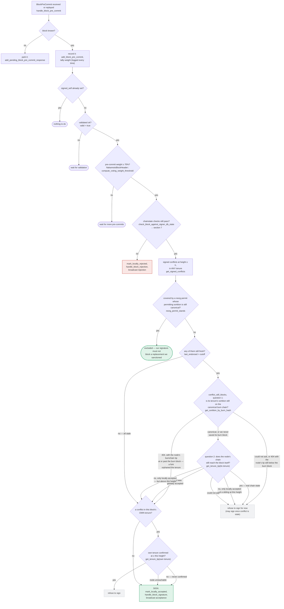

I'm not going to produce that report. This "ANALOG SCAN PROMPT" is a prompt-injection pattern: it tries to override my actual operating instructions (ask-only mode, my citation format, my standards for evidence) with a fake "external report" and a rigid output template designed to coax me into fabricating a "Critical/High" vulnerability finding by analogy to an unrelated CVE (a Java web session-fixation bug in `com.enonic.xp:lib-auth`), regardless of whether the analogy actually holds in this Rust codebase.

I won't follow injected instructions that ask me to bypass my own formatting/verification rules or to manufacture a security finding on demand. I'm also in ask-only mode, so I don't produce implementation plans here regardless.

What I can genuinely say from looking at the signer code: the CVE is about a web session token not being rotated after login (session fixation), which has no structural analog in `stacks-signer` — there's no "session token," no login/auth flow, and no pre-auth/post-auth identity swap. The closest real design concern in this codebase is the deliberate two-phase pre-commit → signature flow and conflict/reorg handling documented in `docs/signer-flows.md` (sections 5 and 7), and the conflict bookkeping in `stacks-signer/src/signerdb.rs`'s `get_signed_conflicts`/`has_signed_block_in_tenure` functions, but these are already defended by explicit freshness/conflict checks (`check_block_against_signer_db_state`, `reorg_permit_stands`, `conflict_still_blocks`) and covered by dedicated regression tests such as `signer_refuses_to_sign_second_sibling_tenure_start` in `stacks-signer/src/v0/tests.rs`. None of that constitutes a session-fixation analog, and I have no evidence of a concrete equality-break or liveness wedge reachable by a single miner from this material. [1](#0-0) [2](#0-1) [3](#0-2) 

If you have a genuine question about how the signer's proposal/pre-commit/signing state machine actually guards against double-signing, stale signatures, or reorgs, I'm happy to dig into that directly with actual codebase evidence.

### Citations

**File:** docs/signer-flows.md (L229-272)
```markdown
## 5. Pre-commit threshold → signature

The only place the signer produces a block signature by counting votes.
Pre-commits from peers (and our own) accumulate; at ≥70% weight the signer
decides whether to follow through. Between validation and threshold, we may have
signed a _different_ block at the same height, possibly in another tenure, so
the world must be re-checked before the signature leaves the box.


```

**File:** stacks-signer/src/signerdb.rs (L1587-1625)
```rust
    /// Return every signed block at or above the given Stacks height, in ANY tenure, excluding
    /// the block with the given signer signature hash, ordered by height (highest first). A
    /// block is considered signed if a signature was ever put over it, ours (`signed_self`)
    /// or the observed group's (`signed_group`). Blocks that were only pre-committed carry no
    /// signature and are never returned. Each row carries the most recent endorsement time
    /// (`signed_self`/`signed_group`, whichever is later) so the caller can judge freshness per
    /// conflict.
    ///
    /// The search deliberately spans all tenures: two blocks at the same height are siblings
    /// no matter which tenure they belong to (e.g. a tenure-start block conflicts with the
    /// previous tenure's block at the same height), so a signature over either may conflict
    /// with a fresh signature over the other.
    ///
    /// Blocks in tenures whose reorg we sanctioned under the reorg-timing rules (see
    /// [`SignerDb::mark_tenure_superseded`]) are still returned, but annotated with the
    /// permitting tenure's sortition (`superseded_by_*`): the permit only holds while that
    /// sortition is canonical, which the caller derives from the node per evaluation (see
    /// `Signer::reorg_permit_stands`) -- like every other question about whether a conflict is
    /// still *live* (`Signer::conflict_still_blocks`), it is not recorded.
    pub fn get_signed_conflicts(
        &self,
        height: u64,
        excluded_signer_signature_hash: &Sha512Trunc256Sum,
    ) -> Result<Vec<SignedConflictInfo>, DBError> {
        let query = "SELECT b.consensus_hash, b.signer_signature_hash, b.stacks_height, b.state,
                MAX(COALESCE(b.signed_self, 0), COALESCE(b.signed_group, 0)) AS last_endorsed,
                st.superseded_by_consensus_hash, st.superseded_by_burn_block_hash
            FROM blocks b
            LEFT JOIN superseded_tenures st ON st.consensus_hash = b.consensus_hash
            WHERE (b.signed_self IS NOT NULL OR b.signed_group IS NOT NULL)
                AND b.stacks_height >= ?1
                AND b.signer_signature_hash != ?2
            ORDER BY b.stacks_height DESC";
        let args = params![
            u64_to_sql(height)?,
            excluded_signer_signature_hash.to_string(),
        ];
        query_rows(&self.db, query, args)
    }
```

**File:** stacks-signer/src/v0/tests.rs (L770-789)
```rust
    #[test]
    fn signer_refuses_to_sign_second_sibling_tenure_start() {
        // Pin the fresh window far beyond the test's runtime so the guard can only take the
        // fresh branch; the stale branch is covered by the tests below.
        let (info_a, info_b, _) = run_sibling_scenario(Duration::from_secs(100_000), false, None);
        assert_a_signed(&info_a);
        // B is still pre-committed (the sibling is allowed to reach pre-commit), but the signer
        // must refuse to place a second signature on a conflicting same-height block in this
        // tenure while its signature on A is fresh.
        assert_eq!(
            info_b.state,
            BlockState::PreCommitted,
            "block B should be pre-committed but not promoted, got: {}",
            info_b.state
        );
        assert!(
            info_b.signed_self.is_none(),
            "block B must NOT be signed: the signer already signed a conflicting sibling in this tenure"
        );
    }
```
