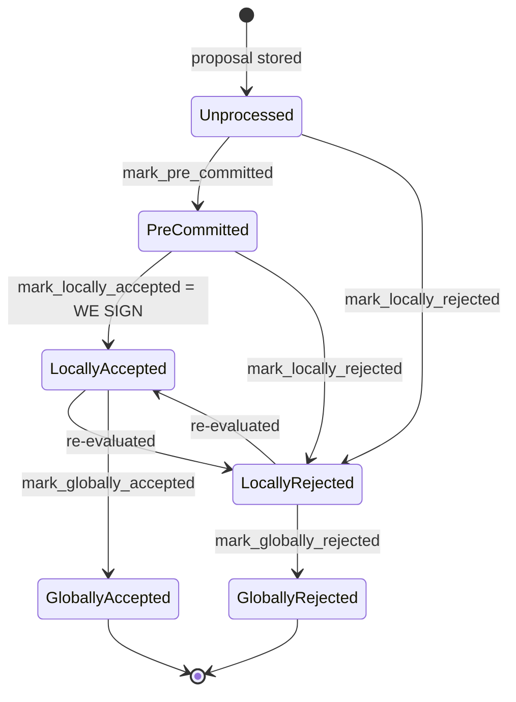

## Finding: Stale rejection weight is never cleared when a signer that rejected a block later accepts it (`total_weight_rejected` vs. current signer opinion)

### Summary
The node-side signer coordinator tallies block-rejection weight (`total_weight_rejected`) per signer slot but never clears a signer's contribution to that tally when the same signer subsequently sends an `Accepted` response for the same block — a transition the signer's own state machine explicitly allows (`LocallyRejected → LocallyAccepted`). This breaks the "aggregated-weight vs. verified-accepts" equality: the coordinator can treat a block as globally/permanently rejected using stale weight from signers who have since approved it, even though a supermajority currently supports the block.

### Finding Description
On the node side, `StackerDBListener` maintains a `BlockStatus` per proposed block with two independent counters, `total_weight_approved` and `total_weight_rejected`, keyed by signer `slot_id`:

- On `Rejected`, weight is added to `total_weight_rejected` exactly once per slot, guarded by `block.responded_signers.insert(slot_id)` [1](#0-0) .
- On `Accepted`, weight is added to `total_weight_approved` guarded only by `!block.gathered_signatures.contains_key(&slot_id)` [2](#0-1) .

Nothing in the `Accepted` handling removes the same slot from `responded_signers` or decrements `total_weight_rejected`; the two counters are updated independently and neither path reconciles the other, so a signer's weight can remain counted in `total_weight_rejected` forever after that signer has switched to acceptance. The only place `total_weight_rejected` is cleared is `reset_rejections`, and that is invoked solely on the coordinator's own rejection-timeout path, not when an individual signer's opinion changes [3](#0-2) [4](#0-3) .

The coordinator loop then uses this possibly-stale `total_weight_rejected` directly to decide the block is dead:

```
if block_status.total_weight_rejected.saturating_add(self.weight_threshold) > self.total_weight {
    ...
    return Err(NakamotoNodeError::SignersRejected { ... });
}
``` [5](#0-4) 

This is reachable through normal, non-majority behavior: the signer explicitly supports re-evaluating and flipping a rejection to an acceptance. The `BlockState` diagram documents `LocallyRejected --> LocallyAccepted: re-evaluated` as a legitimate transition [6](#0-5) , and `should_reevaluate_reject_reason` lists numerous reject codes (`UnknownParent`, `NotFoundError`, `NoSortitionView`, `ConnectivityIssues`, `ConsensusHashMismatch`, `NoSignerConsensus`, etc.) that a signer will reconsider on reproposal [7](#0-6) . A signer that legitimately rejected once (e.g. transient `ConnectivityIssues` or `NotFoundError` from a missing burn view, as exercised in `signer_reevaluates_proposal_with_missing_burn_view`) and later accepts the identical re-proposal [8](#0-7)  leaves its earlier `Rejected` weight permanently baked into `total_weight_rejected` on the node/coordinator side, with no corresponding cleanup.

### Impact Explanation
A single signer whose rejection weight, once "stuck", pushes `total_weight_rejected + weight_threshold` over `total_weight` causes the coordinator to declare the proposal `SignersRejected` and abandon it — even though the *current* opinion of the signer set (after the flip) may already clear the 70% acceptance threshold. This is a liveness wedge on an otherwise valid, canonical block: the miner is forced to abandon and re-mine a block that the live signer set is willing to sign, driven purely by an accounting bug rather than any real objection. Because rejection weight from several signers accumulates the same way, this can repeatedly stall tenure progress whenever transient/re-evaluable rejections (network hiccups, timing races around burn-view/sortition availability, `NotFoundError`, etc.) occur ahead of the eventual accept — none of which require a malicious majority, StackerDB flooding, or key compromise.

### Likelihood Explanation
Re-evaluable rejections are a designed, ordinary part of the protocol (see the re-evaluable `RejectReason` set and the existing `signer_reevaluates_proposal_with_missing_burn_view` test) [7](#0-6) [8](#0-7) , so hitting "reject-then-accept-on-reproposal" for the same block does not require adversarial behavior — only ordinary timing (e.g., a signer momentarily missing a burn block or sortition view before the node catches up). The bug is purely in the node-side weight bookkeeping, independent of signature validity, so no special access beyond normal signer participation is needed to trigger it.

### Recommendation
When processing an `Accepted` message for a slot that is already present in `responded_signers` from a prior `Rejected`, subtract that signer's weight from `total_weight_rejected` (and vice versa if a later `Rejected` supersedes a prior `Accepted`, keeping `gathered_signatures` consistent). Alternatively, track a single "current vote" per slot and derive `total_weight_approved`/`total_weight_rejected` from that map on each update rather than maintaining independently-incrementing counters, so the two thresholds always reflect verified, live signer opinions rather than accumulated history.

### Proof of Concept
1. Miner proposes block `B`. Signer `S` (weight `w`) evaluates and rejects with a re-evaluable reason (e.g. transient `ConnectivityIssues`/`NotFoundError`), which is broadcast as `BlockResponse::Rejected`.
2. `StackerDBListener::run` on the node processes this: `total_weight_rejected += w`, `responded_signers.insert(S)` [1](#0-0) .
3. Miner re-proposes the identical block `B` (same `signer_signature_hash`). `S`'s local state re-evaluates (`should_reevaluate_reject_reason` returns true for the reason above) and this time signs, broadcasting `BlockResponse::Accepted`.
4. The node adds `S`'s weight to `total_weight_approved` (guarded only by `gathered_signatures` not yet containing `S`) but never removes `S`'s weight from `total_weight_rejected` [2](#0-1) .
5. Repeat with enough distinct signers whose combined weight, summed into the never-cleared `total_weight_rejected`, exceeds `total_weight - weight_threshold`, while the *current* accepted weight independently also nears/reaches `weight_threshold`.
6. The coordinator's loop evaluates `block_status.total_weight_rejected.saturating_add(self.weight_threshold) > self.total_weight` first [5](#0-4)  and returns `SignersRejected`, discarding a block that the live signer set (post-flip) was willing to approve — a liveness stall triggered without any signer acting maliciously or in the majority.

### Citations

**File:** stacks-node/src/nakamoto_node/stackerdb_listener.rs (L443-446)
```rust
                        if !block.gathered_signatures.contains_key(&slot_id) {
                            block.total_weight_approved = block
                                .total_weight_approved
                                .saturating_add(signer_entry.weight);
```

**File:** stacks-node/src/nakamoto_node/stackerdb_listener.rs (L514-518)
```rust

                        if block.responded_signers.insert(slot_id) {
                            block.total_weight_rejected = block
                                .total_weight_rejected
                                .saturating_add(signer_entry.weight);
```

**File:** stacks-node/src/nakamoto_node/stackerdb_listener.rs (L706-723)
```rust
    /// Reset rejections for a block proposal.
    /// This is used when a block proposal times out and we need to retry it by
    /// clearing the block's rejections. Block approvals cannot be cleared
    /// because an old approval could always be used to make a block reach
    /// the approval threshold.
    pub fn reset_rejections(&self, signer_sighash: &Sha512Trunc256Sum) {
        let (lock, _cvar) = &*self.blocks;
        let mut blocks = lock.lock().expect("FATAL: failed to lock block status");
        if let Some(block) = blocks.get_mut(signer_sighash) {
            block.responded_signers.clear();
            block.total_weight_rejected = 0;

            // Add approving signers back to the responded signers set
            for (slot_id, _) in block.gathered_signatures.iter() {
                block.responded_signers.insert(*slot_id);
            }
        }
    }
```

**File:** stacks-node/src/nakamoto_node/signer_coordinator.rs (L443-454)
```rust
                    if rejections_timer.elapsed() > *rejections_timeout {
                        warn!("Timed out while waiting for responses from signers, resending proposal";
                            "elapsed" => rejections_timer.elapsed().as_secs(),
                            "rejections_timeout" => rejections_timeout.as_secs(),
                            "rejections" => rejections,
                            "rejections_threshold" => self.total_weight.saturating_sub(self.weight_threshold)
                        );

                        // Reset the rejections in the stackerdb listener
                        self.stackerdb_comms.reset_rejections(block_signer_sighash);

                        return Err(NakamotoNodeError::SignatureTimeout);
```

**File:** stacks-node/src/nakamoto_node/signer_coordinator.rs (L509-540)
```rust
            if block_status
                .total_weight_rejected
                .saturating_add(self.weight_threshold)
                > self.total_weight
            {
                info!(
                    "{}/{} signer weight votes to reject block",
                    block_status.total_weight_rejected, self.total_weight;
                    "signer_signature_hash" => %block_signer_sighash,
                );
                counters.bump_naka_rejected_blocks();

                // Only act on failed txids that a blocking minority (>30% weight) agrees on
                let blocking_minority = self.total_weight.saturating_sub(self.weight_threshold);
                let mut temporarily_excluded_txids = HashSet::new();
                let mut permanently_excluded_txids = HashSet::new();
                for (txid, info) in &block_status.failed_txids {
                    if info.total_weight > blocking_minority {
                        // Do not perma ban txids that only a small minority of signers reported as problematic
                        // But make sure its removed from the next block proposal
                        if info.problematic_weight > blocking_minority {
                            permanently_excluded_txids.insert(txid.clone());
                        } else {
                            temporarily_excluded_txids.insert(txid.clone());
                        }
                    }
                }

                return Err(NakamotoNodeError::SignersRejected {
                    temporarily_excluded_txids,
                    permanently_excluded_txids,
                });
```

**File:** docs/signer-flows.md (L137-150)
```markdown

```

**File:** stacks-signer/src/v0/signer.rs (L2705-2739)
```rust
/// Determine if a block should be re-evaluated based on its rejection reason˝
fn should_reevaluate_reject_reason(block_info: &BlockInfo) -> bool {
    if let Some(reject_reason) = &block_info.reject_reason {
        match reject_reason {
            RejectReason::ValidationFailed(ValidateRejectCode::UnknownParent)
            | RejectReason::ValidationFailed(ValidateRejectCode::NotFoundError)
            | RejectReason::NoSortitionView
            | RejectReason::ConnectivityIssues(_)
            | RejectReason::TestingDirective
            | RejectReason::InvalidTenureExtend
            | RejectReason::ConsensusHashMismatch { .. }
            | RejectReason::NoSignerConsensus
            | RejectReason::NotRejected
            | RejectReason::Unknown(_) => true,
            RejectReason::ValidationFailed(_)
            | RejectReason::RejectedInPriorRound
            | RejectReason::SortitionViewMismatch
            | RejectReason::ReorgNotAllowed
            | RejectReason::InvalidBitvec
            | RejectReason::PubkeyHashMismatch
            | RejectReason::InvalidMiner
            | RejectReason::NotLatestSortitionWinner
            | RejectReason::InvalidParentBlock
            | RejectReason::DuplicateBlockFound
            | RejectReason::IrrecoverablePubkeyHash
            | RejectReason::ProblematicTransactions
            | RejectReason::ProposalTooOld => {
                // No need to re-validate these types of rejections.
                false
            }
        }
    } else {
        false
    }
}
```

**File:** stacks-node/src/tests/signer/v0/missing_burn_block_proposal.rs (L64-67)
```rust
///   `ValidationFailed(NotFoundError)`.
/// - Upon reproposal, the block is fully revalidated and rejected again
///   with the same error.
/// - The rejection is treated as re-evaluable rather than terminal.
```
