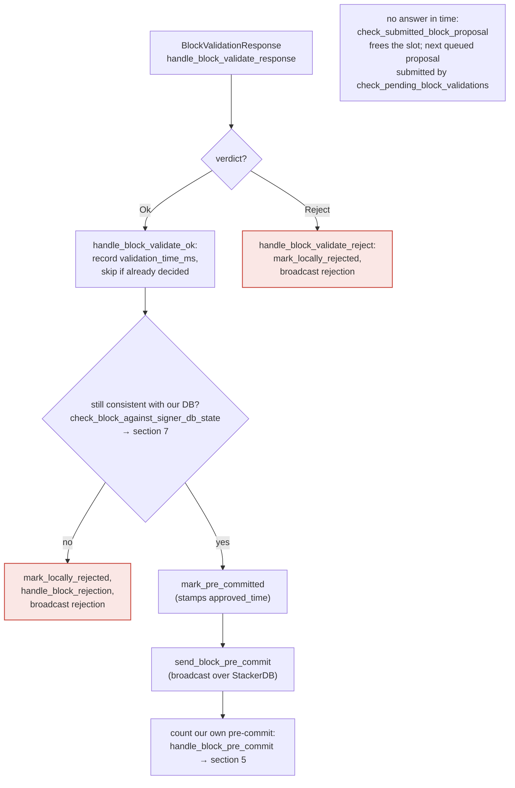
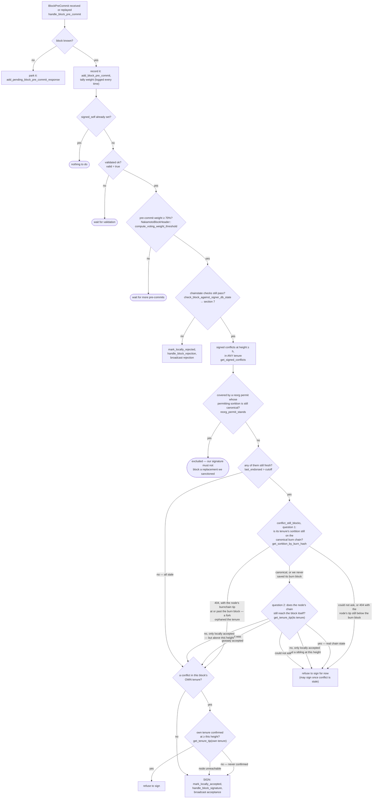
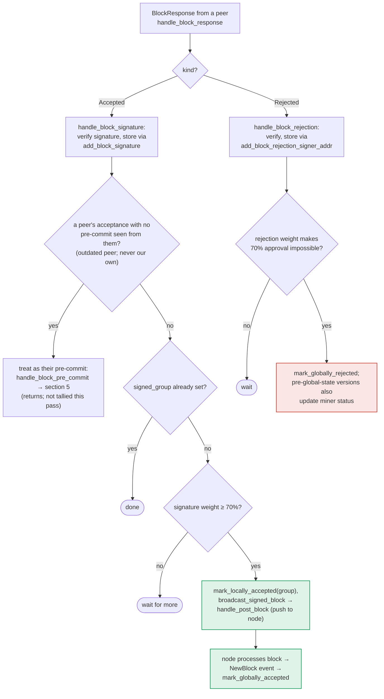

### Title
Peer-signature aggregation in `store_and_process_block_signature` marks a block `LocallyAccepted`/pushes it to the node without re-running the chainstate equivocation/conflict check that the parallel pre-commit→sign path re-runs - (File: `stacks-signer/src/v0/signer.rs`)

### Summary
Three structurally parallel places in the v0 signer move a block toward acceptance: (1) `handle_block_validate_ok` (validate-ok → pre-commit), (2) `handle_block_pre_commit` (pre-commit threshold → *our* signature), and (3) `store_and_process_block_signature` (peer acceptance signatures → tally 70% weight → `mark_locally_accepted(group)` + `broadcast_signed_block`, i.e. push the assembled block to the node). The first two explicitly re-invoke `check_block_against_signer_db_state` immediately before advancing state, because "the chain and signer db state may have changed materially since this block passed the proposal-time checks" [1](#0-0) . The third path (`store_and_process_block_signature`) tallies peer signature weight and, on crossing threshold, calls `mark_locally_accepted`/`broadcast_signed_block` purely from the accumulated weight, with no equivalent re-check against `check_block_against_signer_db_state` in that function [2](#0-1) . This is exactly the BentoML bug-class: a validation/quoting guard applied on one code path (`images.py`) but missed on a structurally identical parallel path (`deployment.py`) that produces the same dangerous output.

### Finding Description
The documented state machine (`docs/signer-flows.md`) makes the asymmetry explicit:
- Section 4 (validate-ok → pre-commit): `RECHECK{"still consistent with our DB? check_block_against_signer_db_state"}` gates `mark_pre_committed` [3](#0-2) .
- Section 5 (pre-commit threshold → sign): `RECHECK{"chainstate checks still pass? check_block_against_signer_db_state"}` gates `SIGN: mark_locally_accepted` [4](#0-3) .
- Section 6 (peer BlockResponse tally → broadcast): `TALLY{"signature weight ≥ 70%?"} -- yes --> BCAST["mark_locally_accepted(group), broadcast_signed_block"]` — no `RECHECK` node at all [5](#0-4) .

The code confirms this: `store_and_process_block_signature` stores the peer signature via `add_block_signature`, treats it as a pre-commit if the peer hasn't pre-committed yet, and otherwise proceeds straight to weight computation (`compute_signature_signing_weight`) against `min_weight` and, once satisfied, transitions the block — with no call to `check_block_against_signer_db_state` anywhere in this function [6](#0-5) . Contrast this with `handle_block_pre_commit`, which re-derives the chainstate checks and reject-on-conflict *at the exact same logical moment* (crossing a weight threshold that triggers an irreversible action) [7](#0-6) .

The equality being broken is "aggregated-weight vs verified-accepts": the signer treats "70% of peers signed" as sufficient grounds to advance/broadcast the block, without confirming its *own*, potentially-changed, view of chainstate (conflicting signed sibling at the same/higher height, tenure-change parent mismatch, stale tenure tip, etc.) still holds. The pre-commit path exists precisely because "between validation and threshold, we may have signed a different block at the same height, possibly in another tenure" [8](#0-7) ; that same time-of-check/time-of-use gap exists identically between validation and the peer-signature tally, but is only guarded in one of the two paths.

### Impact Explanation
If this signer's local chainstate view invalidates a block after it validated it (e.g., it has since signed a conflicting sibling block at the same height, or the tenure-change parent link is no longer canonical — the same scenarios `handle_block_pre_commit`'s `RECHECK`/`get_signed_conflicts` machinery is built to catch, see `docs/signer-flows.md` lines 250–268), a flood of peer acceptance signatures for the now-stale/conflicting block can still push this signer past the 70% aggregated-weight threshold in `store_and_process_block_signature`, causing it to call `mark_locally_accepted(group)` and `broadcast_signed_block` (pushing the block to its own node) without ever re-verifying that the block doesn't conflict with a block this signer has itself since signed. This can cause the signer to help finalize/push a block its own chainstate view considers conflicting/non-canonical — i.e., a signer acting to advance a block that breaks the "aggregated-weight vs verified-accepts" equality the pre-commit path is explicitly designed to preserve. This maps to the High/Critical impact categories: a signer participating in advancing an invalid/conflicting block toward chain acceptance, based on stale local state that was never re-validated at the moment weight crossed threshold.

### Likelihood Explanation
A one-slot miner (plus ordinary gossip of `BlockResponse::Accepted` messages, which any signer or malicious relay in the signer set can trigger by re-broadcasting/timing signatures) can arrange for: (a) this signer to validate and locally accept block B at height h, then (b) receive a competing/conflicting proposal at height h (or a tenure-change block whose parent link no longer matches), sign or reject it via the normally-guarded paths, and then (c) have peer acceptance messages for the *original* conflicting block continue to arrive and accumulate through `store_and_process_block_signature`, which has no re-check and will happily cross the weight threshold and broadcast. Because this relies only on message timing/ordering and gossip already exchanged by the one-slot miner and signer set (no majority of signers or private keys required), the likelihood is non-trivial, though it is bounded by needing the local signer to have already reached a conflicting local state — this requires investigation with a live multi-tenure/reorg timing test to confirm end-to-end exploitability (I was not able to trace `mark_locally_accepted`'s internal implementation in `signerdb.rs` within the available context to confirm whether it independently enforces `valid == true` or conflict-freedom before the state transition completes).

### Recommendation
Add the same `check_block_against_signer_db_state` (or equivalent conflict/parent-confirmation re-check) call inside `store_and_process_block_signature` immediately before `mark_locally_accepted(group)`/`broadcast_signed_block` is invoked, mirroring the guard already present in `handle_block_pre_commit` and `handle_block_validate_ok`, so that all three threshold-crossing paths apply the identical time-of-use chainstate re-verification.

### Proof of Concept
1. Signer S locally accepts/signs block A at height h in tenure T1 (via the normal validate → pre-commit → `handle_block_pre_commit` path, `stacks-signer/src/v0/signer.rs:1250-1374`).
2. A conflicting sibling block B at height h (different tenure or a competing tenure-change block) is proposed and gains pre-commits/signatures from other signers who have not yet seen A signed.
3. Peer `BlockResponse::Accepted` messages for B arrive at S and are routed to `handle_block_signature` → `store_and_process_block_signature` (`stacks-signer/src/v0/signer.rs:2371-2500`).
4. Because `store_and_process_block_signature` never calls `check_block_against_signer_db_state`, S's own knowledge that it already signed conflicting block A at height h is never consulted; once accumulated peer weight for B crosses `min_weight`, S calls `mark_locally_accepted(group)` and `broadcast_signed_block`, pushing B to its node — the same conflict that `handle_block_pre_commit`'s `RECHECK`/`get_signed_conflicts` step (lines 1340-1366, and `docs/signer-flows.md:250-268`) is designed to reject at the analogous decision point.

### Citations

**File:** stacks-signer/src/v0/signer.rs (L1340-1366)
```rust
        // The chain and signer db state may have changed materially since this block passed the
        // proposal-time checks (e.g. between validation and reaching the pre-commit threshold we
        // may have signed a block that this one would reorg). Re-run the chainstate checks
        // before putting a signature over the block, and respond with a rejection if they no
        // longer pass, just as the block validation response handler does.
        if let Some(block_rejection) =
            self.check_block_against_signer_db_state(stacks_client, &block_info.block)
        {
            warn!(
                "{self}: Reached the pre-commit threshold for a block, but it no longer passes the chainstate checks. Rejecting.";
                "signer_signature_hash" => %block_hash,
                "block_height" => block_info.block.header.chain_length,
                "reject_code" => %block_rejection.reason_code,
                "reject_reason" => &block_rejection.reason,
            );
            if let Err(e) = block_info.mark_locally_rejected() {
                if !block_info.has_reached_consensus() {
                    warn!("{self}: Failed to mark block as locally rejected: {e:?}");
                }
            };
            self.signer_db
                .insert_block(&block_info)
                .unwrap_or_else(|e| self.handle_insert_block_error(e));
            self.handle_block_rejection(&block_rejection, sortition_state);
            self.send_block_response(&block_info.block, block_rejection.into());
            return;
        }
```

**File:** stacks-signer/src/v0/signer.rs (L2442-2500)
```rust
    /// Store the block acceptance signature and check if we have reached a consensus decision on the block because of it. If we have, update the block state accordingly and broadcast the block if accepted.
    fn store_and_process_block_signature(
        &mut self,
        stacks_client: &StacksClient,
        sortition_state: &mut Option<SortitionsView>,
        block_info: &mut BlockInfo,
        signer_address: &StacksAddress,
        signature: &MessageSignature,
    ) {
        let block_hash = &block_info.signer_signature_hash();
        // signature is valid! store it.
        // if this returns false, it means the signature already exists in the DB, so just return.
        if !self
            .signer_db
            .add_block_signature(block_hash, signer_address, signature)
            .unwrap_or_else(|_| panic!("{self}: Failed to save block signature"))
        {
            return;
        }

        // If this isn't our own signature and we haven't seen a pre-commit from this signer yet, try treating it as a pre-commit in case the caller is running an outdated version
        if signer_address != &self.stacks_address && !self.signer_db.has_committed(block_hash, signer_address).inspect_err(|e| warn!("Failed to check if pre-commit message already considered for {signer_address:?} for {block_hash}: {e}")).unwrap_or(false) {
            self.handle_block_pre_commit(stacks_client, sortition_state, signer_address, block_hash);
            return;
        }

        if block_info.signed_group.is_some() {
            // We have already processed this block to the accepted state. Adding more signatures will not change anything so nothing to check.
            return;
        }
        // do we have enough signatures to broadcast?
        // i.e. is the threshold reached?
        let signatures = self
            .signer_db
            .get_block_signatures(block_hash)
            .unwrap_or_else(|_| panic!("{self}: Failed to load block signatures"));

        // put signatures in order by signer address (i.e. reward cycle order)
        let addrs_to_sigs: HashMap<_, _> = signatures
            .into_iter()
            .filter_map(|sig| {
                let Ok(public_key) = Secp256k1PublicKey::recover_to_pubkey_without_validating_low_s(
                    block_hash.bits(),
                    &sig,
                ) else {
                    return None;
                };
                let addr = StacksAddress::p2pkh(self.mainnet, &public_key);
                Some((addr, sig))
            })
            .collect();

        let signature_weight = self.signer_weights.get(signer_address).unwrap_or(&0);
        let total_signature_weight = self.compute_signature_signing_weight(addrs_to_sigs.keys());
        let total_weight = self.compute_signature_total_weight();

        let min_weight = NakamotoBlockHeader::compute_voting_weight_threshold(total_weight)
            .unwrap_or_else(|_| {
                panic!("{self}: Failed to compute threshold weight for {total_weight}")
```

**File:** docs/signer-flows.md (L211-223)
```markdown

```

**File:** docs/signer-flows.md (L229-236)
```markdown
## 5. Pre-commit threshold → signature

The only place the signer produces a block signature by counting votes.
Pre-commits from peers (and our own) accumulate; at ≥70% weight the signer
decides whether to follow through. Between validation and threshold, we may have
signed a _different_ block at the same height, possibly in another tenure, so
the world must be re-checked before the signature leaves the box.

```

**File:** docs/signer-flows.md (L237-268)
```markdown


**File:** docs/signer-flows.md (L357-375)
```markdown

```
