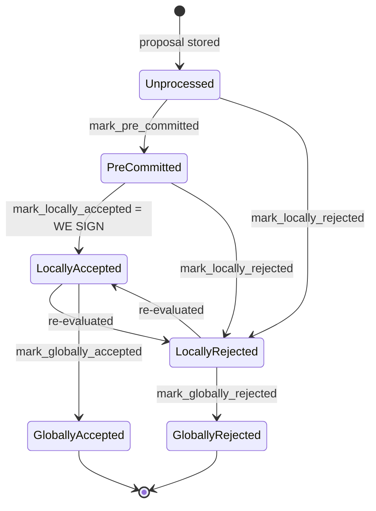

### Title
Node-side signature/rejection tally lets a stale block acceptance survive a signer's later rejection - ([File: stacks-node/src/nakamoto_node/stackerdb_listener.rs])

### Summary
The `StackerDBListener`'s per-block vote tally uses two different, inconsistently-gated collections — `gathered_signatures` (gates the *Accept* path) and `responded_signers` (gates the *Reject* path) — to decide whether a signer's weight should be counted for a given `BlockResponse`. Because these are different keys, a signer that first accepts a block and later re-evaluates and rejects it (a state transition the signer explicitly supports, per `LocallyAccepted --> LocallyRejected: re-evaluated` in the signer's own state machine) has its later rejection silently dropped by the coordinator: `responded_signers.insert(slot_id)` returns `false` because that slot was already marked "responded" during the earlier accept, so the `if` block that would add rejected weight and log the rejection never runs. The stale acceptance's weight and signature remain counted toward `total_weight_approved`, so a signer that has locally moved to `LocallyRejected` can still contribute to crossing the approval threshold on the node side.

### Finding Description
`handle_block_response`-equivalent processing in `stacks-node/src/nakamoto_node/stackerdb_listener.rs` handles the two `BlockResponse` variants separately:

- Accept path (around line 443): gates weight accounting on `!block.gathered_signatures.contains_key(&slot_id)`, then unconditionally calls `block.responded_signers.insert(slot_id)` (line 465) regardless of whether it was already present. [1](#0-0) 

- Reject path (around line 515): gates weight accounting on `block.responded_signers.insert(slot_id)` returning `true`. [2](#0-1) 

Because `responded_signers` is a single set shared by both branches while `gathered_signatures` is only checked by the accept branch, the two branches are not symmetric:
- Reject-then-Accept: the reject inserts the slot into `responded_signers`; the accept later checks `gathered_signatures` (still empty for that slot) and is counted anyway — the signer's weight ends up on both sides of the tally.
- Accept-then-Reject: the accept inserts the slot into `responded_signers` (and `gathered_signatures`); the later reject's `responded_signers.insert(slot_id)` returns `false`, so `total_weight_rejected` is never incremented and the rejection is not logged as counted. Nothing removes the slot from `gathered_signatures` or decrements `total_weight_approved`. The signer's earlier (now stale) acceptance signature is still present in `block.gathered_signatures`, and its weight remains in `total_weight_approved`.

The v0 signer itself documents and implements the re-evaluation transition `LocallyAccepted --> LocallyRejected` (see `docs/signer-flows.md` block lifecycle) and `should_reevaluate_block`/`handle_block_validate_ok`/`check_block_against_signer_db_state`, meaning a signer can legitimately flip from accepted to rejected for the same block hash after conditions change (e.g., a conflicting block gets signed elsewhere, or a chainstate re-check invalidates the earlier verdict). [3](#0-2) [4](#0-3) 

On the node/coordinator side there is no mechanism to walk back a stale acceptance when the same signer later sends a rejection for the same `signer_signature_hash`. The coordinator's threshold check (`SignCoordinator`/`signer_coordinator.rs`) purely reads `block_status.total_weight_approved`/`total_weight_rejected` and, once `total_weight_approved >= self.weight_threshold`, assembles `gathered_signatures` into the final signature set: [5](#0-4) 

This breaks the "aggregated-weight vs verified-accepts" equality: the node's tally of approving weight and the set of signatures it will aggregate can include a signer whose current, live verdict on that exact block is a rejection.

### Impact Explanation
This is a safety-adjacent miscount: a signer's weight/signature that should have been retracted by their own subsequent rejection instead remains locked into the node's approval tally and candidate signature set. In a scenario where enough other signers reject (or fail to sign) such that the flipping signer's weight is the deciding contribution, the node could reach `weight_threshold` and push a block using a signature from a signer that has since determined the block conflicts with something it already signed (i.e., the signer's `LocallyRejected` state is authoritative locally, but the coordinator still treats their earlier vote as live). This falls under the impact category of "a rejection recounted as acceptance" — here more precisely, a rejection is silently discarded so a stale acceptance continues to be recounted as a live acceptance, letting one signer's weight persist on the "approve" side of the tally after they have moved to reject.

### Likelihood Explanation
No majority collusion or dishonest signer is required. This can occur through entirely honest execution: the signer's own documented flow allows `LocallyAccepted --> LocallyRejected` when the signer re-evaluates the block against newer chainstate (e.g., a conflicting block was signed in the interim, or `check_block_against_signer_db_state` newly fails). Whenever the miner or gossip delivers the signer's original acceptance and then its later rejection to the node's StackerDB listener for the same `signer_signature_hash`, the asymmetric gating in `stackerdb_listener.rs` triggers. This is realistic in reorg/conflict-timing windows that the signer-side logic (section 5 of `docs/signer-flows.md`, `get_signed_conflicts`/`conflict_still_blocks`) is explicitly built to handle — i.e., exactly the conditions under which the signer is expected to flip.

### Recommendation
Make the two tally paths symmetric and mutually revocable:
- Gate the Accept path on the same `responded_signers` set (or a per-slot "current verdict" enum) rather than the separate `gathered_signatures` map, so a slot's vote is tracked once and its type (Accept/Reject) can be updated.
- When a signer's message for a given `signer_signature_hash` changes verdict (Accept → Reject or vice versa), subtract the previously counted weight from the old bucket and move the signature/weight to the new bucket (or drop it from `gathered_signatures`) before evaluating thresholds, rather than silently no-op'ing on the second message.
- Ensure `total_weight_approved` and `total_weight_rejected` for a given `slot_id` are mutually exclusive at all times, so the invariant "each signer contributes to at most one side of the tally, and always the side matching their latest message" holds.

### Proof of Concept
1. Node reaches proposal-validation stage for block `B` and starts the `SignCoordinator`/`StackerDBListener` tally for `B`'s `signer_signature_hash`.
2. Signer `S` (assigned `slot_id = k`, weight `w`) validates `B` and initially broadcasts `BlockResponse::Accepted`. The listener's Accept branch checks `gathered_signatures` (empty for `k`), adds `w` to `total_weight_approved`, stores the signature in `gathered_signatures[k]`, and inserts `k` into `responded_signers`.
3. Before the block reaches threshold, `S` observes a conflicting signed block at the same height (per the re-evaluation rules in section 5/6 of `docs/signer-flows.md`) and re-runs `check_block_against_signer_db_state`, which fails; `S` calls `mark_locally_rejected` and broadcasts `BlockResponse::Rejected` for the same `signer_signature_hash`. [4](#0-3) 
4. The listener's Reject branch executes `block.responded_signers.insert(k)`, which returns `false` (already inserted in step 2) — the `if` body that adds `w` to `total_weight_rejected` and logs the rejection is skipped entirely. [2](#0-1) 
5. `total_weight_approved` still includes `w`, and `gathered_signatures[k]` still holds `S`'s stale acceptance signature. If the remaining honest signers' weight plus `w` crosses `weight_threshold`, the coordinator aggregates `gathered_signatures` (including `S`'s stale signature) into the final block signature set despite `S`'s current, authoritative local state being `LocallyRejected` for that exact block.

### Citations

**File:** stacks-node/src/nakamoto_node/stackerdb_listener.rs (L443-465)
```rust
                        if !block.gathered_signatures.contains_key(&slot_id) {
                            block.total_weight_approved = block
                                .total_weight_approved
                                .saturating_add(signer_entry.weight);

                            info!("StackerDBListener: Signature Added to block";
                                "signer_signature_hash" => %block_sighash,
                                "signer_pubkey" => signer_pubkey.to_hex(),
                                "signer_slot_id" => slot_id,
                                "signature" => %signature,
                                "signer_weight" => signer_entry.weight,
                                "total_weight_approved" => block.total_weight_approved,
                                "percent_approved" => block.total_weight_approved as f64 / self.total_weight as f64 * 100.0,
                                "total_weight_rejected" => block.total_weight_rejected,
                                "percent_rejected" => block.total_weight_rejected as f64 / self.total_weight as f64 * 100.0,
                                "weight_threshold" => self.weight_threshold,
                                "tenure_extend_timestamp" => tenure_extend_timestamp,
                                "read_count_extend_timestamp" => read_count_extend_timestamp,
                                "server_version" => metadata.server_version,
                            );
                        }
                        block.gathered_signatures.insert(slot_id, signature);
                        block.responded_signers.insert(slot_id);
```

**File:** stacks-node/src/nakamoto_node/stackerdb_listener.rs (L515-518)
```rust
                        if block.responded_signers.insert(slot_id) {
                            block.total_weight_rejected = block
                                .total_weight_rejected
                                .saturating_add(signer_entry.weight);
```

**File:** docs/signer-flows.md (L130-150)
```markdown
## 2. Block lifecycle (`BlockState`)

Every proposal tracked in the signer DB carries a `BlockState`. **`PreCommitted`
carries no signature**: it means "validated, willing to sign if the pre-commit
threshold is met." The first signature appears at `mark_locally_accepted`.
Global states are terminal against each other.


```

**File:** stacks-signer/src/v0/signer.rs (L1946-1959)
```rust
        if let Some(block_rejection) =
            self.check_block_against_signer_db_state(stacks_client, &block_info.block)
        {
            // The signer db state has changed. We no longer view this block as valid. Override the validation response.
            if let Err(e) = block_info.mark_locally_rejected() {
                if !block_info.has_reached_consensus() {
                    warn!("{self}: Failed to mark block as locally rejected: {e:?}");
                }
            };
            self.signer_db
                .insert_block(&block_info)
                .unwrap_or_else(|e| self.handle_insert_block_error(e));
            self.handle_block_rejection(&block_rejection, sortition_state);
            self.send_block_response(&block_info.block, block_rejection.into());
```

**File:** stacks-node/src/nakamoto_node/signer_coordinator.rs (L541-545)
```rust
            } else if block_status.total_weight_approved >= self.weight_threshold {
                info!("Received enough signatures, block accepted";
                    "signer_signature_hash" => %block_signer_sighash,
                );
                return Ok(block_status.gathered_signatures.values().cloned().collect());
```
