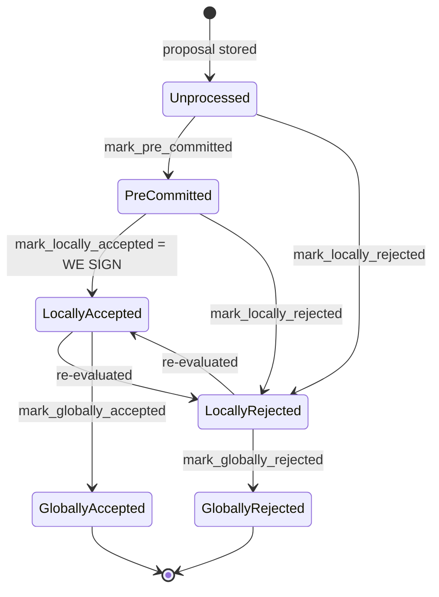

### Title
`process_pending_responses_for_block` reuses a stale `&mut BlockInfo` across nested self-calls, letting a queued pre-commit/signature response clobber block state advanced by an interleaved `handle_block_pre_commit` call — analogous to a CEI-violation reentrancy

### Summary
This is a bug-class analog of the `settleAuction()` reentrancy: an "effect" (a DB write to `signerdb`) performed inside a nested call, triggered mid-way through an outer read-modify-write sequence on the *same* logical resource (a `BlockInfo` row keyed by `signer_signature_hash`), is invisible to the outer call, which later overwrites the DB with its own stale in-memory copy. [1](#0-0) 

### Finding Description
`process_pending_responses_for_block` replays early votes (pre-commits, rejections, signatures) that arrived before a proposal was known, iterating three loops that **all share the same `&mut BlockInfo` reference** across iterations: [2](#0-1) 

Inside the signature loop, `store_and_process_block_signature` is called with this shared `block_info`. Its logic:
1. Writes the incoming signature straight to `signerdb` via `add_block_signature` (line 2454-2457) — an effect on the DB row, not on the passed-in struct.
2. If the sender hasn't pre-committed yet, it treats the acceptance as a pre-commit and calls **`handle_block_pre_commit`** — a full nested self-call — and returns early: [3](#0-2) 

`handle_block_pre_commit` does its **own independent DB lookup** (`block_lookup_by_reward_cycle`), and can itself tally pre-commit weight, re-run chainstate checks, `mark_locally_accepted`/`mark_pre_committed`/`mark_locally_rejected`, and `insert_block` — i.e., it can fully sign and advance the block's `BlockState` (up to `LocallyAccepted`) using a *fresh* copy of `BlockInfo`, completely independent of the caller's stale reference. [4](#0-3) 

Control returns to `process_pending_responses_for_block`'s loop, which proceeds to the **next** pending signature using the **same, now-stale** `block_info` (it was never re-fetched from the DB after the nested call mutated the underlying row). The next call to `store_and_process_block_signature` operates on this stale snapshot: it re-tallies signature weight from a fresh DB read (`get_block_signatures`, correct), but then calls `block_info.mark_locally_accepted(true)` on the **stale struct** and finally `self.signer_db.insert_block(block_info)` (lines 2528-2537), which **overwrites** the DB row — silently discarding/reverting any state the interleaved `handle_block_pre_commit` call had already written (e.g. `approved_time`, `reject_reason`, or even a `state` transition), and doing so via a `mark_locally_accepted` transition validated against `BlockInfo::check_state`'s stale precondition rather than the row's true current state.

This breaks the documented invariant that `BlockState` is a strict progression where "Global states are terminal against each other" [5](#0-4) : a terminal or otherwise-advanced state set by the nested call can be quietly overwritten by the outer loop's blind write-back, exactly as `settleAuction()` blindly resumed with a corrupted `pendingWeights` after the reentrant `withdrawBounty()` callback mutated shared state mid-function.

### Impact Explanation
The scenario matches the "aggregated-weight vs verified-accepts" equality and the state-machine wedge classes named in scope: a stale `BlockInfo::insert_block` write can desynchronize `signerdb`'s row from what was actually decided (e.g. clobbering a `mark_locally_accepted`/pre-commit result that already accounted for a conflict rejection, or vice versa reverting a rejection back to an earlier, weaker state). Because downstream logic (`check_block_against_signer_db_state`, `get_signed_conflicts`, `has_reached_consensus`, `determine_response`) all trust the `signerdb` row as ground truth for whether this signer has already signed/rejected/pre-committed a block, a corrupted row can cause the signer to re-evaluate and potentially sign a block it should have treated as terminal, or conversely get stuck unable to reconcile its local state with reality (a liveness wedge). This falls under the "High" bucket: a signer's local state machine losing consistency after a legitimate but oddly-ordered replay of early votes.

### Likelihood Explanation
This requires no majority collusion and no external key: the "early votes" queue (`pending_responses.signatures`/`pre_commits`/`rejections`) is populated purely from ordinary gossip messages that arrive before the block proposal itself — a normal, frequently-occurring race in the signer network given latency between miner broadcast and signer-to-signer StackerDB propagation (the doc explicitly calls out this path: "Early votes: acceptances, rejections, and pre-commits that arrived before the proposal itself are parked in pending tables and replayed once the proposal is known" [6](#0-5) ). It only needs at least two queued signature/pre-commit responses for the same block, from signers whose pre-commit hasn't yet been recorded locally, to trigger the reentrant nested-call/stale-write interleaving.

### Recommendation
In `process_pending_responses_for_block`, re-fetch `block_info` from `signerdb` (or otherwise refresh the in-memory struct) after every call that can itself mutate the underlying row — in particular after each `handle_block_pre_commit`/`store_and_process_block_signature`/`store_and_process_block_rejection` invocation — instead of threading one `&mut BlockInfo` unchanged through the whole replay loop. More generally, `store_and_process_block_signature` should not blindly `insert_block(block_info)` at the end using a struct that may already be stale relative to a nested call it triggered; it should re-load the current DB state immediately before computing and applying the final transition (Checks-Effects-Interactions: read latest state → decide → write once), mirroring the mitigation recommended for `settleAuction()` (perform all external/nested effects only after the local decision is finalized and persisted).

### Proof of Concept
1. Two `BlockPreCommit`-equivalent signature responses for the same not-yet-known block arrive from Signer A and Signer B before the local signer receives the block proposal; both get queued via `add_pending_block_signature_response` / drained into `pending_responses.signatures`.
2. The block proposal arrives; `handle_block_proposal` builds a fresh `BlockInfo`, then calls `process_pending_responses_for_block`, which loops the two queued signatures through `store_and_process_block_signature` using one shared `&mut block_info`.
3. Processing Signer A's response: no pre-commit from A is on record, so `store_and_process_block_signature` falls into the `handle_block_pre_commit` branch (lines 2462-2466), which independently looks up and mutates the DB row (e.g. reaching pre-commit threshold and marking `LocallyAccepted`, or discovering a conflict and marking `LocallyRejected`), then returns.
4. Processing Signer B's response next, still using the original (pre-step-3) `block_info`: `store_and_process_block_signature` recomputes the signature tally from the DB (accurate) but calls `mark_locally_accepted`/writes `insert_block(block_info)` using the stale struct from before step 3, overwriting the row and discarding whatever `handle_block_pre_commit` had just committed (e.g. reverting a `LocallyRejected` conflict decision back to no-decision state, or clobbering `approved_time`/`reject_reason`).
5. Result: `signerdb`'s recorded block state no longer matches what was actually decided, which downstream code (conflict checks, `determine_response`, re-proposal handling) will treat as ground truth — a demonstrable desync of the local state machine reachable purely through ordinary out-of-order gossip, without any majority or key compromise.

### Citations

**File:** stacks-signer/src/v0/signer.rs (L1250-1366)
```rust
    /// Handle pre-commit message from another signer
    fn handle_block_pre_commit(
        &mut self,
        stacks_client: &StacksClient,
        sortition_state: &mut Option<SortitionsView>,
        stacker_address: &StacksAddress,
        block_hash: &Sha512Trunc256Sum,
    ) {
        let Some(mut block_info) = self.block_lookup_by_reward_cycle(block_hash) else {
            // A pre-commit for a block we have not seen proposed yet means the proposal
            // has not reached us. Log it at INFO: it is a direct signal that our view of
            // the proposal stream is behind the rest of the signer set.
            info!("{self}: Received block pre-commit for an unknown block, storing as pending";
                "signer_address" => %stacker_address,
                "signer_signature_hash" => %block_hash,
                "signer_weight" => self.signer_weights.get(stacker_address).copied().unwrap_or(0),
            );
            if let Err(e) = self
                .signer_db
                .add_pending_block_pre_commit_response(block_hash, stacker_address)
            {
                warn!("{self}: Failed to save pending block pre-commit response: {e:?}");
            }
            return;
        };
        // Always save the pre-commit - we will need to store signer responses for determining which
        // are misbehaving, offline, etc.
        // commit message is from a valid sender! store it
        self.signer_db
            .add_block_pre_commit(block_hash, stacker_address)
            .unwrap_or_else(|_| panic!("{self}: Failed to save block pre-commit"));

        let block_hash = block_info.block.header.signer_signature_hash();
        // do we have enough pre-commits to reach consensus?
        // i.e. is the threshold reached?
        //
        // Tally this up front, before the early returns below, so that every pre-commit we
        // receive can be logged with the running weight. Crossing this threshold is what
        // triggers our block response, so without it the wait for the threshold, which can
        // be minutes and is the bulk of a stalled block's latency, leaves no trace at all.
        let committers = self
            .signer_db
            .get_block_pre_committers(&block_hash)
            .unwrap_or_else(|_| panic!("{self}: Failed to load block commits"));

        let commit_weight = self.compute_signature_signing_weight(committers.iter());
        let total_weight = self.compute_signature_total_weight();

        let min_weight = NakamotoBlockHeader::compute_voting_weight_threshold(total_weight)
            .unwrap_or_else(|_| {
                panic!("{self}: Failed to compute threshold weight for {total_weight}")
            });

        info!("{self}: Received block pre-commit";
            "signer_address" => %stacker_address,
            "signer_signature_hash" => %block_hash,
            "consensus_hash" => %block_info.block.header.consensus_hash,
            "block_height" => block_info.block.header.chain_length,
            "signer_weight" => self.signer_weights.get(stacker_address).copied().unwrap_or(0),
            "pre_commit_weight" => commit_weight,
            "pre_commit_weight_required" => min_weight,
            "total_weight" => total_weight,
            "pre_commit_threshold_reached" => commit_weight >= min_weight,
            "already_signed" => block_info.signed_self.is_some(),
        );

        if block_info.signed_self.is_some() {
            debug!(
                "{self}: Received pre-commit for a block that we have already signed. Doing nothing...",
            );
            return;
        }

        if !block_info.valid.unwrap_or(false) {
            // We received a pre-commit for a block that we have not validated or we have already marked this block as invalid.
            // We should not do anything further as we do not know what our response should be and we do not change our votes on rejected
            // blocks unless we receive a new block proposal for it and the reject reason allows us to reconsider.
            debug!(
                "{self}: Received a pre-commit for a block that we have not determined to be valid: {:?}. Doing nothing...", block_info.valid
            );
            return;
        }

        if min_weight > commit_weight {
            debug!(
                "{self}: Not enough pre-committed to block {block_hash} (have {commit_weight}, need at least {min_weight}/{total_weight})"
            );
            return;
        }

        // The chain and signer db state may have changed materially since this block passed the
        // proposal-time checks (e.g. between validation and reaching the pre-commit threshold we
        // may have signed a block that this one would reorg). Re-run the chainstate checks
        // before putting a signature over the block, and respond with a rejection if they no
        // longer pass, just as the block validation response handler does.
        if let Some(block_rejection) =
            self.check_block_against_signer_db_state(stacks_client, &block_info.block)
        {
            warn!(
                "{self}: Reached the pre-commit threshold for a block, but it no longer passes the chainstate checks. Rejecting.";
                "signer_signature_hash" => %block_hash,
                "block_height" => block_info.block.header.chain_length,
                "reject_code" => %block_rejection.reason_code,
                "reject_reason" => &block_rejection.reason,
            );
            if let Err(e) = block_info.mark_locally_rejected() {
                if !block_info.has_reached_consensus() {
                    warn!("{self}: Failed to mark block as locally rejected: {e:?}");
                }
            };
            self.signer_db
                .insert_block(&block_info)
                .unwrap_or_else(|e| self.handle_insert_block_error(e));
            self.handle_block_rejection(&block_rejection, sortition_state);
            self.send_block_response(&block_info.block, block_rejection.into());
            return;
        }
```

**File:** stacks-signer/src/v0/signer.rs (L1729-1780)
```rust
    /// Process pending responses for a block proposal that we may have received late.
    fn process_pending_responses_for_block(
        &mut self,
        stacks_client: &StacksClient,
        sortition_state: &mut Option<SortitionsView>,
        block_info: &mut BlockInfo,
        pending_responses: PendingBlockResponses,
    ) {
        let signer_signature_hash = block_info.block.header.signer_signature_hash();
        for stacker_address in pending_responses.pre_commits {
            debug!("{self}: Processing pending pre-commit.";
                "stacker_address" => %stacker_address,
                "signer_signature_hash" => %signer_signature_hash,
                "block_id" => %block_info.block.block_id(),
            );
            self.handle_block_pre_commit(
                stacks_client,
                sortition_state,
                &stacker_address,
                &signer_signature_hash,
            );
        }
        for (stacker_address, reject_reason) in pending_responses.rejections {
            debug!("{self}: Processing pending rejection.";
                "stacker_address" => %stacker_address,
                "signer_signature_hash" => %signer_signature_hash,
                "block_id" => %block_info.block.block_id(),
                "reject_reason" => ?reject_reason,
            );
            self.store_and_process_block_rejection(
                sortition_state,
                block_info,
                &stacker_address,
                reject_reason,
            );
        }
        let block_id = block_info.block.block_id();
        for (stackers_address, signature) in pending_responses.signatures {
            debug!("{self}: Processing pending signature.";
                "stacker_address" => %stackers_address,
                "signer_signature_hash" => %signer_signature_hash,
                "block_id" => %block_id,
            );
            self.store_and_process_block_signature(
                stacks_client,
                sortition_state,
                block_info,
                &stackers_address,
                &signature,
            );
        }
    }
```

**File:** stacks-signer/src/v0/signer.rs (L2442-2466)
```rust
    /// Store the block acceptance signature and check if we have reached a consensus decision on the block because of it. If we have, update the block state accordingly and broadcast the block if accepted.
    fn store_and_process_block_signature(
        &mut self,
        stacks_client: &StacksClient,
        sortition_state: &mut Option<SortitionsView>,
        block_info: &mut BlockInfo,
        signer_address: &StacksAddress,
        signature: &MessageSignature,
    ) {
        let block_hash = &block_info.signer_signature_hash();
        // signature is valid! store it.
        // if this returns false, it means the signature already exists in the DB, so just return.
        if !self
            .signer_db
            .add_block_signature(block_hash, signer_address, signature)
            .unwrap_or_else(|_| panic!("{self}: Failed to save block signature"))
        {
            return;
        }

        // If this isn't our own signature and we haven't seen a pre-commit from this signer yet, try treating it as a pre-commit in case the caller is running an outdated version
        if signer_address != &self.stacks_address && !self.signer_db.has_committed(block_hash, signer_address).inspect_err(|e| warn!("Failed to check if pre-commit message already considered for {signer_address:?} for {block_hash}: {e}")).unwrap_or(false) {
            self.handle_block_pre_commit(stacks_client, sortition_state, signer_address, block_hash);
            return;
        }
```

**File:** docs/signer-flows.md (L130-150)
```markdown
## 2. Block lifecycle (`BlockState`)

Every proposal tracked in the signer DB carries a `BlockState`. **`PreCommitted`
carries no signature**: it means "validated, willing to sign if the pre-commit
threshold is met." The first signature appears at `mark_locally_accepted`.
Global states are terminal against each other.


```

**File:** docs/signer-flows.md (L196-203)
```markdown
Early votes: acceptances, rejections, and pre-commits that arrived before the
proposal itself are parked in pending tables and replayed once the proposal is
known.

> Anchors: `handle_block_proposal`, `should_reevaluate_block`,
> `should_reevaluate_reject_reason`, `check_block_against_state`,
> `submit_block_for_validation`, `process_pending_responses_for_block`
> (signer.rs); `check_proposal` (chainstate/v1.rs, v2.rs)
```
