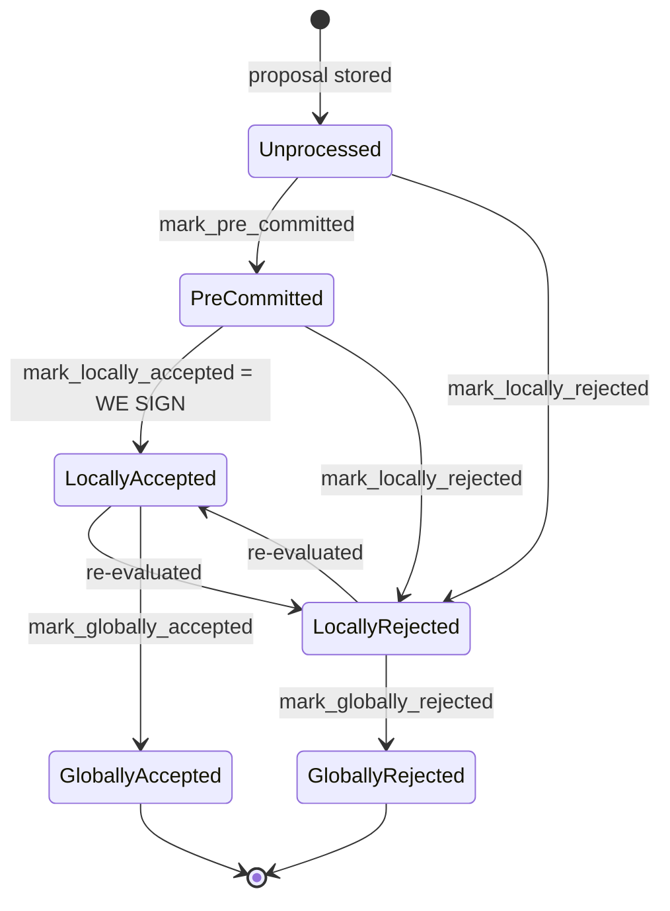

### Title
Stale `block_pre_commits` rows after a signer reverses its vote to rejection inflate pre-commit weight tallies - (File: stacks-signer/src/signerdb.rs, stacks-signer/src/v0/signer.rs)

### Summary
`block_pre_commits` rows are inserted whenever a `BlockPreCommit` message is received, but are never deleted when the same signer later moves to a rejection for the same block. `get_block_pre_committers` (used to compute the pre-commit weight that gates whether the local signer proceeds toward signing) therefore keeps counting a signer's stale, superseded pre-commit even after that signer has switched to rejecting the block — the same "delete instead of remove" pattern as the `isResolverCached` bug, where a stale entry that should have been dropped keeps satisfying a lookup/aggregate it should no longer satisfy.

### Finding Description
Pre-commits are recorded with an unconditional upsert and no corresponding cleanup on rejection: [1](#0-0) 

By contrast, when a signature is recorded, the code explicitly deletes any earlier *rejection* row for that signer/block so the two tables stay mutually exclusive: [2](#0-1) 

No equivalent cleanup exists for the `block_pre_commits` table. A repo-wide search finds no `DELETE FROM block_pre_commits` statement anywhere, so once a `signer_addr` row is inserted into `block_pre_commits` for a given `signer_signature_hash`, it remains there for the lifetime of the block, regardless of what that signer does afterward.

`handle_block_pre_commit` uses `get_block_pre_committers` to tally the weight backing a pre-commit threshold check, which gates progression toward a local signature: [3](#0-2) 

The signer state machine explicitly allows `PreCommitted -> LocallyRejected` transitions (a signer that pre-committed can later reject the same block, e.g. after a chainstate re-check or reorg-related re-evaluation): [4](#0-3) 

When a remote signer's vote flips from pre-commit to rejection, the local node calls `store_and_process_block_rejection`, which inserts into `block_rejection_signer_addrs` but does not touch `block_pre_commits`: [5](#0-4) 

Consequently `get_block_pre_committers(&block_hash)` still returns the reversing signer's address, and `compute_signature_signing_weight` still credits that signer's weight toward the pre-commit threshold on every subsequent `handle_block_pre_commit` invocation triggered by any other signer's (or our own) pre-commit.

### Impact Explanation
This breaks the "aggregated-weight vs verified-accepts" equality explicitly called out as in-scope: the weight the local signer uses to decide it may safely proceed toward signing no longer reflects which signers currently, actually support the block. A signer who withdrew support (moved to rejection) continues to be silently tallied as still supporting it, which can let the pre-commit weight cross the ~70% threshold earlier or when it otherwise would not have, based on stale data rather than the signer set's live view. This is the functional analogue of a rejection being recounted as an acceptance in the aggregate used to gate a critical action (progressing toward putting a signature on a block).

### Likelihood Explanation
This requires no majority collusion and no privileged access: it is triggered purely by normal protocol activity — a single signer that pre-commits and later legitimately reverses to a rejection for the same block (a state transition the signer state machine explicitly supports), combined with any subsequent pre-commit message (including the local signer's own) that re-triggers the weight tally. No malicious behavior beyond ordinary vote reversal is needed, which is a scenario the code path (re-checks, reorg handling, reject-reason re-evaluation) is designed to allow.

### Recommendation
When a signer's rejection is recorded for a block (`store_and_process_block_rejection` / `add_block_rejection_signer_addr`), also delete that signer's row from `block_pre_commits` for the same `signer_signature_hash`, mirroring the symmetric cleanup already performed in `add_block_signature` for the rejection table. This keeps `get_block_pre_committers` an accurate reflection of the signers currently, actively backing the block.

### Proof of Concept
1. Signer B validates block X and pre-commits; local node calls `add_block_pre_commit(X, B)`, inserting a row into `block_pre_commits`.
2. Later, chainstate context changes (e.g., a conflicting signed block, or a reorg-timing re-check) and B moves to `LocallyRejected` for X, broadcasting a rejection. The local node calls `store_and_process_block_rejection`, which records B into `block_rejection_signer_addrs` — but B's earlier row in `block_pre_commits` is never deleted.
3. Some time later, another signer C sends a pre-commit for X, triggering `handle_block_pre_commit` on the local node, which calls `get_block_pre_committers(X)`.
4. `get_block_pre_committers` returns both B and C (B's stale row is still present), so `compute_signature_signing_weight` credits B's weight even though B has withdrawn support and currently rejects X.
5. If B + C's combined (stale) weight crosses `min_weight`, the local signer proceeds past the threshold check based on inflated, stale support — exactly the "aggregated-weight vs verified-accepts" mismatch this analog set targets.

Note: I was unable to view the full body of `add_block_rejection_signer_addr` directly (tool budget ran out before the final read); the conclusion that it performs no `block_pre_commits` cleanup rests on the repo-wide `grep_search` for `block_pre_commits`/`DELETE FROM block_pre_commits`, which surfaced no delete statement against that table anywhere in the codebase. A background Devin session with full file access should confirm this before treating the finding as fully verified.

### Citations

**File:** stacks-signer/src/signerdb.rs (L1876-1881)
```rust
    ) -> Result<bool, DBError> {
        // Remove any block rejection entry for this signer and block hash
        let del_qry = "DELETE FROM block_rejection_signer_addrs WHERE signer_signature_hash = ?1 AND signer_addr = ?2";
        let del_args = params![block_sighash, signer_addr.to_string()];
        self.db.execute(del_qry, del_args)?;

```

**File:** stacks-signer/src/signerdb.rs (L2441-2456)
```rust
    /// Record an observed block pre-commit
    pub fn add_block_pre_commit(
        &self,
        block_sighash: &Sha512Trunc256Sum,
        address: &StacksAddress,
    ) -> Result<(), DBError> {
        let qry = "INSERT OR REPLACE INTO block_pre_commits (signer_signature_hash, signer_addr) VALUES (?1, ?2);";
        let args = params![block_sighash, address.to_string()];

        debug!("Inserting block pre-commit.";
            "signer_signature_hash" => %block_sighash,
            "signer_addr" => %address);

        self.db.execute(qry, args)?;
        Ok(())
    }
```

**File:** stacks-signer/src/v0/signer.rs (L1282-1338)
```rust
        let block_hash = block_info.block.header.signer_signature_hash();
        // do we have enough pre-commits to reach consensus?
        // i.e. is the threshold reached?
        //
        // Tally this up front, before the early returns below, so that every pre-commit we
        // receive can be logged with the running weight. Crossing this threshold is what
        // triggers our block response, so without it the wait for the threshold, which can
        // be minutes and is the bulk of a stalled block's latency, leaves no trace at all.
        let committers = self
            .signer_db
            .get_block_pre_committers(&block_hash)
            .unwrap_or_else(|_| panic!("{self}: Failed to load block commits"));

        let commit_weight = self.compute_signature_signing_weight(committers.iter());
        let total_weight = self.compute_signature_total_weight();

        let min_weight = NakamotoBlockHeader::compute_voting_weight_threshold(total_weight)
            .unwrap_or_else(|_| {
                panic!("{self}: Failed to compute threshold weight for {total_weight}")
            });

        info!("{self}: Received block pre-commit";
            "signer_address" => %stacker_address,
            "signer_signature_hash" => %block_hash,
            "consensus_hash" => %block_info.block.header.consensus_hash,
            "block_height" => block_info.block.header.chain_length,
            "signer_weight" => self.signer_weights.get(stacker_address).copied().unwrap_or(0),
            "pre_commit_weight" => commit_weight,
            "pre_commit_weight_required" => min_weight,
            "total_weight" => total_weight,
            "pre_commit_threshold_reached" => commit_weight >= min_weight,
            "already_signed" => block_info.signed_self.is_some(),
        );

        if block_info.signed_self.is_some() {
            debug!(
                "{self}: Received pre-commit for a block that we have already signed. Doing nothing...",
            );
            return;
        }

        if !block_info.valid.unwrap_or(false) {
            // We received a pre-commit for a block that we have not validated or we have already marked this block as invalid.
            // We should not do anything further as we do not know what our response should be and we do not change our votes on rejected
            // blocks unless we receive a new block proposal for it and the reject reason allows us to reconsider.
            debug!(
                "{self}: Received a pre-commit for a block that we have not determined to be valid: {:?}. Doing nothing...", block_info.valid
            );
            return;
        }

        if min_weight > commit_weight {
            debug!(
                "{self}: Not enough pre-committed to block {block_hash} (have {commit_weight}, need at least {min_weight}/{total_weight})"
            );
            return;
        }
```

**File:** stacks-signer/src/v0/signer.rs (L2267-2306)
```rust
    // Store the block rejection signature and check if we have reached a consensus decision on the block because of it. If we have, update the block state accordingly.
    fn store_and_process_block_rejection(
        &mut self,
        sortition_state: &mut Option<SortitionsView>,
        block_info: &mut BlockInfo,
        signer_address: &StacksAddress,
        reject_reason: RejectReasonPrefix,
    ) {
        let block_hash = &block_info.signer_signature_hash();
        // We should still store signatures even on consensus reached blocks for auditing purposes.
        // signature is valid! store it
        match self.signer_db.add_block_rejection_signer_addr(
            block_hash,
            signer_address,
            reject_reason,
        ) {
            Err(e) => {
                warn!("{self}: Failed to save block rejection signature: {e:?}",);
            }
            Ok(false) => return, // We already have this signature, do not process it again.
            Ok(true) => (),
        }

        if block_info.has_reached_consensus() {
            // Checking the rejection signatures is pointless. We have already reached consensus on this block.
            return;
        }

        // do we have enough signatures to mark a block a globally rejected?
        // i.e. is (set-size) - (threshold) + 1 reached.
        let rejection_addrs = match self.signer_db.get_block_rejection_signer_addrs(block_hash) {
            Ok(addrs) => addrs,
            Err(e) => {
                warn!("{self}: Failed to load block rejection addresses: {e:?}.",);
                return;
            }
        };
        let signature_weight = self.signer_weights.get(signer_address).unwrap_or(&0);
        let total_reject_weight =
            self.compute_signature_signing_weight(rejection_addrs.iter().map(|(addr, _)| addr));
```

**File:** docs/signer-flows.md (L130-150)
```markdown
## 2. Block lifecycle (`BlockState`)

Every proposal tracked in the signer DB carries a `BlockState`. **`PreCommitted`
carries no signature**: it means "validated, willing to sign if the pre-commit
threshold is met." The first signature appears at `mark_locally_accepted`.
Global states are terminal against each other.


```
