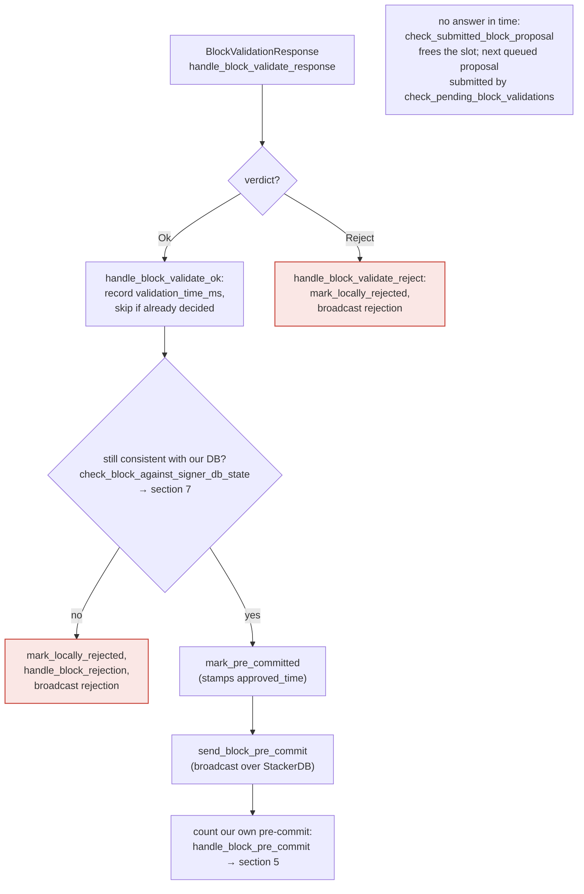
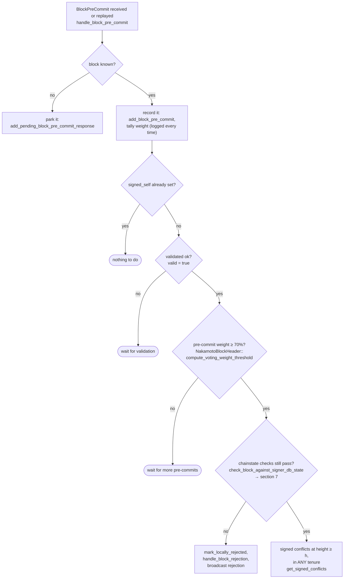

### Title
Fail-open on node-RPC failure in `check_latest_block_in_tenure` lets a signer with no local tenure history (e.g. a freshly-restarted signer) sign a block whose parent/tip confirmation could not actually be verified — ([File: stacks-signer/src/chainstate/mod.rs])

### Summary
`SortitionData::check_latest_block_in_tenure` treats a failed `client.get_tenure_tip(tenure_id)` RPC call the same as "the proposal is fine," explicitly returning `Ok(true)` (pass/not-rejected) on error [1](#0-0) . This is the same class of bug as the reported PraisonAI issue: a validation function fails open when an external lookup errors, and the assumption that this is "safe" depends entirely on a downstream backstop that does not exist at every call site that reuses the function.

### Finding Description
The doc-comment on `check_latest_block_in_tenure` justifies the fail-open explicitly: "If we can't look up `tenure_id`, assume `block` is higher... This assumption is safe because this proposal ultimately must be passed to the `stacks-node` for proposal processing" [2](#0-1) . That reasoning only holds for the **first** call site — the pre-submission screen inside `check_proposal`/`check_block_against_state`, which is followed by a real `submit_block_for_validation` call to the node's `/v3/block_proposal` endpoint (section 3 of the flow) [3](#0-2) .

However, the same function (via `check_tenure_change_confirms_parent` / `confirms_latest_block_in_same_tenure`) is also the mechanism behind `check_block_against_signer_db_state`, which is re-run at two points that have **no further backstop**:
- After the node already returned `Ok` for validation, right before the signer marks the block `PreCommitted` and broadcasts a pre-commit [4](#0-3) .
- Immediately before the pre-commit threshold triggers the actual signature (`RECHECK -- yes --> CONF ... SIGN`) [5](#0-4) .

Inside `check_latest_block_in_tenure`, the height comparison against locally known blocks (`get_tenure_last_block_info`, `get_last_accepted_block`) is *not* subject to this failure mode — it only degrades to the network fallback when the signer's own DB has **no local record for that tenure** [6](#0-5) . That specific condition — no local record for a tenure — is exactly what happens after a signer restarts (or was freshly added, or lost/rolled back its signerdb), which is precisely the scenario the "losing the equivocation guard on restart" impact category is about. In that state, the function's only source of truth is the just-in-time RPC to the signer's own Stacks node, and if that RPC fails or times out at the moment of the final pre-signature recheck, the code assumes the proposal is higher/valid and lets it through — with the next stop being an actual signature (`SIGN: mark_locally_accepted, handle_block_signature`) [7](#0-6) , not another chainstate/network validation.

### Impact Explanation
This maps to the accepted High-impact category: *a signer... losing the equivocation guard on restart*. A signer that has just restarted (empty/limited signerdb state for the tenure in question) relies on the fail-open branch of `check_latest_block_in_tenure` as its only check that the proposal actually confirms the canonical tenure tip. A transient failure of its own node's `/v3/tenures/tip_metadata` RPC at that instant (load, restart race, network blip — plausible without needing majority collusion, since a miner fully controls proposal/pre-commit timing and cadence) causes the check to pass silently, and the signer proceeds toward producing a signature over a block that was never actually confirmed against the node's live view of the tenure tip.

### Likelihood Explanation
Requires only: (1) a signer with no local signerdb record for the relevant tenure (trivially achieved via restart, redeployment, or DB reset — an ordinary operational event, not an attacker capability) and (2) an RPC failure/timeout to the signer's own node at the exact moment of the post-validation or pre-signature recheck. No majority of signers, no other signer's key, and no auth_token access is required; a single miner (plus normal gossip timing) can influence when these rechecks occur relative to node load.

### Recommendation
Do not reuse the "assume higher on RPC failure" behavior of `check_latest_block_in_tenure` at call sites that have no subsequent node-validation backstop. Concretely:
- In `stacks-signer/src/chainstate/mod.rs::check_latest_block_in_tenure` (lines 450–461), change the `Err(e)` branch to fail closed (treat as "not confirmed" / hold) when invoked from `check_block_against_signer_db_state`'s post-validation and pre-signature recheck paths, while preserving the current optimistic behavior only for the pre-submission `check_proposal` screen where the node validation call is guaranteed to run afterward.
- Alternatively, thread an explicit `is_backstopped: bool` (or separate function) through the two call contexts so the fail-open assumption can never silently leak into the irreversible signing path.

### Proof of Concept
Conceptual reproduction (Rust test-harness style, mirroring the existing `check_proposal_refresh` test pattern) [8](#0-7) :
1. Construct a `SignerDb` with no `last_signed_block`/`last_accepted_block` entries for `tenure_id` (simulating a freshly restarted signer).
2. Mock `StacksClient::get_tenure_tip` to return an `Err` (simulating RPC timeout/failure).
3. Call `SortitionData::check_latest_block_in_tenure(tenure_id, &block, &mut signer_db, &client, ...)`.
4. Observe it returns `Ok(true)` (per lines 450–461), i.e., the confirmation check passes despite the signer having no way to know whether `block` actually confirms the tenure tip.
5. Trace this result through `check_tenure_change_confirms_parent` / `confirms_latest_block_in_same_tenure` into `check_block_against_signer_db_state`, used at the pre-commit and pre-signature rechecks, to show it does not cause a rejection at the last gate before `mark_locally_accepted`/signature broadcast.

Note: I was unable to view the raw source of `conflict_still_blocks` / `get_signed_conflicts` in `stacks-signer/src/v0/signer.rs` directly within the available tool budget (only file-level grep matches were returned, not their bodies), so the exact wiring of `check_block_against_signer_db_state` into the final `SIGN` branch is corroborated via `docs/signer-flows.md`'s documented anchors rather than the raw function body. A background Devin session with full repository access could confirm the exact call chain and produce a runnable Rust PoC/test.

### Citations

**File:** stacks-signer/src/chainstate/mod.rs (L366-374)
```rust
    /// Check whether or not `block` is higher than the highest block in `tenure_id`.
    ///  returns `Ok(true)` if `block` is higher, `Ok(false)` if not.
    ///
    /// If we can't look up `tenure_id`, assume `block` is higher.
    /// This assumption is safe because this proposal ultimately must be passed
    /// to the `stacks-node` for proposal processing: so, if we pass the block
    /// height check here, we are relying on the `stacks-node` proposal endpoint
    /// to do the validation on the chainstate data that it has.
    ///
```

**File:** stacks-signer/src/chainstate/mod.rs (L384-448)
```rust
        let last_block_info = SortitionData::get_tenure_last_block_info(
            tenure_id,
            signer_db,
            tenure_last_block_proposal_timeout,
        )?;

        if let Some(info) = last_block_info {
            // N.B. this block might not be the last globally accepted block across the network;
            // it's just the highest one in this tenure that we know about.  If this given block is
            // no higher than it, then it's definitely no higher than the last globally accepted
            // block across the network, so we can do an early rejection here.
            if block.header.chain_length <= info.block.header.chain_length {
                warn!(
                    "Miner's block proposal does not confirm as many blocks as we expect";
                    "proposed_block_consensus_hash" => %block.header.consensus_hash,
                    "signer_signature_hash" => %block.header.signer_signature_hash(),
                    "proposed_chain_length" => block.header.chain_length,
                    "expected_at_least" => info.block.header.chain_length + 1,
                );
                if info.signed_group.is_none_or(|signed_time| {
                    signed_time + reorg_attempts_activity_timeout.as_secs() > get_epoch_time_secs()
                }) {
                    // Note if there is no signed_group time, this is a locally accepted block (i.e. tenure_last_block_proposal_timeout has not been exceeded).
                    // Treat any attempt to reorg a locally accepted block as valid miner activity.
                    // If the call returns a globally accepted block, check its globally accepted time against a quarter of the block_proposal_timeout
                    // to give the miner some extra buffer time to wait for its chain tip to advance
                    // The miner may just be slow, so count this invalid block proposal towards valid miner activity.
                    if let Err(e) = signer_db.update_last_activity_time(
                        &block.header.consensus_hash,
                        get_epoch_time_secs(),
                    ) {
                        warn!("Failed to update last activity time: {e}");
                    }
                }
                return Ok(false);
            }
        }

        // A block we have only pre-committed to must NOT veto this proposal, but, similar to above
        // this should still count as activity for the miner.
        let last_accepted_block = signer_db
            .get_last_accepted_block(tenure_id)
            .map_err(|e| ClientError::InvalidResponse(e.to_string()))?;
        if let Some(info) = last_accepted_block {
            let is_fresh_pre_commit = info.state == BlockState::PreCommitted
                && info.approved_time.is_some_and(|approved_time| {
                    approved_time.saturating_add(tenure_last_block_proposal_timeout.as_secs())
                        > get_epoch_time_secs()
                });
            if is_fresh_pre_commit && block.header.chain_length <= info.block.header.chain_length {
                info!(
                    "Miner's block proposal conflicts with a block we have only pre-committed to. Counting it as miner activity, but not rejecting the proposal.";
                    "proposed_block_consensus_hash" => %block.header.consensus_hash,
                    "signer_signature_hash" => %block.header.signer_signature_hash(),
                    "proposed_chain_length" => block.header.chain_length,
                    "pre_committed_signer_signature_hash" => %info.block.header.signer_signature_hash(),
                    "pre_committed_chain_length" => info.block.header.chain_length,
                );
                if let Err(e) = signer_db
                    .update_last_activity_time(&block.header.consensus_hash, get_epoch_time_secs())
                {
                    warn!("Failed to update last activity time: {e}");
                }
            }
        }
```

**File:** stacks-signer/src/chainstate/mod.rs (L450-461)
```rust
        let tip = match client.get_tenure_tip(tenure_id) {
            Ok(tip) => tip.anchored_header,
            Err(e) => {
                warn!(
                    "Failed to fetch the tenure tip for the parent tenure: {e:?}. Assuming proposal is higher than the parent tenure for now.";
                    "proposed_block_consensus_hash" => %block.header.consensus_hash,
                    "signer_signature_hash" => %block.header.signer_signature_hash(),
                    "parent_tenure" => %tenure_id,
                );
                return Ok(true);
            }
        };
```

**File:** docs/signer-flows.md (L186-191)
```markdown
    FRESH --> CHECK["check_block_against_state:<br/>protocol version consensus (NoSignerConsensus),<br/>static validity, no problematic_txs<br/>(ProblematicTransactions), then<br/>v1 SortitionsView::check_proposal or<br/>v2 GlobalStateView::check_proposal → section 7"]
    CHECK -- invalid --> REJ["send rejection<br/>(not stored)"]:::bad
    CHECK -- "not provably invalid" --> BUSY{"validation slot free?<br/>submitted_block_proposal"}
    BUSY -- yes --> SUBMIT["submit_block_for_validation<br/>(ask the stacks-node)"]
    BUSY -- no --> QUEUE["queue it<br/>insert_pending_block_validation"]
    SUBMIT --> STORE["insert_block +<br/>process_pending_responses_for_block<br/>(replay early votes)"]
```

**File:** docs/signer-flows.md (L205-227)
```markdown
## 4. The node's validation verdict

The stacks-node answers the `/v3/block_proposal` submission. On OK, the signer
re-checks its own DB state and only then advertises willingness to sign by
broadcasting a **pre-commit**. A signature is _not_ produced here.



> Anchors: `handle_block_validate_response`, `handle_block_validate_ok`,
> `handle_block_validate_reject`, `check_block_against_signer_db_state`,
> `send_block_pre_commit` (signer.rs)
```

**File:** docs/signer-flows.md (L229-250)
```markdown
## 5. Pre-commit threshold → signature

The only place the signer produces a block signature by counting votes.
Pre-commits from peers (and our own) accumulate; at ≥70% weight the signer
decides whether to follow through. Between validation and threshold, we may have
signed a _different_ block at the same height, possibly in another tenure, so
the world must be re-checked before the signature leaves the box.



**File:** docs/signer-flows.md (L263-268)
```markdown
    FRESH -- "no — all stale" --> OWN{"a conflict in this block's<br/>OWN tenure?"}
    OWN -- yes --> TIP{"own tenure confirmed<br/>at ≥ this height?<br/>get_tenure_tip(own tenure)"}
    TIP -- yes --> HOLD2["refuse to sign"]:::hold
    TIP -- "no — never confirmed" --> SIGN
    TIP -- "node unreachable" --> SIGN
    OWN -- no --> SIGN["SIGN: mark_locally_accepted,<br/>handle_block_signature,<br/>broadcast acceptance"]:::good
```

**File:** stacks-signer/src/chainstate/tests/v1.rs (L747-763)
```rust
/// Test that the sortition info is refreshed once
/// when `check_proposal` is called with a sortition view
/// that doesn't match the block proposal
#[test]
fn check_proposal_refresh() {
    let (stacks_client, mut signer_db, block_sk, mut view, mut block) =
        setup_test_environment(function_name!());
    block.header.consensus_hash = view.cur_sortition.data.consensus_hash.clone();
    block.header.sign_miner(&block_sk).unwrap();
    view.check_proposal(
        &stacks_client,
        &mut signer_db,
        &block,
        false,
        ReplayTransactionSet::none(),
    )
    .expect("Proposal should validate");
```
