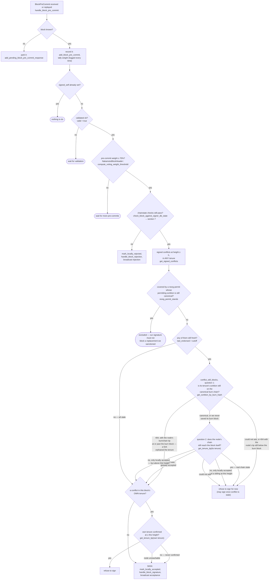
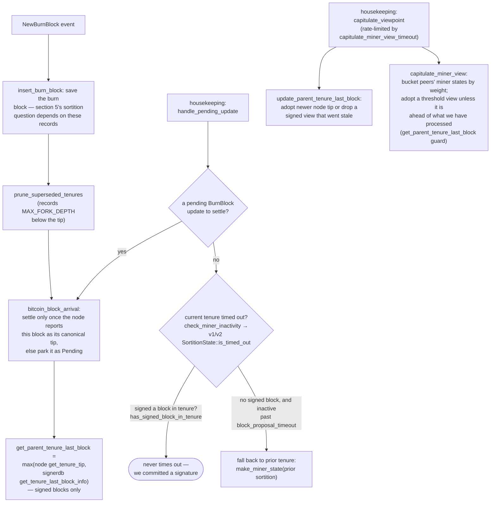

## Missing Re-authorization of the Active Miner at the Pre-Commit → Signature Boundary — ([File: stacks-signer/src/v0/signer.rs])

### Summary
`stacks-signer`'s block-proposal authorization gate (`SortitionsView::check_proposal` in v1, `GlobalStateView::check_proposal` in v2) verifies the proposing miner's authorization — pubkey-hash match against the winning/active miner, tenure/consensus-hash match, and miner-timeout/validity status — only at proposal arrival [1](#0-0) . The re-validation performed later, at the moment a signature is actually about to be produced (when the ≥70% pre-commit threshold is crossed), calls `check_block_against_signer_db_state`, which only re-checks tenure/chain-continuity (`check_tenure_change_confirms_parent` / `check_latest_block_in_tenure`) and never re-runs the miner-authorization checks [2](#0-1) .

### Finding Description
The signer's authorization model for "is this miner allowed to produce this block" is enforced by `check_proposal`, which checks `current_miner_pkh` (v2) / sortition miner status and pubkey-hash match (v1), the consensus hash / tenure id, and (in v1) whether the current or last sortition's miner has already timed out (`SortitionState::is_timed_out`) [3](#0-2) [4](#0-3) .

That gate only runs at proposal arrival (`handle_block_proposal` → `check_block_against_state`) and at re-proposal (`should_reevaluate_block`) [5](#0-4) . The signer then waits — potentially for a long time, since pre-commits trickle in from the whole signer set — for pre-commit weight to cross the 70% threshold before producing its own signature in `handle_block_pre_commit` [6](#0-5) . Immediately before signing, the only re-validation performed is `check_block_against_signer_db_state`, whose own doc-comment warns it is "an incomplete check" that must only be called *after* `check_proposal` has already run [7](#0-6)  — but nothing re-establishes that the authorization `check_proposal` originally granted is still valid. The function's body only calls `check_tenure_change_confirms_parent`/`check_latest_block_in_tenure`, i.e. chain-continuity checks, and never re-checks the miner pubkey hash, the active-miner tenure id, or whether the miner has since been marked invalid/timed-out [8](#0-7) .

This is explicitly acknowledged in the project's own documentation as a class of check that only runs at proposal time and never again: "the v2 `check_proposal` wrapper checks miner pubkey hash, consensus hash, the pox bitvec, and tenure-extend rules before delegating here" and that gap is only partially covered ("Because the duplicate check never runs again, a block that crosses the pre-commit threshold long after it was proposed relies on section 5's own-tenure conflict guard to cover the same ground") [9](#0-8) . The own-tenure conflict guard in `handle_block_pre_commit` only protects against signing a *second, conflicting* block at the same height — it does nothing to re-verify that the *specific miner* who proposed the pending block is still the one the signer's state machine currently recognizes as authorized [10](#0-9) .

Because `block_proposal_timeout`-driven miner invalidation (`is_timed_out` / `check_miner_inactivity`, which flips `SortitionMinerStatus`/`MinerState` to invalid) happens independently on the housekeeping tick, not gated on any particular block's pre-commit progress [11](#0-10) , there is a real window in which: (1) a miner's proposal is validated and pre-commits begin accumulating; (2) the signer's local state machine subsequently marks that miner invalid/timed-out due to slow pre-commit gossip propagation; (3) pre-commit weight nonetheless crosses 70% (because pre-commits sent before the timeout are still counted, and `check_block_against_signer_db_state` performs no miner-authorization recheck); and (4) the signer proceeds to sign under `SIGN: mark_locally_accepted, handle_block_signature` for a miner it has already stopped viewing as authorized [12](#0-11) .

### Impact Explanation
This breaks the equality the protocol is supposed to guarantee — "signed vs validated" and "approved-parent vs canonical/authorized miner." A signer can end up producing a signature for a block from a miner whose authorization it has locally revoked (timed out/invalidated), because the last-chance re-check before signing narrows the authorization gate down to chain-continuity only and drops the miner-identity/timeout re-verification that `check_proposal` originally performed.

### Likelihood Explanation
Triggering the timing window requires only ordinary network/gossip delay in pre-commit propagation relative to `block_proposal_timeout` — no majority-key compromise, node access, or auth_token is needed, and the only actor that needs to be adversarial is the timing of message delivery around a single miner's slot, which is within the "one-slot miner plus gossip" trigger surface described by the scan rules.

### Recommendation
Re-run the full miner-authorization portion of `check_proposal` (pubkey-hash match, tenure id match, and current miner-timeout/validity status) inside `check_block_against_signer_db_state`, or otherwise gate the sign step in `handle_block_pre_commit` on a fresh authorization check against the signer's current `MinerState`/`SortitionMinerStatus`, not just tenure-continuity.

### Proof of Concept
1. Miner M proposes block B; signer validates it and `check_proposal` passes (M is the recognized active miner).
2. M's pre-commit-round messages to some signers are delayed by gossip/network jitter beyond `block_proposal_timeout`.
3. The signer's independent housekeeping tick (`check_miner_inactivity`) marks M's tenure/sortition invalid (`SortitionMinerStatus::InvalidatedBeforeFirstBlock` / `MinerState::NoValidMiner`) before B's pre-commit weight reaches 70%.
4. Delayed pre-commits arrive and push weight over the 70% threshold; `handle_block_pre_commit` calls `check_block_against_signer_db_state`, which only checks tenure continuity (passes) and never re-checks M's now-invalid miner status.
5. The signer signs B anyway [13](#0-12) .

### Citations

**File:** stacks-signer/src/chainstate/v2.rs (L119-163)
```rust
        let MinerState::ActiveMiner {
            current_miner_pkh,
            tenure_id,
            parent_tenure_id,
            ..
        } = &self.signer_state.current_miner
        else {
            info!(
                "No valid current miner. Considering invalid.";
                "block_height" => block.header.chain_length,
                "signer_signature_hash" => %block.header.signer_signature_hash()
            );
            return Err(RejectReason::InvalidMiner);
        };
        if &block.header.consensus_hash != tenure_id {
            info!("Miner block proposal consensus hash does not match the current miner's tenure id. Considering invalid.";
                "block_height" => block.header.chain_length,
                "signer_signature_hash" => %block.header.signer_signature_hash(),
                "block_consensus_hash" => %block.header.consensus_hash,
                "active_miner_tenure_id" => %tenure_id,
                "active_miner_parent_tenure_id" => %parent_tenure_id,
            );
            return Err(RejectReason::ConsensusHashMismatch {
                actual: block.header.consensus_hash.clone(),
                expected: tenure_id.clone(),
            });
        }
        let Some(miner_pk) = block.header.recover_miner_pk() else {
            warn!("Failed to recover miner pubkey";
                  "signer_signature_hash" => %block.header.signer_signature_hash(),
                  "consensus_hash" => %block.header.consensus_hash);
            return Err(RejectReason::IrrecoverablePubkeyHash);
        };
        let miner_pkh = Hash160::from_data(&miner_pk.to_bytes_compressed());
        if current_miner_pkh != &miner_pkh {
            warn!(
                "Miner block proposal pubkey does not match the winning pubkey hash for its sortition. Considering invalid.";
                "proposed_block_consensus_hash" => %block.header.consensus_hash,
                "signer_signature_hash" => %block.header.signer_signature_hash(),
                "proposed_block_pubkey" => &miner_pk.to_hex(),
                "proposed_block_pubkey_hash" => %miner_pkh,
                "active_miner_pubkey_hash" => %current_miner_pkh,
            );
            return Err(RejectReason::PubkeyHashMismatch);
        }
```

**File:** stacks-signer/src/v0/signer.rs (L1250-1367)
```rust
    /// Handle pre-commit message from another signer
    fn handle_block_pre_commit(
        &mut self,
        stacks_client: &StacksClient,
        sortition_state: &mut Option<SortitionsView>,
        stacker_address: &StacksAddress,
        block_hash: &Sha512Trunc256Sum,
    ) {
        let Some(mut block_info) = self.block_lookup_by_reward_cycle(block_hash) else {
            // A pre-commit for a block we have not seen proposed yet means the proposal
            // has not reached us. Log it at INFO: it is a direct signal that our view of
            // the proposal stream is behind the rest of the signer set.
            info!("{self}: Received block pre-commit for an unknown block, storing as pending";
                "signer_address" => %stacker_address,
                "signer_signature_hash" => %block_hash,
                "signer_weight" => self.signer_weights.get(stacker_address).copied().unwrap_or(0),
            );
            if let Err(e) = self
                .signer_db
                .add_pending_block_pre_commit_response(block_hash, stacker_address)
            {
                warn!("{self}: Failed to save pending block pre-commit response: {e:?}");
            }
            return;
        };
        // Always save the pre-commit - we will need to store signer responses for determining which
        // are misbehaving, offline, etc.
        // commit message is from a valid sender! store it
        self.signer_db
            .add_block_pre_commit(block_hash, stacker_address)
            .unwrap_or_else(|_| panic!("{self}: Failed to save block pre-commit"));

        let block_hash = block_info.block.header.signer_signature_hash();
        // do we have enough pre-commits to reach consensus?
        // i.e. is the threshold reached?
        //
        // Tally this up front, before the early returns below, so that every pre-commit we
        // receive can be logged with the running weight. Crossing this threshold is what
        // triggers our block response, so without it the wait for the threshold, which can
        // be minutes and is the bulk of a stalled block's latency, leaves no trace at all.
        let committers = self
            .signer_db
            .get_block_pre_committers(&block_hash)
            .unwrap_or_else(|_| panic!("{self}: Failed to load block commits"));

        let commit_weight = self.compute_signature_signing_weight(committers.iter());
        let total_weight = self.compute_signature_total_weight();

        let min_weight = NakamotoBlockHeader::compute_voting_weight_threshold(total_weight)
            .unwrap_or_else(|_| {
                panic!("{self}: Failed to compute threshold weight for {total_weight}")
            });

        info!("{self}: Received block pre-commit";
            "signer_address" => %stacker_address,
            "signer_signature_hash" => %block_hash,
            "consensus_hash" => %block_info.block.header.consensus_hash,
            "block_height" => block_info.block.header.chain_length,
            "signer_weight" => self.signer_weights.get(stacker_address).copied().unwrap_or(0),
            "pre_commit_weight" => commit_weight,
            "pre_commit_weight_required" => min_weight,
            "total_weight" => total_weight,
            "pre_commit_threshold_reached" => commit_weight >= min_weight,
            "already_signed" => block_info.signed_self.is_some(),
        );

        if block_info.signed_self.is_some() {
            debug!(
                "{self}: Received pre-commit for a block that we have already signed. Doing nothing...",
            );
            return;
        }

        if !block_info.valid.unwrap_or(false) {
            // We received a pre-commit for a block that we have not validated or we have already marked this block as invalid.
            // We should not do anything further as we do not know what our response should be and we do not change our votes on rejected
            // blocks unless we receive a new block proposal for it and the reject reason allows us to reconsider.
            debug!(
                "{self}: Received a pre-commit for a block that we have not determined to be valid: {:?}. Doing nothing...", block_info.valid
            );
            return;
        }

        if min_weight > commit_weight {
            debug!(
                "{self}: Not enough pre-committed to block {block_hash} (have {commit_weight}, need at least {min_weight}/{total_weight})"
            );
            return;
        }

        // The chain and signer db state may have changed materially since this block passed the
        // proposal-time checks (e.g. between validation and reaching the pre-commit threshold we
        // may have signed a block that this one would reorg). Re-run the chainstate checks
        // before putting a signature over the block, and respond with a rejection if they no
        // longer pass, just as the block validation response handler does.
        if let Some(block_rejection) =
            self.check_block_against_signer_db_state(stacks_client, &block_info.block)
        {
            warn!(
                "{self}: Reached the pre-commit threshold for a block, but it no longer passes the chainstate checks. Rejecting.";
                "signer_signature_hash" => %block_hash,
                "block_height" => block_info.block.header.chain_length,
                "reject_code" => %block_rejection.reason_code,
                "reject_reason" => &block_rejection.reason,
            );
            if let Err(e) = block_info.mark_locally_rejected() {
                if !block_info.has_reached_consensus() {
                    warn!("{self}: Failed to mark block as locally rejected: {e:?}");
                }
            };
            self.signer_db
                .insert_block(&block_info)
                .unwrap_or_else(|e| self.handle_insert_block_error(e));
            self.handle_block_rejection(&block_rejection, sortition_state);
            self.send_block_response(&block_info.block, block_rejection.into());
            return;
        }

```

**File:** stacks-signer/src/v0/signer.rs (L1368-1466)
```rust
        // A pre-commit may be superseded by a competing proposal at the same height (e.g. a
        // re-proposed tenure-start block after the first failed to reach consensus), but a
        // signature must not be superseded while it's still "fresh". A signed block at the
        // same or higher height in ANY tenure is a conflict: two blocks at the same height are
        // siblings no matter which tenure they belong to (e.g. the next tenure's tenure-start
        // block conflicts with the current tenure's block at the same height). Blocks in
        // tenures whose reorg we sanctioned under the reorg-timing rules are excluded, but
        // only while the sortition the permit was granted to is still canonical
        // (`check_parent_tenure_choice` records the permit, `reorg_permit_stands` re-derives
        // its validity from the node); every other question about whether a conflict is
        // still live is derived from the node in `conflict_still_blocks`.
        //
        // Unlike the chainstate check above, a refusal here is "for now" rather than a
        // broadcast rejection: a later pre-commit re-evaluation may still sign the block once
        // the conflicting signature has gone stale.
        let conflicts = match self
            .signer_db
            .get_signed_conflicts(block_info.block.header.chain_length, &block_hash)
        {
            Ok(conflicts) => conflicts,
            Err(e) => {
                warn!("{self}: Failed to query the signed blocks. Refusing to sign block {block_hash}: {e:?}");
                return;
            }
        };
        let freshness_cutoff = get_epoch_time_secs().saturating_sub(
            self.proposal_config
                .tenure_last_block_proposal_timeout
                .as_secs(),
        );
        // A fresh signature only blocks while the block it covers could still be part of the
        // chain: see `conflict_still_blocks`, which asks the node whether it is. Check
        // freshness first: it is a local timestamp comparison, while `reorg_permit_stands`
        // and `conflict_still_blocks` each query the node, so stale conflicts cost no
        // round-trips.
        if let Some(conflict) = conflicts.iter().find(|conflict| {
            conflict.last_endorsed > freshness_cutoff
                && !self.reorg_permit_stands(stacks_client, conflict)
                && self.conflict_still_blocks(
                    stacks_client,
                    conflict,
                    block_info.block.header.chain_length,
                )
        }) {
            warn!(
                "{self}: Reached the pre-commit threshold for a block, but we have recently signed or accepted a different block at the same or higher height. Refusing to sign.";
                "signer_signature_hash" => %block_hash,
                "block_height" => block_info.block.header.chain_length,
                "conflicting_signer_signature_hash" => %conflict.signer_signature_hash,
                "conflicting_block_height" => conflict.stacks_height,
                "conflicting_consensus_hash" => %conflict.consensus_hash,
            );
            return;
        }

        // No conflict is both fresh and still live. A conflict that no longer matters, i.e.
        // stale, or provably dead per `conflict_still_blocks`, cannot veto on its own. A
        // stale conflict in another tenure in particular no longer speaks for us: whether this
        // block may replace what another tenure built is settled by the chainstate checks above.
        // A stale conflict in this block's own tenure still blocks if the node already has that
        // tenure at or above the proposed height, since the proposal then duplicates state the
        // node has already built on. (The chainstate checks don't cover this for tenure-change
        // blocks: those check the parent tenure instead of their own.)
        // The permit check is deferred to here so that only same-tenure conflicts pay for it.
        if conflicts.iter().any(|conflict| {
            conflict.consensus_hash == block_info.block.header.consensus_hash
                && !self.reorg_permit_stands(stacks_client, conflict)
        }) {
            match stacks_client.get_tenure_tip(&block_info.block.header.consensus_hash) {
                Ok(tip) => {
                    let tip_height = tip.anchored_header.height();
                    if tip_height >= block_info.block.header.chain_length {
                        warn!(
                            "{self}: Reached the pre-commit threshold for a block that conflicts with previously signed or accepted blocks, and the canonical tip of its tenure is already at or above the proposed height. Refusing to sign.";
                            "signer_signature_hash" => %block_hash,
                            "block_height" => block_info.block.header.chain_length,
                            "canonical_tip_height" => tip_height,
                        );
                        return;
                    }
                }
                Err(e) => {
                    warn!(
                        "{self}: Failed to fetch the canonical tip of the proposed block's tenure: {e:?}. Treating the tenure as unconfirmed.";
                        "signer_signature_hash" => %block_hash,
                        "consensus_hash" => %block_info.block.header.consensus_hash,
                    );
                }
            }
        }
        if !conflicts.is_empty() {
            info!(
                "{self}: Reached the pre-commit threshold for a block that conflicts with previously signed or accepted blocks, but none of those conflicts still blocks it. Signing the replacement.";
                "signer_signature_hash" => %block_hash,
                "block_height" => block_info.block.header.chain_length,
                "num_conflicts" => conflicts.len(),
            );
        }
        // It is only considered globally accepted IFF we receive a new block event confirming it OR see the chain tip of the node advance to it.
```

**File:** stacks-signer/src/v0/signer.rs (L1574-1604)
```rust
    /// Handle block proposal messages submitted to signers stackerdb
    fn handle_block_proposal(
        &mut self,
        stacks_client: &StacksClient,
        sortition_state: &mut Option<SortitionsView>,
        block_proposal: &BlockProposal,
    ) {
        debug!("{self}: Received a block proposal: {block_proposal:?}");
        if block_proposal.reward_cycle != self.reward_cycle {
            // We are not signing for this reward cycle. Ignore the block.
            debug!(
                "{self}: Received a block proposal for a different reward cycle. Ignore it.";
                "requested_reward_cycle" => block_proposal.reward_cycle
            );
            return;
        }

        let signer_signature_hash = block_proposal.block.header.signer_signature_hash();
        let prior_block_info = self.block_lookup_by_reward_cycle(&signer_signature_hash);
        if let Some(block_info) = &prior_block_info {
            // If we have already decided on this block, resend that decision (or ignore
            // the proposal) rather than evaluating it again.
            if !self.should_reevaluate_block(
                stacks_client,
                sortition_state,
                block_info,
                block_proposal,
            ) {
                return;
            }
        }
```

**File:** stacks-signer/src/v0/signer.rs (L1799-1880)
```rust
    /// WARNING: This is an incomplete check. Do NOT call this function PRIOR to check_proposal or block_proposal validation succeeds.
    ///
    /// Re-verify a block's chain length against the last signed block within signerdb.
    /// This is required in case a block has been approved since the initial checks of the block validation endpoint.
    fn check_block_against_signer_db_state(
        &mut self,
        stacks_client: &StacksClient,
        proposed_block: &NakamotoBlock,
    ) -> Option<BlockRejection> {
        let signer_signature_hash = proposed_block.header.signer_signature_hash();
        // If this is a tenure change block, ensure that it confirms the correct number of blocks from the parent tenure.
        if let Some(tenure_change) = proposed_block.get_tenure_change_tx_payload() {
            // Ensure that the tenure change block confirms the expected parent block
            match SortitionData::check_tenure_change_confirms_parent(
                tenure_change,
                proposed_block,
                &mut self.signer_db,
                stacks_client,
                self.proposal_config.tenure_last_block_proposal_timeout,
                self.proposal_config.reorg_attempts_activity_timeout,
            ) {
                Ok(true) => return None,
                Ok(false) => {
                    return Some(self.create_block_rejection(
                        RejectReason::SortitionViewMismatch,
                        proposed_block,
                    ))
                }
                Err(e) => {
                    warn!("{self}: Error checking block proposal: {e}";
                        "signer_signature_hash" => %signer_signature_hash,
                        "block_id" => %proposed_block.block_id()
                    );
                    return Some(self.create_block_rejection(
                        RejectReason::ConnectivityIssues(
                            "error checking block proposal".to_string(),
                        ),
                        proposed_block,
                    ));
                }
            }
        }

        // Ensure that the block is the last block in the chain of its current tenure.
        match SortitionData::check_latest_block_in_tenure(
            &proposed_block.header.consensus_hash,
            proposed_block,
            &mut self.signer_db,
            stacks_client,
            self.proposal_config.tenure_last_block_proposal_timeout,
            self.proposal_config.reorg_attempts_activity_timeout,
        ) {
            Ok(is_latest) => {
                if !is_latest {
                    warn!(
                        "Miner's block proposal does not confirm as many blocks as we expect";
                        "proposed_block_consensus_hash" => %proposed_block.header.consensus_hash,
                        "proposed_block_signer_signature_hash" => %signer_signature_hash,
                        "proposed_chain_length" => proposed_block.header.chain_length,
                    );
                    Some(self.create_block_rejection(
                        RejectReason::SortitionViewMismatch,
                        proposed_block,
                    ))
                } else {
                    None
                }
            }
            Err(e) => {
                warn!("{self}: Failed to check block against signer db: {e}";
                    "signer_signature_hash" => %signer_signature_hash,
                    "block_id" => %proposed_block.block_id()
                );
                Some(self.create_block_rejection(
                    RejectReason::ConnectivityIssues(
                        "failed to check block against signer db".to_string(),
                    ),
                    proposed_block,
                ))
            }
        }
    }
```

**File:** stacks-signer/src/chainstate/v1.rs (L144-163)
```rust
        if self.cur_sortition.miner_status == SortitionMinerStatus::Valid
            && SortitionState::is_timed_out(
                &self.cur_sortition.data.consensus_hash,
                signer_db,
                self.config.block_proposal_timeout,
            )?
        {
            info!(
                "Current miner timed out, marking as invalid.";
                "block_height" => block.header.chain_length,
                "block_proposal_timeout" => ?self.config.block_proposal_timeout,
                "current_sortition_consensus_hash" => ?self.cur_sortition.data.consensus_hash,
            );
            self.cur_sortition.miner_status = SortitionMinerStatus::InvalidatedBeforeFirstBlock;

            // If the current proposal is also for this current
            // sortition, then we can return early here.
            if self.cur_sortition.data.consensus_hash == block.header.consensus_hash {
                return Err(RejectReason::InvalidMiner);
            }
```

**File:** docs/signer-flows.md (L229-268)
```markdown
## 5. Pre-commit threshold → signature

The only place the signer produces a block signature by counting votes.
Pre-commits from peers (and our own) accumulate; at ≥70% weight the signer
decides whether to follow through. Between validation and threshold, we may have
signed a _different_ block at the same height, possibly in another tenure, so
the world must be re-checked before the signature leaves the box.



**File:** docs/signer-flows.md (L425-437)
```markdown
Two things belong to the proposal path only and are **not** re-run at validate-ok
or at signing:

- `validate_tenure_change_payload` rejects with `DuplicateBlockFound` when we
  have already accepted a block in the tenure a tenure-change block is starting.
  v2 counts locally or globally accepted blocks (`get_last_signed_block`); v1
  counts only globally accepted ones (`get_last_globally_accepted_block`).
- the v2 `check_proposal` wrapper checks miner pubkey hash, consensus hash, the
  pox bitvec, and tenure-extend rules before delegating here.

Because the duplicate check never runs again, a block that crosses the pre-commit
threshold long after it was proposed relies on section 5's own-tenure conflict
guard to cover the same ground.
```

**File:** docs/signer-flows.md (L450-470)
```markdown
## 8. Burn blocks & the miner-view state machine

Independent of any single block, the signer maintains a view of _who the current
miner is and what they should build on_, and broadcasts it as a
`StateMachineUpdate`. The whole miner state, including
`parent_tenure_last_block`, is the equality key for global agreement, so what
this flow computes is consensus-visible.


