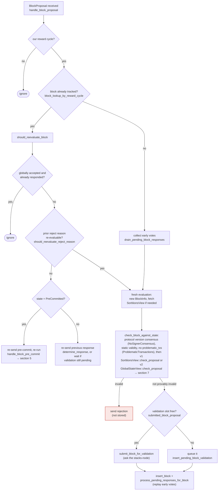

## Finding: Signer weight double-counted across accept/reject tallies in the miner's StackerDB signature collector

### Title
Stale rejection weight is never retracted when a signer flips to acceptance, letting one signer's weight count toward both the rejection and approval tallies - ([File: stacks-node/src/nakamoto_node/stackerdb_listener.rs])

### Summary
The miner-side `StackerDBListener` that tallies signer `BlockResponse`s for a given `signer_signature_hash` uses two independent, never-reconciled counters: `total_weight_rejected` (gated by `responded_signers`) and `total_weight_approved` (gated by `gathered_signatures`). A signer that first rejects and later legitimately re-evaluates and accepts the *same* block (a normal, documented signer-flow event) has its weight added to `total_weight_rejected` once and, on the later acceptance, added again to `total_weight_approved`, with no code path ever removing the earlier rejection weight.

### Finding Description
In `stackerdb_listener.rs`, on `BlockResponse::Accepted`, weight is only added to `total_weight_approved` if the slot is not already in `gathered_signatures`: [1](#0-0) 

On `BlockResponse::Rejected`, weight is added to `total_weight_rejected` only if the slot is newly inserted into `responded_signers`: [2](#0-1) 

Because the accept path's guard (`gathered_signatures`) and the reject path's guard (`responded_signers`) are two separate sets, a signer that rejects first (setting `responded_signers` and adding weight to `total_weight_rejected`) and *then* accepts the same block hash (not yet in `gathered_signatures`) will have its weight added a second time to `total_weight_approved`, without any corresponding subtraction from `total_weight_rejected`.

This reject-then-accept sequence for the *same* `signer_signature_hash` is not hypothetical: the signer's own re-evaluation logic explicitly allows exactly this. `handle_block_proposal`/`should_reevaluate_reject_reason` re-runs a fresh evaluation for a re-proposed (unchanged, same-hash) block when the prior rejection reason is no longer valid, and the signer can go on to sign it: [3](#0-2) 

The rejection weight recorded earlier for that signer is treated in the docs/implementation as a "revocable opinion" from the signer's own state-machine perspective, but the miner's `StackerDBListener` tally has no mechanism to revoke it once counted: [4](#0-3) 

The consuming code in `signer_coordinator.rs` uses these two counters as if they were mutually exclusive partitions of `total_weight`, deciding to abort mining with `SignersRejected` once `total_weight_rejected + weight_threshold > total_weight`: [5](#0-4) 

and separately deciding to accept once `total_weight_approved >= weight_threshold`: [6](#0-5) 

Because a flipped signer's weight is never removed from `total_weight_rejected`, the sum `total_weight_approved + total_weight_rejected` can permanently exceed `total_weight` for a block, and the "> 30% blocking minority" condition can be satisfied purely from stale, superseded rejections even while the genuine, current tally of accepting signers is climbing toward (or has reached) the real 70% threshold.

### Impact Explanation
This is a liveness wedge in the node-side coordinator/StackerDB listener that is explicitly in scope. It does not corrupt the cryptographic safety of the eventually-mined block (final acceptance still requires `NakamotoBlockHeader::verify_signer_signatures` against the real reward-set signatures, which is computed independently from this tally): [7](#0-6) 

but it can cause the miner to declare `SignersRejected` and abandon a block prematurely, based on rejection weight from a signer that has already switched to accepting the exact same block. This stalls the tenure/mining loop until a new proposal round, i.e., a liveness degradation triggered by a single signer's completely normal reject→accept transition (no majority or malicious key needed).

### Likelihood Explanation
The reject→accept transition for the same block hash is a documented, normal occurrence (`should_reevaluate_reject_reason`, stale/timeout-driven re-evaluation), not an edge case requiring attacker control. Any single signer whose earlier rejection reason becomes re-evaluable (e.g., timing/timeout races described in `docs/signer-flows.md` sections 3, 5, 7) can trigger this double count without colluding with other signers.

### Recommendation
Track a single per-slot "current vote" (Accepted/Rejected) instead of two independently-latched sets, and recompute `total_weight_approved`/`total_weight_rejected` by summing only over each signer's *current* recorded vote (updating/overwriting on flip rather than accumulating in both directions). Alternatively, when transitioning to `Accepted` for a slot previously counted in `responded_signers` as `Rejected`, subtract the signer's weight from `total_weight_rejected` before adding it to `total_weight_approved` (and symmetrically for the reverse transition).

### Proof of Concept
1. Miner requests validation of block `B` (`signer_signature_hash = H`), `StackerDBListener` allocates a fresh `BlockStatus` for `H`.
2. Signer `S` (weight `w`) sends `BlockResponse::Rejected` for `H` (e.g., a transient chainstate-check failure). `stackerdb_listener.rs` records `responded_signers.insert(slot_S)` and `total_weight_rejected += w` (lines 515-518).
3. `S`'s prior rejection reason becomes re-evaluable (timeout/stale conflict resolves per `should_reevaluate_reject_reason`), and `S` re-evaluates and signs `B`, broadcasting `BlockResponse::Accepted` for the same `H`.
4. `stackerdb_listener.rs` sees `slot_S` not in `gathered_signatures`, so it adds `total_weight_approved += w` and inserts into `gathered_signatures`/`responded_signers` (lines 443-465). `total_weight_rejected` is left unchanged at its earlier value including `w`.
5. Now `total_weight_approved + total_weight_rejected` includes `w` twice. If other signers' current rejections push `total_weight_rejected` (still containing S's stale `w`) past `total_weight - weight_threshold`, `signer_coordinator.rs` returns `NakamotoNodeError::SignersRejected` (line 537-540) and aborts the block even though `S` is now voting to accept it.

**Uncertainty**: I could not fully confirm from the indexed code whether the `BlockStatus` map entry for hash `H` is ever reset/recreated between the rejection and the later re-proposal round (which would clear the counters) versus reused for the identical hash throughout the round. The documented behavior (`should_reevaluate_reject_reason`, re-proposal producing an unchanged hash) strongly suggests the same `BlockStatus` entry persists, but a Devin session with full repository access should verify the `BlockStatus` lifecycle/allocation site to remove this residual uncertainty before treating this as fully confirmed.

### Citations

**File:** stacks-node/src/nakamoto_node/stackerdb_listener.rs (L443-465)
```rust
                        if !block.gathered_signatures.contains_key(&slot_id) {
                            block.total_weight_approved = block
                                .total_weight_approved
                                .saturating_add(signer_entry.weight);

                            info!("StackerDBListener: Signature Added to block";
                                "signer_signature_hash" => %block_sighash,
                                "signer_pubkey" => signer_pubkey.to_hex(),
                                "signer_slot_id" => slot_id,
                                "signature" => %signature,
                                "signer_weight" => signer_entry.weight,
                                "total_weight_approved" => block.total_weight_approved,
                                "percent_approved" => block.total_weight_approved as f64 / self.total_weight as f64 * 100.0,
                                "total_weight_rejected" => block.total_weight_rejected,
                                "percent_rejected" => block.total_weight_rejected as f64 / self.total_weight as f64 * 100.0,
                                "weight_threshold" => self.weight_threshold,
                                "tenure_extend_timestamp" => tenure_extend_timestamp,
                                "read_count_extend_timestamp" => read_count_extend_timestamp,
                                "server_version" => metadata.server_version,
                            );
                        }
                        block.gathered_signatures.insert(slot_id, signature);
                        block.responded_signers.insert(slot_id);
```

**File:** stacks-node/src/nakamoto_node/stackerdb_listener.rs (L486-518)
```rust
                    SignerMessageV0::BlockResponse(BlockResponse::Rejected(rejected_data)) => {
                        let (lock, cvar) = &*self.blocks;
                        let mut blocks = lock.lock().expect("FATAL: failed to lock block status");

                        let Some(block) = blocks.get_mut(&rejected_data.signer_signature_hash)
                        else {
                            info!(
                                "StackerDBListener: Received rejection for block that we did not request. Ignoring.";
                                "signer_signature_hash" => %rejected_data.signer_signature_hash,
                                "slot_id" => slot_id,
                                "signer_set" => self.signer_set,
                            );
                            continue;
                        };

                        let rejected_pubkey = match rejected_data.recover_public_key() {
                            Ok(rejected_pubkey) => {
                                if rejected_pubkey != signer_pubkey {
                                    warn!("StackerDBListener: Recovered public key from rejected data does not match signer's public key. Ignoring.");
                                    continue;
                                }
                                rejected_pubkey
                            }
                            Err(e) => {
                                warn!("StackerDBListener: Failed to recover public key from rejected data: {e:?}. Ignoring.");
                                continue;
                            }
                        };

                        if block.responded_signers.insert(slot_id) {
                            block.total_weight_rejected = block
                                .total_weight_rejected
                                .saturating_add(signer_entry.weight);
```

**File:** docs/signer-flows.md (L164-203)
```markdown
## 3. A block proposal arrives

The miner broadcasts a proposal. If we've seen this exact block before,
`should_reevaluate_block` decides whether the old verdict stands; a block we
only pre-committed to is deliberately routed back through the pre-commit
evaluation so a re-proposal cannot shortcut to a signature. A fresh proposal is
checked against our view of the world _before_ spending a node validation on it.



Early votes: acceptances, rejections, and pre-commits that arrived before the
proposal itself are parked in pending tables and replayed once the proposal is
known.

> Anchors: `handle_block_proposal`, `should_reevaluate_block`,
> `should_reevaluate_reject_reason`, `check_block_against_state`,
> `submit_block_for_validation`, `process_pending_responses_for_block`
> (signer.rs); `check_proposal` (chainstate/v1.rs, v2.rs)
```

**File:** stacks-signer/src/signerdb.rs (L1496-1510)
```rust
    /// Return whether this signer has signed a block, or observed the signer set sign a block,
    /// in a tenure (identified by its consensus hash). Used by `is_timed_out` to keep a tenure
    /// we are committed to from being timed out.
    ///
    /// Unlike [`SignerDb::has_approved_block_in_tenure`] this excludes blocks that were only
    /// pre-committed. A pre-commit does not put a signature over the block, so it does not
    /// represent a commitment that would be violated by abandoning the tenure.
    ///
    /// Rejection, even global rejection, does NOT clear the commitment. A rejection is a
    /// revocable opinion; a signature is a bearer instrument. Once ours is public, anyone can
    /// aggregate it toward the 70% threshold should enough rejecting signers change their
    /// minds, so a block we signed binds us to its tenure no matter what state it later fell
    /// to. This is deliberately a different predicate from
    /// [`SignerDb::get_last_signed_block`], which answers a tip question rather than a
    /// commitment question (see there).
```

**File:** stacks-node/src/nakamoto_node/signer_coordinator.rs (L509-540)
```rust
            if block_status
                .total_weight_rejected
                .saturating_add(self.weight_threshold)
                > self.total_weight
            {
                info!(
                    "{}/{} signer weight votes to reject block",
                    block_status.total_weight_rejected, self.total_weight;
                    "signer_signature_hash" => %block_signer_sighash,
                );
                counters.bump_naka_rejected_blocks();

                // Only act on failed txids that a blocking minority (>30% weight) agrees on
                let blocking_minority = self.total_weight.saturating_sub(self.weight_threshold);
                let mut temporarily_excluded_txids = HashSet::new();
                let mut permanently_excluded_txids = HashSet::new();
                for (txid, info) in &block_status.failed_txids {
                    if info.total_weight > blocking_minority {
                        // Do not perma ban txids that only a small minority of signers reported as problematic
                        // But make sure its removed from the next block proposal
                        if info.problematic_weight > blocking_minority {
                            permanently_excluded_txids.insert(txid.clone());
                        } else {
                            temporarily_excluded_txids.insert(txid.clone());
                        }
                    }
                }

                return Err(NakamotoNodeError::SignersRejected {
                    temporarily_excluded_txids,
                    permanently_excluded_txids,
                });
```

**File:** stacks-node/src/nakamoto_node/signer_coordinator.rs (L541-545)
```rust
            } else if block_status.total_weight_approved >= self.weight_threshold {
                info!("Received enough signatures, block accepted";
                    "signer_signature_hash" => %block_signer_sighash,
                );
                return Ok(block_status.gathered_signatures.values().cloned().collect());
```

**File:** stackslib/src/chainstate/nakamoto/mod.rs (L1096-1189)
```rust
    #[cfg_attr(test, mutants::skip)]
    pub fn verify_signer_signatures(
        &self,
        reward_set: &RewardSet,
        epoch_id: StacksEpochId,
    ) -> Result<u32, ChainstateError> {
        let message = self.signer_signature_hash();
        let Some(signers) = reward_set.signers() else {
            return Err(ChainstateError::InvalidStacksBlock(
                "No signers in the reward set".to_string(),
            ));
        };

        // if this is a shadow block, then its signing weight is as if every signer signed it, even
        // though the signature vector is undefined.
        if self.is_shadow_block() {
            return Ok(self.get_shadow_signer_weight(reward_set)?);
        }

        let mut total_weight_signed: u32 = 0;
        // `last_index` is used to prevent out-of-order signatures
        let mut last_index = None;
        // Before Epoch 4.0, signature order check contained a bug, so gate the
        // strict ordering behavior on the epoch.
        let strict_order = epoch_id.enforces_strict_signature_order();

        let total_weight = reward_set
            .total_signing_weight()
            .map_err(|_| ChainstateError::NoRegisteredSigners(0))?;

        // HashMap of <PublicKey, (Signer, Index)>
        let mut signers_by_pk: HashMap<_, _> = signers
            .iter()
            .enumerate()
            .map(|(i, signer)| (&signer.signing_key, (signer, i)))
            .collect();

        for signature in self.signer_signature.iter() {
            let public_key = Secp256k1PublicKey::recover_to_pubkey_without_validating_low_s(
                message.bits(),
                signature,
            )
            .map_err(|_| {
                ChainstateError::InvalidStacksBlock(format!(
                    "Unable to recover public key from signature {}",
                    signature.to_hex()
                ))
            })?;

            let mut public_key_bytes = [0u8; 33];
            public_key_bytes.copy_from_slice(&public_key.to_bytes_compressed()[..]);

            let (signer, signer_index) = signers_by_pk.remove(&public_key_bytes).ok_or_else(|| {
                warn!(
                    "Found an invalid public key. Reward set has {} signers. Chain length {}. Signatures length {}",
                    signers.len(),
                    self.chain_length,
                    self.signer_signature.len(),
                );
                ChainstateError::InvalidStacksBlock(format!(
                    "Public key {} not found in the reward set",
                    public_key.to_hex()
                ))
            })?;

            // Enforce order of signatures
            if let Some(index) = last_index.as_ref() {
                if *index >= signer_index {
                    return Err(ChainstateError::InvalidStacksBlock(
                        "Signatures are out of order".to_string(),
                    ));
                }
                if strict_order {
                    last_index = Some(signer_index);
                }
            } else {
                last_index = Some(signer_index);
            }

            total_weight_signed = total_weight_signed
                .checked_add(signer.weight)
                .expect("FATAL: overflow while computing signer set threshold");
        }

        let threshold = Self::compute_voting_weight_threshold(total_weight)?;

        if total_weight_signed < threshold {
            return Err(ChainstateError::InvalidStacksBlock(format!(
                "Not enough signatures. Needed at least {} but got {} (out of {})",
                threshold, total_weight_signed, total_weight,
            )));
        }

        return Ok(total_weight_signed);
```
