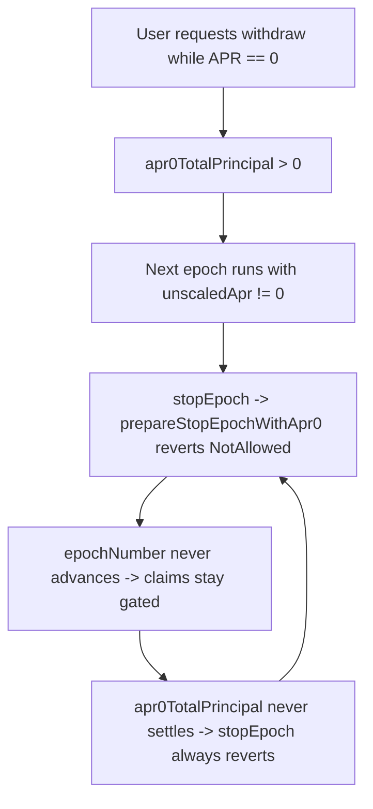

### Title
A single APR0 withdraw request permanently bricks `stopEpoch` once APR is non-zero, freezing all vault funds - (File: contracts/strategies/idle/IdleCreditVault.sol)

### Summary
The Zigbee CVE pattern — a malformed/edge-case message pushes a node into a non-rejoinable state requiring manual recommissioning — maps onto `IdleCreditVault`'s APR0 accounting. An unprivileged user who calls `requestWithdraw` while `unscaledApr == 0` creates a persistent global `apr0TotalPrincipal` bucket that can only be cleared inside `prepareStopEpochWithApr0`. That function unconditionally reverts `NotAllowed` when `unscaledApr != 0`, so if the vault later runs an epoch with a non-zero APR while the bucket is still open, `stopEpoch` can never succeed and no user can settle or claim — the pool is stuck until manual intervention.

### Finding Description
In `requestWithdraw`, when `unscaledApr == 0` the user's request is routed to `_requestWithdrawApr0`, which increments the global `apr0TotalPrincipal` (contracts/strategies/idle/IdleCreditVault.sol:285-286).

`prepareStopEpochWithApr0` — called by the CDO during every `stopEpoch` — contains this guard (contracts/strategies/idle/IdleCreditVault.sol:505-508):

```solidity
// APR0 principal is only valid while APR is 0 for that request lifecycle.
if (unscaledApr != 0) {
  revert NotAllowed();
}
```

The only line that clears the bucket is `apr0TotalPrincipal = 0` at line 540, which sits *after* the revert. The only other decrement path is lazy per-user settlement via `_settleApr0`, which is invoked from `_claimFundedWithdrawRequest` — but claims are gated by `epochNumber <= lastWithdrawRequest[_user]` (line 326), i.e. they require `stopEpoch` to have already run. This creates a circular dependency:



Attack sequence (running epoch, APR0 mode, then honest-APR epoch):

1. Epoch N runs with `unscaledApr == 0` (a supported vault mode — see the `unscaledApr == 0 && !isClosed` branch).
2. Attacker (any KYC-passed tranche holder) deposits/mints and calls `requestWithdraw` for a dust amount (e.g. 1 wei of tranche tokens). `apr0TotalPrincipal` becomes non-zero.
3. The honest manager starts epoch N+1 with a normal non-zero APR — a routine, honest action.
4. At epoch end the manager calls `stopEpoch`; it internally calls `prepareStopEpochWithApr0`, which hits `apr0TotalPrincipal != 0` and `unscaledApr != 0` and reverts `NotAllowed`.
5. Because the revert happens before `apr0TotalPrincipal = 0` (line 540), every subsequent `stopEpoch` reverts identically. No user claim path can advance `epochNumber` or drain the bucket, so the deadlock is self-sustaining on-chain.

### Impact Explanation
All vault funds are frozen: `stopEpoch` is the only way to end the epoch, recall borrower funds, fund `pendingWithdraws` via `collectWithdrawFunds`, and advance `epochNumber` so queued withdrawals/deposits can be claimed. With `stopEpoch` permanently reverting, the entire TVL (active deposits plus all pending withdraw receipts) is locked. If `unscaledApr` can only be changed at epoch boundaries, the freeze is permanent — the epoch can never end to reach a boundary. If a manager setter can force `unscaledApr` back to 0 mid-epoch, recovery requires manual privileged intervention (recommissioning) and the epoch must run to completion at 0% APR, i.e. a forced zero-yield epoch plus a freeze lasting the full remaining `epochDuration`. Quantified loss: 100% of vault TVL frozen for at least one epoch duration, or permanently.

### Likelihood Explanation
Medium-high. Triggering requires only that the vault operate in APR0 mode for one epoch — a supported configuration with dedicated accounting (`apr0Users`, `apr0RateByEpoch`, `prepareStopEpochWithApr0`) — plus one dust `requestWithdraw` from any KYC'd wallet, plus one subsequent honest epoch with non-zero APR. No privileged cooperation, no borrower default, no timing race is needed; the honest manager's routine APR change is what arms the trap, and the attacker has full control over when to plant the dust request. The cost to the attacker is one dust-sized tranche position.

### Recommendation
Do not gate `prepareStopEpochWithApr0` on `unscaledApr == 0`. When APR has become non-zero, finalize the APR0 bucket deterministically instead of reverting: either settle `apr0TotalPrincipal` with zero accrued rate for the current epoch (set `apr0RateByEpoch[epochNumber] = 0` and clear `apr0TotalPrincipal` before the early return), or convert outstanding APR0 principal into normal `withdrawsRequests`/`withdrawsRequestsByEpoch` entries so it flows through the standard funded-claim path. The invariant should be that a user's pending receipt can never make the epoch state machine itself uncallable.

### Proof of Concept
```solidity
// Foundry fork test — place in test/foundry/IdleCreditVault.t.sol style harness
function testApr0RequestBricksStopEpochAfterAprChange() external {
    uint256 amount = 10_000 * ONE_SCALE;
    // configure next epoch with APR = 0
    _setApr(0); // strategy/cdo helper used by existing APR0 tests
    _startEpochAndCheckPrices(0);

    // attacker: dust deposit + dust withdraw request during APR0 epoch
    address attacker = makeAddr('attacker');
    uint256 dust = _depositWithUser(attacker, 1e6, true);
    vm.prank(attacker);
    cdoEpoch.requestWithdraw(dust, address(AAtranche));
    assertGt(strategy.apr0TotalPrincipal(), 0);

    // honest manager ends APR0 epoch and starts a normal-APR epoch
    _stopEpochAndCheckPrices(0, 0, _expectedFundsEndEpoch());
    _setApr(initialProvidedApr); // non-zero APR, routine manager action
    _startEpochAndCheckPrices(1);

    // epoch end: stopEpoch can never succeed again
    vm.warp(cdoEpoch.epochEndDate() + 1);
    _fundBorrowerForRepay(); // borrower fully repays, funds are available
    vm.prank(manager);
    vm.expectRevert(abi.encodeWithSelector(NotAllowed.selector));
    cdoEpoch.stopEpoch(initialProvidedApr, 0);

    // claims remain gated forever because epochNumber cannot advance
    vm.prank(attacker);
    vm.expectRevert(abi.encodeWithSelector(NotAllowed.selector));
    cdoEpoch.claimWithdrawRequest();

    // every retry reverts identically: apr0TotalPrincipal is never cleared
    vm.prank(manager);
    vm.expectRevert(abi.encodeWithSelector(NotAllowed.selector));
    cdoEpoch.stopEpoch(0, 0);
}
```

Note: I verified the revert guard and clearing order at `IdleCreditVault.sol:505-540` and the claim gating at line 326, but could not fully trace whether `unscaledApr` is mutable mid-epoch by the manager; that determines whether the freeze is permanent (APR set only per-epoch) or recoverable-via-intervention (mid-epoch setter exists). Either way the state machine deadlock — user receipt blocking `stopEpoch` — is a broken invariant.