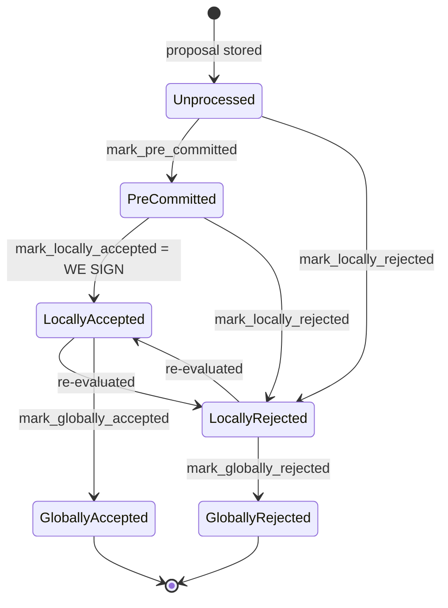

### Title
Vote flip-flop double-counts a single signer's weight in both `total_weight_approved` and `total_weight_rejected` - (File: `stacks-node/src/nakamoto_node/stackerdb_listener.rs`)

### Summary
`StackerDBListener` tracks per-block signer votes in a `BlockStatus` struct with two independently-incremented weight counters, `total_weight_approved` and `total_weight_rejected` [1](#0-0) . These counters are the analog of `idleETH`: they are running totals that must stay consistent with the underlying per-signer response sets, and the miner's threshold decisions (`SignerCoordinator::wait_for_signatures`, or equivalent) trust these aggregates directly rather than re-deriving them from the signer set on every check [2](#0-1) . When a signer's opinion on a block flips (reject then later accept, which the signer-side state machine explicitly allows via `LocallyRejected --> LocallyAccepted` re-evaluation), the listener adds the signer's weight to the new bucket without ever subtracting it from the old one, so a single signer's weight ends up double-counted across both tallies.

### Finding Description
- On `BlockResponse::Rejected`, the listener only guards against re-processing the *same* rejection message from a signer via `responded_signers.insert(slot_id)`; if that insert succeeds (the first time this signer's slot rejects), `total_weight_rejected` is incremented by the signer's weight [3](#0-2) .
- On `BlockResponse::Accepted`, the guard used is `gathered_signatures.contains_key(&slot_id)` — a *different* set from `responded_signers` — so if this same signer's slot later sends an Accepted for the same block (e.g., because the signer re-evaluated its own rejection and moved from `LocallyRejected` to `LocallyAccepted`, per the documented state machine `LocallyRejected --> LocallyAccepted : re-evaluated`), the check `!block.gathered_signatures.contains_key(&slot_id)` is true and `total_weight_approved` is incremented by that same signer's weight [4](#0-3) .
- Nowhere in either branch is the *other* tally decremented, nor is there a check that the signer hasn't already contributed weight to the opposing bucket. `responded_signers` and `gathered_signatures` are separate maps/sets that are each only ever grown, never reconciled against each other.
- As a result, `total_weight_approved + total_weight_rejected` can exceed `total_weight` (the sum of all signer weights), and a signer who flips from reject to accept (or vice versa, if the reverse path exists) contributes weight to both sides of the ledger simultaneously.
- This breaks the "aggregated-weight vs verified-accepts" equality the miner's threshold logic depends on: `total_weight_rejected` is compared directly against `weight_threshold`/`total_weight` to decide whether to abandon the block, and `total_weight_approved` is compared to decide when enough signatures exist to broadcast it [2](#0-1) . Both counters can independently reach their threshold using overlapping (not disjoint) sets of signer weight, which is not a sound representation of "who actually currently endorses/rejects this block."

### Impact Explanation
This does not directly forge a signature or make a signer sign an invalid block by itself — the actual accepted signature set is still separately verified via `Self::compute_voting_weight_threshold` / `verify_signer_signatures` at consensus time using the real `gathered_signatures` map, which is unaffected by the stale rejection weight. So the miner-side listener's inflated `total_weight_rejected` mainly risks a **liveness fault**: the coordinator can incorrectly conclude the 30% rejection threshold has been crossed (`total_weight_rejected.saturating_add(weight_threshold) > total_weight`) using weight that is also being counted toward acceptance, causing the miner to abandon a block proposal that in reality still has enough distinct signer weight to be approved, or to reach the reject threshold prematurely/incorrectly relative to the actual distinct-signer state. This matches the "signer wedged"/"acting on stale/miscounted state" category rather than an invalid-signature-acceptance category, since final block acceptance is still gated by real signature verification in `verify_signer_signatures` [5](#0-4) .

### Likelihood Explanation
Reachable by a single non-majority signer (or slow network causing an honest signer's reject to be superseded by its own later accept), no majority collusion required. The signer-side state machine explicitly documents and permits `LocallyRejected --> LocallyAccepted` transitions on re-evaluation, so this is not a hypothetical trigger but a normal path a single signer can walk through (e.g., initial rejection due to validation-pending/conflict, later marked locally accepted once pre-commit threshold is met and conflicts become stale) [6](#0-5) .

### Recommendation
Track, per slot_id, the single most-recent vote and its weight contribution in one place, and when a signer's vote changes bucket, subtract the previously-counted weight from the old bucket before adding it to the new one — mirroring how `total_weight_rejected`/`total_weight_approved` must always equal the sum of weights of currently-rejecting/currently-accepting distinct slot_ids, never both.

### Proof of Concept
1. Miner proposes block B; `BlockStatus` for B is created with empty `responded_signers`/`gathered_signatures` and zero weights.
2. Signer S (weight w) initially rejects B (e.g., transient validation-pending conflict) and broadcasts `BlockResponse::Rejected`. Listener: `responded_signers.insert(S)` succeeds → `total_weight_rejected += w` [3](#0-2) .
3. S later re-evaluates (conflict becomes stale / pre-commit threshold met) and moves `LocallyRejected -> LocallyAccepted`, broadcasting `BlockResponse::Accepted` with its signature.
4. Listener processes Accepted: `gathered_signatures.contains_key(&S)` is false (S was never in `gathered_signatures`), so `total_weight_approved += w` [4](#0-3) . `total_weight_rejected` is left untouched at its earlier value that already includes w.
5. Now `total_weight_approved + total_weight_rejected` counts S's weight w twice, and if enough other signers are near either threshold, `wait_for_signatures`'s rejection check `total_weight_rejected + weight_threshold > total_weight` [7](#0-6)  can fire using weight that is simultaneously counted toward acceptance, causing the miner to reject a proposal that a correct, disjoint accounting would show as still viable — a liveness wedge on that block proposal.

### Citations

**File:** stacks-node/src/nakamoto_node/stackerdb_listener.rs (L70-82)
```rust
#[derive(Debug, Clone)]
pub struct BlockStatus {
    /// Set of the slot ids of signers who have responded
    pub responded_signers: HashSet<u32>,
    /// Map of the slot id of signers who have signed the block and their signature
    pub gathered_signatures: BTreeMap<u32, MessageSignature>,
    /// Total weight of signers who have signed the block
    pub total_weight_approved: u32,
    /// Total weight of signers who have rejected the block
    pub total_weight_rejected: u32,
    /// Per-txid rejection tracking from signers
    pub failed_txids: HashMap<Txid, FailedTxInfo>,
}
```

**File:** stacks-node/src/nakamoto_node/stackerdb_listener.rs (L443-446)
```rust
                        if !block.gathered_signatures.contains_key(&slot_id) {
                            block.total_weight_approved = block
                                .total_weight_approved
                                .saturating_add(signer_entry.weight);
```

**File:** stacks-node/src/nakamoto_node/stackerdb_listener.rs (L515-518)
```rust
                        if block.responded_signers.insert(slot_id) {
                            block.total_weight_rejected = block
                                .total_weight_rejected
                                .saturating_add(signer_entry.weight);
```

**File:** stacks-node/src/nakamoto_node/signer_coordinator.rs (L509-545)
```rust
            if block_status
                .total_weight_rejected
                .saturating_add(self.weight_threshold)
                > self.total_weight
            {
                info!(
                    "{}/{} signer weight votes to reject block",
                    block_status.total_weight_rejected, self.total_weight;
                    "signer_signature_hash" => %block_signer_sighash,
                );
                counters.bump_naka_rejected_blocks();

                // Only act on failed txids that a blocking minority (>30% weight) agrees on
                let blocking_minority = self.total_weight.saturating_sub(self.weight_threshold);
                let mut temporarily_excluded_txids = HashSet::new();
                let mut permanently_excluded_txids = HashSet::new();
                for (txid, info) in &block_status.failed_txids {
                    if info.total_weight > blocking_minority {
                        // Do not perma ban txids that only a small minority of signers reported as problematic
                        // But make sure its removed from the next block proposal
                        if info.problematic_weight > blocking_minority {
                            permanently_excluded_txids.insert(txid.clone());
                        } else {
                            temporarily_excluded_txids.insert(txid.clone());
                        }
                    }
                }

                return Err(NakamotoNodeError::SignersRejected {
                    temporarily_excluded_txids,
                    permanently_excluded_txids,
                });
            } else if block_status.total_weight_approved >= self.weight_threshold {
                info!("Received enough signatures, block accepted";
                    "signer_signature_hash" => %block_signer_sighash,
                );
                return Ok(block_status.gathered_signatures.values().cloned().collect());
```

**File:** stackslib/src/chainstate/nakamoto/mod.rs (L1096-1189)
```rust
    #[cfg_attr(test, mutants::skip)]
    pub fn verify_signer_signatures(
        &self,
        reward_set: &RewardSet,
        epoch_id: StacksEpochId,
    ) -> Result<u32, ChainstateError> {
        let message = self.signer_signature_hash();
        let Some(signers) = reward_set.signers() else {
            return Err(ChainstateError::InvalidStacksBlock(
                "No signers in the reward set".to_string(),
            ));
        };

        // if this is a shadow block, then its signing weight is as if every signer signed it, even
        // though the signature vector is undefined.
        if self.is_shadow_block() {
            return Ok(self.get_shadow_signer_weight(reward_set)?);
        }

        let mut total_weight_signed: u32 = 0;
        // `last_index` is used to prevent out-of-order signatures
        let mut last_index = None;
        // Before Epoch 4.0, signature order check contained a bug, so gate the
        // strict ordering behavior on the epoch.
        let strict_order = epoch_id.enforces_strict_signature_order();

        let total_weight = reward_set
            .total_signing_weight()
            .map_err(|_| ChainstateError::NoRegisteredSigners(0))?;

        // HashMap of <PublicKey, (Signer, Index)>
        let mut signers_by_pk: HashMap<_, _> = signers
            .iter()
            .enumerate()
            .map(|(i, signer)| (&signer.signing_key, (signer, i)))
            .collect();

        for signature in self.signer_signature.iter() {
            let public_key = Secp256k1PublicKey::recover_to_pubkey_without_validating_low_s(
                message.bits(),
                signature,
            )
            .map_err(|_| {
                ChainstateError::InvalidStacksBlock(format!(
                    "Unable to recover public key from signature {}",
                    signature.to_hex()
                ))
            })?;

            let mut public_key_bytes = [0u8; 33];
            public_key_bytes.copy_from_slice(&public_key.to_bytes_compressed()[..]);

            let (signer, signer_index) = signers_by_pk.remove(&public_key_bytes).ok_or_else(|| {
                warn!(
                    "Found an invalid public key. Reward set has {} signers. Chain length {}. Signatures length {}",
                    signers.len(),
                    self.chain_length,
                    self.signer_signature.len(),
                );
                ChainstateError::InvalidStacksBlock(format!(
                    "Public key {} not found in the reward set",
                    public_key.to_hex()
                ))
            })?;

            // Enforce order of signatures
            if let Some(index) = last_index.as_ref() {
                if *index >= signer_index {
                    return Err(ChainstateError::InvalidStacksBlock(
                        "Signatures are out of order".to_string(),
                    ));
                }
                if strict_order {
                    last_index = Some(signer_index);
                }
            } else {
                last_index = Some(signer_index);
            }

            total_weight_signed = total_weight_signed
                .checked_add(signer.weight)
                .expect("FATAL: overflow while computing signer set threshold");
        }

        let threshold = Self::compute_voting_weight_threshold(total_weight)?;

        if total_weight_signed < threshold {
            return Err(ChainstateError::InvalidStacksBlock(format!(
                "Not enough signatures. Needed at least {} but got {} (out of {})",
                threshold, total_weight_signed, total_weight,
            )));
        }

        return Ok(total_weight_signed);
```

**File:** docs/signer-flows.md (L130-154)
```markdown
## 2. Block lifecycle (`BlockState`)

Every proposal tracked in the signer DB carries a `BlockState`. **`PreCommitted`
carries no signature**: it means "validated, willing to sign if the pre-commit
threshold is met." The first signature appears at `mark_locally_accepted`.
Global states are terminal against each other.



Canonical paths shown; the exact rule in `BlockInfo::check_state` is: either
local state is reachable from anything not yet global, `PreCommitted` only from
`Unprocessed`, and each global state is unreachable from the other.
```
