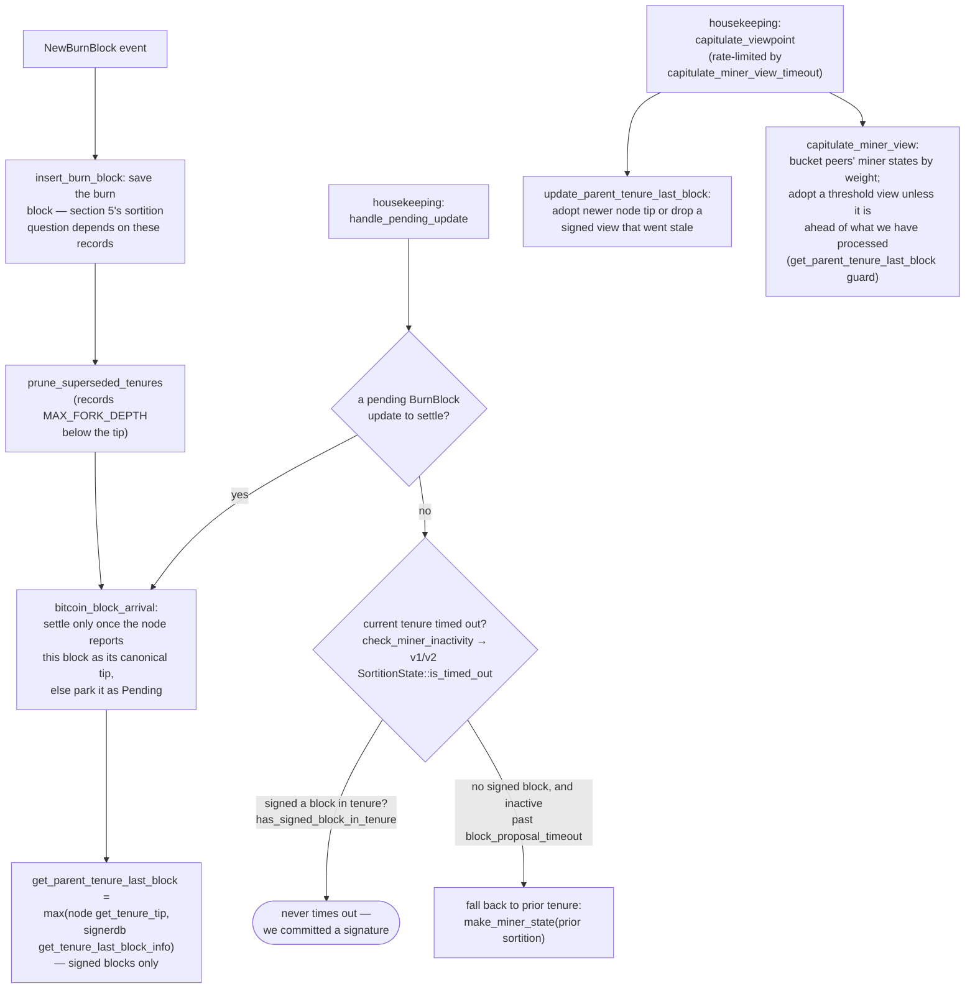

### Title
Global state-machine agreement uses a rounded-down (floor) threshold while block-signature consensus uses a rounded-up (ceiling) threshold, letting `GlobalStateEvaluator` declare "70% agreement" below the real supermajority weight - (File: `libsigner/src/v0/signer_state.rs`)

### Summary
`GlobalStateEvaluator::reached_agreement` computes the 70%-weight supermajority threshold with integer floor division, while the canonical block-signing threshold, `NakamotoBlockHeader::compute_voting_weight_threshold`, computes the same nominal 70% bound with ceiling rounding. For total weights not evenly divisible by 10 these two "70%" caps diverge, so the signer's local miner/burn-view/tx-replay-set state machine can reach "global agreement" on a weight that would *not* satisfy the real supermajority required to sign or accept a block.

### Finding Description
`reached_agreement` in `libsigner/src/v0/signer_state.rs` is defined as: [1](#0-0) 

```rust
pub fn reached_agreement(&self, vote_weight: u32) -> bool {
    u64::from(vote_weight)
        >= u64::from(self.total_weight).strict_mul(NAKAMOTO_SIGNER_BLOCK_APPROVAL_THRESHOLD)
            / 10
}
```

This is a plain floor-division comparison: `vote_weight >= total_weight * 7 / 10`.

The block-signing threshold used everywhere else in the protocol — `verify_signer_signatures`, the v0 signer's pre-commit/signature tallies (`handle_block_pre_commit`, `store_and_process_block_signature`), and the node-side `signer_coordinator.rs` — is `NakamotoBlockHeader::compute_voting_weight_threshold`, which rounds *up*: [2](#0-1) 

For a `total_weight` that is not a multiple of 10 (e.g. `total_weight = 3`), `compute_voting_weight_threshold(3)` returns `3` (100% of weight, since `21/10=2` plus a ceiling `+1`), but `reached_agreement(2)` on the same total weight returns `true` (`2 >= 21/10=2`). So `reached_agreement` can be satisfied with strictly less weight than the real 70% supermajority that protects block signatures.

`reached_agreement` is the sole gate used by `determine_latest_supported_signer_protocol_version`, `determine_global_burn_view`, and `determine_global_state` (which builds the agreed `SignerStateMachine`, i.e. `current_miner`, `burn_block`, `tx_replay_set`, `active_signer_protocol_version`): [3](#0-2) [4](#0-3) 

The docs describe this state as consensus-visible and used by `capitulate_miner_view` to adopt a threshold miner view for the signer's local state machine: [5](#0-4) 

So the same "70%" label is enforced with two different rounding rules in two places that are supposed to represent the identical protocol-level supermajority bound — exactly the "cap not enforced consistently" bug class from the external report (there, `calculateInterestRates()` could exceed `getMaxBorrowRate()`; here, `reached_agreement()` can be satisfied by weight below what `compute_voting_weight_threshold()` would require for the equivalent bound).

### Impact Explanation
This breaks the intended equality between "believed global agreement" (used to pick the current miner view, burn view, tx replay set, and protocol version) and the "verified 70% weight" standard enforced for actual block signing. At specific, naturally-occurring total-weight values (any total weight not a multiple of 10 — the common case, since signer weights are derived from stacked STX and rarely sum to a multiple of 10), a subset of signers whose combined weight is below the real supermajority can cause a signer to adopt a miner/tenure view or tx-replay set as "agreed," even though this weight would not clear the actual 70% bar used for block signatures elsewhere. This matches the High-impact category of "acting on a stale/threshold reward set" - the signer's state machine (which subsequently gates what it proposes/accepts/pre-commits) is driven by a looser threshold than the one that actually secures block acceptance, creating a persistent discrepancy between local state-machine consensus and the real supermajority guarantee.

### Likelihood Explanation
No majority collusion or malicious key access is required — this is a deterministic integer-rounding defect triggered purely by the natural distribution of registered signer weights (any `total_weight` not evenly divisible by 10, which is the common case in practice). It fires automatically inside `reached_agreement` any time the weight bucket for a given view crosses the floor-rounded fraction, without any signer needing to misbehave.

### Recommendation
Make `reached_agreement` (and its complement `reached_disagreement`) use the same ceiling-rounding logic as `NakamotoBlockHeader::compute_voting_weight_threshold`, ideally by sharing one canonical threshold-computation function between `libsigner`/`stacks-signer` and `stackslib`, so that "70% agreement" always means the same weight bound wherever it is checked.

### Proof of Concept
1. Configure three signers with weights `1, 1, 1` (`total_weight = 3`).
2. Two signers (`weight = 2`) broadcast a `StateMachineUpdate` for miner/tenure view `X`; the third signer supports view `Y`.
3. In `GlobalStateEvaluator::determine_global_state`, the accumulated weight for `X` is `2`; `reached_agreement(2)` returns `true` since `2 >= 3*7/10 = 2`, so `X` is adopted as the global state.
4. Meanwhile, `NakamotoBlockHeader::compute_voting_weight_threshold(3)` would require all `3` weight units to satisfy the equivalent 70% bound for an actual block signature/pre-commit tally on the same total weight.
5. The signer has therefore locked in a "global" miner/tenure view supported by weight that would not meet the real supermajority bar used for signing — a concrete divergence between the two threshold computations that are meant to enforce the identical protocol rule.

### Citations

**File:** libsigner/src/v0/signer_state.rs (L56-79)
```rust
    /// Determine what the maximum signer protocol version that a majority of signers can support
    pub fn determine_latest_supported_signer_protocol_version(&self) -> Option<u64> {
        let mut protocol_versions = HashMap::new();
        for (address, update) in &self.address_updates {
            let Some(weight) = self.address_weights.get(address) else {
                continue;
            };
            let entry = protocol_versions
                .entry(update.local_supported_signer_protocol_version)
                .or_insert_with(|| 0);
            *entry += weight;
        }
        // find the highest version number supported by a threshold number of signers
        let mut protocol_versions: Vec<_> = protocol_versions.into_iter().collect();
        protocol_versions.sort_by_key(|(version, _)| *version);
        let mut total_weight_support: u32 = 0;
        for (version, weight_support) in protocol_versions.into_iter().rev() {
            total_weight_support += weight_support;
            if self.reached_agreement(total_weight_support) {
                return Some(version);
            }
        }
        None
    }
```

**File:** libsigner/src/v0/signer_state.rs (L101-101)
```rust
    /// Check if there is an agreed upon global state
```

**File:** libsigner/src/v0/signer_state.rs (L169-175)
```rust
    /// Check if the supplied vote weight crosses the global agreement threshold.
    /// Returns true if it has, false otherwise.
    pub fn reached_agreement(&self, vote_weight: u32) -> bool {
        u64::from(vote_weight)
            >= u64::from(self.total_weight).strict_mul(NAKAMOTO_SIGNER_BLOCK_APPROVAL_THRESHOLD)
                / 10
    }
```

**File:** stackslib/src/chainstate/nakamoto/mod.rs (L1192-1207)
```rust
    /// Compute the threshold for the minimum number of signers (by weight) required
    /// to approve a Nakamoto block.
    pub fn compute_voting_weight_threshold(total_weight: u32) -> Result<u32, ChainstateError> {
        let threshold = NAKAMOTO_SIGNER_BLOCK_APPROVAL_THRESHOLD;
        let total_weight = u64::from(total_weight);
        let ceil = if (total_weight * threshold) % 10 == 0 {
            0
        } else {
            1
        };
        u32::try_from((total_weight * threshold) / 10 + ceil).map_err(|_| {
            ChainstateError::InvalidStacksBlock(
                "Overflow when computing nakamoto block approval threshold".to_string(),
            )
        })
    }
```

**File:** docs/signer-flows.md (L450-470)
```markdown
## 8. Burn blocks & the miner-view state machine

Independent of any single block, the signer maintains a view of _who the current
miner is and what they should build on_, and broadcasts it as a
`StateMachineUpdate`. The whole miner state, including
`parent_tenure_last_block`, is the equality key for global agreement, so what
this flow computes is consensus-visible.


