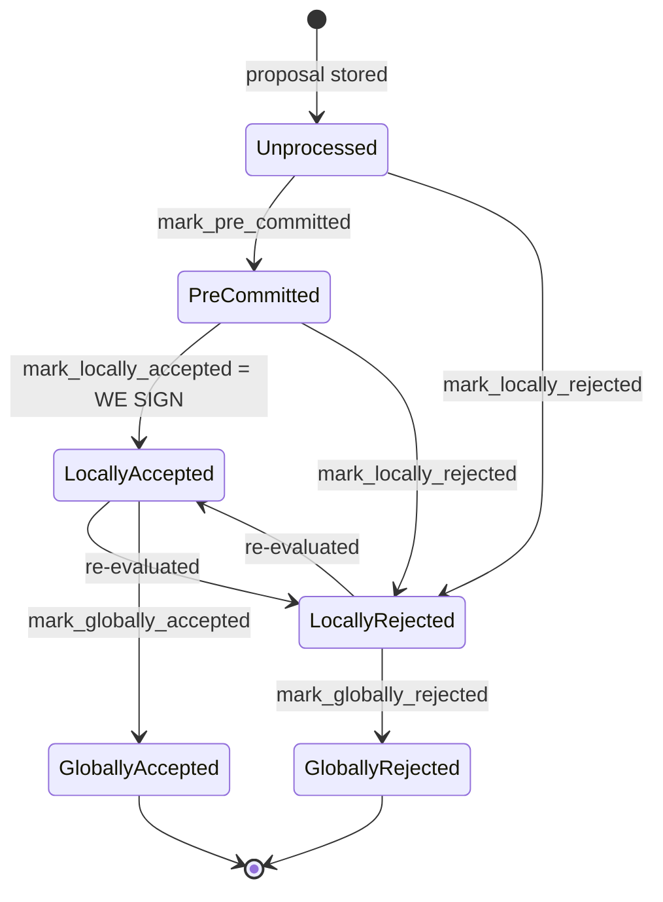
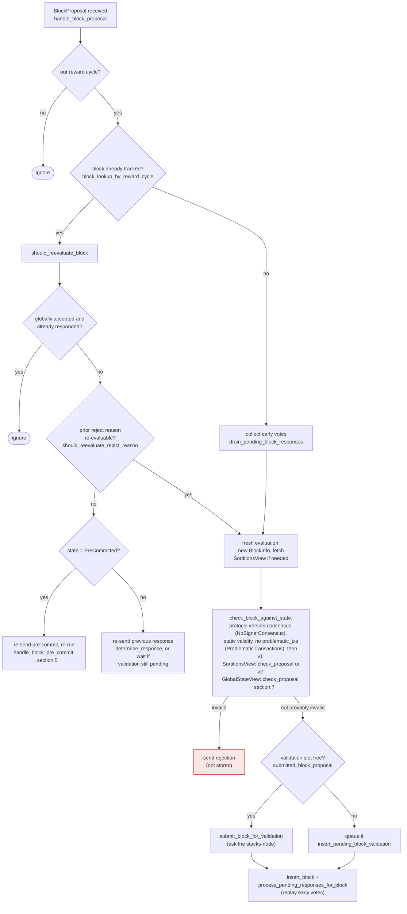

### Title
Stale rejection weight is never retracted when a signer later accepts the same block, letting a single signer's rejection permanently pollute `total_weight_rejected` and trigger a false `SignersRejected` for a block that later reaches real approval - (File: stacks-node/src/nakamoto_node/stackerdb_listener.rs)

### Summary
`StackerDBListener` tracks two independent, monotonically-increasing counters per block, `total_weight_approved` and `total_weight_rejected`, gated by two different idempotency sets (`gathered_signatures` for accepts, `responded_signers` for both). Because a signer's protocol allows moving from `LocallyRejected` back to `LocallyAccepted` for the *same* `signer_signature_hash` when the reject reason becomes re-evaluable, the coordinator can end up counting the *same* signer's weight in `total_weight_rejected` (from the first, stale rejection) forever, even after that signer sends a later `BlockAccepted`/pre-commit for the identical block. Nothing in `handle_...` ever decrements `total_weight_rejected` when a later acceptance for the same slot arrives.

### Finding Description
Per-block bookkeeping lives in `BlockStatus`: [1](#0-0) 

On `BlockResponse::Rejected`, weight is added to `total_weight_rejected` gated only by `responded_signers.insert(slot_id)`: [2](#0-1) 

On `BlockResponse::Accepted` (or an aggregated signature), weight is added to `total_weight_approved` gated by `gathered_signatures.contains_key(&slot_id)`, i.e. a *different* set: [3](#0-2) 

Both branches unconditionally `responded_signers.insert(slot_id)` as well. The two accounting sets are therefore not mutually exclusive: once a slot has rejected, `responded_signers` already contains it, so a *later* rejection message is correctly deduplicated - but a later *acceptance* message from that same slot is still added to `total_weight_approved` (because `gathered_signatures` was empty), while the earlier weight already counted in `total_weight_rejected` is never removed. The block's `total_weight_rejected` retains a stale contribution from a signer that has since switched to approving the exact same block.

This state transition (reject → later accept for the same block) is a normal, protocol-sanctioned path on the signer side, not a signer misbehaving: `handle_block_proposal`'s `should_reevaluate_block` / `should_reevaluate_reject_reason` logic explicitly re-evaluates a previously-rejected block and can move it from `LocallyRejected` back to `LocallyAccepted`, as documented in the block lifecycle: [4](#0-3) [5](#0-4) 

A miner (the one actor a single tenure slot controls) can drive this transition purely by re-proposing/re-broadcasting the same block after conditions that made a signer's earlier rejection reason go stale (e.g. `ConnectivityIssues`, `NoSignerConsensus`, or timing-based reject reasons that are explicitly marked re-evaluable) — no other signer's key, majority, or StackerDB manipulation is required. The miner only needs one honest signer to naturally reject-then-accept the identical `signer_signature_hash`.

The coordinator's threshold-check loop then evaluates: [6](#0-5) 

If enough *other* signers also happen to have contributed a rejection before later approving (or the stale weight from just one large-weight signer plus timeout-driven rejections from others accumulates), `total_weight_rejected` can cross `total_weight - weight_threshold` even though the *current* set of signers, evaluated at the present moment, would clear the 70% approval threshold. The coordinator would then return `NakamotoNodeError::SignersRejected`, discarding a block that is, in the signers' present true state, valid and approved by a supermajority — a liveness break of the "aggregated-weight vs verified-accepts" equality: the rejected-weight aggregate no longer reflects the verified, current set of rejecting signers.

### Impact Explanation
This is a liveness issue rather than an outright safety break: it does not cause a signer to sign an invalid/non-canonical block, nor does it produce a false quorum of *signatures* (the actual `NakamotoBlockHeader::verify_signer_signatures` check on unique signatures in `gathered_signatures` is still correct and mutually exclusive). The damage is that the *coordinator's* rejected-weight tally can retain phantom weight from a signer who has since reversed course, causing the miner/coordinator to prematurely declare `SignersRejected` and discard a tenure's block even when a live supermajority currently supports it. Per the stated impact classes this best matches "a signer wedged into never signing valid blocks" at the coordinator/liveness level: legitimate blocks can be repeatedly forced into `SignersRejected`/timeout cycles by exploiting stale rejection accounting, stalling tenure progress without requiring a signer majority or any signer's private key.

### Likelihood Explanation
Requires no colluding signer key and no majority: only the ordinary, protocol-sanctioned reject→accept transition of at least one signer for the same block (driven entirely by miner-controlled proposal timing/re-proposal, or normal transient node connectivity issues), which the docs confirm is a designed re-evaluation path. Because `total_weight_rejected` is never decremented, this is a strict one-way ratchet: any transient rejection (even for benign reasons like a temporarily-unreachable node, `ConnectivityIssues`, or a stale sortition view) permanently taxes that block's rejected-weight tally.

### Recommendation
Make `total_weight_approved` and `total_weight_rejected` mutually exclusive and correctable per slot: track each signer's *current* vote (accept vs reject) in a single `HashMap<u32, Vote>` instead of two independently-gated counters/sets, and recompute both weight sums from that map (or decrement/move weight between buckets) whenever a signer's vote changes for the same `signer_signature_hash`, rather than only ever adding weight once per set membership.

### Proof of Concept
1. Miner proposes block `B` at height `h`.
2. Signer `S` (weight `w`) evaluates `B`, hits a re-evaluable reject reason (e.g. `ConnectivityIssues` because its local stacks-node RPC briefly failed) and broadcasts `BlockResponse::Rejected` for `B`'s `signer_signature_hash`.
3. `StackerDBListener::handle_...` records this: `responded_signers.insert(S)` succeeds, `total_weight_rejected += w` (`stacks-node/src/nakamoto_node/stackerdb_listener.rs:515-518`).
4. The miner re-proposes/re-broadcasts the identical block `B` (or simply waits for `S`'s own reconnection). `S`'s `handle_block_proposal`/`should_reevaluate_block` logic re-evaluates the now-recoverable reject reason and, since `B` is genuinely valid, transitions to `LocallyAccepted` and broadcasts `BlockResponse::Accepted`/pre-commit for the same hash.
5. `StackerDBListener` handles the acceptance: `gathered_signatures` did not contain `S`, so `total_weight_approved += w` (`stacks-node/src/nakamoto_node/stackerdb_listener.rs:443-465`). `total_weight_rejected` is left at its stale value from step 3 — never reduced.
6. Repeat with enough signers (or with one high-weight signer) so that the stale `total_weight_rejected`, summed with any other transient/legitimate rejections, satisfies `total_weight_rejected.saturating_add(weight_threshold) > total_weight` in `signer_coordinator.rs:509-513`, even though every signer currently holds an `Accepted`/pre-commit state for `B` and the true live approved weight exceeds `weight_threshold`.
7. `wait_for_block_status_response` (or equivalent) returns `Err(NakamotoNodeError::SignersRejected{..})`, discarding a block the live signer set actually approves.

Verification of the underlying accounting asymmetry (two independently-gated, never-reconciled counters) is directly supported by the cited code; full exploit reliability (i.e., how easily a miner can force enough signers through a transient-reject-then-accept cycle for the same hash within one proposal round) would need to be validated against the exact set of `RejectReason` variants `should_reevaluate_reject_reason` treats as re-evaluable, which I could not fully enumerate from the available index — a Devin session with full repo access could confirm the exact reject-reason set and reproduce the timing in an integration test.

### Citations

**File:** stacks-node/src/nakamoto_node/stackerdb_listener.rs (L70-82)
```rust
#[derive(Debug, Clone)]
pub struct BlockStatus {
    /// Set of the slot ids of signers who have responded
    pub responded_signers: HashSet<u32>,
    /// Map of the slot id of signers who have signed the block and their signature
    pub gathered_signatures: BTreeMap<u32, MessageSignature>,
    /// Total weight of signers who have signed the block
    pub total_weight_approved: u32,
    /// Total weight of signers who have rejected the block
    pub total_weight_rejected: u32,
    /// Per-txid rejection tracking from signers
    pub failed_txids: HashMap<Txid, FailedTxInfo>,
}
```

**File:** stacks-node/src/nakamoto_node/stackerdb_listener.rs (L443-465)
```rust
                        if !block.gathered_signatures.contains_key(&slot_id) {
                            block.total_weight_approved = block
                                .total_weight_approved
                                .saturating_add(signer_entry.weight);

                            info!("StackerDBListener: Signature Added to block";
                                "signer_signature_hash" => %block_sighash,
                                "signer_pubkey" => signer_pubkey.to_hex(),
                                "signer_slot_id" => slot_id,
                                "signature" => %signature,
                                "signer_weight" => signer_entry.weight,
                                "total_weight_approved" => block.total_weight_approved,
                                "percent_approved" => block.total_weight_approved as f64 / self.total_weight as f64 * 100.0,
                                "total_weight_rejected" => block.total_weight_rejected,
                                "percent_rejected" => block.total_weight_rejected as f64 / self.total_weight as f64 * 100.0,
                                "weight_threshold" => self.weight_threshold,
                                "tenure_extend_timestamp" => tenure_extend_timestamp,
                                "read_count_extend_timestamp" => read_count_extend_timestamp,
                                "server_version" => metadata.server_version,
                            );
                        }
                        block.gathered_signatures.insert(slot_id, signature);
                        block.responded_signers.insert(slot_id);
```

**File:** stacks-node/src/nakamoto_node/stackerdb_listener.rs (L515-518)
```rust
                        if block.responded_signers.insert(slot_id) {
                            block.total_weight_rejected = block
                                .total_weight_rejected
                                .saturating_add(signer_entry.weight);
```

**File:** docs/signer-flows.md (L130-150)
```markdown
## 2. Block lifecycle (`BlockState`)

Every proposal tracked in the signer DB carries a `BlockState`. **`PreCommitted`
carries no signature**: it means "validated, willing to sign if the pre-commit
threshold is met." The first signature appears at `mark_locally_accepted`.
Global states are terminal against each other.


```

**File:** docs/signer-flows.md (L164-203)
```markdown
## 3. A block proposal arrives

The miner broadcasts a proposal. If we've seen this exact block before,
`should_reevaluate_block` decides whether the old verdict stands; a block we
only pre-committed to is deliberately routed back through the pre-commit
evaluation so a re-proposal cannot shortcut to a signature. A fresh proposal is
checked against our view of the world _before_ spending a node validation on it.



Early votes: acceptances, rejections, and pre-commits that arrived before the
proposal itself are parked in pending tables and replayed once the proposal is
known.

> Anchors: `handle_block_proposal`, `should_reevaluate_block`,
> `should_reevaluate_reject_reason`, `check_block_against_state`,
> `submit_block_for_validation`, `process_pending_responses_for_block`
> (signer.rs); `check_proposal` (chainstate/v1.rs, v2.rs)
```

**File:** stacks-node/src/nakamoto_node/signer_coordinator.rs (L509-545)
```rust
            if block_status
                .total_weight_rejected
                .saturating_add(self.weight_threshold)
                > self.total_weight
            {
                info!(
                    "{}/{} signer weight votes to reject block",
                    block_status.total_weight_rejected, self.total_weight;
                    "signer_signature_hash" => %block_signer_sighash,
                );
                counters.bump_naka_rejected_blocks();

                // Only act on failed txids that a blocking minority (>30% weight) agrees on
                let blocking_minority = self.total_weight.saturating_sub(self.weight_threshold);
                let mut temporarily_excluded_txids = HashSet::new();
                let mut permanently_excluded_txids = HashSet::new();
                for (txid, info) in &block_status.failed_txids {
                    if info.total_weight > blocking_minority {
                        // Do not perma ban txids that only a small minority of signers reported as problematic
                        // But make sure its removed from the next block proposal
                        if info.problematic_weight > blocking_minority {
                            permanently_excluded_txids.insert(txid.clone());
                        } else {
                            temporarily_excluded_txids.insert(txid.clone());
                        }
                    }
                }

                return Err(NakamotoNodeError::SignersRejected {
                    temporarily_excluded_txids,
                    permanently_excluded_txids,
                });
            } else if block_status.total_weight_approved >= self.weight_threshold {
                info!("Received enough signatures, block accepted";
                    "signer_signature_hash" => %block_signer_sighash,
                );
                return Ok(block_status.gathered_signatures.values().cloned().collect());
```
