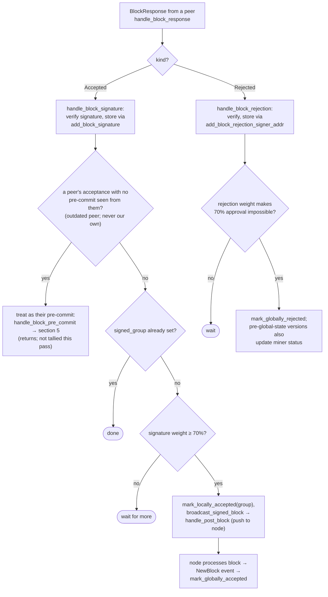

## Finding

### Title
Signer broadcasts a signed block bundle even after its own DB state marks the block `GloballyRejected` — the terminal-state guard is checked but its failure is silently ignored - (File: `stacks-signer/src/v0/signer.rs`)

### Summary
`store_and_process_block_signature` computes the acceptance-signature weight from the raw `block_signatures` table and, once the threshold is reached, calls `block_info.mark_locally_accepted(true)` to update `BlockState`, then unconditionally calls `broadcast_signed_block`. If `mark_locally_accepted` fails — which by design happens whenever the block has already reached `GloballyRejected` or `GloballyAccepted`, per `BlockInfo::check_state` — the error is silently swallowed and the function falls through anyway, pushing the fully assembled signed block to the node and gossiping it. This mirrors the reported bug pattern exactly: a state field ("cancel"/rejection) is correctly computed and would fail an internal check, but the actual externally-visible action (executing the proposal / here, broadcasting the signed block) is not gated on that check succeeding.

### Finding Description
`BlockInfo::check_state`/`move_to` enforce that the two global states are terminal against each other: [1](#0-0) 

`store_and_process_block_signature` uses this guard purely as a bookkeeping step, not as a gate on the irreversible network action: [2](#0-1) 

Note that:
- The error from `mark_locally_accepted` is inspected only to decide whether to `warn!`, not whether to abort.
- `self.signer_db.insert_block(block_info)` is executed unconditionally, persisting whatever `block_info.state` ended up being (still `GloballyRejected` if the transition failed).
- `self.broadcast_signed_block(...)` — the call that assembles the aggregated signature set and hands the block to `handle_post_block` (push to node + StackerDB `BlockPushed` gossip) — is called unconditionally, with no check of `block_info.state` or the outcome of `mark_locally_accepted`.

The only earlier guard in the function is `if block_info.signed_group.is_some() { return; }` — a field that is never set when a block is marked `GloballyRejected` via the rejection path: [3](#0-2) 

So a block that this signer's own `handle_block_rejection`/rejection tally has already driven to `GloballyRejected` (>30% blocking weight) is not excluded from having its independently-tracked `block_signatures` tally re-evaluated later, e.g. by a late-arriving `BlockResponse::Accepted` from a signer that validated/pre-committed before it learned of the rejection, or by a resend routed through the "outdated peer" pre-commit compatibility fallback documented in the flow map: [4](#0-3) 

Because acceptance and rejection weights are accumulated in two entirely separate tables (`block_signatures` vs `block_rejection_signer_addrs`) with no reconciliation against `block_info.state` before the acceptance path runs, this signer can end up recomputing `total_signature_weight ≥ min_weight` from stored signatures alone, well after its own `BlockState` machinery already declared the block dead — and will still gossip a `BlockPushed` message and forward it to its own node for adoption, in direct contradiction to the invariant the state machine exists to enforce ("Global states are terminal against each other").

### Impact Explanation
This is a rejection recounted as an accept at the point that actually matters: the moment the signature bundle leaves the box. A signer whose own bookkeeping has already concluded a block is dead can still push and gossip a signed/`BlockPushed` message for that very block, feeding the node a block its own signer state considers finalized-rejected. This directly matches the "Critical" impact bar: a signer signing/pushing a conflicting or already-rejected block, driven by a rejection tally that gets overridden by an unguarded acceptance tally.

### Likelihood Explanation
No majority collusion is required — only a single stray/late `BlockResponse::Accepted` (from a signer or gossip replay that raced ahead of/behind the rejection tally) needs to arrive after `GloballyRejected` has already been recorded locally, at a moment where the recomputed acceptance-signature weight independently crosses the (unrelated) 70% threshold. This is a plain one-slot/gossip-driven race in existing message-handling code, not a theoretical concern, since the acceptance path performs no `block_info.state`/`has_reached_consensus()` precondition before computing weight and broadcasting.

### Recommendation
In `store_and_process_block_signature`, check `block_info.has_reached_consensus()` (or explicitly `block_info.state == BlockState::GloballyRejected`) immediately after confirming `signed_group.is_none()`, and return early without calling `broadcast_signed_block` if the block has already reached a terminal global state. Additionally, make the `mark_locally_accepted` failure a hard abort of the broadcast path rather than only a conditional `warn!`, so that any future refactor cannot reintroduce the same silent fallthrough.

### Proof of Concept
1. Signer S receives a `BlockProposal` for block `B`, validates it, and issues its own pre-commit/acceptance.
2. A blocking minority (>30% weight) of other signers reject `B`; S processes these via `handle_block_rejection`, and `total_weight_rejected + weight_threshold > total_weight` triggers `mark_globally_rejected()`, persisting `BlockState::GloballyRejected` for `B` in S's `signer_db`.
3. Later, a `BlockResponse::Accepted` for `B` arrives at S from a signer that validated/pre-committed before observing the rejections (or is replayed/gossiped late) and had not previously been counted in S's `block_signatures` table.
4. `handle_block_signature` → `store_and_process_block_signature` runs: `block_info.signed_group` is still `None` (never set on the rejection path), so execution proceeds; the signature is added, and the freshly recomputed `total_signature_weight` from the `block_signatures` table crosses `min_weight`.
5. `block_info.mark_locally_accepted(true)` fails (state is `GloballyRejected`), the error is silently absorbed by the `if !block_info.has_reached_consensus()` guard (which is true here, so no even a warning is logged), and the very next line unconditionally calls `self.broadcast_signed_block(...)`, which assembles the aggregated signatures and calls `handle_post_block`, pushing `B` to the node and gossiping `BlockPushed` — despite S's own signer DB still recording `B` as `GloballyRejected`. [5](#0-4)

### Citations

**File:** stacks-signer/src/signerdb.rs (L313-341)
```rust
    /// Check if the block state transition is valid
    fn check_state(&self, state: BlockState) -> bool {
        let prev_state = &self.state;
        if *prev_state == state {
            return true;
        }
        match state {
            BlockState::Unprocessed => false,
            BlockState::LocallyAccepted | BlockState::LocallyRejected => !matches!(
                prev_state,
                BlockState::GloballyRejected | BlockState::GloballyAccepted
            ),
            BlockState::GloballyAccepted => !matches!(prev_state, BlockState::GloballyRejected),
            BlockState::GloballyRejected => !matches!(prev_state, BlockState::GloballyAccepted),
            BlockState::PreCommitted => matches!(prev_state, BlockState::Unprocessed),
        }
    }

    /// Attempt to transition the block state
    pub fn move_to(&mut self, state: BlockState) -> Result<(), String> {
        if !self.check_state(state) {
            return Err(format!(
                "Invalid state transition from {} to {state}",
                self.state
            ));
        }
        self.state = state;
        Ok(())
    }
```

**File:** stacks-signer/src/v0/signer.rs (L2442-2538)
```rust
    /// Store the block acceptance signature and check if we have reached a consensus decision on the block because of it. If we have, update the block state accordingly and broadcast the block if accepted.
    fn store_and_process_block_signature(
        &mut self,
        stacks_client: &StacksClient,
        sortition_state: &mut Option<SortitionsView>,
        block_info: &mut BlockInfo,
        signer_address: &StacksAddress,
        signature: &MessageSignature,
    ) {
        let block_hash = &block_info.signer_signature_hash();
        // signature is valid! store it.
        // if this returns false, it means the signature already exists in the DB, so just return.
        if !self
            .signer_db
            .add_block_signature(block_hash, signer_address, signature)
            .unwrap_or_else(|_| panic!("{self}: Failed to save block signature"))
        {
            return;
        }

        // If this isn't our own signature and we haven't seen a pre-commit from this signer yet, try treating it as a pre-commit in case the caller is running an outdated version
        if signer_address != &self.stacks_address && !self.signer_db.has_committed(block_hash, signer_address).inspect_err(|e| warn!("Failed to check if pre-commit message already considered for {signer_address:?} for {block_hash}: {e}")).unwrap_or(false) {
            self.handle_block_pre_commit(stacks_client, sortition_state, signer_address, block_hash);
            return;
        }

        if block_info.signed_group.is_some() {
            // We have already processed this block to the accepted state. Adding more signatures will not change anything so nothing to check.
            return;
        }
        // do we have enough signatures to broadcast?
        // i.e. is the threshold reached?
        let signatures = self
            .signer_db
            .get_block_signatures(block_hash)
            .unwrap_or_else(|_| panic!("{self}: Failed to load block signatures"));

        // put signatures in order by signer address (i.e. reward cycle order)
        let addrs_to_sigs: HashMap<_, _> = signatures
            .into_iter()
            .filter_map(|sig| {
                let Ok(public_key) = Secp256k1PublicKey::recover_to_pubkey_without_validating_low_s(
                    block_hash.bits(),
                    &sig,
                ) else {
                    return None;
                };
                let addr = StacksAddress::p2pkh(self.mainnet, &public_key);
                Some((addr, sig))
            })
            .collect();

        let signature_weight = self.signer_weights.get(signer_address).unwrap_or(&0);
        let total_signature_weight = self.compute_signature_signing_weight(addrs_to_sigs.keys());
        let total_weight = self.compute_signature_total_weight();

        let min_weight = NakamotoBlockHeader::compute_voting_weight_threshold(total_weight)
            .unwrap_or_else(|_| {
                panic!("{self}: Failed to compute threshold weight for {total_weight}")
            });

        if min_weight > total_signature_weight {
            info!("{self}: Received block acceptance, but have not yet reached the acceptance threshold.";
                "signer_signature_hash" => %block_hash,
                "signature_weight" => signature_weight,
                "consensus_hash" => %block_info.block.header.consensus_hash,
                "block_height" => block_info.block.header.chain_length,
                "total_weight_approved" => total_signature_weight,
                "total_weight" => total_weight,
                "percent_approved" => (total_signature_weight as f64 / total_weight as f64 * 100.0),
            );
            return;
        }
        info!("{self}: have reached the block acceptance threshold";
            "signer_signature_hash" => %block_hash,
            "signature_weight" => signature_weight,
            "consensus_hash" => %block_info.block.header.consensus_hash,
            "block_height" => block_info.block.header.chain_length,
            "total_weight_approved" => total_signature_weight,
            "total_weight" => total_weight,
            "percent_approved" => (total_signature_weight as f64 / total_weight as f64 * 100.0),
        );

        // have enough signatures to broadcast!
        // move block to LOCALLY accepted state.
        // It is only considered globally accepted IFF we receive a new block event confirming it OR see the chain tip of the node advance to it.
        if let Err(e) = block_info.mark_locally_accepted(true) {
            if !block_info.has_reached_consensus() {
                warn!("{self}: Failed to mark block as locally accepted: {e:?}");
            }
        }
        let _ = self.signer_db.insert_block(block_info).map_err(|e| {
            warn!("Failed to set group threshold signature timestamp for {block_hash}: {e:?}");
            panic!("{self} Failed to write block to signerdb: {e}");
        });
        self.broadcast_signed_block(stacks_client, block_info.block.clone(), &addrs_to_sigs);
    }
```

**File:** docs/signer-flows.md (L357-372)
```markdown

