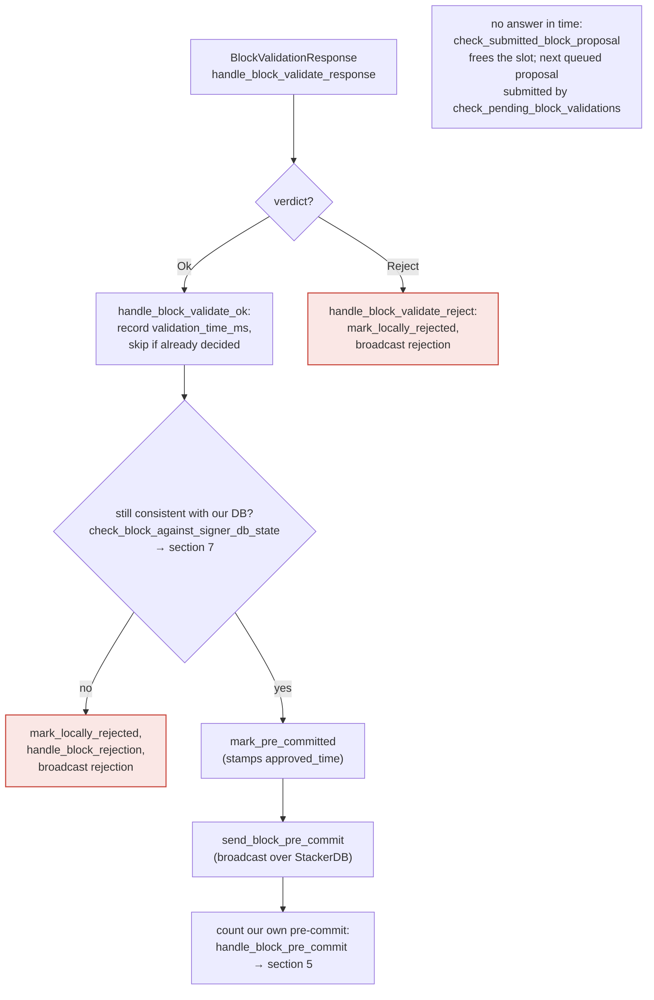
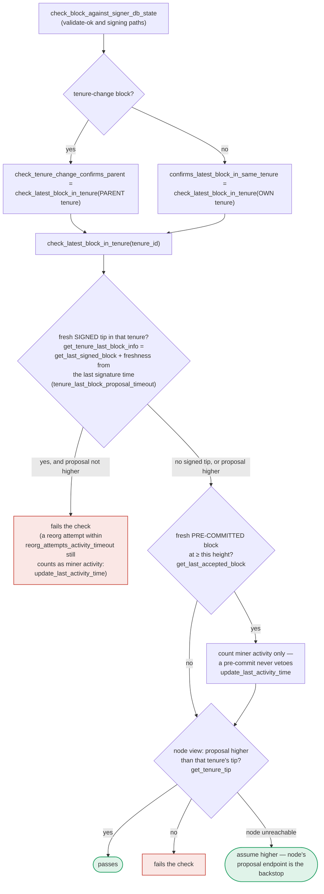

### Title
Stale tenure-extend admissibility check (burn-view / idle-timeout) is evaluated only once at proposal time and never re-verified before the group signature is produced - (File: `stacks-signer/src/chainstate/v1.rs`, `stacks-signer/src/chainstate/v2.rs`)

### Summary
The signer's admissibility check for a `TenureExtend` transaction (`changed_burn_view` and `enough_time_passed` for a full extend, `changed_burn_view` and `enough_time_passed` for a read-count extend) is computed exactly once, at proposal arrival, inside `SortitionsView::check_proposal` / `GlobalStateView::check_proposal`. This is the exact analog of the ConsenSys report's bug class: a value/condition that is a function of *current, mutable, time-dependent chain state* (there: `block.basefee`; here: the canonical burn view and elapsed idle time) is validated once, then relied upon after a real delay, without being re-checked at the moment the irreversible action (fee deduction / block signature) actually happens.

### Finding Description
`check_proposal` in `stacks-signer/src/chainstate/v1.rs:352-403` computes, for a full tenure-extend: [1](#0-0) 

and the equivalent read-count-extend check in `stacks-signer/src/chainstate/v2.rs:252-297`: [2](#0-1) 

Both compute `changed_burn_view` (via `client.get_tenure_tip`) and `enough_time_passed` (via `get_epoch_time_secs()` vs `calculate_full_extend_timestamp`/`calculate_read_count_extend_timestamp`) against the state of the world *at the instant the proposal is first evaluated* (section 3 of the flow docs, "FRESH evaluation"): [3](#0-2) 

The repo's own documentation explicitly states this check is scoped to the proposal path only: [4](#0-3) 

By contrast, the re-check performed at validate-ok time and at the final "one last look" before signing goes through `check_block_against_signer_db_state`, which only re-runs `check_latest_block_in_tenure` (the tip-confirmation logic) — not the tenure-extend timing/burn-view admissibility logic: [5](#0-4) [6](#0-5) 

Between the initial proposal check and the moment the 70% pre-commit threshold is reached and the group signature is produced, real time elapses and the burn chain can advance (a new burn block/sortition can arrive), exactly as the docs note for the general "one last look" problem: [7](#0-6) 

So a `TenureExtend` block whose burn-view/idle-timeout admissibility was true only marginally (e.g., `enough_time_passed` just barely true, or the burn view happened to still match) at first-look time can become stale by sign time — a new burn block can change the canonical burn view underneath it — yet nothing in the pre-commit (`handle_block_pre_commit`) or signing path re-evaluates `changed_burn_view`/`enough_time_passed`. The group can therefore commit a signature to a tenure-extend block whose extend rationale is no longer valid against the current canonical burn view, i.e., a non-canonical/invalid tenure-extend gets signed.

### Impact Explanation
This falls under the Critical impact bucket: a signer (and by extension the group, once ≥70% independently hit the same stale window) signing an invalid/non-canonical block. A `TenureExtend` that no longer reflects the canonical burn view breaks the equality the signer set is supposed to enforce — that a tenure extension is only valid when it truly reflects either a burn-view change or a genuinely elapsed idle timeout at the moment of commitment, not at some earlier proposal-time snapshot.

### Likelihood Explanation
A single miner (one-slot) can trigger the window deterministically: propose the tenure-extend block right as the timing/burn-view condition is satisfied, then rely on ordinary gossip/pre-commit-threshold latency (no majority collusion required) for the burn chain to advance before 70% of pre-commits accumulate. This requires no signer collusion, secp256k1/serde defects, or majority control — only the naturally-occurring propagation delay between proposal and signature that the docs themselves acknowledge exists for every block. Likelihood is comparable to the original report's "relatively high" rating, since it needs only ordinary network timing, not an adversarial majority.

### Recommendation
Re-run the tenure-extend admissibility checks (`changed_burn_view`, `enough_time_passed`, and their v1/v2 equivalents) as part of `check_block_against_signer_db_state`, so they execute both at validate-ok time and immediately before a signature is produced (the "one last look" in section 5), not only once at initial proposal evaluation. Alternatively, cache the burn view/tip snapshot used for the initial check and invalidate/re-validate it if the local burn-block view has changed since that check ran.

### Proof of Concept
1. Miner proposes a `TenureExtend` block at time T0 where `enough_time_passed` is `true` by a slim margin and/or `changed_burn_view` reflects the burn view current at T0 (`stacks-signer/src/chainstate/v1.rs:370-391`).
2. The signer's own node validates it OK; the signer broadcasts a pre-commit (section 4 of `docs/signer-flows.md`).
3. Before 70% of signers' pre-commits accumulate, a new burn block arrives, changing the canonical burn view (`NewBurnBlock` → `insert_burn_block`, `docs/signer-flows.md:458-476`).
4. Pre-commit threshold is reached; per `docs/signer-flows.md:229-236` and `:389-418`, the only re-check performed is `check_latest_block_in_tenure`/tip-confirmation — `changed_burn_view`/`enough_time_passed` for the tenure-extend are never recomputed.
5. The signer signs the block even though, evaluated against the now-current canonical burn view, the tenure-extend condition would fail `check_proposal`'s own logic if run again.

### Citations

**File:** stacks-signer/src/chainstate/v1.rs (L360-391)
```rust
            let sortition_consensus_hash = &proposed_by.state().data.consensus_hash;
            let tenure_tip = client.get_tenure_tip(sortition_consensus_hash)
                .map_err(|e| {
                    warn!("Could not load current tenure tip while evaluating a tenure-extend; cannot approve."; "err" => %e);
                    RejectReason::InvalidTenureExtend
                })?;
            let Some(current_burn_view) = tenure_tip.burn_view else {
                warn!("Tenure-extend attempted in tenure without burn-view.");
                return Err(RejectReason::InvalidTenureExtend);
            };
            let changed_burn_view = tenure_extend.burn_view_consensus_hash != current_burn_view;
            let extend_timestamp = signer_db.calculate_full_extend_timestamp(
                self.config.tenure_idle_timeout,
                block,
                false,
            );
            let epoch_time = get_epoch_time_secs();
            let enough_time_passed = epoch_time >= extend_timestamp;
            let is_in_replay = replay_set.is_some();
            if !changed_burn_view && !enough_time_passed && !is_in_replay {
                warn!(
                    "Miner block proposal contains a tenure extend, but the conditions for allowing a tenure extend are not met. Considering proposal invalid.";
                    "proposed_block_consensus_hash" => %block.header.consensus_hash,
                    "signer_signature_hash" => %block.header.signer_signature_hash(),
                    "extend_timestamp" => extend_timestamp,
                    "epoch_time" => epoch_time,
                    "is_in_replay" => is_in_replay,
                    "changed_burn_view" => changed_burn_view,
                    "enough_time_passed" => enough_time_passed,
                );
                return Err(RejectReason::InvalidTenureExtend);
            }
```

**File:** stacks-signer/src/chainstate/v2.rs (L257-297)
```rust
            // burn view changes are not allowed during read-count tenure extends
            let tenure_tip = client.get_tenure_tip(tenure_id)
                .map_err(|e| {
                    warn!("Could not load current tenure tip while evaluating a tenure-extend; cannot approve."; "err" => %e);
                    RejectReason::InvalidTenureExtend
                })?;
            let Some(current_burn_view) = tenure_tip.burn_view else {
                warn!("Tenure-extend attempted in tenure without burn-view.");
                return Err(RejectReason::InvalidTenureExtend);
            };
            let changed_burn_view = tenure_extend.burn_view_consensus_hash != current_burn_view;
            if changed_burn_view {
                warn!(
                    "Miner block proposal contains a read-count extend, but the conditions for allowing a tenure extend are not met. Considering proposal invalid.";
                    "proposed_block_consensus_hash" => %block.header.consensus_hash,
                    "signer_signature_hash" => %block.header.signer_signature_hash(),
                    "changed_burn_view" => changed_burn_view,
                );
                return Err(RejectReason::InvalidTenureExtend);
            }
            let extend_timestamp = signer_db.calculate_read_count_extend_timestamp(
                self.config.read_count_idle_timeout,
                block,
                false,
            );
            let epoch_time = get_epoch_time_secs();
            let enough_time_passed = epoch_time >= extend_timestamp;
            let is_in_replay = self.signer_state.tx_replay_set.is_some();
            if !enough_time_passed && !is_in_replay {
                warn!(
                    "Miner block proposal contains a read-count extend, but the conditions for allowing a tenure extend are not met. Considering proposal invalid.";
                    "proposed_block_consensus_hash" => %block.header.consensus_hash,
                    "signer_signature_hash" => %block.header.signer_signature_hash(),
                    "extend_timestamp" => extend_timestamp,
                    "epoch_time" => epoch_time,
                    "is_in_replay" => is_in_replay,
                    "changed_burn_view" => changed_burn_view,
                    "enough_time_passed" => enough_time_passed,
                );
                return Err(RejectReason::InvalidTenureExtend);
            }
```

**File:** docs/signer-flows.md (L184-187)
```markdown
    REASON -- yes --> FRESH
    KNOWN -- no --> DRAIN["collect early votes<br/>drain_pending_block_responses"] --> FRESH["fresh evaluation:<br/>new BlockInfo, fetch<br/>SortitionsView if needed"]
    FRESH --> CHECK["check_block_against_state:<br/>protocol version consensus (NoSignerConsensus),<br/>static validity, no problematic_txs<br/>(ProblematicTransactions), then<br/>v1 SortitionsView::check_proposal or<br/>v2 GlobalStateView::check_proposal → section 7"]
    CHECK -- invalid --> REJ["send rejection<br/>(not stored)"]:::bad
```

**File:** docs/signer-flows.md (L211-227)
```markdown


> Anchors: `handle_block_validate_response`, `handle_block_validate_ok`,
> `handle_block_validate_reject`, `check_block_against_signer_db_state`,
> `send_block_pre_commit` (signer.rs)
```

**File:** docs/signer-flows.md (L229-236)
```markdown
## 5. Pre-commit threshold → signature

The only place the signer produces a block signature by counting votes.
Pre-commits from peers (and our own) accumulate; at ≥70% weight the signer
decides whether to follow through. Between validation and threshold, we may have
signed a _different_ block at the same height, possibly in another tenure, so
the world must be re-checked before the signature leaves the box.

```

**File:** docs/signer-flows.md (L389-418)
```markdown
## 7. The chainstate checks (shared)

`check_latest_block_in_tenure` answers "does this block confirm the tip we
expect?" and it runs in three places: at proposal arrival (inside
`check_proposal`), at validate-ok, and at the moment of signing. _Which_ tenure
it is asked about depends on the block: a tenure-change block is checked against
its **parent** tenure, every other block against its **own**. Never both. The
pivotal helper is `get_tenure_last_block_info`, which considers only blocks that
carry a signature (`get_last_signed_block`): a pre-commit never vetoes anything,
it only counts as miner activity.


```

**File:** docs/signer-flows.md (L425-437)
```markdown
Two things belong to the proposal path only and are **not** re-run at validate-ok
or at signing:

- `validate_tenure_change_payload` rejects with `DuplicateBlockFound` when we
  have already accepted a block in the tenure a tenure-change block is starting.
  v2 counts locally or globally accepted blocks (`get_last_signed_block`); v1
  counts only globally accepted ones (`get_last_globally_accepted_block`).
- the v2 `check_proposal` wrapper checks miner pubkey hash, consensus hash, the
  pox bitvec, and tenure-extend rules before delegating here.

Because the duplicate check never runs again, a block that crosses the pre-commit
threshold long after it was proposed relies on section 5's own-tenure conflict
guard to cover the same ground.
```
