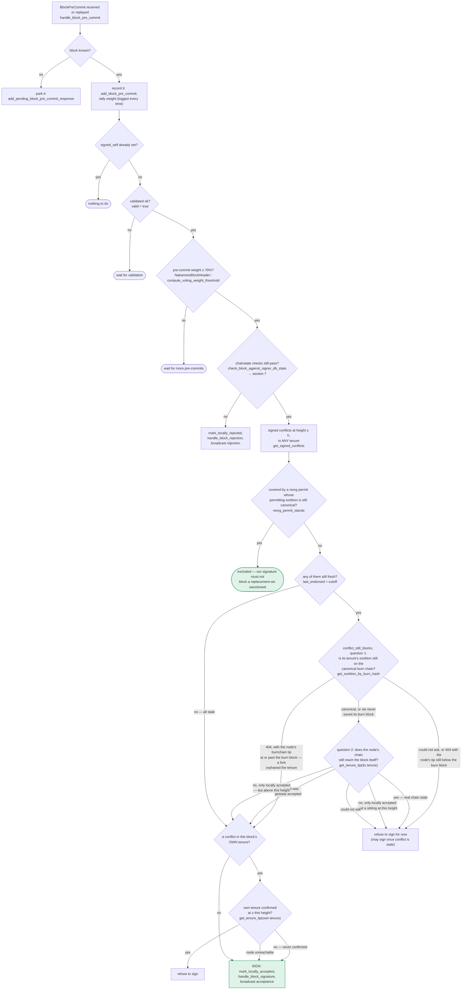

I investigated the described bug class (improper reset/disconnection of an internal callback path, similar to Qt's `reject()`/signal-disconnect crash) against the stacks-signer rejection/response pipeline, since that's the closest analog to "a cancel/reject path leaving stale internal state."

Key areas checked:
- `handle_block_validate_reject` guards against reprocessing a block whose `valid` field is already set, and clears `submitted_block_proposal` before storing the rejection and broadcasting the response. [1](#0-0) 
- `handle_block_rejection` / `store_and_process_block_rejection` validate the signature, authenticate the signer, and de-duplicate stored rejection signatures (`Ok(false) => return`) before tallying rejection weight against the voting threshold. [2](#0-1) 
- The pre-commit/signature path re-validates chainstate and signed conflicts at threshold time rather than trusting a stale cached verdict, which is the state-machine analog of "verifying before acting on a transition." [3](#0-2) 

None of these paths exhibit the crash class described in the report (a cancel/reject handler that skips proper cleanup and leaves an object referencing stale/invalid internal state, causing later logic to act on garbage). The rejection-handling code explicitly checks `block_info.valid.is_some()` before acting, de-duplicates signatures, and re-derives weight from the DB rather than from a possibly-stale in-memory reference. I could not find a reachable path where a single miner or gossiping peer (without a majority of signers) can force a rejection to be recounted as an acceptance, force a signature over an invalid/non-canonical/conflicting block, produce a cross-context-valid signature, or wedge the signer into permanent non-signing — the criteria required by the rules for a valid analog.

No valid analog was found under the given constraints.

### Citations

**File:** stacks-signer/src/v0/signer.rs (L1987-2024)
```rust
    /// Handle the block validate reject response
    fn handle_block_validate_reject(
        &mut self,
        block_validate_reject: &BlockValidateReject,
        sortition_state: &mut Option<SortitionsView>,
    ) {
        crate::monitoring::actions::increment_block_validation_responses(false);
        let signer_signature_hash = &block_validate_reject.signer_signature_hash;
        if self
            .submitted_block_proposal
            .as_ref()
            .map(|(proposal_hash, _)| proposal_hash == signer_signature_hash)
            .unwrap_or(false)
        {
            self.submitted_block_proposal = None;
        }
        let Some(mut block_info) = self.block_lookup_by_reward_cycle(signer_signature_hash) else {
            // We have not seen this block before. Why are we getting a response for it?
            debug!("{self}: Received a block validate response for a block we are not tracking. Ignoring...");
            return;
        };
        if block_info.valid.is_some() {
            // We should only have valid set if we have already processed a validation response for this block OR we locally marked it as rejected.
            // and responded to it. If we received a new proposal for it, we would have reset valid to None.
            warn!(
                "{self}: Already processed a block validate response for block {}. Ignoring validation response.", block_info.block.header.signer_signature_hash(); "valid" => ?block_info.valid,
            );
            return;
        }
        if !block_info.check_static_valid_block() {
            debug!("{self}: Block is syntatically invalid; will not store");
            return;
        }
        if let Err(e) = block_info.mark_locally_rejected() {
            if !block_info.has_reached_consensus() {
                warn!("{self}: Failed to mark block as locally rejected: {e:?}");
            }
        }
```

**File:** stacks-signer/src/v0/signer.rs (L2278-2325)
```rust
        match self.signer_db.add_block_rejection_signer_addr(
            block_hash,
            signer_address,
            reject_reason,
        ) {
            Err(e) => {
                warn!("{self}: Failed to save block rejection signature: {e:?}",);
            }
            Ok(false) => return, // We already have this signature, do not process it again.
            Ok(true) => (),
        }

        if block_info.has_reached_consensus() {
            // Checking the rejection signatures is pointless. We have already reached consensus on this block.
            return;
        }

        // do we have enough signatures to mark a block a globally rejected?
        // i.e. is (set-size) - (threshold) + 1 reached.
        let rejection_addrs = match self.signer_db.get_block_rejection_signer_addrs(block_hash) {
            Ok(addrs) => addrs,
            Err(e) => {
                warn!("{self}: Failed to load block rejection addresses: {e:?}.",);
                return;
            }
        };
        let signature_weight = self.signer_weights.get(signer_address).unwrap_or(&0);
        let total_reject_weight =
            self.compute_signature_signing_weight(rejection_addrs.iter().map(|(addr, _)| addr));
        let total_weight = self.compute_signature_total_weight();

        let min_weight = NakamotoBlockHeader::compute_voting_weight_threshold(total_weight)
            .unwrap_or_else(|_| {
                panic!("{self}: Failed to compute threshold weight for {total_weight}")
            });
        if total_reject_weight.saturating_add(min_weight) <= total_weight {
            // Not enough rejection signatures to make a decision
            info!("{self}: Have not yet received enough block rejections to reach a consensus decision on this block";
                "signer_signature_hash" => %block_hash,
                "signature_weight" => signature_weight,
                "consensus_hash" => %block_info.block.header.consensus_hash,
                "block_height" => block_info.block.header.chain_length,
                "total_weight_rejected" => total_reject_weight,
                "total_weight" => total_weight,
                "percent_rejected" => (total_reject_weight as f64 / total_weight as f64 * 100.0),
            );
            return;
        }
```

**File:** docs/signer-flows.md (L229-269)
```markdown
## 5. Pre-commit threshold → signature

The only place the signer produces a block signature by counting votes.
Pre-commits from peers (and our own) accumulate; at ≥70% weight the signer
decides whether to follow through. Between validation and threshold, we may have
signed a _different_ block at the same height, possibly in another tenure, so
the world must be re-checked before the signature leaves the box.


