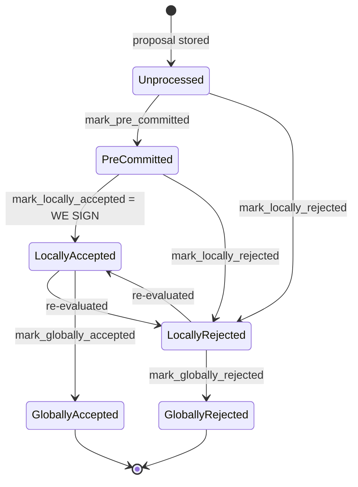

### Title
Stale rejection weight is never retracted on vote-flip, letting the coordinator falsely declare `SignersRejected` for a block that later reaches the real 70% signature threshold - (File: `stacks-node/src/nakamoto_node/stackerdb_listener.rs`)

### Summary
`StackerDBListener` tracks two independent counters per proposed block — `total_weight_approved` (keyed off `gathered_signatures`, a `slot_id -> signature` map) and `total_weight_rejected` (keyed off `responded_signers`, a `slot_id` set). A signer that first rejects and later accepts the *same* block (a state transition the signer state machine explicitly allows: `LocallyRejected --> LocallyAccepted : re-evaluated`, documented in `docs/signer-flows.md:145`) has its weight added to `total_weight_rejected` on the reject message and *also* added to `total_weight_approved` on the later accept message, because the "already counted" guard for rejections is `responded_signers` while the guard for approvals is `gathered_signatures` — two different maps that are never reconciled or retracted against each other.

### Finding Description
In `stackerdb_listener.rs`:
- Accepted path (`stacks-node/src/nakamoto_node/stackerdb_listener.rs:443-465`): weight is added to `total_weight_approved` only `if !block.gathered_signatures.contains_key(&slot_id)`, then `gathered_signatures.insert(slot_id, signature)` and `responded_signers.insert(slot_id)` both run unconditionally.
- Rejected path (`stacks-node/src/nakamoto_node/stackerdb_listener.rs:490-566`): weight is added to `total_weight_rejected` only `if block.responded_signers.insert(slot_id)` (i.e., only the first time that slot is seen in `responded_signers` at all, from *either* message type).

Consequence: if a signer sends **Reject** first, `responded_signers` gets the slot and `total_weight_rejected` is incremented; `gathered_signatures` is untouched. If that same signer later sends **Accept** for the same block (a legitimate, protocol-sanctioned re-evaluation, e.g. after a re-proposal resolves a transient/re-evaluable rejection reason per `should_reevaluate_reject_reason`, `stacks-signer/src/v0/signer.rs:1505-1529`), the Accept handler checks `gathered_signatures` — which does **not** contain the slot — so it adds the weight to `total_weight_approved` as well. The earlier contribution to `total_weight_rejected` is never removed.

`SignCoordinator::wait_for_signatures` (`stacks-node/src/nakamoto_node/signer_coordinator.rs:509-545`) polls this shared state each loop iteration and checks, in order:
1. `total_weight_rejected.saturating_add(weight_threshold) > total_weight` → returns `Err(SignersRejected)` immediately.
2. else `total_weight_approved >= weight_threshold` → returns `Ok(signatures)`.

Because check (1) is evaluated on every message and short-circuits the wait, a set of signers whose *stale* rejection weight crosses the blocking-minority threshold will cause the coordinator to declare the block dead via `NakamotoNodeError::SignersRejected` even though those same signers have since (or concurrently) supplied valid accept signatures that would otherwise cross the real 70% `total_weight_approved` threshold. The two tallies (`aggregated rejected-weight` vs. the `verified accept-set`) are allowed to diverge from the true, current position of each signer.

### Impact Explanation
This breaks the "aggregated-weight vs verified-accepts" equality the coordinator relies on to decide a block's fate: a block that has genuinely reached the 70% real-signature threshold can instead be reported to the miner as globally rejected, because obsolete rejection weight from signers who have since flipped to accept is never retracted. This is a liveness wedge on block production (the miner loop returns `SignersRejected`, forcing a re-propose/backoff cycle) driven purely by ordinary, protocol-sanctioned signer state transitions (reject → re-evaluate → accept) that a single miner can provoke by re-proposing a block after a recoverable rejection reason. It matches the "High" impact class of a wedge that prevents a valid block from being signed/pushed, without requiring a majority of signers or any other signer's key.

### Likelihood Explanation
Reaching this requires only that enough signers (up to just under the ~30% blocking minority) transiently reject and then accept the same block — a realistic sequence given `should_reevaluate_reject_reason`/`should_reevaluate_block` explicitly support and expect reject→accept transitions on re-proposal (`stacks-signer/src/v0/signer.rs:1505-1529`, `docs/signer-flows.md:130-154`). A miner fully controls when and how many times it (re)proposes a block, and transient rejection reasons (timeouts, connectivity issues, stale chain-tip snapshots) are common in normal operation, so this does not need adversarial signer collusion — only ordinary asynchronous timing between validation/proposal rounds.

### Recommendation
Make `total_weight_rejected` and `total_weight_approved` mutually exclusive per slot, or retract a slot's rejection weight when that same slot later supplies a valid accept signature (and vice versa). Concretely: track a single `per-slot last-known verdict` and derive both weight sums from it, or when adding to `gathered_signatures` for a slot previously present in a "rejected slots" set, subtract that slot's weight back out of `total_weight_rejected` before evaluating the `> total_weight` check in `SignCoordinator::wait_for_signatures`.

### Proof of Concept
1. Miner proposes block B; a subset of signers S (weight just under the 30% blocking minority) reject B for a re-evaluable reason (e.g., a transient `ConnectivityIssues`/stale-chainstate rejection), while the remaining signers begin validating.
2. `stackerdb_listener` records these rejections: `total_weight_rejected += weight(S)`, and each slot in S is added to `responded_signers`.
3. Miner re-proposes the identical block (or the condition that caused the rejection clears). Per `should_reevaluate_block`/`should_reevaluate_reject_reason`, signers in S re-evaluate and now send Accepted.
4. In `stackerdb_listener`, since slots in S are not present in `gathered_signatures`, their weight is added to `total_weight_approved` (`total_weight_approved += weight(S)`), while `total_weight_rejected` still retains their earlier contribution.
5. As other signers' accepts arrive, `total_weight_approved` reaches the real 70% threshold — but if `total_weight_rejected` (still inflated by S's stale reject) plus `weight_threshold` exceeds `total_weight` at any polling point before/regardless of the approvals, `SignCoordinator::wait_for_signatures` returns `Err(SignersRejected)` first, wedging a block that legitimately reached consensus.

Note: I was not able to independently execute this scenario in a live cluster (no filesystem/test-runner access here); the trace above is derived directly from the code paths cited. Confirming exact timing/ordering behavior under concurrent message delivery would benefit from an integration-test run in a Devin session with repo access. [1](#0-0) [2](#0-1) [3](#0-2) [4](#0-3) [5](#0-4)

### Citations

**File:** stacks-node/src/nakamoto_node/stackerdb_listener.rs (L443-465)
```rust
                        if !block.gathered_signatures.contains_key(&slot_id) {
                            block.total_weight_approved = block
                                .total_weight_approved
                                .saturating_add(signer_entry.weight);

                            info!("StackerDBListener: Signature Added to block";
                                "signer_signature_hash" => %block_sighash,
                                "signer_pubkey" => signer_pubkey.to_hex(),
                                "signer_slot_id" => slot_id,
                                "signature" => %signature,
                                "signer_weight" => signer_entry.weight,
                                "total_weight_approved" => block.total_weight_approved,
                                "percent_approved" => block.total_weight_approved as f64 / self.total_weight as f64 * 100.0,
                                "total_weight_rejected" => block.total_weight_rejected,
                                "percent_rejected" => block.total_weight_rejected as f64 / self.total_weight as f64 * 100.0,
                                "weight_threshold" => self.weight_threshold,
                                "tenure_extend_timestamp" => tenure_extend_timestamp,
                                "read_count_extend_timestamp" => read_count_extend_timestamp,
                                "server_version" => metadata.server_version,
                            );
                        }
                        block.gathered_signatures.insert(slot_id, signature);
                        block.responded_signers.insert(slot_id);
```

**File:** stacks-node/src/nakamoto_node/stackerdb_listener.rs (L486-518)
```rust
                    SignerMessageV0::BlockResponse(BlockResponse::Rejected(rejected_data)) => {
                        let (lock, cvar) = &*self.blocks;
                        let mut blocks = lock.lock().expect("FATAL: failed to lock block status");

                        let Some(block) = blocks.get_mut(&rejected_data.signer_signature_hash)
                        else {
                            info!(
                                "StackerDBListener: Received rejection for block that we did not request. Ignoring.";
                                "signer_signature_hash" => %rejected_data.signer_signature_hash,
                                "slot_id" => slot_id,
                                "signer_set" => self.signer_set,
                            );
                            continue;
                        };

                        let rejected_pubkey = match rejected_data.recover_public_key() {
                            Ok(rejected_pubkey) => {
                                if rejected_pubkey != signer_pubkey {
                                    warn!("StackerDBListener: Recovered public key from rejected data does not match signer's public key. Ignoring.");
                                    continue;
                                }
                                rejected_pubkey
                            }
                            Err(e) => {
                                warn!("StackerDBListener: Failed to recover public key from rejected data: {e:?}. Ignoring.");
                                continue;
                            }
                        };

                        if block.responded_signers.insert(slot_id) {
                            block.total_weight_rejected = block
                                .total_weight_rejected
                                .saturating_add(signer_entry.weight);
```

**File:** stacks-node/src/nakamoto_node/signer_coordinator.rs (L509-545)
```rust
            if block_status
                .total_weight_rejected
                .saturating_add(self.weight_threshold)
                > self.total_weight
            {
                info!(
                    "{}/{} signer weight votes to reject block",
                    block_status.total_weight_rejected, self.total_weight;
                    "signer_signature_hash" => %block_signer_sighash,
                );
                counters.bump_naka_rejected_blocks();

                // Only act on failed txids that a blocking minority (>30% weight) agrees on
                let blocking_minority = self.total_weight.saturating_sub(self.weight_threshold);
                let mut temporarily_excluded_txids = HashSet::new();
                let mut permanently_excluded_txids = HashSet::new();
                for (txid, info) in &block_status.failed_txids {
                    if info.total_weight > blocking_minority {
                        // Do not perma ban txids that only a small minority of signers reported as problematic
                        // But make sure its removed from the next block proposal
                        if info.problematic_weight > blocking_minority {
                            permanently_excluded_txids.insert(txid.clone());
                        } else {
                            temporarily_excluded_txids.insert(txid.clone());
                        }
                    }
                }

                return Err(NakamotoNodeError::SignersRejected {
                    temporarily_excluded_txids,
                    permanently_excluded_txids,
                });
            } else if block_status.total_weight_approved >= self.weight_threshold {
                info!("Received enough signatures, block accepted";
                    "signer_signature_hash" => %block_signer_sighash,
                );
                return Ok(block_status.gathered_signatures.values().cloned().collect());
```

**File:** stacks-signer/src/v0/signer.rs (L1505-1529)
```rust
        if !should_reevaluate_reject_reason(block_info) {
            if block_info.state == BlockState::PreCommitted {
                // We validated this block but haven't signed it. Signing requires the
                // pre-commit threshold and the conflict checks in `handle_block_pre_commit`.
                // Re-broadcast our pre-commit and re-run that evaluation instead of
                // responding with a signature directly, so a re-proposed block can't
                // bypass those checks.
                info!(
                    "{self}: received a block proposal for a block we have pre-committed to but not signed. Re-evaluating the pre-commit.";
                    "signer_signature_hash" => %signer_signature_hash,
                    "block_id" => %block_info.block.block_id(),
                    "block_height" => block_info.block.header.chain_length,
                    "burn_height" => block_proposal.burn_height,
                    "consensus_hash" => %block_info.block.header.consensus_hash
                );
                self.send_block_pre_commit(signer_signature_hash.clone());
                let address = self.stacks_address.clone();
                self.handle_block_pre_commit(
                    stacks_client,
                    sortition_state,
                    &address,
                    &signer_signature_hash,
                );
                return false;
            }
```

**File:** docs/signer-flows.md (L137-150)
```markdown

```
