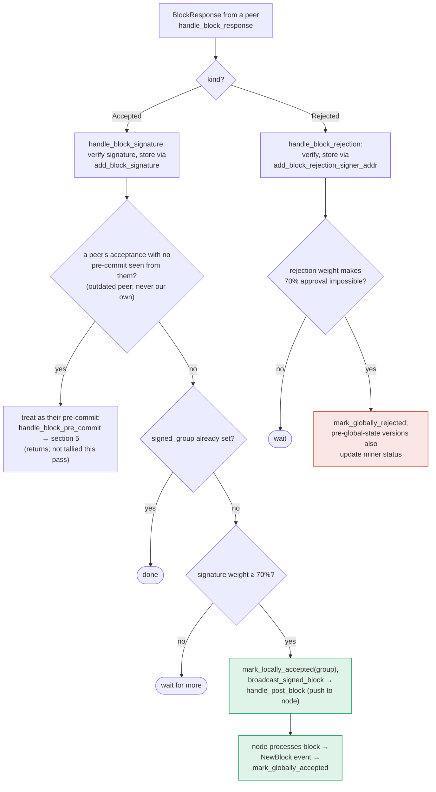

### Title
Peer-signature tallying path (`store_and_process_block_signature`) skips the block-validity and chainstate re-check that the sibling pre-commit path enforces, letting a locally-rejected/unvalidated block be marked `LocallyAccepted` and pushed to the node - ([File: stacks-signer/src/v0/signer.rs])

### Summary
`stacks-signer` has two independent code paths that can cross the signing/acceptance weight threshold and act on it: `handle_block_pre_commit` (triggered by `BlockPreCommit` messages, section 5 of the flow) and `store_and_process_block_signature` (triggered by `BlockResponse::Accepted` messages from peers, section 6). The pre-commit path explicitly gates on `block_info.valid` and re-runs `check_block_against_signer_db_state` before letting the signer sign or broadcast. The signature-tallying path has no such gate at all, and calling `BlockInfo::mark_locally_accepted(true)` (the "group" branch) never reads or resets `self.valid`. This is the same "router bypass" pattern as the referenced Vader finding: one call path enforces validation, a parallel call path that reaches the same state-mutating/broadcasting effect does not.

### Finding Description
`handle_block_pre_commit` explicitly refuses to act on the pre-commit weight tally unless the block has already been validated by this signer: [1](#0-0) 

Only after that gate does it recompute weight, and if the threshold is crossed it re-runs `check_block_against_signer_db_state` (the chainstate/conflict re-check) before signing: [2](#0-1) 

`store_and_process_block_signature`, invoked from `handle_block_signature` (peer `BlockResponse::Accepted`) and also replayed from `process_pending_responses_for_block`, has no equivalent gate. It stores the cryptographically-verified signature, then goes straight to weight accounting and, on reaching threshold, calls `mark_locally_accepted(true)` and broadcasts the block - it never inspects `block_info.valid` and never calls `check_block_against_signer_db_state`: [3](#0-2) 

`BlockInfo::mark_locally_accepted` confirms the asymmetry: when called with `group_signed = true` it only touches `signed_group` and the state machine - it does not read or set `self.valid`, unlike the `group_signed = false` (self-signing) branch which sets `valid = Some(true)`: [4](#0-3) 

The state-machine rule (`check_state`) explicitly permits `LocallyRejected -> LocallyAccepted` ("re-evaluated"), so a block this signer's own node rejected (`mark_locally_rejected` sets `valid = Some(false)` and moves to `LocallyRejected`) can still transition to `LocallyAccepted` via this path: [5](#0-4) [6](#0-5) 

The documentation for this exact code path (section 6, "Responses from other signers") confirms no `valid?` gate is present there, in contrast to section 5's explicit `VALID` decision node: [7](#0-6) [8](#0-7) 

### Impact Explanation
A signer whose own node rejected a block (`RejectReason` such as `SortitionViewMismatch`, `InvalidParentBlock`, `ConnectivityIssues`, etc., set via `handle_block_validate_reject`/`mark_locally_rejected`) retains `block_info.valid == Some(false)` and `state == LocallyRejected`. If enough of the *other* signers' legitimately-signed `BlockAccepted` messages for that same block reach the signer over StackerDB (ordinary gossip/relay, not a majority of malicious keys - just the natural propagation of already-produced valid signatures), `store_and_process_block_signature` will:
1. Accept and store each peer signature (real cryptographic verification, so this part is sound),
2. Recompute total weight and, on crossing the ~70% threshold, unconditionally call `mark_locally_accepted(true)`, silently flipping this signer's local bookkeeping from `LocallyRejected` to `LocallyAccepted` **without ever re-examining `valid`**, and
3. Call `broadcast_signed_block`, actively pushing the block to this signer's own node - the very block this signer's chainstate/state-machine logic had determined should be rejected.

This breaks the "rejection recounted as an accept" invariant explicitly in scope: a decision this signer made (reject) is overwritten and acted upon (accept + broadcast) purely by counting others' weight, bypassing the same `check_block_against_signer_db_state` conflict/reorg re-check that the sibling pre-commit path treats as mandatory before any acceptance/broadcast action. It is the direct structural analog of `BasePool.swap()` lacking the `onlyRouter` gate that `VaderRouter._swap()` enforces: two paths reach the same effect, only one carries the validation.

### Likelihood Explanation
This does not require a majority of colluding signers or any key compromise - only ordinary propagation of `BlockResponse::Accepted` messages that were already validly produced by other signers, arriving after (or interleaved with) this signer's own rejection or pending validation. This is a realistic and previously-acknowledged race in this codebase (the "outdated-peer fallback" and the explicit `WARNING: incomplete check` comment on `check_block_against_signer_db_state` show the authors are aware these orderings are fragile), which raises confidence that the missing `valid` gate in this specific path is an oversight rather than a deliberate simplification.

### Recommendation
Add the same `block_info.valid` check used in `handle_block_pre_commit` to `store_and_process_block_signature` before acting on the aggregated peer weight, and re-run `check_block_against_signer_db_state` before calling `mark_locally_accepted(true)` / `broadcast_signed_block`, mirroring the pre-commit path's re-validation. At minimum, refuse to transition out of `LocallyRejected` via the group-signed branch without first re-confirming the block against current chainstate/signer-db state.

### Proof of Concept
1. Miner proposes block `A` at height `h`. Signer `S` validates `A`, its node returns `Reject`, and `handle_block_validate_reject` calls `mark_locally_rejected` -> `S`'s `BlockInfo` for `A` now has `valid = Some(false)`, `state = LocallyRejected`; `S` broadcasts its own rejection.
2. Enough of the remaining signer weight (≥70%) independently validates and signs `A` (e.g., they raced ahead before a conflicting/competing state change `S` observed), each broadcasting `BlockResponse::Accepted`.
3. `S` receives these `Accepted` messages via `handle_block_response` -> `handle_block_signature` -> `store_and_process_block_signature` [9](#0-8) 
Each passes signature verification (`is_valid_signer`), gets stored via `add_block_signature`, and weight is tallied.
4. Once tallied weight crosses threshold, `store_and_process_block_signature` calls `block_info.mark_locally_accepted(true)` - transitioning `A`'s state for `S` from `LocallyRejected` to `LocallyAccepted` without ever consulting or resetting `valid` - then calls `broadcast_signed_block`, pushing `A` to `S`'s own node, even though `S` had explicitly rejected `A`.
5. This can be replayed identically if the accept messages arrive *before* `S` has any validation result at all (`valid == None`, block not yet tracked/validated), via `process_pending_responses_for_block` -> `store_and_process_block_signature` on the pending-signature queue [10](#0-9) 
again with no `valid` gate, unlike the parallel pending pre-commit replay which routes back through the gated `handle_block_pre_commit`.

### Citations

**File:** stacks-signer/src/v0/signer.rs (L1323-1331)
```rust
        if !block_info.valid.unwrap_or(false) {
            // We received a pre-commit for a block that we have not validated or we have already marked this block as invalid.
            // We should not do anything further as we do not know what our response should be and we do not change our votes on rejected
            // blocks unless we receive a new block proposal for it and the reject reason allows us to reconsider.
            debug!(
                "{self}: Received a pre-commit for a block that we have not determined to be valid: {:?}. Doing nothing...", block_info.valid
            );
            return;
        }
```

**File:** stacks-signer/src/v0/signer.rs (L1340-1366)
```rust
        // The chain and signer db state may have changed materially since this block passed the
        // proposal-time checks (e.g. between validation and reaching the pre-commit threshold we
        // may have signed a block that this one would reorg). Re-run the chainstate checks
        // before putting a signature over the block, and respond with a rejection if they no
        // longer pass, just as the block validation response handler does.
        if let Some(block_rejection) =
            self.check_block_against_signer_db_state(stacks_client, &block_info.block)
        {
            warn!(
                "{self}: Reached the pre-commit threshold for a block, but it no longer passes the chainstate checks. Rejecting.";
                "signer_signature_hash" => %block_hash,
                "block_height" => block_info.block.header.chain_length,
                "reject_code" => %block_rejection.reason_code,
                "reject_reason" => &block_rejection.reason,
            );
            if let Err(e) = block_info.mark_locally_rejected() {
                if !block_info.has_reached_consensus() {
                    warn!("{self}: Failed to mark block as locally rejected: {e:?}");
                }
            };
            self.signer_db
                .insert_block(&block_info)
                .unwrap_or_else(|e| self.handle_insert_block_error(e));
            self.handle_block_rejection(&block_rejection, sortition_state);
            self.send_block_response(&block_info.block, block_rejection.into());
            return;
        }
```

**File:** stacks-signer/src/v0/signer.rs (L1765-1780)
```rust
        let block_id = block_info.block.block_id();
        for (stackers_address, signature) in pending_responses.signatures {
            debug!("{self}: Processing pending signature.";
                "stacker_address" => %stackers_address,
                "signer_signature_hash" => %signer_signature_hash,
                "block_id" => %block_id,
            );
            self.store_and_process_block_signature(
                stacks_client,
                sortition_state,
                block_info,
                &stackers_address,
                &signature,
            );
        }
    }
```

**File:** stacks-signer/src/v0/signer.rs (L2371-2440)
```rust
    /// Handle an observed signature from another signer
    fn handle_block_signature(
        &mut self,
        stacks_client: &StacksClient,
        sortition_state: &mut Option<SortitionsView>,
        accepted: &BlockAccepted,
    ) {
        let BlockAccepted {
            signer_signature_hash: block_hash,
            signature,
            metadata,
            ..
        } = accepted;
        debug!(
            "{self}: Received a block-accept signature: ({block_hash}, {signature}, {})",
            metadata.server_version
        );

        // recover public key
        let Ok(public_key) = Secp256k1PublicKey::recover_to_pubkey_without_validating_low_s(
            block_hash.bits(),
            signature,
        ) else {
            debug!("{self}: Received unrecovarable signature. Will not store.";
                   "signature" => %signature,
                   "signer_signature_hash" => %block_hash);

            return;
        };

        // authenticate the signature -- it must be signed by one of the stacking set
        let signer_address = StacksAddress::p2pkh(self.mainnet, &public_key);
        if !self.is_valid_signer(&signer_address) {
            debug!("{self}: Received block acceptance with an invalid signature. Will not store.";
                "signer_public_key" => ?public_key,
                "signer_address" => %signer_address,
                "signer_signature_hash" => %block_hash,
                "signature" => %signature
            );
            return;
        }
        let Some(mut block_info) = self.block_lookup_by_reward_cycle(block_hash) else {
            if let Err(e) = self.signer_db.add_pending_block_signature_response(
                block_hash,
                &signer_address,
                signature,
            ) {
                warn!("{self}: Failed to add pending block signature response: {e:?}");
            }
            return;
        };

        info!("{self}: Received block acceptance";
            "signer_pubkey" => public_key.to_hex(),
            "signer_address" => %signer_address,
            "signer_signature_hash" => %block_hash,
            "consensus_hash" => %block_info.block.header.consensus_hash,
            "block_height" => block_info.block.header.chain_length,
            "signer_weight" => self.signer_weights.get(&signer_address).copied().unwrap_or(0),
            "tenure_extend_timestamp" => accepted.response_data.tenure_extend_timestamp,
            "tenure_extend_read_count_timestamp" => accepted.response_data.tenure_extend_read_count_timestamp
        );
        self.store_and_process_block_signature(
            stacks_client,
            sortition_state,
            &mut block_info,
            &signer_address,
            signature,
        );
    }
```

**File:** stacks-signer/src/v0/signer.rs (L2442-2538)
```rust
    /// Store the block acceptance signature and check if we have reached a consensus decision on the block because of it. If we have, update the block state accordingly and broadcast the block if accepted.
    fn store_and_process_block_signature(
        &mut self,
        stacks_client: &StacksClient,
        sortition_state: &mut Option<SortitionsView>,
        block_info: &mut BlockInfo,
        signer_address: &StacksAddress,
        signature: &MessageSignature,
    ) {
        let block_hash = &block_info.signer_signature_hash();
        // signature is valid! store it.
        // if this returns false, it means the signature already exists in the DB, so just return.
        if !self
            .signer_db
            .add_block_signature(block_hash, signer_address, signature)
            .unwrap_or_else(|_| panic!("{self}: Failed to save block signature"))
        {
            return;
        }

        // If this isn't our own signature and we haven't seen a pre-commit from this signer yet, try treating it as a pre-commit in case the caller is running an outdated version
        if signer_address != &self.stacks_address && !self.signer_db.has_committed(block_hash, signer_address).inspect_err(|e| warn!("Failed to check if pre-commit message already considered for {signer_address:?} for {block_hash}: {e}")).unwrap_or(false) {
            self.handle_block_pre_commit(stacks_client, sortition_state, signer_address, block_hash);
            return;
        }

        if block_info.signed_group.is_some() {
            // We have already processed this block to the accepted state. Adding more signatures will not change anything so nothing to check.
            return;
        }
        // do we have enough signatures to broadcast?
        // i.e. is the threshold reached?
        let signatures = self
            .signer_db
            .get_block_signatures(block_hash)
            .unwrap_or_else(|_| panic!("{self}: Failed to load block signatures"));

        // put signatures in order by signer address (i.e. reward cycle order)
        let addrs_to_sigs: HashMap<_, _> = signatures
            .into_iter()
            .filter_map(|sig| {
                let Ok(public_key) = Secp256k1PublicKey::recover_to_pubkey_without_validating_low_s(
                    block_hash.bits(),
                    &sig,
                ) else {
                    return None;
                };
                let addr = StacksAddress::p2pkh(self.mainnet, &public_key);
                Some((addr, sig))
            })
            .collect();

        let signature_weight = self.signer_weights.get(signer_address).unwrap_or(&0);
        let total_signature_weight = self.compute_signature_signing_weight(addrs_to_sigs.keys());
        let total_weight = self.compute_signature_total_weight();

        let min_weight = NakamotoBlockHeader::compute_voting_weight_threshold(total_weight)
            .unwrap_or_else(|_| {
                panic!("{self}: Failed to compute threshold weight for {total_weight}")
            });

        if min_weight > total_signature_weight {
            info!("{self}: Received block acceptance, but have not yet reached the acceptance threshold.";
                "signer_signature_hash" => %block_hash,
                "signature_weight" => signature_weight,
                "consensus_hash" => %block_info.block.header.consensus_hash,
                "block_height" => block_info.block.header.chain_length,
                "total_weight_approved" => total_signature_weight,
                "total_weight" => total_weight,
                "percent_approved" => (total_signature_weight as f64 / total_weight as f64 * 100.0),
            );
            return;
        }
        info!("{self}: have reached the block acceptance threshold";
            "signer_signature_hash" => %block_hash,
            "signature_weight" => signature_weight,
            "consensus_hash" => %block_info.block.header.consensus_hash,
            "block_height" => block_info.block.header.chain_length,
            "total_weight_approved" => total_signature_weight,
            "total_weight" => total_weight,
            "percent_approved" => (total_signature_weight as f64 / total_weight as f64 * 100.0),
        );

        // have enough signatures to broadcast!
        // move block to LOCALLY accepted state.
        // It is only considered globally accepted IFF we receive a new block event confirming it OR see the chain tip of the node advance to it.
        if let Err(e) = block_info.mark_locally_accepted(true) {
            if !block_info.has_reached_consensus() {
                warn!("{self}: Failed to mark block as locally accepted: {e:?}");
            }
        }
        let _ = self.signer_db.insert_block(block_info).map_err(|e| {
            warn!("Failed to set group threshold signature timestamp for {block_hash}: {e:?}");
            panic!("{self} Failed to write block to signerdb: {e}");
        });
        self.broadcast_signed_block(stacks_client, block_info.block.clone(), &addrs_to_sigs);
    }
```

**File:** stacks-signer/src/signerdb.rs (L279-289)
```rust
    /// Mark this block as valid and the appropriate timestamps if they aren't already set, and attempt to mark it as locally accepted.
    pub fn mark_locally_accepted(&mut self, group_signed: bool) -> Result<(), String> {
        if group_signed {
            self.signed_group.get_or_insert(get_epoch_time_secs());
        } else {
            self.valid = Some(true);
            self.approved_time.get_or_insert(get_epoch_time_secs());
            self.signed_self.get_or_insert(get_epoch_time_secs());
        }
        self.move_to(BlockState::LocallyAccepted)
    }
```

**File:** stacks-signer/src/signerdb.rs (L297-301)
```rust
    /// Mark this block as invalid and attempt to mark it as locally rejected
    pub fn mark_locally_rejected(&mut self) -> Result<(), String> {
        self.valid = Some(false);
        self.move_to(BlockState::LocallyRejected)
    }
```

**File:** stacks-signer/src/signerdb.rs (L313-329)
```rust
    /// Check if the block state transition is valid
    fn check_state(&self, state: BlockState) -> bool {
        let prev_state = &self.state;
        if *prev_state == state {
            return true;
        }
        match state {
            BlockState::Unprocessed => false,
            BlockState::LocallyAccepted | BlockState::LocallyRejected => !matches!(
                prev_state,
                BlockState::GloballyRejected | BlockState::GloballyAccepted
            ),
            BlockState::GloballyAccepted => !matches!(prev_state, BlockState::GloballyRejected),
            BlockState::GloballyRejected => !matches!(prev_state, BlockState::GloballyAccepted),
            BlockState::PreCommitted => matches!(prev_state, BlockState::Unprocessed),
        }
    }
```

**File:** docs/signer-flows.md (L357-375)
```markdown

```
