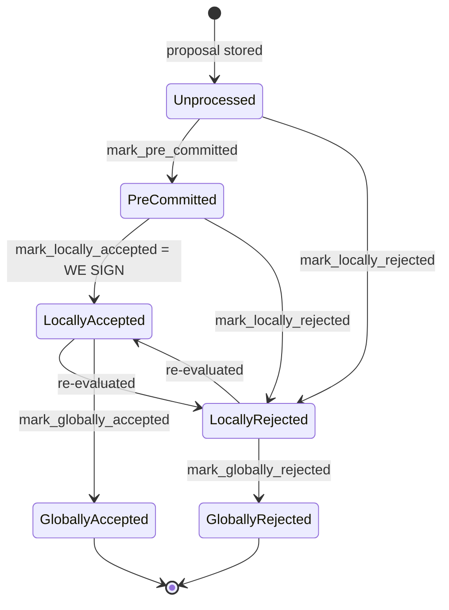
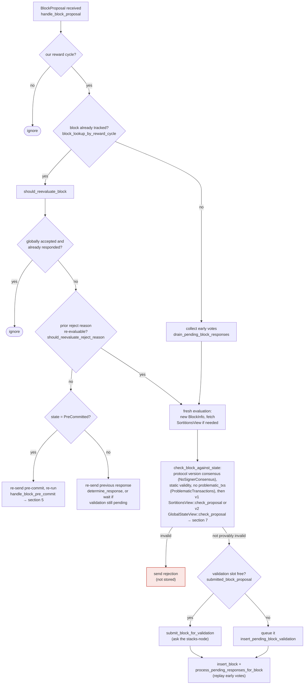

### Title
Rejection weight is never cleared when a signer later accepts the same block, letting stale rejections outvote a legitimately-signed block - (File: stacks-node/src/nakamoto_node/stackerdb_listener.rs)

### Summary
`StackerDBListener` (the miner-side aggregator that tallies signer `BlockResponse` messages) keeps two independent weight counters per block, `total_weight_approved` and `total_weight_rejected`, and a single `responded_signers` de-dup set that is only consulted on the *rejection* path. When a signer legitimately flips its vote from `Rejected` to `Accepted` for the same block — a transition the signer state machine explicitly supports (`LocallyRejected -> LocallyAccepted: re-evaluated`) — the previously-tallied rejection weight is never subtracted. The signer's weight then counts on *both* sides simultaneously, and the stale rejection weight can by itself push `total_weight_rejected` past the blocking-minority threshold, causing the miner to conclude the block was rejected (`SignersRejected`) even though the same signers have since produced enough real signatures to cross `weight_threshold`.

### Finding Description
`BlockStatus` tracks `responded_signers`, `gathered_signatures`, `total_weight_approved`, and `total_weight_rejected` [1](#0-0) .

For `BlockResponse::Accepted`, the only de-dup guard used before adding weight is whether the slot already has a gathered signature — it does not check or clear anything in `responded_signers`/`total_weight_rejected`: [2](#0-1) 

For `BlockResponse::Rejected`, weight is tallied and the slot is marked in `responded_signers`: [3](#0-2) 

There is no code path anywhere in this handler (nor in `signer_coordinator.rs`) that decrements `total_weight_rejected` or removes a slot from `responded_signers` when that same slot subsequently sends an `Accepted` message. Grepping the file for every occurrence of `total_weight_rejected` and `responded_signers` shows only additive (`saturating_add`) usage, never a `saturating_sub`/reset counterpart [4](#0-3) .

This flip is not a hypothetical edge case; it is the documented, sanctioned behavior of the per-block state machine — a block that was rejected can be re-evaluated and become locally accepted: [5](#0-4) 

Concretely: a signer can validly reject a proposal early (e.g. a stale/timing-based rejection, or a rejection issued before the node's validation settled), and later re-evaluate and accept the exact same `signer_signature_hash` once the pre-commit/threshold checks pass (`should_reevaluate_reject_reason`, `handle_block_pre_commit` re-run) [6](#0-5) . On the miner side, this signer's weight is now double-booked: it is permanently present in `total_weight_rejected` from the first message and gets added to `total_weight_approved` from the second, with no mechanism ever reconciling the two.

The miner's decision loop uses these two totals as if they were mutually exclusive: [7](#0-6) 

If enough weight (up to the blocking-minority, `total_weight - weight_threshold`) rejects early and then flips to accept, the stale rejected sum alone can still satisfy `total_weight_rejected + weight_threshold > total_weight`, so the coordinator returns `SignersRejected` and bumps `bump_naka_rejected_blocks()`/excludes txids — even though the true, current signer weight (now on the accept side) is ≥ `weight_threshold` and the block should have been assembled and pushed. This is the exact structural analog of the reported bug: a "refund" (vote reversal) that should restore/clear the prior accounting entry, but does not, letting stale state block a legitimate, currently-valid outcome — an "aggregated-weight vs verified-accepts" equality break.

### Impact Explanation
This is a High-severity liveness wedge for block production: a miner can be made to discard/treat-as-rejected a block that has genuinely reached the 70% signing weight, based purely on rejection weight from signers who have since reversed their vote. No majority of signers and no compromise of other signers' keys is required — an honest signer's own legitimate re-evaluation flow (reject then accept, sanctioned by the state machine) is sufficient to leave permanently poisoned rejection weight in the miner's in-memory tally for that block hash, since the tally is never corrected once a reject is recorded.

### Likelihood Explanation
The `Rejected -> Accepted` transition for the same block is a documented, first-class path in the signer's block-lifecycle state machine (re-evaluation on re-proposal, stale-reason re-evaluation, pre-commit threshold re-checks), not an attacker-crafted anomaly. It can occur during ordinary operation — timeouts, re-proposals after a signature timeout, or a `ProposalTooOld`/pending-validation rejection followed by an in-time acceptance once validation completes. Because the miner-side listener never reconciles the two counters, this can happen without any adversarial signer, purely from timing.

### Recommendation
When processing `BlockResponse::Accepted` for a slot, check whether that slot previously contributed to `total_weight_rejected` (i.e. is present in `responded_signers` with a prior rejection) and, if so, subtract that signer's weight from `total_weight_rejected` before/while adding it to `total_weight_approved` (and symmetrically for a possible `Accepted -> Rejected` reversal, if that is also reachable). Alternatively, track per-signer current vote (accept/reject) in a single map keyed by slot_id and recompute `total_weight_approved`/`total_weight_rejected` from that map on every update, so a signer's weight is counted on exactly one side at any time.

### Proof of Concept
1. Signer S (slot `k`, weight `w`) sends `BlockResponse::Rejected` for hash `H` before validation completes (e.g. `ProposalTooOld`/timing-based rejection). `StackerDBListener` records `responded_signers.insert(k)` and `total_weight_rejected += w` [3](#0-2) .
2. S re-evaluates (per the documented `should_reevaluate_reject_reason`/pre-commit re-run flow) and later sends `BlockResponse::Accepted` for the same `H`. `StackerDBListener` adds `w` to `total_weight_approved` because the only guard checked is `gathered_signatures.contains_key(&k)`, which is false [2](#0-1) .
3. `total_weight_rejected` is never decremented, so S's weight `w` is now counted in both totals.
4. Repeat with enough signers (sum of weights = blocking minority `total_weight - weight_threshold`, but < `weight_threshold` needed on their own) all of whom eventually flip to accept, joined by other signers who accept outright, so that `total_weight_approved >= weight_threshold` is genuinely reached.
5. `SigningCoordinator`'s poll loop in `signer_coordinator.rs` evaluates the rejected-branch condition first: `total_weight_rejected.saturating_add(weight_threshold) > total_weight` is true purely from the stale rejection weight, so the function returns `Err(SignersRejected{...})` [8](#0-7)  — even though the block, at that moment, has legitimately reached the accept threshold.

Note: I was not able to trace, within the remaining tool budget, whether any later code path (outside `stackerdb_listener.rs`/`signer_coordinator.rs`) resets a `BlockStatus` entry between proposal re-submissions for the identical `signer_signature_hash`; if such a reset exists on re-proposal it would narrow (but not eliminate, since accept/reject can arrive for the same hash without a full re-proposal) the reachable window for this issue.

### Citations

**File:** stacks-node/src/nakamoto_node/stackerdb_listener.rs (L70-82)
```rust
#[derive(Debug, Clone)]
pub struct BlockStatus {
    /// Set of the slot ids of signers who have responded
    pub responded_signers: HashSet<u32>,
    /// Map of the slot id of signers who have signed the block and their signature
    pub gathered_signatures: BTreeMap<u32, MessageSignature>,
    /// Total weight of signers who have signed the block
    pub total_weight_approved: u32,
    /// Total weight of signers who have rejected the block
    pub total_weight_rejected: u32,
    /// Per-txid rejection tracking from signers
    pub failed_txids: HashMap<Txid, FailedTxInfo>,
}
```

**File:** stacks-node/src/nakamoto_node/stackerdb_listener.rs (L443-446)
```rust
                        if !block.gathered_signatures.contains_key(&slot_id) {
                            block.total_weight_approved = block
                                .total_weight_approved
                                .saturating_add(signer_entry.weight);
```

**File:** stacks-node/src/nakamoto_node/stackerdb_listener.rs (L486-519)
```rust
                    SignerMessageV0::BlockResponse(BlockResponse::Rejected(rejected_data)) => {
                        let (lock, cvar) = &*self.blocks;
                        let mut blocks = lock.lock().expect("FATAL: failed to lock block status");

                        let Some(block) = blocks.get_mut(&rejected_data.signer_signature_hash)
                        else {
                            info!(
                                "StackerDBListener: Received rejection for block that we did not request. Ignoring.";
                                "signer_signature_hash" => %rejected_data.signer_signature_hash,
                                "slot_id" => slot_id,
                                "signer_set" => self.signer_set,
                            );
                            continue;
                        };

                        let rejected_pubkey = match rejected_data.recover_public_key() {
                            Ok(rejected_pubkey) => {
                                if rejected_pubkey != signer_pubkey {
                                    warn!("StackerDBListener: Recovered public key from rejected data does not match signer's public key. Ignoring.");
                                    continue;
                                }
                                rejected_pubkey
                            }
                            Err(e) => {
                                warn!("StackerDBListener: Failed to recover public key from rejected data: {e:?}. Ignoring.");
                                continue;
                            }
                        };

                        if block.responded_signers.insert(slot_id) {
                            block.total_weight_rejected = block
                                .total_weight_rejected
                                .saturating_add(signer_entry.weight);

```

**File:** docs/signer-flows.md (L130-150)
```markdown
## 2. Block lifecycle (`BlockState`)

Every proposal tracked in the signer DB carries a `BlockState`. **`PreCommitted`
carries no signature**: it means "validated, willing to sign if the pre-commit
threshold is met." The first signature appears at `mark_locally_accepted`.
Global states are terminal against each other.


```

**File:** docs/signer-flows.md (L164-203)
```markdown
## 3. A block proposal arrives

The miner broadcasts a proposal. If we've seen this exact block before,
`should_reevaluate_block` decides whether the old verdict stands; a block we
only pre-committed to is deliberately routed back through the pre-commit
evaluation so a re-proposal cannot shortcut to a signature. A fresh proposal is
checked against our view of the world _before_ spending a node validation on it.



Early votes: acceptances, rejections, and pre-commits that arrived before the
proposal itself are parked in pending tables and replayed once the proposal is
known.

> Anchors: `handle_block_proposal`, `should_reevaluate_block`,
> `should_reevaluate_reject_reason`, `check_block_against_state`,
> `submit_block_for_validation`, `process_pending_responses_for_block`
> (signer.rs); `check_proposal` (chainstate/v1.rs, v2.rs)
```

**File:** stacks-node/src/nakamoto_node/signer_coordinator.rs (L509-545)
```rust
            if block_status
                .total_weight_rejected
                .saturating_add(self.weight_threshold)
                > self.total_weight
            {
                info!(
                    "{}/{} signer weight votes to reject block",
                    block_status.total_weight_rejected, self.total_weight;
                    "signer_signature_hash" => %block_signer_sighash,
                );
                counters.bump_naka_rejected_blocks();

                // Only act on failed txids that a blocking minority (>30% weight) agrees on
                let blocking_minority = self.total_weight.saturating_sub(self.weight_threshold);
                let mut temporarily_excluded_txids = HashSet::new();
                let mut permanently_excluded_txids = HashSet::new();
                for (txid, info) in &block_status.failed_txids {
                    if info.total_weight > blocking_minority {
                        // Do not perma ban txids that only a small minority of signers reported as problematic
                        // But make sure its removed from the next block proposal
                        if info.problematic_weight > blocking_minority {
                            permanently_excluded_txids.insert(txid.clone());
                        } else {
                            temporarily_excluded_txids.insert(txid.clone());
                        }
                    }
                }

                return Err(NakamotoNodeError::SignersRejected {
                    temporarily_excluded_txids,
                    permanently_excluded_txids,
                });
            } else if block_status.total_weight_approved >= self.weight_threshold {
                info!("Received enough signatures, block accepted";
                    "signer_signature_hash" => %block_signer_sighash,
                );
                return Ok(block_status.gathered_signatures.values().cloned().collect());
```
