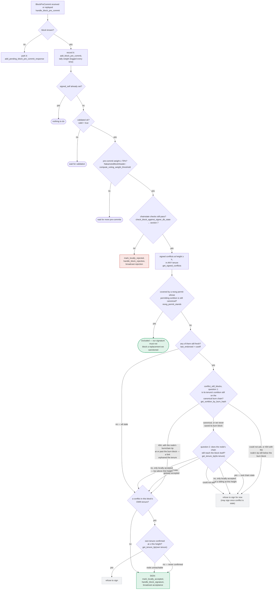

### Title
Signer re-validates only tenure/parent confirmation before signing, never re-checks miner authority (`ActiveMiner` pubkey/consensus-hash) that may go stale between pre-commit and signature — ([File: stacks-signer/src/v0/signer.rs], [File: stacks-signer/src/chainstate/v2.rs])

### Summary
The v2 signer protocol checks that a proposed block's `consensus_hash` and miner pubkey hash match the signer's currently-recognized `ActiveMiner` **only once**, at proposal arrival, inside `GlobalStateView::check_proposal`. The only re-check performed later — at validate-ok time and again at the moment 70% pre-commit weight is reached (the point the signature is actually emitted) — is `check_block_against_signer_db_state`, which re-verifies solely "does this block confirm the expected parent tip", not "is this still the miner my state machine currently recognizes as authoritative." Because the signer's local view of the active miner can fall back to a prior tenure purely from elapsed wall-clock time (a pre-commit, unlike a signature, does not suppress the miner-inactivity timeout), a block whose originating miner's authority was valid at proposal time can be signed after that authority has expired — with the signer never re-checking it.

### Finding Description
`GlobalStateView::check_proposal` (`stacks-signer/src/chainstate/v2.rs`) requires the current `MinerState::ActiveMiner` and matches its `tenure_id`/`current_miner_pkh` against the proposed block: [1](#0-0) 

This check runs from `handle_block_proposal` → `check_block_against_state` → `check_block_against_global_state`, i.e. only at the moment a fresh proposal arrives (docs/signer-flows.md section 3): [2](#0-1) 

After that point, the only place the signer re-verifies anything against chain state — both at validate-ok and again right before signing at the pre-commit threshold — is `check_block_against_signer_db_state`, which only calls `check_tenure_change_confirms_parent` / `check_latest_block_in_tenure`: [3](#0-2) 

The documentation for this shared checkpoint explicitly enumerates what is *not* re-run at validate-ok or signing time — and only claims a substitute guard exists for the `DuplicateBlockFound`/tenure-change case, saying nothing about a substitute for the `ActiveMiner` pubkey/consensus-hash/bitvec checks: [4](#0-3) 

Meanwhile, the signer's local `current_miner` view is explicitly time-sensitive: a merely `PreCommitted` block (no signature yet) does **not** suppress the miner-inactivity timeout, so the state machine can fall back to a prior tenure's miner purely from elapsed time while a block from the now-stale miner sits pre-committed and accumulating weight: [5](#0-4) [6](#0-5) 

Once ≥70% pre-commit weight is reached, the signer proceeds to sign as long as `check_block_against_signer_db_state` (the parent/tenure-confirmation-only check) and the sibling-conflict guard pass — neither of which re-verifies `ActiveMiner` identity: [7](#0-6) [8](#0-7) 

This is structurally the same class of bug as the referenced report: a slippage/authorization-relevant value (`limitPrice_e36` there; `ActiveMiner`/miner authority here) is validated once at commit time but the irreversible payout/signature is produced later without re-validating it, and the value is provably mutable in the intervening window.

### Impact Explanation
If a signer emits a signature (`mark_locally_accepted`, `handle_block_signature`, broadcast acceptance) over a block whose originating miner is no longer the signer's own recognized active/canonical miner, the signer has signed a block that its own chain-state view considers non-canonical/stale relative to the current tip. This is a Critical-class outcome per the scan's rubric: "a signer signing an invalid, non-canonical, or conflicting block." It also undermines the state-machine's fallback/liveness guarantee: the miner-inactivity fallback (`FALL: make_miner_state(prior sortition)`) exists precisely so the signer set stops backing a stalled/absent miner, but a pre-committed-but-not-yet-signed block from that miner can still cross the line unchecked.

### Likelihood Explanation
This requires only a single miner's tenure and ordinary passage of time/new burn blocks — no majority of signers, no key compromise, no auth-token access. The pre-commit gathering window (30%+ of signer weight still to arrive) combined with the documented miner-inactivity timeout (`block_proposal_timeout`) provides a plausible window for the local `current_miner` view to change while a proposal from the previous miner is still in flight toward the 70% pre-commit threshold, especially for a signer that received pre-commits from peers before doing its own housekeeping tick. The doc itself flags that a block "crosses the pre-commit threshold long after it was proposed" is an anticipated scenario for the sibling/tenure-change gap; the same timing window applies here.

### Recommendation
Re-run the full `GlobalStateView::check_proposal` (or at minimum, re-verify `ActiveMiner` tenure_id/pubkey-hash match against the signer's current `local_state_machine.current_miner`) inside `check_block_against_signer_db_state`, so it executes both at validate-ok and immediately before the signature is produced at the pre-commit threshold — not only at initial proposal arrival.

### Proof of Concept
1. Miner M wins sortition for tenure T; every signer's `current_miner` becomes `ActiveMiner{tenure_id: T, current_miner_pkh: pkh(M)}`. M proposes tenure-start block B. `check_proposal` passes (consensus hash, pubkey hash, bitvec all match); node validates OK; `check_block_against_signer_db_state` at validate-ok passes (tenure confirms parent); signers `mark_pre_committed` and broadcast `BlockPreCommit` for B.
2. Before B accumulates ≥70% pre-commit weight, M goes quiet (or is merely slow) long enough that `block_proposal_timeout` elapses. Since B is only `PreCommitted` (no signature), `has_signed_block_in_tenure` is false, so `check_miner_inactivity` triggers `FALL: make_miner_state(prior sortition)` on some signers, updating their `local_state_machine.current_miner` away from M.
3. Pre-commits from other, slower signers (who haven't yet fallen back, or whose fallback doesn't affect the tally) continue arriving and push B's pre-commit weight over 70% on a signer whose own `current_miner` has already moved on.
4. That signer's threshold path calls only `check_block_against_signer_db_state` (tenure/parent confirmation — still true, since T's tip hasn't moved) and the sibling-conflict guard (no conflicting signature yet exists) — both pass — and the signer signs B, even though its own state machine no longer recognizes M as the active miner.

### Citations

**File:** stacks-signer/src/chainstate/v2.rs (L55-66)
```rust
        // If we've already signed a block in this tenure, the miner can't have timed out: we have
        // committed a signature to this tenure and must not help abandon it.
        //
        // Importantly, a block we have only pre-committed to does not count! A pre-commit carries
        // no signature, and if it never reaches the pre-commit threshold the tenure can stall
        // indefinitely. Treating it as signed here would suppress the inactivity timeout for
        // exactly the signers that pre-committed, so they could never fall back to the prior
        // miner and the tenure could never recover.
        let has_block = signer_db.has_signed_block_in_tenure(sortition)?;
        if has_block {
            return Ok(false);
        }
```

**File:** stacks-signer/src/chainstate/v2.rs (L119-163)
```rust
        let MinerState::ActiveMiner {
            current_miner_pkh,
            tenure_id,
            parent_tenure_id,
            ..
        } = &self.signer_state.current_miner
        else {
            info!(
                "No valid current miner. Considering invalid.";
                "block_height" => block.header.chain_length,
                "signer_signature_hash" => %block.header.signer_signature_hash()
            );
            return Err(RejectReason::InvalidMiner);
        };
        if &block.header.consensus_hash != tenure_id {
            info!("Miner block proposal consensus hash does not match the current miner's tenure id. Considering invalid.";
                "block_height" => block.header.chain_length,
                "signer_signature_hash" => %block.header.signer_signature_hash(),
                "block_consensus_hash" => %block.header.consensus_hash,
                "active_miner_tenure_id" => %tenure_id,
                "active_miner_parent_tenure_id" => %parent_tenure_id,
            );
            return Err(RejectReason::ConsensusHashMismatch {
                actual: block.header.consensus_hash.clone(),
                expected: tenure_id.clone(),
            });
        }
        let Some(miner_pk) = block.header.recover_miner_pk() else {
            warn!("Failed to recover miner pubkey";
                  "signer_signature_hash" => %block.header.signer_signature_hash(),
                  "consensus_hash" => %block.header.consensus_hash);
            return Err(RejectReason::IrrecoverablePubkeyHash);
        };
        let miner_pkh = Hash160::from_data(&miner_pk.to_bytes_compressed());
        if current_miner_pkh != &miner_pkh {
            warn!(
                "Miner block proposal pubkey does not match the winning pubkey hash for its sortition. Considering invalid.";
                "proposed_block_consensus_hash" => %block.header.consensus_hash,
                "signer_signature_hash" => %block.header.signer_signature_hash(),
                "proposed_block_pubkey" => &miner_pk.to_hex(),
                "proposed_block_pubkey_hash" => %miner_pkh,
                "active_miner_pubkey_hash" => %current_miner_pkh,
            );
            return Err(RejectReason::PubkeyHashMismatch);
        }
```

**File:** docs/signer-flows.md (L184-203)
```markdown
    REASON -- yes --> FRESH
    KNOWN -- no --> DRAIN["collect early votes<br/>drain_pending_block_responses"] --> FRESH["fresh evaluation:<br/>new BlockInfo, fetch<br/>SortitionsView if needed"]
    FRESH --> CHECK["check_block_against_state:<br/>protocol version consensus (NoSignerConsensus),<br/>static validity, no problematic_txs<br/>(ProblematicTransactions), then<br/>v1 SortitionsView::check_proposal or<br/>v2 GlobalStateView::check_proposal → section 7"]
    CHECK -- invalid --> REJ["send rejection<br/>(not stored)"]:::bad
    CHECK -- "not provably invalid" --> BUSY{"validation slot free?<br/>submitted_block_proposal"}
    BUSY -- yes --> SUBMIT["submit_block_for_validation<br/>(ask the stacks-node)"]
    BUSY -- no --> QUEUE["queue it<br/>insert_pending_block_validation"]
    SUBMIT --> STORE["insert_block +<br/>process_pending_responses_for_block<br/>(replay early votes)"]
    QUEUE --> STORE
    classDef bad fill:#d84a3f22,stroke:#c9473d,stroke-width:1.5px;
```

Early votes: acceptances, rejections, and pre-commits that arrived before the
proposal itself are parked in pending tables and replayed once the proposal is
known.

> Anchors: `handle_block_proposal`, `should_reevaluate_block`,
> `should_reevaluate_reject_reason`, `check_block_against_state`,
> `submit_block_for_validation`, `process_pending_responses_for_block`
> (signer.rs); `check_proposal` (chainstate/v1.rs, v2.rs)
```

**File:** docs/signer-flows.md (L229-272)
```markdown
## 5. Pre-commit threshold → signature

The only place the signer produces a block signature by counting votes.
Pre-commits from peers (and our own) accumulate; at ≥70% weight the signer
decides whether to follow through. Between validation and threshold, we may have
signed a _different_ block at the same height, possibly in another tenure, so
the world must be re-checked before the signature leaves the box.


```

**File:** docs/signer-flows.md (L425-437)
```markdown
Two things belong to the proposal path only and are **not** re-run at validate-ok
or at signing:

- `validate_tenure_change_payload` rejects with `DuplicateBlockFound` when we
  have already accepted a block in the tenure a tenure-change block is starting.
  v2 counts locally or globally accepted blocks (`get_last_signed_block`); v1
  counts only globally accepted ones (`get_last_globally_accepted_block`).
- the v2 `check_proposal` wrapper checks miner pubkey hash, consensus hash, the
  pox bitvec, and tenure-extend rules before delegating here.

Because the duplicate check never runs again, a block that crosses the pre-commit
threshold long after it was proposed relies on section 5's own-tenure conflict
guard to cover the same ground.
```

**File:** docs/signer-flows.md (L466-468)
```markdown
    PEND -- no --> TO{"current tenure timed out?<br/>check_miner_inactivity →<br/>v1/v2 SortitionState::is_timed_out"}
    TO -- "signed a block in tenure?<br/>has_signed_block_in_tenure" --> NEVER(["never times out —<br/>we committed a signature"])
    TO -- "no signed block, and inactive<br/>past block_proposal_timeout" --> FALL["fall back to prior tenure:<br/>make_miner_state(prior sortition)"]
```

**File:** stacks-signer/src/v0/signer.rs (L1345-1366)
```rust
        if let Some(block_rejection) =
            self.check_block_against_signer_db_state(stacks_client, &block_info.block)
        {
            warn!(
                "{self}: Reached the pre-commit threshold for a block, but it no longer passes the chainstate checks. Rejecting.";
                "signer_signature_hash" => %block_hash,
                "block_height" => block_info.block.header.chain_length,
                "reject_code" => %block_rejection.reason_code,
                "reject_reason" => &block_rejection.reason,
            );
            if let Err(e) = block_info.mark_locally_rejected() {
                if !block_info.has_reached_consensus() {
                    warn!("{self}: Failed to mark block as locally rejected: {e:?}");
                }
            };
            self.signer_db
                .insert_block(&block_info)
                .unwrap_or_else(|e| self.handle_insert_block_error(e));
            self.handle_block_rejection(&block_rejection, sortition_state);
            self.send_block_response(&block_info.block, block_rejection.into());
            return;
        }
```

**File:** stacks-signer/src/v0/signer.rs (L1799-1850)
```rust
    /// WARNING: This is an incomplete check. Do NOT call this function PRIOR to check_proposal or block_proposal validation succeeds.
    ///
    /// Re-verify a block's chain length against the last signed block within signerdb.
    /// This is required in case a block has been approved since the initial checks of the block validation endpoint.
    fn check_block_against_signer_db_state(
        &mut self,
        stacks_client: &StacksClient,
        proposed_block: &NakamotoBlock,
    ) -> Option<BlockRejection> {
        let signer_signature_hash = proposed_block.header.signer_signature_hash();
        // If this is a tenure change block, ensure that it confirms the correct number of blocks from the parent tenure.
        if let Some(tenure_change) = proposed_block.get_tenure_change_tx_payload() {
            // Ensure that the tenure change block confirms the expected parent block
            match SortitionData::check_tenure_change_confirms_parent(
                tenure_change,
                proposed_block,
                &mut self.signer_db,
                stacks_client,
                self.proposal_config.tenure_last_block_proposal_timeout,
                self.proposal_config.reorg_attempts_activity_timeout,
            ) {
                Ok(true) => return None,
                Ok(false) => {
                    return Some(self.create_block_rejection(
                        RejectReason::SortitionViewMismatch,
                        proposed_block,
                    ))
                }
                Err(e) => {
                    warn!("{self}: Error checking block proposal: {e}";
                        "signer_signature_hash" => %signer_signature_hash,
                        "block_id" => %proposed_block.block_id()
                    );
                    return Some(self.create_block_rejection(
                        RejectReason::ConnectivityIssues(
                            "error checking block proposal".to_string(),
                        ),
                        proposed_block,
                    ));
                }
            }
        }

        // Ensure that the block is the last block in the chain of its current tenure.
        match SortitionData::check_latest_block_in_tenure(
            &proposed_block.header.consensus_hash,
            proposed_block,
            &mut self.signer_db,
            stacks_client,
            self.proposal_config.tenure_last_block_proposal_timeout,
            self.proposal_config.reorg_attempts_activity_timeout,
        ) {
```
