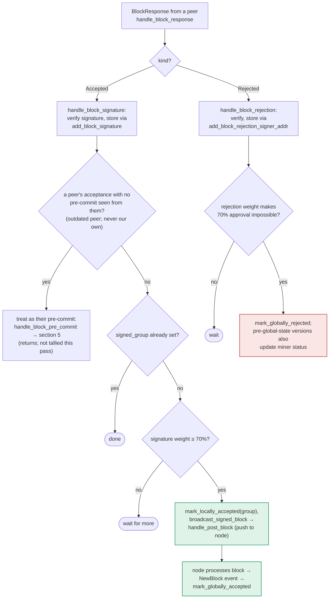

### Title
Missing `approved_time` on a locally-known block defaults the reorg-timing check to "0", letting `check_parent_tenure_choice` sanction an illegitimate reorg past a well-timed tenure - (File: `stacks-signer/src/chainstate/mod.rs`)

### Summary
`SortitionData::check_parent_tenure_choice` decides whether a miner may build off something other than the prior sortition (a reorg). For each reorged tenure it inspects the *first* locally-known approved/signed block of that tenure and measures how close its proposal was to the burn-block transition, allowing the reorg only if the block arrived "late" (within `first_proposal_burn_block_timing` of the new sortition). When the local `BlockInfo.approved_time` for that block is `None`, the code substitutes `0` as the elapsed time instead of using an always-populated timestamp such as `proposed_time`, which makes the "arrived late" test trivially true and wrongly authorizes the reorg.

### Finding Description
In `stacks-signer/src/chainstate/mod.rs`, `check_parent_tenure_choice` fetches the tenure's earliest approved block via `signer_db.get_first_approved_block_in_tenure`: [1](#0-0) 

That query matches rows where `signed_self`, `signed_group`, **or** `approved_time` is non-null: [2](#0-1) 

The timing verdict is then computed as: [3](#0-2) 

`local_block_info.approved_time` is `None` on any record whose only signal was `signed_group` (never personally pre-committed/validated by this signer), because `mark_locally_accepted(true)` and `mark_globally_accepted()` both only touch `signed_group`/`signed_self`, never `approved_time`: [4](#0-3) 

This state is reachable purely through gossip, without any admin/majority access: per the documented "outdated peer fallback" flow, a peer's `Accepted` response with no prior pre-commit seen from that peer is routed into the pre-commit-counting path, and once the group weight threshold is reached the block is marked `LocallyAccepted` with only `signed_group` set - `approved_time` is never populated: [5](#0-4) 

When `approved_time` is `None`, the code sets `proposal_to_sortition = 0` and logs that it is "considering it as a late-arriving proposal." Since `Duration::from_secs(0) < first_proposal_burn_block_timing` is true for any non-zero configured timing, the tenure is unconditionally pushed onto `superseded_tenures` and the reorg is permitted for that tenure - regardless of how much time the tenure's block actually had before the sortition transition. Note `BlockInfo` already carries a `proposed_time` that is *always* set at construction time (`BlockInfo::from(BlockProposal)`): [6](#0-5) 

but the code uses the always-`None`-able `approved_time` and a `0` fallback instead of the more accurate, always-present `proposed_time`. This is structurally the same class of bug as the zrok advisory: a legitimacy/ownership condition (`is the reorged tenure's block genuinely late-arriving?`) is guarded by an optional field, and when that field is absent the check fail-opens (grants the permission) instead of fail-closing or falling back to an available surrogate.

Consequence: a signer in this state calls `record_superseded_tenure`, marking the victim tenure as superseded in its local DB, which subsequently excludes the signer's own prior signature over that tenure's blocks from the conflict guard in the pre-commit path (`reorg_permit_stands`), and the signer will go on to sign the new tenure's tenure-change block even though the parent-tenure choice was not actually valid under the documented reorg rules - i.e., the signer signs a block that performs a reorg it should have rejected. `is_tenure_valid` / `check_proposal` / `validate_tenure_change_payload` all rely on this same `check_parent_tenure_choice` result as the sole gate for whether a non-immediate parent tenure choice is acceptable: [7](#0-6) [8](#0-7) 

### Impact Explanation
This breaks the "approved-parent vs canonical" equality guard: a single malicious/opportunistic miner (one sortition slot) can craft a tenure-change block whose `parent_tenure_id` skips the immediately-prior, perfectly legitimate tenure. Any signer whose local knowledge of that legitimate tenure's first block came only through the group-signature/gossip path (not personal pre-commit) will have `approved_time == None` for it, causing `check_parent_tenure_choice` to wrongly treat the reorg as "sanctioned" and sign the replacement tenure-change block - a signer signing a non-canonical/invalid-reorg block, matching the Critical impact bucket ("a signer signing an invalid, non-canonical, or conflicting block").

### Likelihood Explanation
Reaching the vulnerable state requires no special privileges: any signer that observes a block proposal and enough peer acceptances (via normal StackerDB gossip) to hit the group signing threshold without itself having pre-committed will have `approved_time = None` for that record - a routine occurrence in a live network with network delay/version skew, not an adversarial edge case. The attacker only needs to control the current sortition (a single miner slot) to attempt the reorg and target such signers; no majority of signers, no other signer's key, and no auth token are needed.

### Recommendation
In `check_parent_tenure_choice`, when `local_block_info.approved_time` is `None`, do not substitute `0`. Instead fall back to `local_block_info.proposed_time` (always populated) or, if a stricter default is preferred, treat the missing signal as "not late" (i.e., fail closed / reject the reorg) rather than fail open. Additionally, audit other timing-sensitive comparisons that read `approved_time` for the same fail-open default pattern.

### Proof of Concept
1. Signer S receives tenure T's first block proposal (creates a local `BlockInfo` via `BlockInfo::from`, `approved_time = None`).
2. S is slow/out of sync and never personally pre-commits/validates it, but observes peer `Accepted` responses reaching the group weight threshold; `handle_block_response` → `mark_locally_accepted(true)` sets `signed_group` but leaves `approved_time = None`.
3. A one-slot miner mines a new sortition whose tenure-change block sets `parent_tenure_id` to something other than tenure T's prior sortition (attempting to reorg past T even though T's first block was mined well before the burn-block transition).
4. S evaluates the proposal; `check_parent_tenure_choice` calls `get_first_approved_block_in_tenure(T)`, finds the record with `approved_time = None`, computes `proposal_to_sortition = 0`, satisfies `0 < first_proposal_burn_block_timing`, and marks T as superseded, returning `Ok(true)`.
5. `validate_tenure_change_payload`/`check_proposal` accept the reorg; S signs the tenure-change block that abandons the legitimately-timed tenure T.

### Citations

**File:** stacks-signer/src/chainstate/mod.rs (L234-245)
```rust
            let Some(local_block_info) =
                signer_db.get_first_approved_block_in_tenure(&tenure.consensus_hash)?
            else {
                warn!(
                    "Miner is not building off of most recent tenure, but a tenure they attempted to reorg has already mined blocks, and there is no local knowledge for that tenure's block timing.";
                    "parent_tenure" => %self.parent_tenure_id,
                    "last_sortition" => %self.prior_sortition,
                    "violating_tenure_id" => %tenure.consensus_hash,
                    "violating_tenure_first_block_id" => %first_block_mined,
                );
                return Ok(false);
            };
```

**File:** stacks-signer/src/chainstate/mod.rs (L247-278)
```rust
            let checked_proposal_timing = if let Some(sortition_state_received_time) =
                sortition_state_received_time
            {
                // how long was there between when the proposal was received and the next sortition started?
                let proposal_to_sortition = if let Some(approved_at) =
                    local_block_info.approved_time
                {
                    sortition_state_received_time.saturating_sub(approved_at)
                } else {
                    info!("We did not sign over the reorged tenure's first block, considering it as a late-arriving proposal");
                    0
                };
                if Duration::from_secs(proposal_to_sortition) < *first_proposal_burn_block_timing {
                    info!(
                        "Miner is not building off of most recent tenure. A tenure they reorg has already mined blocks, but the block was poorly timed, allowing the reorg.";
                        "parent_tenure" => %self.parent_tenure_id,
                        "last_sortition" => %self.prior_sortition,
                        "violating_tenure_id" => %tenure.consensus_hash,
                        "violating_tenure_first_block_id" => %first_block_mined,
                        "violating_tenure_proposed_time" => local_block_info.proposed_time,
                        "new_tenure_received_time" => sortition_state_received_time,
                        "new_tenure_burn_timestamp" => self.burn_header_timestamp,
                        "first_proposal_burn_block_timing_secs" => first_proposal_burn_block_timing.as_secs(),
                        "proposal_to_sortition" => proposal_to_sortition,
                    );
                    superseded_tenures.push(tenure);
                    continue;
                }
                true
            } else {
                false
            };
```

**File:** stacks-signer/src/signerdb.rs (L233-251)
```rust
impl From<BlockProposal> for BlockInfo {
    fn from(value: BlockProposal) -> Self {
        Self {
            block: value.block,
            burn_block_height: value.burn_height,
            reward_cycle: value.reward_cycle,
            vote: None,
            valid: None,
            proposed_time: get_epoch_time_secs(),
            approved_time: None,
            signed_self: None,
            signed_group: None,
            ext: ExtraBlockInfo::default(),
            state: BlockState::Unprocessed,
            validation_time_ms: None,
            reject_reason: None,
        }
    }
}
```

**File:** stacks-signer/src/signerdb.rs (L279-295)
```rust
    /// Mark this block as valid and the appropriate timestamps if they aren't already set, and attempt to mark it as locally accepted.
    pub fn mark_locally_accepted(&mut self, group_signed: bool) -> Result<(), String> {
        if group_signed {
            self.signed_group.get_or_insert(get_epoch_time_secs());
        } else {
            self.valid = Some(true);
            self.approved_time.get_or_insert(get_epoch_time_secs());
            self.signed_self.get_or_insert(get_epoch_time_secs());
        }
        self.move_to(BlockState::LocallyAccepted)
    }

    /// Mark this block's signed group time if not already set and attempt to mark it as globally accepted.
    pub fn mark_globally_accepted(&mut self) -> Result<(), String> {
        self.signed_group.get_or_insert(get_epoch_time_secs());
        self.move_to(BlockState::GloballyAccepted)
    }
```

**File:** stacks-signer/src/signerdb.rs (L1519-1527)
```rust
    pub fn get_first_approved_block_in_tenure(
        &self,
        tenure: &ConsensusHash,
    ) -> Result<Option<BlockInfo>, DBError> {
        let query = "SELECT block_info FROM blocks WHERE consensus_hash = ? AND (signed_self IS NOT NULL OR signed_group IS NOT NULL OR approved_time IS NOT NULL) ORDER BY stacks_height ASC LIMIT 1";
        let result: Option<String> = query_row(&self.db, query, [tenure])?;

        try_deserialize(result)
    }
```

**File:** docs/signer-flows.md (L357-383)
```markdown


The outdated-peer fallback keeps mixed-version fleets live: an acceptance from a
peer that never sent a pre-commit is routed into the pre-commit path instead, so
that peer's weight still counts toward the threshold that produces _our_
signature. Note that reaching 70% signatures still only marks the block
_locally_ accepted with the group timestamp; global acceptance waits for the node
to adopt it. Marking the miner invalid on a 30% `ReorgNotAllowed` rejection is
skipped once the active protocol version uses global signer state.
```

**File:** stacks-signer/src/chainstate/v1.rs (L496-504)
```rust
        // now, we have to check if the parent tenure was a valid choice.
        let is_valid_parent_tenure = proposed_by.state().data.check_parent_tenure_choice(
            signer_db,
            client,
            &self.config.first_proposal_burn_block_timing,
        )?;
        if !is_valid_parent_tenure {
            return Err(RejectReason::ReorgNotAllowed);
        }
```

**File:** stacks-signer/src/chainstate/v2.rs (L326-339)
```rust

        // Ensure that the tenure change block confirms the expected parent block
        let confirms_expected_parent = SortitionData::check_tenure_change_confirms_parent(
            tenure_change,
            block,
            signer_db,
            client,
            config.tenure_last_block_proposal_timeout,
            config.reorg_attempts_activity_timeout,
        )
        .map_err(SignerChainstateError::from)?;
        if !confirms_expected_parent {
            return Err(RejectReason::InvalidParentBlock);
        }
```
