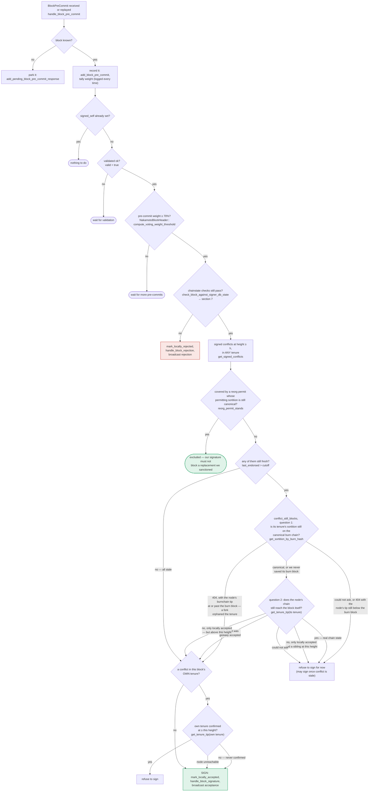

### Title
Tenure-restart duplicate-block guard (`DuplicateBlockFound`) is enforced only at proposal time and never re-checked before signing - ([File: stacks-signer/src/v0/signer.rs], [File: stacks-signer/src/chainstate/v1.rs], [File: stacks-signer/src/chainstate/v2.rs])

### Summary
The signer's `validate_tenure_change_payload` rejects a tenure-change block with `DuplicateBlockFound` if the signer has already accepted/signed a block in that same tenure [1](#0-0) [2](#0-1) . This check only runs on the initial `check_proposal` path and is explicitly documented as not re-run at validate-ok or at signing time [3](#0-2) . This is directly analogous to the Karak H-04 bug class: a safety-relevant check performed once at "intake" time (registration / proposal) is not re-validated at "finalization" time (slash finalization / signature emission), so state that changes in the intervening asynchronous window (node validation RTT) can silently invalidate the earlier check's premise.

### Finding Description
`check_block_against_signer_db_state`, which runs both at `handle_block_validate_ok` (post node-validation) and is the same gate consulted before a signature is emitted at the pre-commit threshold, only re-checks the **parent**-tenure confirmation (`check_tenure_change_confirms_parent`) for tenure-change blocks — it does not re-run the **own**-tenure duplicate check that `validate_tenure_change_payload` performs at proposal time [4](#0-3) .

```
docs/signer-flows.md:425-437
Two things belong to the proposal path only and are not re-run at validate-ok
or at signing:
- `validate_tenure_change_payload` rejects with `DuplicateBlockFound` when we
  have already accepted a block in the tenure a tenure-change block is starting.
  ...
Because the duplicate check never runs again, a block that crosses the pre-commit
threshold long after it was proposed relies on section 5's own-tenure conflict
guard to cover the same ground.
```

Section 5's "own-tenure conflict guard" (`get_signed_conflicts` / `conflict_still_blocks`, invoked from `handle_block_pre_commit`) is a **height**-based conflict check ("signed conflicts at height ≥ h, in ANY tenure") [5](#0-4) . A tenure-change block that restarts an *already-signed* tenure X does not necessarily conflict at the same chain height as a previously signed block in tenure X — the tenure-change block's chain_length continues from the parent tenure's tip, not from the height of blocks the signer already signed within tenure X. So the height-keyed guard in section 5 is not a drop-in replacement for the tenure-keyed `DuplicateBlockFound` check that ran only at proposal time.

Concretely: proposal-time submits the tenure-change block for asynchronous node validation (`submit_block_for_validation`), which can take an arbitrary amount of wall-clock time (`validation_time_ms` is even recorded and logged) [6](#0-5) [7](#0-6) . Between submission and the validate-ok callback (or between validate-ok and reaching the ≥70% pre-commit weight threshold), the signer can process a separate, unrelated block proposal that extends the *same* tenure and gets signed first (via a different, concurrently-in-flight proposal/validation round-trip) — exactly the "asynchronous-validation timing gap" the existing `async_sibling_validation` test module documents and defends against for the *sibling-at-same-height* case [8](#0-7) . That regression coverage is scoped to two tenure-*start* siblings racing at the *same height*; it does not cover the case where the signer has already signed a *later, higher* block continuing the same tenure by the time the stale tenure-change proposal's validation returns.

### Impact Explanation
If the height-based section-5 guard fails to catch this (because the tenure-change block and the already-signed block in the same tenure are at different heights, which is the normal case for a tenure restart), the signer would emit a signature over a tenure-change block that restarts a tenure it has already committed to — i.e., a signer signing a conflicting/non-canonical block for a tenure it already signed real content for. This breaks the "signed vs validated" / "one signature per committed tenure" equality the state machine is supposed to preserve, and maps to the Critical impact category (a signer signing an invalid/conflicting block).

### Likelihood Explanation
This requires only ordinary node/network latency variance (no majority collusion, no key compromise): a miner (or gossip of a stale proposal) re-sending/re-processing a tenure-change proposal whose validation round-trip is slow enough to be overtaken by a normal follow-up block in the same tenure being validated and signed first. This is a plausible, one-miner-plus-gossip-triggerable timing window, consistent with the scan's scope (single miner/gossip-triggerable equality violations).

### Recommendation
Re-run the tenure-keyed duplicate check (the "have we already signed/accepted a block in this exact tenure" check that backs `DuplicateBlockFound`) inside `check_block_against_signer_db_state` for tenure-change blocks, in addition to the parent-tenure confirmation, so it is consulted both at validate-ok and immediately before a signature is emitted at the pre-commit threshold — mirroring how Karak's mitigation re-validated operator/vault status at slash-finalization time rather than relying solely on the state check made at request time.

### Proof of Concept
Conceptual PoC, following the same before/after equality pattern as the Karak PoC:
1. Miner proposes tenure-change block `TC` starting tenure `X`, building on parent tenure `P`. Signer's `check_proposal` (via `validate_tenure_change_payload`) confirms no block has been signed yet in `X`; submits `TC` to the node for async validation (`submit_block_for_validation`).
2. Before `TC`'s validation returns, the same tenure `X` progresses: a normal follow-up block `B` (child of `X`, not a tenure-change) is proposed, validated, and signed by this signer via `handle_block_pre_commit`'s signature path — `has_signed_block_in_tenure(X)` is now true.
3. `TC`'s delayed validate-ok now arrives. `handle_block_validate_ok` → `check_block_against_signer_db_state` for `TC` only calls `check_tenure_change_confirms_parent` (checks `P`), never re-running the `X`-duplicate check [4](#0-3) . `TC` is marked pre-committed and broadcast.
4. If `TC` accumulates ≥70% pre-commit weight, `handle_block_pre_commit`'s section-5 conflict guard checks height-based conflicts (`get_signed_conflicts`), not tenure-identity; because `TC` and `B` are at different chain heights, no conflict is flagged, and the signer signs `TC` — a tenure-change block re-starting a tenure (`X`) it already signed real blocks in.

This PoC is a logical construction from the documented control-flow (`docs/signer-flows.md` sections 3–5 and 7) and the code paths cited above; it has not been executed against a running signer/test harness, so the exact timing feasibility (whether the height-based guard in `handle_block_pre_commit`/`get_signed_conflicts` might incidentally catch this via some code path not shown in the excerpts reviewed) could not be fully confirmed from static reading alone — a background agent with test-harness access should write the equivalent of `run_sibling_scenario` in `stacks-signer/src/v0/tests.rs` but for a tenure-restart-vs-continuation race (rather than same-height siblings) to confirm whether the signature is actually emitted.

### Citations

**File:** stacks-signer/src/chainstate/v2.rs (L340-357)
```rust
        // We already confirmed in check miner activity that the current tenure is valid. So check we are not
        // reorging the tenure blocks. Only blocks we have signed (locally or globally accepted) count
        // here: a block we have merely pre-committed to carries no signature from us, so it is safe to
        // accept a competing tenure-start block in its place if it failed to reach consensus.
        let last_in_current_tenure = signer_db
            .get_last_signed_block(&block.header.consensus_hash)
            .map_err(|e| {
                SignerChainstateError::from(ClientError::InvalidResponse(e.to_string()))
            })?;
        if let Some(last_in_current_tenure) = last_in_current_tenure {
            warn!(
                "Miner block proposal contains a tenure change, but we've already signed a block in this tenure. Considering proposal invalid.";
                "proposed_block_consensus_hash" => %block.header.consensus_hash,
                "proposed_block_signer_signature_hash" => %block.header.signer_signature_hash(),
                "last_in_tenure_signer_signature_hash" => %last_in_current_tenure.block.header.signer_signature_hash(),
            );
            return Err(RejectReason::DuplicateBlockFound);
        }
```

**File:** stacks-signer/src/chainstate/v1.rs (L505-518)
```rust
        let last_in_current_tenure = signer_db
            .get_last_globally_accepted_block(&block.header.consensus_hash)
            .map_err(|e| {
                SignerChainstateError::from(ClientError::InvalidResponse(e.to_string()))
            })?;
        if let Some(last_in_current_tenure) = last_in_current_tenure {
            warn!(
                "Miner block proposal contains a tenure change, but we've already signed a block in this tenure. Considering proposal invalid.";
                "proposed_block_consensus_hash" => %block.header.consensus_hash,
                "proposed_block_signer_signature_hash" => %block.header.signer_signature_hash(),
                "last_in_tenure_signer_signature_hash" => %last_in_current_tenure.block.header.signer_signature_hash(),
            );
            return Err(RejectReason::DuplicateBlockFound);
        }
```

**File:** docs/signer-flows.md (L229-270)
```markdown
## 5. Pre-commit threshold → signature

The only place the signer produces a block signature by counting votes.
Pre-commits from peers (and our own) accumulate; at ≥70% weight the signer
decides whether to follow through. Between validation and threshold, we may have
signed a _different_ block at the same height, possibly in another tenure, so
the world must be re-checked before the signature leaves the box.



**File:** docs/signer-flows.md (L425-437)
```markdown
Two things belong to the proposal path only and are **not** re-run at validate-ok
or at signing:

- `validate_tenure_change_payload` rejects with `DuplicateBlockFound` when we
  have already accepted a block in the tenure a tenure-change block is starting.
  v2 counts locally or globally accepted blocks (`get_last_signed_block`); v1
  counts only globally accepted ones (`get_last_globally_accepted_block`).
- the v2 `check_proposal` wrapper checks miner pubkey hash, consensus hash, the
  pox bitvec, and tenure-extend rules before delegating here.

Because the duplicate check never runs again, a block that crosses the pre-commit
threshold long after it was proposed relies on section 5's own-tenure conflict
guard to cover the same ground.
```

**File:** stacks-signer/src/v0/signer.rs (L1670-1701)
```rust
        // Check if proposal can be rejected now if not valid against sortition view
        let block_rejection =
            self.check_block_against_state(stacks_client, sortition_state, &block_info);

        #[cfg(any(test, feature = "testing"))]
        let block_rejection =
            self.test_reject_block_proposal(block_proposal, &mut block_info, block_rejection);

        if let Some(block_rejection) = block_rejection {
            // We know proposal is invalid. Send rejection message, do not do further validation and do not store it.
            self.send_block_response(&block_info.block, block_rejection.into());
        } else {
            // Just in case check if the last block validation submission timed out.
            self.check_submitted_block_proposal();
            if self.submitted_block_proposal.is_none() {
                // We don't know if proposal is valid, submit to stacks-node for further checks and store it locally.
                info!(
                    "{self}: submitting block proposal for validation";
                    "signer_signature_hash" => %signer_signature_hash,
                    "block_id" => %block_proposal.block.block_id(),
                    "block_height" => block_proposal.block.header.chain_length,
                    "burn_height" => block_proposal.burn_height,
                );

                #[cfg(any(test, feature = "testing"))]
                self.test_stall_block_validation_submission();
                self.submit_block_for_validation(
                    stacks_client,
                    &block_proposal.block,
                    get_epoch_time_secs(),
                );
            } else {
```

**File:** stacks-signer/src/v0/signer.rs (L1808-1840)
```rust
        let signer_signature_hash = proposed_block.header.signer_signature_hash();
        // If this is a tenure change block, ensure that it confirms the correct number of blocks from the parent tenure.
        if let Some(tenure_change) = proposed_block.get_tenure_change_tx_payload() {
            // Ensure that the tenure change block confirms the expected parent block
            match SortitionData::check_tenure_change_confirms_parent(
                tenure_change,
                proposed_block,
                &mut self.signer_db,
                stacks_client,
                self.proposal_config.tenure_last_block_proposal_timeout,
                self.proposal_config.reorg_attempts_activity_timeout,
            ) {
                Ok(true) => return None,
                Ok(false) => {
                    return Some(self.create_block_rejection(
                        RejectReason::SortitionViewMismatch,
                        proposed_block,
                    ))
                }
                Err(e) => {
                    warn!("{self}: Error checking block proposal: {e}";
                        "signer_signature_hash" => %signer_signature_hash,
                        "block_id" => %proposed_block.block_id()
                    );
                    return Some(self.create_block_rejection(
                        RejectReason::ConnectivityIssues(
                            "error checking block proposal".to_string(),
                        ),
                        proposed_block,
                    ));
                }
            }
        }
```

**File:** stacks-signer/src/v0/signer.rs (L1921-1930)
```rust
        // Record the block validation time but do not consider stx transfers or boot contract calls
        block_info.validation_time_ms = if block_validate_ok.cost.is_zero() {
            Some(0)
        } else {
            Some(block_validate_ok.validation_time_ms)
        };

        self.signer_db
            .insert_block(&block_info)
            .unwrap_or_else(|e| self.handle_insert_block_error(e));
```

**File:** stacks-signer/src/v0/tests.rs (L317-328)
```rust
}

/// Tests for the asynchronous-validation tenure-start timing gap.
///
/// `check_proposal` rejects a second tenure-start block for a tenure, but it runs before the
/// node's async validation, so two sibling tenure-start blocks proposed within the validation
/// window can both be pre-committed. A signer must still refuse to place a *signature* on a
/// second sibling while its signature on the first is fresh, so a single winning miner cannot
/// obtain two signer certificates for one sortition. Once the signature has timed out, the
/// signer consults the node and signs the replacement only if the signed sibling is not
/// canonical at that height, so a sibling that failed to be confirmed can still be replaced.
#[cfg(test)]
```
