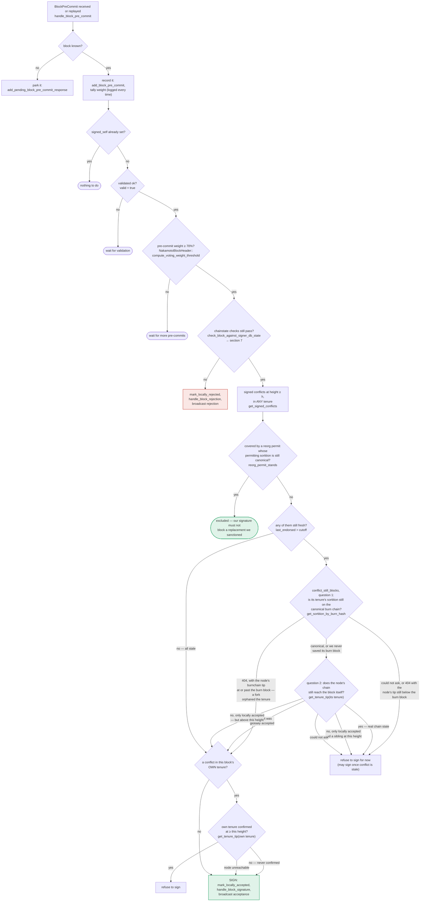

### Title
Peer signature aggregation broadcasts a block without re-validating it against local chainstate/conflict state - (File: stacks-signer/src/v0/signer.rs)

### Summary
`store_and_process_block_signature` stores any cryptographically valid peer `BlockResponse::Accepted` signature and, once the accumulated signature weight crosses the 70% threshold, immediately calls `mark_locally_accepted(true)` and pushes the block to the node via `broadcast_signed_block` → `handle_post_block`. Unlike every other path that produces or acts on a signer's own signature, this threshold-reached path performs **no re-check** of `check_block_against_signer_db_state` (conflict/tenure-tip checks) or of the block's own `valid`/state fields before broadcasting.

### Finding Description
The signer flow documentation and code establish a strict invariant: before a signature "leaves the box" (or before a block is pushed to the node), the local chainstate must be re-checked, because "between validation and threshold, we may have signed a different block at the same height, possibly in another tenure." [1](#0-0) 

This re-check (`check_block_against_signer_db_state`, conflict/`get_signed_conflicts`/`reorg_permit_stands` logic) is enforced at validate-ok time and at the pre-commit→sign transition: [2](#0-1) 

However, the *other* place a block gets pushed to the node — `store_and_process_block_signature`, triggered purely by accumulating peer `Accepted` signatures — has no such guard. It:
1. Stores the peer's signature unconditionally after only cryptographic/address validation (`add_block_signature`).
2. Computes total signature weight strictly from `get_block_signatures`.
3. Once weight ≥ threshold, calls `block_info.mark_locally_accepted(true)` and `broadcast_signed_block` → `handle_post_block`, with **no call to `check_block_against_signer_db_state`, no check of `block_info.valid`, and no check of `block_info.state`** (e.g. whether this signer had itself locally rejected the block as conflicting). [3](#0-2) 

`BlockInfo::check_state` explicitly permits `LocallyRejected --> LocallyAccepted` as a "re-evaluated" transition: [4](#0-3) 

and the docs confirm rejection does not retract the underlying signature/commitment weight — "a rejection is a revocable opinion, while the signature is public and can still be aggregated toward the 70% threshold": [5](#0-4) 

`handle_post_block` then submits the block to the node unconditionally: [6](#0-5) 

This is the same class of bug as the OAuth report: a mutating/broadcast-triggering code path is missing the local guard (`check_block_against_signer_db_state`) that its sibling paths (`handle_block_validate_ok`, `handle_block_pre_commit`) enforce before performing an equivalent "irreversible" action (signing/pushing).

### Impact Explanation
This breaks the "approved-parent vs canonical" / "aggregated-weight vs verified-accepts" equality the state machine is supposed to maintain: a signer can end up broadcasting and pushing to its own node a block that its own local chainstate checks previously flagged as conflicting or invalid (`LocallyRejected`), purely because externally-gathered peer signatures crossed the weight threshold. This is a concrete safety break under the Critical bucket ("a signer signing an invalid, non-canonical, or conflicting block") since the local node ends up actively re-pushing/finalizing a block it had itself determined conflicts with chain state it already committed to (e.g., a sibling it already signed at the same height in another tenure), without the mandated last-look re-check.

### Likelihood Explanation
This does not require a majority of malicious signers or key compromise — the 70% peer weight is exactly the honest majority threshold the protocol already relies on for normal block finalization. The trigger condition (a miner or fork producing two conflicting proposals at/around the same height, one of which this signer signs/rejects while other honest signers accumulate signatures for the other) is explicitly called out as a real race in the signer's own documentation ("we may have signed a _different_ block at the same height, possibly in another tenure"), making this reachable through ordinary gossip/timing rather than any privileged access.

### Recommendation
Add a `check_block_against_signer_db_state` (and/or `block_info.valid`/conflict) re-validation in `store_and_process_block_signature` immediately before `mark_locally_accepted(true)` / `broadcast_signed_block`, mirroring the guard already present in `handle_block_validate_ok` and `handle_block_pre_commit`, so a block already known to conflict with this signer's own chainstate cannot be pushed to the node purely by accumulated peer signature weight.

### Proof of Concept
1. Miner proposes conflicting blocks A and B at the same/overlapping height (e.g., across a tenure race), as in `check_tenure_change_accepts_when_only_pre_committed_block_exists`-style scenarios. [7](#0-6) 
2. This signer signs A (`mark_locally_accepted`) or rejects B locally via the conflict-recheck path in `handle_block_pre_commit`/`check_block_against_signer_db_state`.
3. Meanwhile, a supermajority of other honest signers (racing on timing, not needing to be malicious or colluding) sign B before observing A, and gossip `BlockResponse::Accepted(B)` to this signer.
4. Each incoming acceptance for B is stored via `add_block_signature` in `store_and_process_block_signature` (lines 2450-2460) with no reference to this signer's own conflict/rejection state for B.
5. Once accumulated weight for B reaches the 70% threshold (lines 2503-2537), this signer calls `mark_locally_accepted(true)` and `broadcast_signed_block`/`handle_post_block`, pushing B to its own node — despite this signer's own chainstate view having already flagged B as conflicting/rejected, and with no re-invocation of `check_block_against_signer_db_state` to catch this.

### Citations

**File:** docs/signer-flows.md (L229-270)
```markdown
## 5. Pre-commit threshold → signature

The only place the signer produces a block signature by counting votes.
Pre-commits from peers (and our own) accumulate; at ≥70% weight the signer
decides whether to follow through. Between validation and threshold, we may have
signed a _different_ block at the same height, possibly in another tenure, so
the world must be re-checked before the signature leaves the box.



**File:** stacks-signer/src/v0/signer.rs (L1941-1960)
```rust
        if !block_info.check_static_valid_block() {
            debug!("{self}: Block is syntatically invalid; will not store");
            return;
        }

        if let Some(block_rejection) =
            self.check_block_against_signer_db_state(stacks_client, &block_info.block)
        {
            // The signer db state has changed. We no longer view this block as valid. Override the validation response.
            if let Err(e) = block_info.mark_locally_rejected() {
                if !block_info.has_reached_consensus() {
                    warn!("{self}: Failed to mark block as locally rejected: {e:?}");
                }
            };
            self.signer_db
                .insert_block(&block_info)
                .unwrap_or_else(|e| self.handle_insert_block_error(e));
            self.handle_block_rejection(&block_rejection, sortition_state);
            self.send_block_response(&block_info.block, block_rejection.into());
        } else {
```

**File:** stacks-signer/src/v0/signer.rs (L2450-2538)
```rust
    ) {
        let block_hash = &block_info.signer_signature_hash();
        // signature is valid! store it.
        // if this returns false, it means the signature already exists in the DB, so just return.
        if !self
            .signer_db
            .add_block_signature(block_hash, signer_address, signature)
            .unwrap_or_else(|_| panic!("{self}: Failed to save block signature"))
        {
            return;
        }

        // If this isn't our own signature and we haven't seen a pre-commit from this signer yet, try treating it as a pre-commit in case the caller is running an outdated version
        if signer_address != &self.stacks_address && !self.signer_db.has_committed(block_hash, signer_address).inspect_err(|e| warn!("Failed to check if pre-commit message already considered for {signer_address:?} for {block_hash}: {e}")).unwrap_or(false) {
            self.handle_block_pre_commit(stacks_client, sortition_state, signer_address, block_hash);
            return;
        }

        if block_info.signed_group.is_some() {
            // We have already processed this block to the accepted state. Adding more signatures will not change anything so nothing to check.
            return;
        }
        // do we have enough signatures to broadcast?
        // i.e. is the threshold reached?
        let signatures = self
            .signer_db
            .get_block_signatures(block_hash)
            .unwrap_or_else(|_| panic!("{self}: Failed to load block signatures"));

        // put signatures in order by signer address (i.e. reward cycle order)
        let addrs_to_sigs: HashMap<_, _> = signatures
            .into_iter()
            .filter_map(|sig| {
                let Ok(public_key) = Secp256k1PublicKey::recover_to_pubkey_without_validating_low_s(
                    block_hash.bits(),
                    &sig,
                ) else {
                    return None;
                };
                let addr = StacksAddress::p2pkh(self.mainnet, &public_key);
                Some((addr, sig))
            })
            .collect();

        let signature_weight = self.signer_weights.get(signer_address).unwrap_or(&0);
        let total_signature_weight = self.compute_signature_signing_weight(addrs_to_sigs.keys());
        let total_weight = self.compute_signature_total_weight();

        let min_weight = NakamotoBlockHeader::compute_voting_weight_threshold(total_weight)
            .unwrap_or_else(|_| {
                panic!("{self}: Failed to compute threshold weight for {total_weight}")
            });

        if min_weight > total_signature_weight {
            info!("{self}: Received block acceptance, but have not yet reached the acceptance threshold.";
                "signer_signature_hash" => %block_hash,
                "signature_weight" => signature_weight,
                "consensus_hash" => %block_info.block.header.consensus_hash,
                "block_height" => block_info.block.header.chain_length,
                "total_weight_approved" => total_signature_weight,
                "total_weight" => total_weight,
                "percent_approved" => (total_signature_weight as f64 / total_weight as f64 * 100.0),
            );
            return;
        }
        info!("{self}: have reached the block acceptance threshold";
            "signer_signature_hash" => %block_hash,
            "signature_weight" => signature_weight,
            "consensus_hash" => %block_info.block.header.consensus_hash,
            "block_height" => block_info.block.header.chain_length,
            "total_weight_approved" => total_signature_weight,
            "total_weight" => total_weight,
            "percent_approved" => (total_signature_weight as f64 / total_weight as f64 * 100.0),
        );

        // have enough signatures to broadcast!
        // move block to LOCALLY accepted state.
        // It is only considered globally accepted IFF we receive a new block event confirming it OR see the chain tip of the node advance to it.
        if let Err(e) = block_info.mark_locally_accepted(true) {
            if !block_info.has_reached_consensus() {
                warn!("{self}: Failed to mark block as locally accepted: {e:?}");
            }
        }
        let _ = self.signer_db.insert_block(block_info).map_err(|e| {
            warn!("Failed to set group threshold signature timestamp for {block_hash}: {e:?}");
            panic!("{self} Failed to write block to signerdb: {e}");
        });
        self.broadcast_signed_block(stacks_client, block_info.block.clone(), &addrs_to_sigs);
    }
```

**File:** stacks-signer/src/v0/signer.rs (L2562-2583)
```rust
    /// Attempt to post a block to the stacks-node and handle the result
    pub fn handle_post_block(&mut self, stacks_client: &StacksClient, block: &NakamotoBlock) {
        #[cfg(any(test, feature = "testing"))]
        if self.test_skip_block_broadcast(block) {
            return;
        }
        let block_hash = block.header.signer_signature_hash();
        match stacks_client.post_block(block) {
            Ok(accepted) => {
                debug!("{self}: Block {block_hash} accepted by stacks node: {accepted}");
                if let Err(e) = self
                    .signer_db
                    .set_block_broadcasted(&block_hash, get_epoch_time_secs())
                {
                    warn!("{self}: Failed to set block broadcasted for {block_hash}: {e:?}");
                }
            }
            Err(e) => {
                warn!("{self}: Failed to broadcast block {block_hash} to the node: {e}")
            }
        }
    }
```

**File:** stacks-signer/src/signerdb.rs (L313-329)
```rust
    /// Check if the block state transition is valid
    fn check_state(&self, state: BlockState) -> bool {
        let prev_state = &self.state;
        if *prev_state == state {
            return true;
        }
        match state {
            BlockState::Unprocessed => false,
            BlockState::LocallyAccepted | BlockState::LocallyRejected => !matches!(
                prev_state,
                BlockState::GloballyRejected | BlockState::GloballyAccepted
            ),
            BlockState::GloballyAccepted => !matches!(prev_state, BlockState::GloballyRejected),
            BlockState::GloballyRejected => !matches!(prev_state, BlockState::GloballyAccepted),
            BlockState::PreCommitted => matches!(prev_state, BlockState::Unprocessed),
        }
    }
```

**File:** stacks-signer/src/signerdb.rs (L4140-4147)
```rust
        // Global rejection does not clear the commitment: a rejection is a revocable opinion,
        // while the signature is public and can still be aggregated toward the 70% threshold
        // if enough rejecting signers change their minds. The block must keep counting.
        block_info.mark_globally_rejected().unwrap();
        db.insert_block(&block_info).unwrap();

        assert!(db.has_signed_block_in_tenure(&consensus_hash_1).unwrap());
        assert!(db.has_signed_block_in_tenure(&consensus_hash_2).unwrap());
```

**File:** stacks-signer/src/chainstate/tests/v2.rs (L861-906)
```rust
#[test]
fn check_tenure_change_accepts_when_only_pre_committed_block_exists() {
    let MockServerClient {
        server,
        client: stacks_client,
        config: _,
    } = MockServerClient::new();
    let rand_int = server.local_addr().unwrap().port();

    let (_stacks_client, mut signer_db, block_sk, mut block, cur_sortition, _, sortitions_view) =
        setup_test_environment(&format!("{}_{rand_int}", function_name!()));

    // Set up the block in the current tenure
    block.header.consensus_hash = cur_sortition.data.consensus_hash.clone();
    let parent_block_header = make_parent_header_meta(&block_sk, &mut block);
    let response = crate::client::tests::build_get_tenure_tip_response(&parent_block_header);

    // Insert a pre-committed block in the same tenure (same consensus_hash).
    // This simulates a miner's first tenure-start block that the signer
    // broadcast a pre-commit for, but that never gathered enough pre-commits
    // to be signed.
    let existing_block_proposal = BlockProposal {
        block: NakamotoBlock::new(
            NakamotoBlockHeader {
                version: 1,
                chain_length: 10,
                burn_spent: 10,
                consensus_hash: cur_sortition.data.consensus_hash.clone(),
                parent_block_id: StacksBlockId([0; 32]),
                tx_merkle_root: Sha512Trunc256Sum([0; 32]),
                state_index_root: TrieHash([0; 32]),
                timestamp: 11,
                miner_signature: MessageSignature::empty(),
                signer_signature: vec![],
                pox_treatment: BitVec::ones(1).unwrap(),
                problematic_txs: vec![],
            },
            vec![],
        ),
        burn_height: 2,
        reward_cycle: 1,
        block_proposal_data: BlockProposalData::empty(),
    };
    let mut existing_block_info = BlockInfo::from(existing_block_proposal);
    existing_block_info.mark_pre_committed().unwrap();
    signer_db.insert_block(&existing_block_info).unwrap();
```
