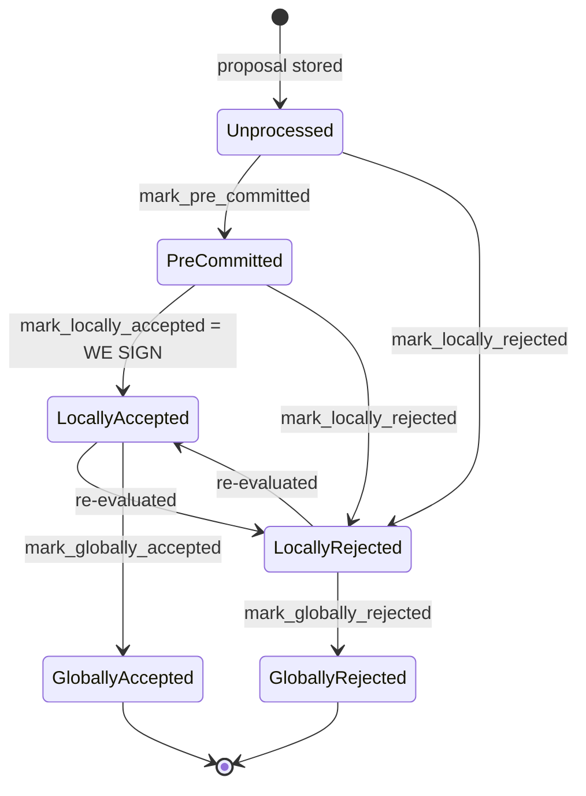

### Title
Miner's block-approval weight tally never revokes a signer's weight after that signer legitimately flips from Accepted to Rejected for the same block — a rejection is silently discarded and the stale acceptance still counts toward the signing threshold - (File: `stacks-node/src/nakamoto_node/stackerdb_listener.rs`)

### Summary
`StackerDBListener` tallies `total_weight_approved` and `total_weight_rejected` per block (keyed by `signer_signature_hash`) using two different dedup sets: the accept path gates on `gathered_signatures` while the reject path gates on `responded_signers`. Because the accept path inserts into *both* sets, a signer who first Accepts and later legitimately re-evaluates and Rejects the same block has their later rejection silently swallowed — the reject path's `responded_signers.insert(slot_id)` returns `false` and none of the reject processing (including any correction of `total_weight_approved`) runs. The signer's weight remains permanently counted toward `total_weight_approved`, even though its authoritative, most recent vote is a rejection.

### Finding Description
In the `BlockResponse::Accepted` branch: [1](#0-0) 
weight is added to `total_weight_approved` gated on `!block.gathered_signatures.contains_key(&slot_id)`, and then the code unconditionally inserts the slot into *both* `gathered_signatures` and `responded_signers`.

In the `BlockResponse::Rejected` branch: [2](#0-1) 
the weight accounting (and all subsequent bookkeeping — reason logging, per-txid `failed_txids` tracking, idle-timestamp update ordering) is gated on `block.responded_signers.insert(slot_id)`.

If a signer sends Accepted for a block and later sends Rejected for the *same* `signer_signature_hash` (a fully legitimate protocol event — the signer-side state machine explicitly allows `LocallyAccepted --> LocallyRejected : re-evaluated`): [3](#0-2) 
then at the time the Rejected message arrives, `responded_signers` already contains `slot_id` (inserted during the earlier Accepted processing), so `responded_signers.insert(slot_id)` returns `false`, and the entire reject-processing block — including any means of undoing the earlier `total_weight_approved` addition — is skipped. There is no code path anywhere in `StackerDBListener` that ever decrements `total_weight_approved` for a slot once added. Nothing in `BlockStatus` (`responded_signers: HashSet<u32>`, `gathered_signatures: BTreeMap<u32, MessageSignature>`, `total_weight_approved: u32`, `total_weight_rejected: u32`) tracks "current vote" vs "historical votes" — it is a monotonically-increasing counter per block. [4](#0-3) 

This breaks the aggregated-weight vs. verified-accepts equality that the miner relies on to decide when a block has crossed the 70% approval threshold and can be pushed/broadcast: [5](#0-4) 
`total_weight_approved` can retain phantom weight from a signer that has since rejected the block, letting the miner believe it has enough distinct signer support when it does not.

### Impact Explanation
This is a Critical-class break of the "aggregated-weight vs verified-accepts" equality explicitly called out in scope: the miner's local threshold check (`block.total_weight_approved >= self.weight_threshold`) can be satisfied using weight from a signer whose current, authoritative vote is a rejection. In a scenario where signers are near the 70% threshold and one signer flips from Accepted to Rejected (e.g., because the sortition view changed, a reorg was detected, or its own reevaluation logic determined the block is now invalid per `should_reevaluate_block`), the miner may still treat the block as having crossed threshold based on the stale/retracted acceptance, and proceed to push a block that no longer has legitimate 70% support. This does not require a majority of signers — a single signer's benign vote-flip is sufficient to leave stale weight in the miner's tally.

### Likelihood Explanation
No malicious majority or key compromise is required. The signer-side documentation and state machine explicitly support and expect the `LocallyAccepted -> LocallyRejected` re-evaluation transition as a normal operational path (`should_reevaluate_block`, `mark_locally_rejected`), meaning any single honest signer that re-evaluates and reverses its own decision for a block (which can happen during ordinary tenure/reorg activity) will trigger this stale-weight condition on the miner side. This requires no more than one signer's normal message flow plus the node's own stackerdb listener processing — squarely within a "one-slot miner (plus gossip)" trigger.

### Recommendation
Track each signer's *current* vote per block (e.g., an enum `Approved`/`Rejected` per slot instead of two independent sets), and recompute `total_weight_approved`/`total_weight_rejected` from the current set of votes rather than monotonically accumulating weight. When a later message from the same slot supersedes an earlier one (Accept -> Reject or vice versa), the previous weight contribution must be subtracted from its bucket and added to the new one, keeping `total_weight_approved + total_weight_rejected <= total_weight` at all times as an invariant.

### Proof of Concept
1. Miner proposes block B with `signer_signature_hash = H`; `StackerDBListener` creates `BlockStatus` entry for `H`.
2. Signer S (weight `w`) sends `BlockResponse::Accepted` for `H`. `total_weight_approved += w`; `gathered_signatures` and `responded_signers` both gain `slot_id(S)`.
3. Signer S subsequently re-evaluates (e.g. `should_reevaluate_block` triggers due to a changed sortition view) and legitimately transitions `LocallyAccepted -> LocallyRejected`, sending `BlockResponse::Rejected` for the same `H`.
4. In `StackerDBListener`, `block.responded_signers.insert(slot_id(S))` returns `false` (already present from step 2) — the whole reject-processing branch (weight accounting, logging, failed-txid tracking) is skipped entirely.
5. `total_weight_approved` still includes `w` from step 2, even though S's current/latest vote is a rejection. If enough other signers approve, the miner's threshold check at line 467 can fire using this stale weight, incorrectly concluding the block has sufficient approving weight.

### Citations

**File:** stacks-node/src/nakamoto_node/stackerdb_listener.rs (L70-82)
```rust
#[derive(Debug, Clone)]
pub struct BlockStatus {
    /// Set of the slot ids of signers who have responded
    pub responded_signers: HashSet<u32>,
    /// Map of the slot id of signers who have signed the block and their signature
    pub gathered_signatures: BTreeMap<u32, MessageSignature>,
    /// Total weight of signers who have signed the block
    pub total_weight_approved: u32,
    /// Total weight of signers who have rejected the block
    pub total_weight_rejected: u32,
    /// Per-txid rejection tracking from signers
    pub failed_txids: HashMap<Txid, FailedTxInfo>,
}
```

**File:** stacks-node/src/nakamoto_node/stackerdb_listener.rs (L443-465)
```rust
                        if !block.gathered_signatures.contains_key(&slot_id) {
                            block.total_weight_approved = block
                                .total_weight_approved
                                .saturating_add(signer_entry.weight);

                            info!("StackerDBListener: Signature Added to block";
                                "signer_signature_hash" => %block_sighash,
                                "signer_pubkey" => signer_pubkey.to_hex(),
                                "signer_slot_id" => slot_id,
                                "signature" => %signature,
                                "signer_weight" => signer_entry.weight,
                                "total_weight_approved" => block.total_weight_approved,
                                "percent_approved" => block.total_weight_approved as f64 / self.total_weight as f64 * 100.0,
                                "total_weight_rejected" => block.total_weight_rejected,
                                "percent_rejected" => block.total_weight_rejected as f64 / self.total_weight as f64 * 100.0,
                                "weight_threshold" => self.weight_threshold,
                                "tenure_extend_timestamp" => tenure_extend_timestamp,
                                "read_count_extend_timestamp" => read_count_extend_timestamp,
                                "server_version" => metadata.server_version,
                            );
                        }
                        block.gathered_signatures.insert(slot_id, signature);
                        block.responded_signers.insert(slot_id);
```

**File:** stacks-node/src/nakamoto_node/stackerdb_listener.rs (L467-470)
```rust
                        if block.total_weight_approved >= self.weight_threshold {
                            // Signal to anyone waiting on this block that we have enough signatures
                            cvar.notify_all();
                        }
```

**File:** stacks-node/src/nakamoto_node/stackerdb_listener.rs (L515-518)
```rust
                        if block.responded_signers.insert(slot_id) {
                            block.total_weight_rejected = block
                                .total_weight_rejected
                                .saturating_add(signer_entry.weight);
```

**File:** docs/signer-flows.md (L130-150)
```markdown
## 2. Block lifecycle (`BlockState`)

Every proposal tracked in the signer DB carries a `BlockState`. **`PreCommitted`
carries no signature**: it means "validated, willing to sign if the pre-commit
threshold is met." The first signature appears at `mark_locally_accepted`.
Global states are terminal against each other.


```
