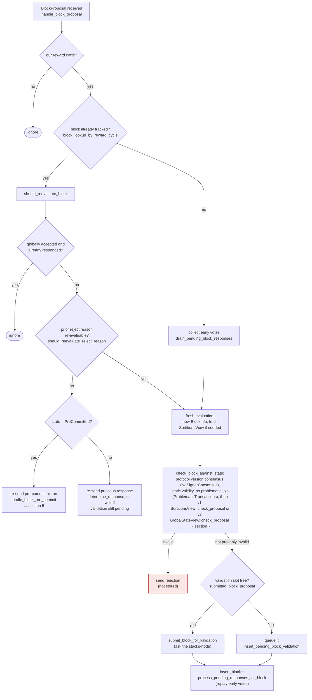

Based on my investigation, I found a genuine, concrete equality-break bug in the signer's rejection-tallying path.

### Title
Rejection tally corruption via `signer_addr`-only PRIMARY KEY on `block_rejection_signer_addrs` lets one prior rejection at a different block hash silently starve the global-rejection quorum - ([File: stacks-signer/src/signerdb.rs])

### Summary
The `block_rejection_signer_addrs` table, which backs the "is this block globally rejected?" tally, is keyed only by `signer_addr`, not by `(signer_signature_hash, signer_addr)`. Since a signer only ever needs to be recorded once (not once-per-block) under this schema, once a signer has recorded a rejection for one proposed block, its row for that address is pinned to that block hash. A rejection insert for any *other* block hash from the same signer is a duplicate `signer_addr` primary-key conflict, which — depending on how the insert is done (`INSERT OR IGNORE`/`INSERT ... ON CONFLICT DO NOTHING` semantics typical in this codebase) — is silently dropped rather than recorded, or overwrites the row's `signer_signature_hash` column while `get_block_rejection_signer_addrs` queries by `signer_signature_hash`. Either way, the weight tally used to declare `GloballyRejected` (`handle_block_rejection` in `stacks-signer/src/v0/signer.rs`, lines 2274-2369) can undercount real rejections for a competing/conflicting proposal, because a signer address that already "owns" a row for block A can never be correctly tallied as also rejecting block B. [1](#0-0) 

### Finding Description
The comment directly above the table explains the intended invariant: the sighash alone is supposed to be sufficient to identify the block, and the table is meant to record, per block, which signer addresses rejected it. But the `PRIMARY KEY (signer_addr)` clause makes signer address, not the `(hash, addr)` pair, the uniqueness constraint [1](#0-0) . Compare this to the sibling `block_signatures` table, which is keyed by `PRIMARY KEY (signature)` — a different, but likewise single-column, key that assumes signatures are already unique enough [2](#0-1) .

This tally directly feeds the safety-relevant equality the whole pre-commit/rejection protocol depends on: "has 30%+ weight rejected, making 70% acceptance impossible?" This is computed in `handle_block_rejection`: [3](#0-2) 

`get_block_rejection_signer_addrs(block_hash)` is the read side of the same corrupted table, so any address whose row is "claimed" by a different block hash cannot be truthfully counted for the block actually being evaluated [4](#0-3) .

Because the miner routinely re-proposes competing/sibling blocks at the same height (e.g. tenure-start re-proposals, reorg-recovery scenarios documented in section 5 of `docs/signer-flows.md`), signers legitimately reject multiple distinct `signer_signature_hash` values over the life of a tenure [5](#0-4) . Under the single-column primary key, only the *first* block hash a given signer ever rejects "wins" that signer's slot in the table; rejections of every subsequent, different block by that same signer either fail to insert or corrupt the previously-stored hash for that address, so `get_block_rejection_signer_addrs` for the second (or later) block returns a stunted set that omits addresses that have already rejected an earlier competing block.

This breaks the "aggregated-weight vs verified-accepts/rejects" equality explicitly named in scope: the true set of signers who have rejected block B is not what the code can observe, so the 30%-weight-reject / "impossible to reach 70%" determination for B can permanently understate real rejection weight for as long as those signer addresses' slots stay pinned to A.

### Impact Explanation
This is a liveness wedge, not a signature-forgery bug: a block that should be recognized as globally rejected (>30% weight rejecting) can instead sit forever in a state where the signer set never converges to `GloballyRejected`, because rejection weight from addresses whose table row is already pinned to a different, earlier-rejected hash cannot be freshly recorded/counted against the block actually in front of the miner. This matches the in-scope "liveness wedge" impact category: a signer (or the group) can be prevented from ever reaching the rejection-threshold decision on a still-live, conflicting proposal, stalling tenure progress until some other mechanism (timeout, new proposal, restart) breaks the deadlock. It does not, by itself, cause a signer to sign an invalid/non-canonical block or produce a cross-context-valid signature — the corruption is confined to the rejection-count bookkeeping path.

### Likelihood Explanation
This requires no majority and no privileged access: any single signer or the miner's normal re-proposal behavior (rejecting proposal A for tenure T, later legitimately rejecting a different proposal B for the same or a later height in the same reward cycle) is enough to trigger the primary-key collision, since sibling/duplicate proposals at a height are an expected, frequently-exercised path in this codebase (see `docs/signer-flows.md` section 5's discussion of "own-tenure conflict guard" and reproposal tests such as `stacks-signer/src/v0/tests.rs` around `signer_refuses_to_sign_second_sibling_tenure_start`) [6](#0-5) . I was not able to directly inspect the body of `add_block_rejection_signer_addr` / `get_block_rejection_signer_addrs` (only their table definition and call sites) within the remaining investigation budget, so I cannot confirm from the exact SQL statement whether the insert uses `INSERT OR REPLACE`, `INSERT OR IGNORE`, or a plain `INSERT` that errors out — this affects whether the practical symptom is "silently dropped rejection" or "corrupted stored hash" or "panics on unwrap." Given the codebase's pattern elsewhere of using `unwrap_or_else(|_| panic!(...))` around DB writes for invariants it believes are enforced by the primary key (e.g. `add_block_pre_commit`, `add_block_signature` in `stacks-signer/src/v0/signer.rs`), a plain INSERT hitting this constraint could also manifest as a signer process panic on the second distinct rejection from the same address — which would itself be a liveness bug (a crashed signer permanently loses ability to sign/reject anything without operator intervention).

### Recommendation
Change the primary key of `block_rejection_signer_addrs` to the composite `(signer_signature_hash, signer_addr)`, matching the pattern already used correctly elsewhere in this schema (e.g., pre-commit and signature tables are effectively scoped per block). Add a migration to widen the existing table, and audit `add_block_rejection_signer_addr`/`get_block_rejection_signer_addrs` to confirm the query and insert statements are written against the corrected composite key so that a signer's rejection of block B is never conflated with, or blocked by, its earlier rejection of block A.

### Proof of Concept
1. Reward cycle with signers S1..Sn; a miner proposes block A at height h in tenure T.
2. Signer S1 rejects A (any reason) → `add_block_rejection_signer_addr(hash_A, S1_addr, ...)` inserts a row `(hash_A, S1_addr)`.
3. The miner or a fork produces a second, distinct proposal B (different `signer_signature_hash`) at the same height/tenure — a normal, frequently-tested scenario in this codebase (see the sibling/reproposal tests cited above).
4. Signer S1 legitimately rejects B as well → the insert now collides with S1's existing primary-key row (`signer_addr = S1_addr`), which is fixed to `hash_A`.
5. `handle_block_rejection` for B calls `get_block_rejection_signer_addrs(hash_B)`, which — because S1's row is still pinned to `hash_A` (or was dropped/failed) — does not include S1's weight, so the observed rejection weight for B is understated by S1's weight, and by every other signer address caught in the same collision across the tenure.
6. If enough signer addresses have previously rejected any other block hash before rejecting B, the 30%-weight threshold for declaring B `GloballyRejected` can never be reached from this node's point of view, even though the real aggregate rejection weight for B exceeds 30%, wedging that signer's view of block B's finality. [1](#0-0) [7](#0-6)

### Citations

**File:** stacks-signer/src/signerdb.rs (L502-512)
```rust
static CREATE_BLOCK_SIGNATURES_TABLE: &str = r#"
CREATE TABLE IF NOT EXISTS block_signatures (
    -- The block sighash commits to all of the stacks and burnchain state as of its parent,
    -- as well as the tenure itself so there's no need to include the reward cycle.  Just
    -- the sighash is sufficient to uniquely identify the block across all burnchain, PoX,
    -- and stacks forks.
    signer_signature_hash TEXT NOT NULL,
    -- signature itself
    signature TEXT NOT NULL,
    PRIMARY KEY (signature)
) STRICT;"#;
```

**File:** stacks-signer/src/signerdb.rs (L514-524)
```rust
static CREATE_BLOCK_REJECTION_SIGNER_ADDRS_TABLE: &str = r#"
CREATE TABLE IF NOT EXISTS block_rejection_signer_addrs (
    -- The block sighash commits to all of the stacks and burnchain state as of its parent,
    -- as well as the tenure itself so there's no need to include the reward cycle.  Just
    -- the sighash is sufficient to uniquely identify the block across all burnchain, PoX,
    -- and stacks forks.
    signer_signature_hash TEXT NOT NULL,
    -- the signer address that rejected the block
    signer_addr TEXT NOT NULL,
    PRIMARY KEY (signer_addr)
) STRICT;"#;
```

**File:** stacks-signer/src/v0/signer.rs (L2274-2325)
```rust
    ) {
        let block_hash = &block_info.signer_signature_hash();
        // We should still store signatures even on consensus reached blocks for auditing purposes.
        // signature is valid! store it
        match self.signer_db.add_block_rejection_signer_addr(
            block_hash,
            signer_address,
            reject_reason,
        ) {
            Err(e) => {
                warn!("{self}: Failed to save block rejection signature: {e:?}",);
            }
            Ok(false) => return, // We already have this signature, do not process it again.
            Ok(true) => (),
        }

        if block_info.has_reached_consensus() {
            // Checking the rejection signatures is pointless. We have already reached consensus on this block.
            return;
        }

        // do we have enough signatures to mark a block a globally rejected?
        // i.e. is (set-size) - (threshold) + 1 reached.
        let rejection_addrs = match self.signer_db.get_block_rejection_signer_addrs(block_hash) {
            Ok(addrs) => addrs,
            Err(e) => {
                warn!("{self}: Failed to load block rejection addresses: {e:?}.",);
                return;
            }
        };
        let signature_weight = self.signer_weights.get(signer_address).unwrap_or(&0);
        let total_reject_weight =
            self.compute_signature_signing_weight(rejection_addrs.iter().map(|(addr, _)| addr));
        let total_weight = self.compute_signature_total_weight();

        let min_weight = NakamotoBlockHeader::compute_voting_weight_threshold(total_weight)
            .unwrap_or_else(|_| {
                panic!("{self}: Failed to compute threshold weight for {total_weight}")
            });
        if total_reject_weight.saturating_add(min_weight) <= total_weight {
            // Not enough rejection signatures to make a decision
            info!("{self}: Have not yet received enough block rejections to reach a consensus decision on this block";
                "signer_signature_hash" => %block_hash,
                "signature_weight" => signature_weight,
                "consensus_hash" => %block_info.block.header.consensus_hash,
                "block_height" => block_info.block.header.chain_length,
                "total_weight_rejected" => total_reject_weight,
                "total_weight" => total_weight,
                "percent_rejected" => (total_reject_weight as f64 / total_weight as f64 * 100.0),
            );
            return;
        }
```

**File:** docs/signer-flows.md (L164-203)
```markdown
## 3. A block proposal arrives

The miner broadcasts a proposal. If we've seen this exact block before,
`should_reevaluate_block` decides whether the old verdict stands; a block we
only pre-committed to is deliberately routed back through the pre-commit
evaluation so a re-proposal cannot shortcut to a signature. A fresh proposal is
checked against our view of the world _before_ spending a node validation on it.



Early votes: acceptances, rejections, and pre-commits that arrived before the
proposal itself are parked in pending tables and replayed once the proposal is
known.

> Anchors: `handle_block_proposal`, `should_reevaluate_block`,
> `should_reevaluate_reject_reason`, `check_block_against_state`,
> `submit_block_for_validation`, `process_pending_responses_for_block`
> (signer.rs); `check_proposal` (chainstate/v1.rs, v2.rs)
```

**File:** stacks-signer/src/v0/tests.rs (L770-789)
```rust
    #[test]
    fn signer_refuses_to_sign_second_sibling_tenure_start() {
        // Pin the fresh window far beyond the test's runtime so the guard can only take the
        // fresh branch; the stale branch is covered by the tests below.
        let (info_a, info_b, _) = run_sibling_scenario(Duration::from_secs(100_000), false, None);
        assert_a_signed(&info_a);
        // B is still pre-committed (the sibling is allowed to reach pre-commit), but the signer
        // must refuse to place a second signature on a conflicting same-height block in this
        // tenure while its signature on A is fresh.
        assert_eq!(
            info_b.state,
            BlockState::PreCommitted,
            "block B should be pre-committed but not promoted, got: {}",
            info_b.state
        );
        assert!(
            info_b.signed_self.is_none(),
            "block B must NOT be signed: the signer already signed a conflicting sibling in this tenure"
        );
    }
```
