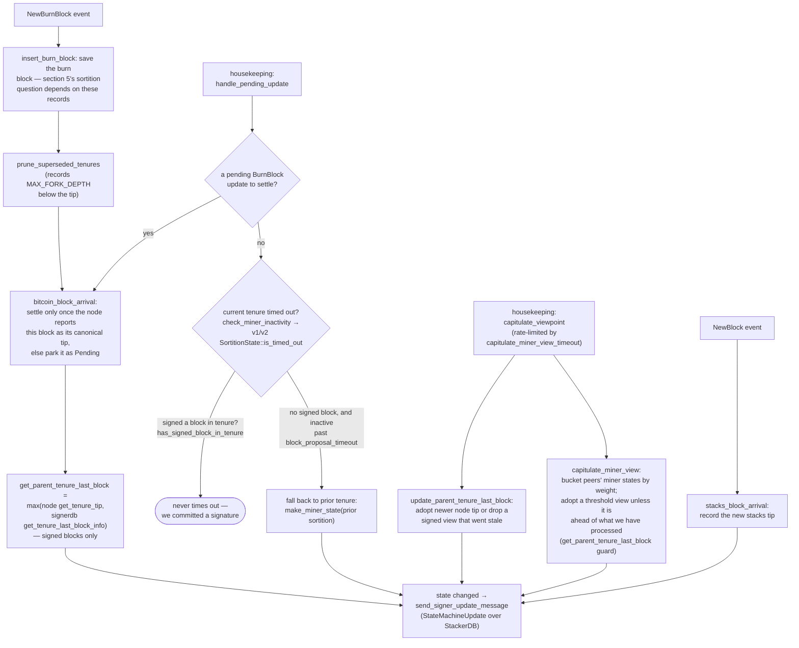

Based on the investigation, I found a concrete analog in the signer codebase. Given the format constraints of this task, here is the structured output:

### Title
Pre-commit-threshold signing skips re-verification of miner/tenure-extend validity checked only at proposal time - (File: stacks-signer/src/chainstate/v2.rs, stacks-signer/src/v0/signer.rs)

### Summary
The Teller bug's root cause is a check performed once at request-submission time (borrower's collateral ownership) that is never re-verified at the later, irreversible action (fund transfer at `lenderAcceptBid`), letting state drift between the two points defeat the lender's expectation. The signer codebase has a structurally identical gap: `GlobalStateView::check_proposal` (v2) performs several validity checks — that the block's miner pubkey hash matches the currently active miner, that the tenure-extend timing/burn-view conditions hold, and that the pox bitvec is all-ones — but these run **only once**, at proposal arrival. The re-check performed just before the irreversible action (placing a signature) is `check_block_against_signer_db_state`, which deliberately omits all of them.

### Finding Description
`GlobalStateView::check_proposal` in [1](#0-0)  validates the proposed block against `MinerState::ActiveMiner` (pubkey hash, tenure id) and the pox bitvec, and separately validates tenure-extend timing conditions (`changed_burn_view`, `enough_time_passed`) in [2](#0-1) . This is the "submission-time" check, analogous to Teller's `submitBid` collateral-ownership check.

The signer only produces its signature after the pre-commit threshold (≥70% weight) is reached, which the project's own documentation notes can happen "minutes" after the initial proposal check [3](#0-2) . Immediately before signing, the signer re-runs `check_block_against_signer_db_state`, but as the code's own doc comment and the flow documentation state, this re-check **only** covers tenure-change-confirms-parent and confirms-latest-block-in-tenure — not the miner pubkey/tenure-id/bitvec/tenure-extend-timing checks from `check_proposal`: [4](#0-3) [5](#0-4) 

Meanwhile, the signer's own view of `current_miner` (`MinerState::ActiveMiner`) is not static — it is mutated by ordinary background operation between proposal and signing: `capitulate_miner_view` can adopt a differing threshold view from peers, `update_parent_tenure_last_block` can drop a signed view that went stale, and a timed-out tenure falls back to the prior miner state, all documented in [6](#0-5) . None of these are majority-controlled operations — they are triggered by ordinary gossip and timing that a single lagging or strategically-timed miner/proposal can influence (e.g., by delaying its own tenure-extend burn-view update, or by causing peers' state-machine updates to disagree during the pre-commit accumulation window).

The equality this breaks is: "a signature is only produced for a block that currently matches the signer's active-miner/tenure/bitvec/tenure-extend view" — but that equality is only checked at t1 (proposal), while the irreversible action (signature) happens at t2, with no guarantee the equality still holds at t2, exactly the "collateral was owned at t1 but not locked until t2" pattern from the Teller report.

### Impact Explanation
If the signer's `current_miner` view legitimately shifts away from the proposed block's miner/tenure between pre-commit and the 70% threshold being crossed, or if a tenure-extend block's timing/burn-view justification becomes stale by the time of signing, the signer can still emit a signature for a block that no longer corresponds to its own current view of the active/canonical miner or tenure-extend legitimacy — a signer signing a now-invalid/stale block, matching the "signer signing an invalid, non-canonical, or conflicting block" Critical-impact category in scope.

### Likelihood Explanation
This requires no majority of signers, no other signer's key, and no auth token — only the normal passage of time between pre-commit accumulation and threshold-crossing (explicitly acknowledged by the codebase's own documentation as taking "minutes") combined with ordinary state-machine update/capitulation traffic that a single miner or a few peers can influence via timing of proposals/burn-view changes.

### Recommendation
Re-run the miner-pubkey-hash, tenure-id, bitvec, and tenure-extend timing/burn-view checks from `GlobalStateView::check_proposal` inside `check_block_against_signer_db_state` (or an equivalent re-check invoked immediately before `mark_locally_accepted`/signing), so the properties validated at proposal time are still guaranteed to hold at the moment the irreversible signature is produced.

### Proof of Concept
1. Miner proposes tenure-extend block B; at t1, `GlobalStateView::check_proposal` validates B against the signer's current `MinerState::ActiveMiner` and passes the tenure-extend timing check (e.g., `changed_burn_view == true`) — see [7](#0-6) .
2. Signer pre-commits to B; pre-commits from peers trickle in slowly (a normal, gossip-timing-dependent process).
3. Before 70% weight is reached, the signer's local `current_miner`/burn-view state updates via `capitulate_miner_view`/`update_parent_tenure_last_block` (ordinary background housekeeping, not requiring a majority) such that B's tenure-extend justification is no longer valid under a fresh `check_proposal` evaluation.
4. Pre-commit threshold is crossed; `check_block_against_signer_db_state` runs but only checks tenure-confirms-parent/latest-block-in-tenure, not the tenure-extend timing or miner-match conditions — see [8](#0-7) .
5. The signer proceeds to sign B despite it no longer satisfying the conditions its own `check_proposal` would require if re-evaluated.

### Citations

**File:** stacks-signer/src/chainstate/v2.rs (L118-163)
```rust
    ) -> Result<(), RejectReason> {
        let MinerState::ActiveMiner {
            current_miner_pkh,
            tenure_id,
            parent_tenure_id,
            ..
        } = &self.signer_state.current_miner
        else {
            info!(
                "No valid current miner. Considering invalid.";
                "block_height" => block.header.chain_length,
                "signer_signature_hash" => %block.header.signer_signature_hash()
            );
            return Err(RejectReason::InvalidMiner);
        };
        if &block.header.consensus_hash != tenure_id {
            info!("Miner block proposal consensus hash does not match the current miner's tenure id. Considering invalid.";
                "block_height" => block.header.chain_length,
                "signer_signature_hash" => %block.header.signer_signature_hash(),
                "block_consensus_hash" => %block.header.consensus_hash,
                "active_miner_tenure_id" => %tenure_id,
                "active_miner_parent_tenure_id" => %parent_tenure_id,
            );
            return Err(RejectReason::ConsensusHashMismatch {
                actual: block.header.consensus_hash.clone(),
                expected: tenure_id.clone(),
            });
        }
        let Some(miner_pk) = block.header.recover_miner_pk() else {
            warn!("Failed to recover miner pubkey";
                  "signer_signature_hash" => %block.header.signer_signature_hash(),
                  "consensus_hash" => %block.header.consensus_hash);
            return Err(RejectReason::IrrecoverablePubkeyHash);
        };
        let miner_pkh = Hash160::from_data(&miner_pk.to_bytes_compressed());
        if current_miner_pkh != &miner_pkh {
            warn!(
                "Miner block proposal pubkey does not match the winning pubkey hash for its sortition. Considering invalid.";
                "proposed_block_consensus_hash" => %block.header.consensus_hash,
                "signer_signature_hash" => %block.header.signer_signature_hash(),
                "proposed_block_pubkey" => &miner_pk.to_hex(),
                "proposed_block_pubkey_hash" => %miner_pkh,
                "active_miner_pubkey_hash" => %current_miner_pkh,
            );
            return Err(RejectReason::PubkeyHashMismatch);
        }
```

**File:** stacks-signer/src/chainstate/v2.rs (L199-298)
```rust
        // is there an unsupported tenure extend type?
        if let Some(tenure_extend) = block.get_tenure_extend_tx_payload().filter(|extend| {
            !(extend.cause.is_full_extend() || extend.cause.is_read_count_extend())
        }) {
            warn!(
                "Miner block proposal contains a tenure extend with an unsupported cause";
                "tenure_extend_cause" => %tenure_extend.cause,
            );
            return Err(RejectReason::InvalidTenureExtend);
        }

        // is there a full tenure extend in this block?
        if let Some(tenure_extend) = block
            .get_tenure_extend_tx_payload()
            .filter(|extend| extend.cause.is_full_extend())
        {
            // in full tenure extends, we need to check:
            // (1) if this is the most recent sortition, an extend is allowed if it changes the burnchain view
            // (2) if this is the most recent sortition, an extend is allowed if enough time has passed to refresh the block limit
            // (3) if we are in replay, an extend is allowed
            let tenure_tip = client.get_tenure_tip(tenure_id)
                .map_err(|e| {
                    warn!("Could not load current tenure tip while evaluating a tenure-extend; cannot approve."; "err" => %e);
                    RejectReason::InvalidTenureExtend
                })?;
            let Some(current_burn_view) = tenure_tip.burn_view else {
                warn!("Tenure-extend attempted in tenure without burn-view.");
                return Err(RejectReason::InvalidTenureExtend);
            };
            let changed_burn_view = tenure_extend.burn_view_consensus_hash != current_burn_view;
            let extend_timestamp = signer_db.calculate_full_extend_timestamp(
                self.config.tenure_idle_timeout,
                block,
                false,
            );
            let epoch_time = get_epoch_time_secs();
            let enough_time_passed = epoch_time >= extend_timestamp;
            let is_in_replay = self.signer_state.tx_replay_set.is_some();
            if !changed_burn_view && !enough_time_passed && !is_in_replay {
                warn!(
                    "Miner block proposal contains a tenure extend, but the conditions for allowing a tenure extend are not met. Considering proposal invalid.";
                    "proposed_block_consensus_hash" => %block.header.consensus_hash,
                    "signer_signature_hash" => %block.header.signer_signature_hash(),
                    "extend_timestamp" => extend_timestamp,
                    "epoch_time" => epoch_time,
                    "is_in_replay" => is_in_replay,
                    "changed_burn_view" => changed_burn_view,
                    "enough_time_passed" => enough_time_passed,
                );
                return Err(RejectReason::InvalidTenureExtend);
            }
        }

        // is there a read-count tenure extend in this block?
        if let Some(tenure_extend) = block
            .get_tenure_extend_tx_payload()
            .filter(|extend| extend.cause.is_read_count_extend())
        {
            // burn view changes are not allowed during read-count tenure extends
            let tenure_tip = client.get_tenure_tip(tenure_id)
                .map_err(|e| {
                    warn!("Could not load current tenure tip while evaluating a tenure-extend; cannot approve."; "err" => %e);
                    RejectReason::InvalidTenureExtend
                })?;
            let Some(current_burn_view) = tenure_tip.burn_view else {
                warn!("Tenure-extend attempted in tenure without burn-view.");
                return Err(RejectReason::InvalidTenureExtend);
            };
            let changed_burn_view = tenure_extend.burn_view_consensus_hash != current_burn_view;
            if changed_burn_view {
                warn!(
                    "Miner block proposal contains a read-count extend, but the conditions for allowing a tenure extend are not met. Considering proposal invalid.";
                    "proposed_block_consensus_hash" => %block.header.consensus_hash,
                    "signer_signature_hash" => %block.header.signer_signature_hash(),
                    "changed_burn_view" => changed_burn_view,
                );
                return Err(RejectReason::InvalidTenureExtend);
            }
            let extend_timestamp = signer_db.calculate_read_count_extend_timestamp(
                self.config.read_count_idle_timeout,
                block,
                false,
            );
            let epoch_time = get_epoch_time_secs();
            let enough_time_passed = epoch_time >= extend_timestamp;
            let is_in_replay = self.signer_state.tx_replay_set.is_some();
            if !enough_time_passed && !is_in_replay {
                warn!(
                    "Miner block proposal contains a read-count extend, but the conditions for allowing a tenure extend are not met. Considering proposal invalid.";
                    "proposed_block_consensus_hash" => %block.header.consensus_hash,
                    "signer_signature_hash" => %block.header.signer_signature_hash(),
                    "extend_timestamp" => extend_timestamp,
                    "epoch_time" => epoch_time,
                    "is_in_replay" => is_in_replay,
                    "changed_burn_view" => changed_burn_view,
                    "enough_time_passed" => enough_time_passed,
                );
                return Err(RejectReason::InvalidTenureExtend);
            }
        }
```

**File:** docs/signer-flows.md (L229-236)
```markdown
## 5. Pre-commit threshold → signature

The only place the signer produces a block signature by counting votes.
Pre-commits from peers (and our own) accumulate; at ≥70% weight the signer
decides whether to follow through. Between validation and threshold, we may have
signed a _different_ block at the same height, possibly in another tenure, so
the world must be re-checked before the signature leaves the box.

```

**File:** docs/signer-flows.md (L425-433)
```markdown
Two things belong to the proposal path only and are **not** re-run at validate-ok
or at signing:

- `validate_tenure_change_payload` rejects with `DuplicateBlockFound` when we
  have already accepted a block in the tenure a tenure-change block is starting.
  v2 counts locally or globally accepted blocks (`get_last_signed_block`); v1
  counts only globally accepted ones (`get_last_globally_accepted_block`).
- the v2 `check_proposal` wrapper checks miner pubkey hash, consensus hash, the
  pox bitvec, and tenure-extend rules before delegating here.
```

**File:** docs/signer-flows.md (L450-476)
```markdown
## 8. Burn blocks & the miner-view state machine

Independent of any single block, the signer maintains a view of _who the current
miner is and what they should build on_, and broadcasts it as a
`StateMachineUpdate`. The whole miner state, including
`parent_tenure_last_block`, is the equality key for global agreement, so what
this flow computes is consensus-visible.


```

**File:** stacks-signer/src/v0/signer.rs (L1345-1366)
```rust
        if let Some(block_rejection) =
            self.check_block_against_signer_db_state(stacks_client, &block_info.block)
        {
            warn!(
                "{self}: Reached the pre-commit threshold for a block, but it no longer passes the chainstate checks. Rejecting.";
                "signer_signature_hash" => %block_hash,
                "block_height" => block_info.block.header.chain_length,
                "reject_code" => %block_rejection.reason_code,
                "reject_reason" => &block_rejection.reason,
            );
            if let Err(e) = block_info.mark_locally_rejected() {
                if !block_info.has_reached_consensus() {
                    warn!("{self}: Failed to mark block as locally rejected: {e:?}");
                }
            };
            self.signer_db
                .insert_block(&block_info)
                .unwrap_or_else(|e| self.handle_insert_block_error(e));
            self.handle_block_rejection(&block_rejection, sortition_state);
            self.send_block_response(&block_info.block, block_rejection.into());
            return;
        }
```

**File:** stacks-signer/src/v0/signer.rs (L1799-1803)
```rust
    /// WARNING: This is an incomplete check. Do NOT call this function PRIOR to check_proposal or block_proposal validation succeeds.
    ///
    /// Re-verify a block's chain length against the last signed block within signerdb.
    /// This is required in case a block has been approved since the initial checks of the block validation endpoint.
    fn check_block_against_signer_db_state(
```
