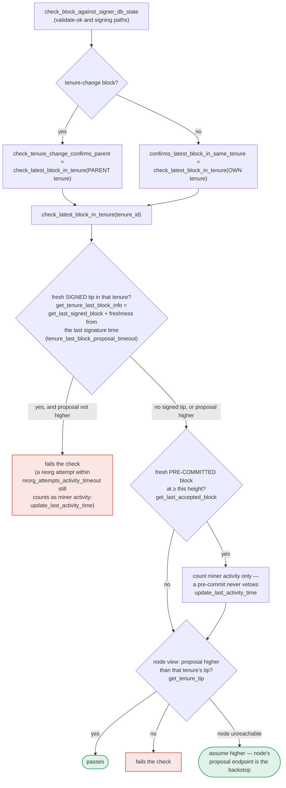

### Title
Signer re-validates only tenure/parent freshness—not miner identity/consensus-hash—before the irreversible signing action, allowing a signature on a block whose miner is no longer canonical - (File: stacks-signer/src/v0/signer.rs, stacks-signer/src/chainstate/v2.rs)

### Summary
The full proposal check (`GlobalStateView::check_proposal` / `SortitionsView::check_proposal`) verifies that a proposed block's `consensus_hash` and miner pubkey hash match the *currently active* miner's tenure before storing the proposal. But the re-validation that gates the actual signing action — run when the pre-commit weight threshold is crossed (`handle_block_pre_commit`) and at validate-ok — calls the narrower `check_block_against_signer_db_state`, which only re-runs tenure/parent-freshness logic (`check_latest_block_in_tenure`), not the miner-identity/consensus-hash/bitvec/tenure-extend checks. This mirrors the Treasury bug: a broad, always-rechecked gate (`globalPause`-analog = tenure/parent-tip freshness) is enforced everywhere, but the specific gate (`marketPaused`-analog = "is this block still tied to the currently active miner's tenure?") is enforced only once, at intake, and never re-verified before the value-bearing action (a signature) is produced.

### Finding Description
`GlobalStateView::check_proposal` in `stacks-signer/src/chainstate/v2.rs` requires `MinerState::ActiveMiner` and checks `block.header.consensus_hash == tenure_id` and the recovered miner pubkey hash against `current_miner_pkh`, returning `ConsensusHashMismatch`/`PubkeyHashMismatch` otherwise: [1](#0-0) 

This full check runs at proposal intake (`handle_block_proposal` → `check_block_against_state` → `check_block_against_global_state`): [2](#0-1) 

But the check that gates the actual signature — invoked when a block crosses the pre-commit weight threshold in `handle_block_pre_commit`, the one point at which the signer commits an irreversible signature — is the narrower `check_block_against_signer_db_state`, not the full `check_proposal`: [3](#0-2) 

The documentation for this codebase confirms that `check_block_against_signer_db_state` only re-runs `check_latest_block_in_tenure`-style logic, and explicitly calls out that the miner-identity checks are proposal-path only and never re-run at validate-ok or at signing: [4](#0-3) 

So the equality that should hold — "the block I am about to sign still belongs to the miner/tenure my current global state considers active" — is checked once at proposal time but not re-verified at the moment the signature is actually produced. In the window between initial validation and pre-commit-threshold crossing (which can take up to the full pre-commit collection period, since the code explicitly re-runs chainstate checks "before putting a signature over the block" but only the tenure-freshness subset), the signer's global state can advance to a new `ActiveMiner` (via `handle_state_machine_update`/global state evaluation reacting to a new sortition) while the stale block's own tenure/parent state still passes `check_latest_block_in_tenure` (that function only asks whether this specific tenure's chain-of-blocks is still un-superseded, not whether this tenure is still the globally active one).

### Impact Explanation
This breaks the "approved-parent vs canonical" / "signer signing a non-canonical or conflicting block" invariant: a signer can put its signature on a block proposed by a miner that its own global state machine no longer recognizes as the active miner (e.g., after a new sortition), because the specific `ConsensusHashMismatch`/`PubkeyHashMismatch` gate is never re-asked at the signing moment. This falls under the Critical impact category defined by the rules ("a signer signing an invalid, non-canonical, or conflicting block").

### Likelihood Explanation
This requires only a single miner/proposer plus normal gossip timing (a new sortition/tenure-change landing during the pre-commit collection window for an in-flight proposal), which is reachable by a one-slot miner or by ordinary burnchain-fork timing — no majority of signers, no other signer's key, and no local/auth-token access is needed.

### Recommendation
Re-run the full `check_proposal` (or at minimum the consensus-hash/miner-pubkey-hash/bitvec checks) inside `check_block_against_signer_db_state`/`handle_block_pre_commit`, and at validate-ok, immediately before a signature is produced — not just the tenure/parent-freshness subset — so that a change in the globally active miner state between proposal intake and pre-commit-threshold crossing causes the stale block to be rejected rather than signed.

### Proof of Concept
1. Miner M proposes block B in tenure T; B's `consensus_hash`/miner pubkey hash matches the signer's current `ActiveMiner` state, so `check_proposal` passes and B is stored (`stacks-signer/src/v0/signer.rs:1671-1719`).
2. Before the pre-commit weight threshold is reached, a new sortition elects miner M' for tenure T'; the signer's `GlobalStateEvaluator`/local state machine updates `current_miner` to M'/T' via `handle_state_machine_update`/`handle_pending_update` (docs: `docs/signer-flows.md:78-129`).
3. Enough other signers still pre-commit to B (they may be lagging in their own state-machine updates), crossing the pre-commit threshold; `handle_block_pre_commit` re-validates B only via `check_block_against_signer_db_state` (`stacks-signer/src/v0/signer.rs:1345-1366`), which never re-checks B's `consensus_hash`/miner pubkey hash against the now-updated `current_miner` (M'/T').
4. The signer signs and broadcasts a signature over B, a block belonging to a miner/tenure its own state machine has already superseded — a signature over a non-canonical/conflicting block, which the initial `check_proposal` gate (chainstate/v2.rs:119-163) was specifically designed to prevent but which is bypassed at the actual signing step.

### Citations

**File:** stacks-signer/src/chainstate/v2.rs (L119-163)
```rust
        let MinerState::ActiveMiner {
            current_miner_pkh,
            tenure_id,
            parent_tenure_id,
            ..
        } = &self.signer_state.current_miner
        else {
            info!(
                "No valid current miner. Considering invalid.";
                "block_height" => block.header.chain_length,
                "signer_signature_hash" => %block.header.signer_signature_hash()
            );
            return Err(RejectReason::InvalidMiner);
        };
        if &block.header.consensus_hash != tenure_id {
            info!("Miner block proposal consensus hash does not match the current miner's tenure id. Considering invalid.";
                "block_height" => block.header.chain_length,
                "signer_signature_hash" => %block.header.signer_signature_hash(),
                "block_consensus_hash" => %block.header.consensus_hash,
                "active_miner_tenure_id" => %tenure_id,
                "active_miner_parent_tenure_id" => %parent_tenure_id,
            );
            return Err(RejectReason::ConsensusHashMismatch {
                actual: block.header.consensus_hash.clone(),
                expected: tenure_id.clone(),
            });
        }
        let Some(miner_pk) = block.header.recover_miner_pk() else {
            warn!("Failed to recover miner pubkey";
                  "signer_signature_hash" => %block.header.signer_signature_hash(),
                  "consensus_hash" => %block.header.consensus_hash);
            return Err(RejectReason::IrrecoverablePubkeyHash);
        };
        let miner_pkh = Hash160::from_data(&miner_pk.to_bytes_compressed());
        if current_miner_pkh != &miner_pkh {
            warn!(
                "Miner block proposal pubkey does not match the winning pubkey hash for its sortition. Considering invalid.";
                "proposed_block_consensus_hash" => %block.header.consensus_hash,
                "signer_signature_hash" => %block.header.signer_signature_hash(),
                "proposed_block_pubkey" => &miner_pk.to_hex(),
                "proposed_block_pubkey_hash" => %miner_pkh,
                "active_miner_pubkey_hash" => %current_miner_pkh,
            );
            return Err(RejectReason::PubkeyHashMismatch);
        }
```

**File:** stacks-signer/src/v0/signer.rs (L944-975)
```rust
    fn check_block_against_global_state(
        &mut self,
        stacks_client: &StacksClient,
        block: &NakamotoBlock,
    ) -> Option<BlockRejection> {
        let signer_signature_hash = block.header.signer_signature_hash();
        let block_id = block.block_id();
        let Some(global_state) = self.global_state_evaluator.determine_global_state() else {
            warn!(
                "{self}: Cannot validate block, no global signer state";
                "signer_signature_hash" => %signer_signature_hash,
                "block_id" => %block_id,
                "local_signer_state" => ?self.local_state_machine
            );
            return Some(self.create_block_rejection(RejectReason::NoSignerConsensus, block));
        };

        let global_state_view = GlobalStateView {
            signer_state: global_state,
            config: self.proposal_config.clone(),
        };

        info!(
            "{self}: Evaluating proposal against global state";
            "signer_state" => ?global_state_view.signer_state,
            "signer_signature_hash" => %signer_signature_hash,
            "block_id" => %block_id,
            "local_signer_state" => ?self.local_state_machine,
        );

        // Check if proposal can be rejected now if not valid against the global state
        match global_state_view.check_proposal(stacks_client, &mut self.signer_db, block) {
```

**File:** stacks-signer/src/v0/signer.rs (L1340-1366)
```rust
        // The chain and signer db state may have changed materially since this block passed the
        // proposal-time checks (e.g. between validation and reaching the pre-commit threshold we
        // may have signed a block that this one would reorg). Re-run the chainstate checks
        // before putting a signature over the block, and respond with a rejection if they no
        // longer pass, just as the block validation response handler does.
        if let Some(block_rejection) =
            self.check_block_against_signer_db_state(stacks_client, &block_info.block)
        {
            warn!(
                "{self}: Reached the pre-commit threshold for a block, but it no longer passes the chainstate checks. Rejecting.";
                "signer_signature_hash" => %block_hash,
                "block_height" => block_info.block.header.chain_length,
                "reject_code" => %block_rejection.reason_code,
                "reject_reason" => &block_rejection.reason,
            );
            if let Err(e) = block_info.mark_locally_rejected() {
                if !block_info.has_reached_consensus() {
                    warn!("{self}: Failed to mark block as locally rejected: {e:?}");
                }
            };
            self.signer_db
                .insert_block(&block_info)
                .unwrap_or_else(|e| self.handle_insert_block_error(e));
            self.handle_block_rejection(&block_rejection, sortition_state);
            self.send_block_response(&block_info.block, block_rejection.into());
            return;
        }
```

**File:** docs/signer-flows.md (L391-434)
```markdown
`check_latest_block_in_tenure` answers "does this block confirm the tip we
expect?" and it runs in three places: at proposal arrival (inside
`check_proposal`), at validate-ok, and at the moment of signing. _Which_ tenure
it is asked about depends on the block: a tenure-change block is checked against
its **parent** tenure, every other block against its **own**. Never both. The
pivotal helper is `get_tenure_last_block_info`, which considers only blocks that
carry a signature (`get_last_signed_block`): a pre-commit never vetoes anything,
it only counts as miner activity.



A failed check becomes a different rejection depending on who asked.
`check_block_against_signer_db_state` returns `SortitionViewMismatch`, or
`ConnectivityIssues` when the lookup itself errored rather than answering; the v2
`check_proposal` path returns `InvalidParentBlock`.

Two things belong to the proposal path only and are **not** re-run at validate-ok
or at signing:

- `validate_tenure_change_payload` rejects with `DuplicateBlockFound` when we
  have already accepted a block in the tenure a tenure-change block is starting.
  v2 counts locally or globally accepted blocks (`get_last_signed_block`); v1
  counts only globally accepted ones (`get_last_globally_accepted_block`).
- the v2 `check_proposal` wrapper checks miner pubkey hash, consensus hash, the
  pox bitvec, and tenure-extend rules before delegating here.

```
