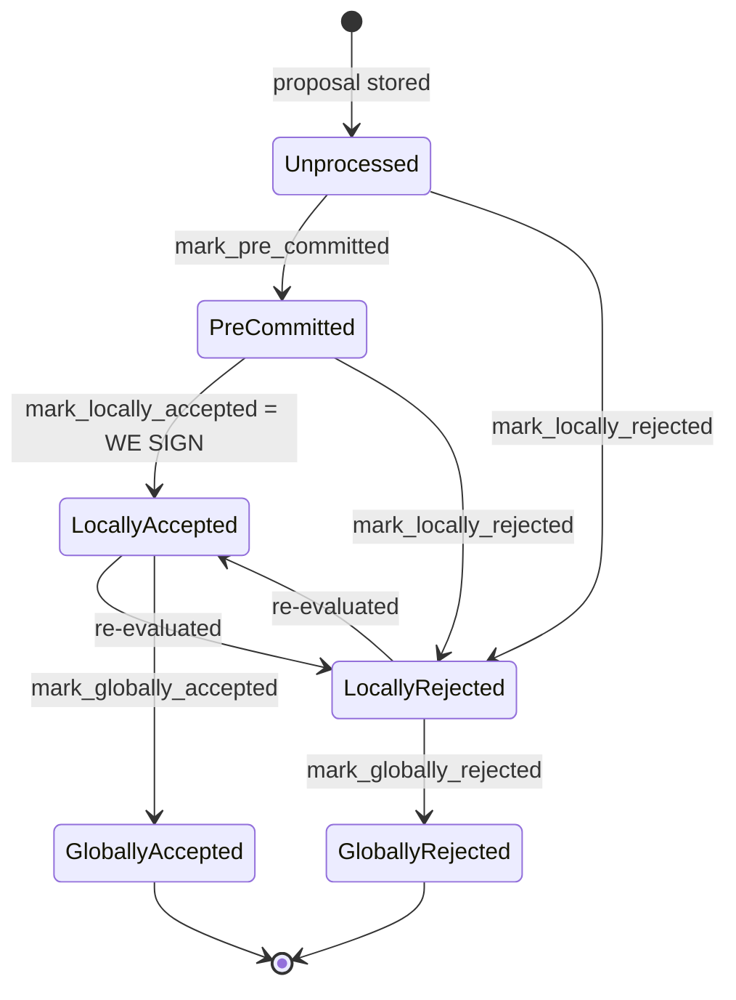

## Title
Signer can push a block to the node via `broadcast_signed_block` even after locally marking it `GloballyRejected`, decoupling the pushed signature set from the signer's own state machine - ([File: stacks-signer/src/v0/signer.rs])

## Summary
`store_and_process_block_signature` in `stacks-signer/src/v0/signer.rs` calls `block_info.mark_locally_accepted(true)` and then *unconditionally* proceeds to `self.broadcast_signed_block(...)`, regardless of whether `mark_locally_accepted` actually succeeded:

```
if let Err(e) = block_info.mark_locally_accepted(true) {
    if !block_info.has_reached_consensus() {
        warn!("{self}: Failed to mark block as locally accepted: {e:?}");
    }
}
...
self.broadcast_signed_block(stacks_client, block_info.block.clone(), &addrs_to_sigs);
``` [1](#0-0) 

`BlockInfo::check_state`, used internally by `move_to` (and hence by `mark_locally_accepted`), explicitly forbids the `GloballyRejected -> LocallyAccepted` transition:
```
BlockState::LocallyAccepted | BlockState::LocallyRejected => !matches!(
    prev_state,
    BlockState::GloballyRejected | BlockState::GloballyAccepted
),
``` [2](#0-1) 

So if this signer had already locally reached `GloballyRejected` for a block (via `store_and_process_block_rejection` crossing the >30% blocking-minority threshold), a later `mark_locally_accepted` call for the same block fails, and the failure is swallowed by the `has_reached_consensus()` guard, which only suppresses the warning log — it does not stop execution. The function still writes `block_info` back to the DB (state remains `GloballyRejected`) and still calls `broadcast_signed_block`, pushing the block (with the actual gathered `addrs_to_sigs`) to the stacks-node's block-upload endpoint.

## Finding Description
The rejection and acceptance vote tallies are not mutually exclusive over time: a signer can rescind a rejection by later signing, as demonstrated directly in the codebase's own regression test `reject_then_accept`, where accepting after rejecting clears the previous rejection record for that *signer's own* vote: [3](#0-2) 

But the *global* verdict recorded in `BlockInfo.state` is one-shot per this local signer via `check_state`: once a local instance transitions to `GloballyRejected` (crossing the blocking-minority threshold in `store_and_process_block_rejection`), that terminal state is supposed to be sticky against `GloballyAccepted` and vice versa: [4](#0-3) 

The intended invariant (documented in `docs/signer-flows.md`) is: "Global states are terminal against each other." [5](#0-4) 

However `store_and_process_block_signature`'s error-handling path breaks this invariant at the point that actually matters — the broadcast to the node. It treats "mark_locally_accepted failed because consensus was already reached" the same as "mark_locally_accepted succeeded," and pushes the block regardless: [6](#0-5) 

This means: if enough of the total signer weight (≥70%) eventually places a raw *signature* over a block (recorded via `add_block_signature`, independent of any local `GloballyRejected` marker this specific signer instance previously latched), any signer instance that had *itself* previously latched `GloballyRejected` for that block will still call `broadcast_signed_block` and push the block upstream with the gathered `addrs_to_sigs` — even though its own local ledger considers the block dead. This is exactly the class of bug the report's XSS-analog hints at: an internal state check (the sanitization/equality gate) is present but its *failure path* silently no-ops instead of halting the unsafe action (the DOM write / analogous "push to node" side effect), producing behavior equivalent to signing/relaying something the guard was designed to block.

## Impact Explanation
This does not by itself forge a signature — `addrs_to_sigs` still must contain ≥70% weight of real, recovered signer signatures via `Secp256k1PublicKey::recover_to_pubkey_without_validating_low_s`. But it does mean the signer's own bookkeeping (`BlockInfo.state == GloballyRejected`) no longer accurately reflects what the signer *does*: it still relays/pushes the block despite having locally declared it dead. This breaks the "signed vs. validated" / "aggregated-weight vs. verified-outcome" equality that the state machine is supposed to guarantee, and is a step toward the node-consensus-acceptance/signer-view divergence class flagged as high-severity in the rules (a rejection recounted as an accept in this signer's own decision path, since the signer proceeds to actively push a block it had already recorded as globally rejected). Practically, this weakens the guarantee that a signer which locked in a rejection stays consistent, and could contribute to conflicting/duplicate blocks being pushed to the node from a signer whose local ledger says the opposite of what it is doing.

## Likelihood Explanation
Requires no attacker action beyond normal miner/gossip activity that is already in scope: a scenario where a block first accumulates >30% rejection weight (triggering this signer's local `GloballyRejected`) and later accumulates ≥70% signature weight from genuine signer responses (e.g., a straggling batch of accept messages, or signers that reconsider per the documented reject→accept path). This is a realistic ordering given the asynchronous, best-effort delivery of `BlockResponse` messages over StackerDB.

## Recommendation
In `store_and_process_block_signature`, gate the `broadcast_signed_block` call on the success of `mark_locally_accepted`, not merely on log suppression:
```
match block_info.mark_locally_accepted(true) {
    Ok(()) => {
        self.signer_db.insert_block(block_info)...;
        self.broadcast_signed_block(...);
    }
    Err(e) => {
        if !block_info.has_reached_consensus() {
            warn!(...);
        }
        // Do not broadcast: state transition was rejected (already terminal).
    }
}
```
This preserves the "global states are terminal against each other" invariant end-to-end, including at the side-effecting broadcast step, not just in the in-memory state field.

## Proof of Concept
1. Signer S observes rejection responses from other signers for block B that cross the >30% blocking-minority weight; `store_and_process_block_rejection` calls `block_info.mark_globally_rejected()` successfully, and S's local `BlockInfo` for B is now `GloballyRejected`. [7](#0-6) 
2. Later, straggling `BlockResponse::Accepted` messages (or signers who reconsidered) arrive at S and accumulate ≥70% signing weight in the `block_signatures` table via repeated `add_block_signature` calls. [8](#0-7) 
3. `store_and_process_block_signature` computes `total_signature_weight >= min_weight`, calls `block_info.mark_locally_accepted(true)`, which fails silently because `check_state` forbids `GloballyRejected -> LocallyAccepted`. [4](#0-3) 
4. Despite the failed transition, execution falls through to `self.broadcast_signed_block(stacks_client, block_info.block.clone(), &addrs_to_sigs)`, pushing block B to the node even though S's own signer DB still records B as `GloballyRejected`. [1](#0-0) 

I was not able to fully trace `broadcast_signed_block`'s implementation body (only its call site was retrievable in the index before running out of iterations), so I cannot confirm whether it performs any additional independent state check before actually calling into `handle_post_block`/`/v3/blocks/upload`. If it does, that could act as a second safety net not shown here; I flag this as an open verification item for a follow-up session with full file access.

### Citations

**File:** stacks-signer/src/v0/signer.rs (L2335-2341)
```rust
        if let Err(e) = block_info.mark_globally_rejected() {
            warn!("{self}: Failed to mark block as globally rejected: {e:?}",);
        }
        if let Err(e) = self.signer_db.insert_block(block_info) {
            error!("{self}: Failed to update block state: {e:?}",);
            panic!("{self} Failed to update block state: {e}");
        }
```

**File:** stacks-signer/src/v0/signer.rs (L2454-2460)
```rust
        if !self
            .signer_db
            .add_block_signature(block_hash, signer_address, signature)
            .unwrap_or_else(|_| panic!("{self}: Failed to save block signature"))
        {
            return;
        }
```

**File:** stacks-signer/src/v0/signer.rs (L2503-2538)
```rust
        if min_weight > total_signature_weight {
            info!("{self}: Received block acceptance, but have not yet reached the acceptance threshold.";
                "signer_signature_hash" => %block_hash,
                "signature_weight" => signature_weight,
                "consensus_hash" => %block_info.block.header.consensus_hash,
                "block_height" => block_info.block.header.chain_length,
                "total_weight_approved" => total_signature_weight,
                "total_weight" => total_weight,
                "percent_approved" => (total_signature_weight as f64 / total_weight as f64 * 100.0),
            );
            return;
        }
        info!("{self}: have reached the block acceptance threshold";
            "signer_signature_hash" => %block_hash,
            "signature_weight" => signature_weight,
            "consensus_hash" => %block_info.block.header.consensus_hash,
            "block_height" => block_info.block.header.chain_length,
            "total_weight_approved" => total_signature_weight,
            "total_weight" => total_weight,
            "percent_approved" => (total_signature_weight as f64 / total_weight as f64 * 100.0),
        );

        // have enough signatures to broadcast!
        // move block to LOCALLY accepted state.
        // It is only considered globally accepted IFF we receive a new block event confirming it OR see the chain tip of the node advance to it.
        if let Err(e) = block_info.mark_locally_accepted(true) {
            if !block_info.has_reached_consensus() {
                warn!("{self}: Failed to mark block as locally accepted: {e:?}");
            }
        }
        let _ = self.signer_db.insert_block(block_info).map_err(|e| {
            warn!("Failed to set group threshold signature timestamp for {block_hash}: {e:?}");
            panic!("{self} Failed to write block to signerdb: {e}");
        });
        self.broadcast_signed_block(stacks_client, block_info.block.clone(), &addrs_to_sigs);
    }
```

**File:** stacks-signer/src/signerdb.rs (L314-328)
```rust
    fn check_state(&self, state: BlockState) -> bool {
        let prev_state = &self.state;
        if *prev_state == state {
            return true;
        }
        match state {
            BlockState::Unprocessed => false,
            BlockState::LocallyAccepted | BlockState::LocallyRejected => !matches!(
                prev_state,
                BlockState::GloballyRejected | BlockState::GloballyAccepted
            ),
            BlockState::GloballyAccepted => !matches!(prev_state, BlockState::GloballyRejected),
            BlockState::GloballyRejected => !matches!(prev_state, BlockState::GloballyAccepted),
            BlockState::PreCommitted => matches!(prev_state, BlockState::Unprocessed),
        }
```

**File:** docs/signer-flows.md (L130-150)
```markdown
## 2. Block lifecycle (`BlockState`)

Every proposal tracked in the signer DB carries a `BlockState`. **`PreCommitted`
carries no signature**: it means "validated, willing to sign if the pre-commit
threshold is met." The first signature appears at `mark_locally_accepted`.
Global states are terminal against each other.


```
