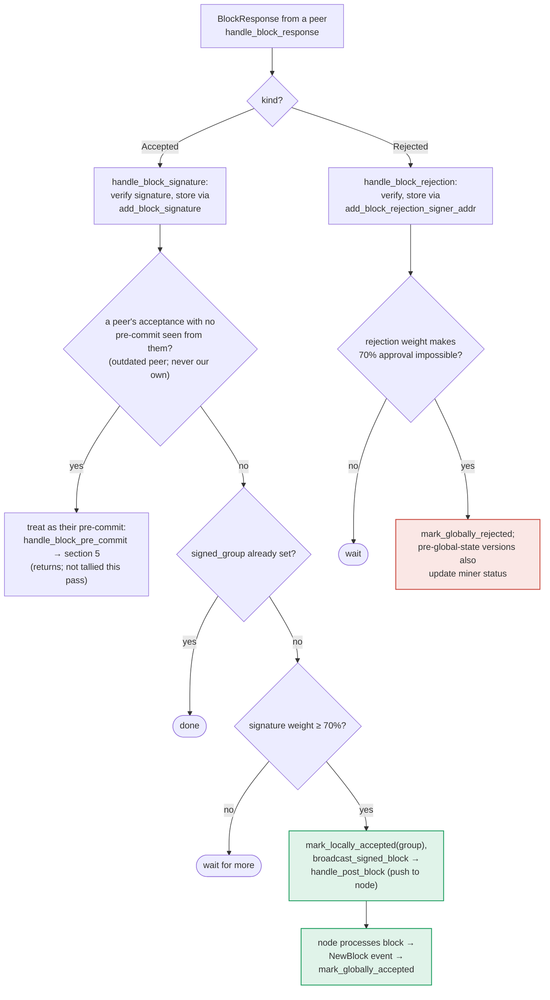

### Title
Miner-side StackerDB tally lets a signer's stale `Accepted` weight remain counted toward the signing threshold even after that same signer broadcasts a `Rejected` vote for the same block - ([File: stacks-node/src/nakamoto_node/stackerdb_listener.rs])

### Summary
The analog of the Bribe `deposit`/`withdraw` asymmetry (increment on one path, no corresponding decrement on the reverse path) exists in `StackerDBListener`'s block-response tally. `total_weight_approved` is only ever added to, never subtracted, and the "already counted" guard used for `Accepted` (`gathered_signatures.contains_key(&slot_id)`) is a *different* set than the guard used for `Rejected` (`responded_signers.insert(slot_id)`), so the two response kinds are not mutually exclusive against each other's weight. A single signer that legitimately flips its local vote for the *same* block (a transition explicitly modeled and permitted by the signer's own state machine, `LocallyAccepted → LocallyRejected` "re-evaluated") ends up with its weight and signature retained in the approved pool even after it broadcasts a rejection.

### Finding Description
`BlockStatus` tracks tallies purely additively: [1](#0-0) 

On `Accepted`, the guard against double counting is keyed on `gathered_signatures`: [2](#0-1) 

On `Rejected`, the guard against double counting is keyed on `responded_signers`: [3](#0-2) 

`responded_signers.insert(slot_id)` is performed unconditionally on *both* branches (line 465 for Accepted, and implicitly reused as the sole gate for Rejected). This means:

- If a signer sends `Accepted` first: `total_weight_approved` is bumped, `gathered_signatures[slot_id]` is set, and `responded_signers` gains `slot_id`. If that same signer later sends `Rejected` for the identical block hash, the `responded_signers.insert(slot_id)` check on the reject path returns `false` (already present), so `total_weight_rejected` is **not** incremented — but crucially, `total_weight_approved` and the stored `gathered_signatures[slot_id]` entry are **never removed or corrected**. The signer's earlier "accept" weight and signature stay permanently counted toward the 70% threshold, even though the signer's final, current vote is a rejection.

This is reachable by a single (one-slot) signer through entirely legitimate protocol logic, not a majority or malicious collusion: the signer's own local state machine explicitly allows `LocallyAccepted → LocallyRejected` on re-evaluation (per `BlockInfo::check_state`, `LocallyAccepted | LocallyRejected` is reachable from anything not yet global): [4](#0-3) 

and the flow doc that maps this state machine explicitly describes this as a supported "re-evaluated" transition and separately documents that the pre-commit/sign path can re-check chainstate and reject even after willingness to sign was previously announced (section 5, "RECHECK -- no --> mark_locally_rejected, handle_block_rejection, broadcast rejection"), i.e., a signer can broadcast an acceptance and later, upon detecting a fresher conflicting/rival block or a chainstate inconsistency, broadcast a rejection for the very same `signer_signature_hash`: [5](#0-4) 

Because the node-side coordinator (`SignerCoordinator::wait_for_signatures` in `signer_coordinator.rs`) treats `total_weight_approved` as ground truth for reaching the signing threshold and directly collects `gathered_signatures` to produce the final aggregate signature set: [6](#0-5) 

the coordinator can push a block to the node carrying the retracted signature of a signer who has since rejected it, and the equality "aggregated approved weight == weight of signers whose *current* vote is accept" is broken — a stale/withdrawn acceptance is effectively counted as a live accept in perpetuity, exactly mirroring how the Bribe contract's `totalVoting` retained stale deposits after a withdrawal because the withdraw path never decremented the counter that deposit had incremented.

### Impact Explanation
This is a Critical-class break under the stated rules ("a rejection recounted as an accept"/an aggregated-weight vs verified-accepts equality violation): a single one-slot signer's later, final rejection of a block does not undo its earlier acceptance contribution in the miner's aggregate tally. The `SignerCoordinator` can therefore assemble and submit to the node a signature set that includes a signer who no longer endorses the block (e.g., because they detected it conflicts with something else they've already signed, or a chainstate recheck failed), producing a block that is pushed and processed by the node with support that does not reflect the live/current signer votes as required by the two-phase acceptance protocol. Depending on when the flip happens relative to reaching threshold, this can let a block cross the 70% bar using phantom weight from a signer who has withdrawn support — undermining the safety property that block adoption reflects genuine, current supermajority agreement.

### Likelihood Explanation
No majority collusion or external actor is required — a single signer's own honest state-machine re-evaluation logic (explicitly documented and coded as a supported transition) is sufficient to produce an `Accepted` followed later by a `Rejected` for the same block hash. The miner-side listener is core, always-running code (`stackerdb_listener.rs`) that processes every signer's `BlockResponse`s, so the condition is trivially reachable during normal operation whenever a signer changes its mind after an initial acceptance (a scenario the protocol clearly anticipates, per the `LocallyAccepted → LocallyRejected` "re-evaluated" transition), making this readily triggerable rather than theoretical.

### Recommendation
Make the weight/tally bookkeeping symmetric and vote-exclusive per slot: track each `slot_id`'s current vote kind (accept/reject) rather than gating on two different sets (`gathered_signatures` vs `responded_signers`). When a later `Rejected` arrives for a slot that previously contributed to `total_weight_approved`, subtract that signer's weight from `total_weight_approved` and remove its entry from `gathered_signatures` before adding it to `total_weight_rejected` (and symmetrically for the reverse flip). This restores the invariant that `total_weight_approved` reflects only signers whose most recent response was acceptance.

### Proof of Concept
1. Signer S (one slot, weight w) broadcasts `BlockResponse::Accepted` for block B. `StackerDBListener` adds `w` to `total_weight_approved`, stores S's signature in `gathered_signatures[S]`, and adds S to `responded_signers`.
2. Before the coordinator collects enough total weight to finalize, S's local state machine re-evaluates B (e.g., detects a conflicting block it already signed at the same height, or a chainstate recheck in the pre-commit/reject path fails) and legitimately transitions `LocallyAccepted → LocallyRejected`, broadcasting `BlockResponse::Rejected` for the same `signer_signature_hash`.
3. In `stackerdb_listener.rs`, the `Rejected` handler checks `block.responded_signers.insert(slot_id)`, which returns `false` because S is already in `responded_signers` from step 1 — so `total_weight_rejected` is not incremented, but nothing undoes `total_weight_approved` or removes S's entry from `gathered_signatures`.
4. Other signers accept, pushing `total_weight_approved` (which still includes S's stale weight) to ≥ `weight_threshold` in `signer_coordinator.rs`'s `wait_for_signatures`. The coordinator collects `gathered_signatures.values()`, which still includes S's signature, and returns it as part of the finalized signature set — even though S's current, final vote is a rejection. [2](#0-1) [3](#0-2) [6](#0-5)

### Citations

**File:** stacks-node/src/nakamoto_node/stackerdb_listener.rs (L70-82)
```rust
#[derive(Debug, Clone)]
pub struct BlockStatus {
    /// Set of the slot ids of signers who have responded
    pub responded_signers: HashSet<u32>,
    /// Map of the slot id of signers who have signed the block and their signature
    pub gathered_signatures: BTreeMap<u32, MessageSignature>,
    /// Total weight of signers who have signed the block
    pub total_weight_approved: u32,
    /// Total weight of signers who have rejected the block
    pub total_weight_rejected: u32,
    /// Per-txid rejection tracking from signers
    pub failed_txids: HashMap<Txid, FailedTxInfo>,
}
```

**File:** stacks-node/src/nakamoto_node/stackerdb_listener.rs (L443-465)
```rust
                        if !block.gathered_signatures.contains_key(&slot_id) {
                            block.total_weight_approved = block
                                .total_weight_approved
                                .saturating_add(signer_entry.weight);

                            info!("StackerDBListener: Signature Added to block";
                                "signer_signature_hash" => %block_sighash,
                                "signer_pubkey" => signer_pubkey.to_hex(),
                                "signer_slot_id" => slot_id,
                                "signature" => %signature,
                                "signer_weight" => signer_entry.weight,
                                "total_weight_approved" => block.total_weight_approved,
                                "percent_approved" => block.total_weight_approved as f64 / self.total_weight as f64 * 100.0,
                                "total_weight_rejected" => block.total_weight_rejected,
                                "percent_rejected" => block.total_weight_rejected as f64 / self.total_weight as f64 * 100.0,
                                "weight_threshold" => self.weight_threshold,
                                "tenure_extend_timestamp" => tenure_extend_timestamp,
                                "read_count_extend_timestamp" => read_count_extend_timestamp,
                                "server_version" => metadata.server_version,
                            );
                        }
                        block.gathered_signatures.insert(slot_id, signature);
                        block.responded_signers.insert(slot_id);
```

**File:** stacks-node/src/nakamoto_node/stackerdb_listener.rs (L515-518)
```rust
                        if block.responded_signers.insert(slot_id) {
                            block.total_weight_rejected = block
                                .total_weight_rejected
                                .saturating_add(signer_entry.weight);
```

**File:** stacks-signer/src/signerdb.rs (L313-329)
```rust
    /// Check if the block state transition is valid
    fn check_state(&self, state: BlockState) -> bool {
        let prev_state = &self.state;
        if *prev_state == state {
            return true;
        }
        match state {
            BlockState::Unprocessed => false,
            BlockState::LocallyAccepted | BlockState::LocallyRejected => !matches!(
                prev_state,
                BlockState::GloballyRejected | BlockState::GloballyAccepted
            ),
            BlockState::GloballyAccepted => !matches!(prev_state, BlockState::GloballyRejected),
            BlockState::GloballyRejected => !matches!(prev_state, BlockState::GloballyAccepted),
            BlockState::PreCommitted => matches!(prev_state, BlockState::Unprocessed),
        }
    }
```

**File:** docs/signer-flows.md (L349-375)
```markdown
## 6. Responses from other signers

Peer acceptances and rejections drive the two consensus outcomes. Acceptances
tally toward the 70% signing threshold and reaching it makes _this_ signer
assemble the signature set and push the block to its node. Rejections tally
toward the blocking minority (>30%), which makes the 70% unreachable and
finalizes the block as globally rejected.


```

**File:** stacks-node/src/nakamoto_node/signer_coordinator.rs (L541-545)
```rust
            } else if block_status.total_weight_approved >= self.weight_threshold {
                info!("Received enough signatures, block accepted";
                    "signer_signature_hash" => %block_signer_sighash,
                );
                return Ok(block_status.gathered_signatures.values().cloned().collect());
```
