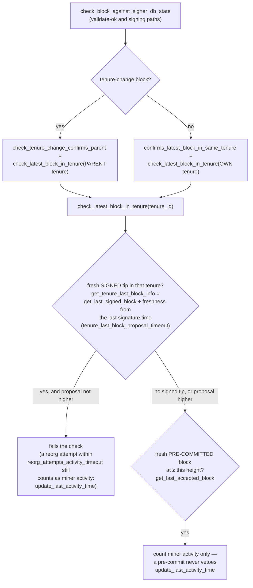

### Title
Miner-controlled `update_last_activity_time` refresh creates a non-expiring inactivity window, indefinitely wedging the fallback-to-prior-miner liveness path - ([File: stacks-signer/src/chainstate/mod.rs])

### Summary
`check_latest_block_in_tenure` refreshes a tenure's "last activity" timestamp (`signer_db.update_last_activity_time`) whenever the *current* miner sends a block proposal that merely repeats/conflicts with an already-known block — even proposals that are ultimately treated as invalid/superseded (a reorg attempt, or a proposal below an already pre-committed/signed height). This is exactly analogous to the aiohttp-session bug class: a value meant to expire and force re-validation of liveness is instead perpetually "recreated" by attacker-controlled traffic before it can expire, producing an unbounded/non-expiring window.

### Finding Description
The signer's only liveness escape hatch for a stalled/unresponsive miner is `check_miner_inactivity` → `SortitionState::is_timed_out`, which falls back to the prior tenure's miner once `now - last_activity > block_proposal_timeout` [1](#0-0) . `last_activity` is *not* derived from meaningful chain progress; it's whatever `signer_db.get_last_activity_time` last recorded, defaulting to the tenure's burn-block-received time if never updated [2](#0-1) .

That timestamp is updated purely from proposal traffic in `check_latest_block_in_tenure`:
- If the proposal's height doesn't exceed the tenure's already-signed tip, but the signed record is a mere `signed_group` observation that is itself still "fresh" (within `reorg_attempts_activity_timeout`), the code calls `update_last_activity_time(&block.header.consensus_hash, now())` and rejects the proposal [3](#0-2) .
- Separately, if the proposal merely conflicts with a fresh *pre-committed* (unsigned) block, the same refresh happens [4](#0-3) .

Both refresh paths are reachable with proposals a single miner can produce entirely on their own — they do not require any other signer's cooperation, a valid/canonical block, or majority participation. Because `update_last_activity_time` is an unconditional `INSERT OR REPLACE` with no upper bound or "already refreshed too many times" guard [5](#0-4) , a miner that keeps re-sending trivially-conflicting/duplicate proposals (well below `reorg_attempts_activity_timeout` intervals) resets the activity clock every time, exactly as CVE-2018-1000814 lets an attacker resubmit an expired cookie value to indefinitely extend a session that was supposed to expire.

The result: `is_timed_out` can never observe `elapsed > timeout` because `last_activity` is continuously bumped forward by the same non-progressing miner, so the fallback-to-prior-miner path (the intended liveness recovery when the current miner has gone dead/misbehaving) never fires — even though the miner produces no valid, chain-advancing block. Note the guard the code *does* have — `has_signed_block_in_tenure` short-circuiting to "never timed out" once a real signature exists [6](#0-5)  — is a *different*, intentional rule and does not apply here: this analog covers the case where no block has ever been signed, so the only thing keeping the timeout from firing is the repeatedly-refreshed `last_activity_time`, not a legitimate signature.

### Impact Explanation
This is a High-severity liveness wedge on the "miner inactivity" state machine: a malicious or misbehaving one-slot miner can, without any signature or valid block, prevent all signers from timing out its dead/stuck tenure and reverting to the prior (still-live) miner. This directly matches the analog rubric's "a signer wedged into never signing valid blocks... or acting on a stale reward set/threshold" — here the signer set is wedged acting on a stale "miner is still active" view indefinitely, stalling the chain's tenure-fallback recovery mechanism as long as the malicious miner keeps sending cheap conflicting/duplicate proposals faster than `reorg_attempts_activity_timeout`.

### Likelihood Explanation
High likelihood of reachability: the attacker is the current sortition-winning miner (a role attainable by any miner who wins a single sortition), requires no other signer's key or majority, and the refresh conditions (proposal height ≤ existing tip, or conflicting with a still-fresh pre-commit) are trivially satisfiable by resubmitting the same or a slightly modified proposal on a timer shorter than `reorg_attempts_activity_timeout` (default 200s) and `block_proposal_timeout`. No cryptographic or consensus threshold is needed to trigger the refresh — only that the proposal reach `check_latest_block_in_tenure`, which happens at proposal arrival, at validate-ok, and at signing time [7](#0-6) .

### Recommendation
Bound the number/effect of activity refreshes that originate from non-advancing proposals: e.g., only count the first refresh per burn view, cap total refresh time by `block_proposal_timeout` from the *original* `last_activity_time` set (rather than allowing it to be repeatedly pushed forward), or require the refreshing proposal to make some verifiable progress (e.g., higher height than any previously-seen proposal from that miner) before it is allowed to reset the clock in `check_latest_block_in_tenure` (`stacks-signer/src/chainstate/mod.rs`).

### Proof of Concept
1. Miner A wins a tenure but never gets a block signed (e.g., is intentionally stalling or its node is broken but it can still gossip proposals).
2. Miner A repeatedly rebroadcasts a `BlockProposal` at height ≤ the tenure's last pre-committed/signed height, spaced at intervals `< reorg_attempts_activity_timeout` (default 200s) and `< block_proposal_timeout`.
3. Each proposal arrival triggers `check_latest_block_in_tenure`, which detects the conflicting/duplicate proposal is still "fresh" and calls `signer_db.update_last_activity_time(consensus_hash, now())`, rejecting the proposal but resetting the clock [8](#0-7) .
4. `SortitionState::is_timed_out` computes `elapsed = now - last_activity`, which never exceeds `timeout` because `last_activity` keeps being pushed forward [9](#0-8) .
5. `check_miner_inactivity` therefore never falls back to the prior (live) miner's tenure, and the chain stalls behind miner A indefinitely, despite miner A never producing a valid signed block.

### Citations

**File:** stacks-signer/src/chainstate/v2.rs (L46-88)
```rust
    /// Check if the sortition identified by the ConsensusHash is timed out based on
    /// the blocks within the signer db and the block proposal timeout
    pub fn is_timed_out(
        sortition: &ConsensusHash,
        signer_db: &SignerDb,
        eval: &GlobalStateEvaluator,
        local_address: &StacksAddress,
        timeout: Duration,
    ) -> Result<bool, SignerChainstateError> {
        // If we've already signed a block in this tenure, the miner can't have timed out: we have
        // committed a signature to this tenure and must not help abandon it.
        //
        // Importantly, a block we have only pre-committed to does not count! A pre-commit carries
        // no signature, and if it never reaches the pre-commit threshold the tenure can stall
        // indefinitely. Treating it as signed here would suppress the inactivity timeout for
        // exactly the signers that pre-committed, so they could never fall back to the prior
        // miner and the tenure could never recover.
        let has_block = signer_db.has_signed_block_in_tenure(sortition)?;
        if has_block {
            return Ok(false);
        }
        let Some(received_ts) =
            signer_db.get_burn_block_received_time_from_signers(eval, sortition, local_address)?
        else {
            return Ok(false);
        };
        let received_time = UNIX_EPOCH + Duration::from_secs(received_ts);
        let last_activity = signer_db
            .get_last_activity_time(sortition)?
            .map(|time| UNIX_EPOCH + Duration::from_secs(time))
            .unwrap_or(received_time);

        let Ok(elapsed) = std::time::SystemTime::now().duration_since(last_activity) else {
            return Ok(false);
        };
        if elapsed > timeout {
            info!("Sortition has timed out";
                "sorition" => %sortition,
                "timeout" => %timeout.as_secs(),
                "elapsed" => %elapsed.as_secs()
            )
        }
        Ok(elapsed > timeout)
```

**File:** stacks-signer/src/chainstate/mod.rs (L390-417)
```rust
        if let Some(info) = last_block_info {
            // N.B. this block might not be the last globally accepted block across the network;
            // it's just the highest one in this tenure that we know about.  If this given block is
            // no higher than it, then it's definitely no higher than the last globally accepted
            // block across the network, so we can do an early rejection here.
            if block.header.chain_length <= info.block.header.chain_length {
                warn!(
                    "Miner's block proposal does not confirm as many blocks as we expect";
                    "proposed_block_consensus_hash" => %block.header.consensus_hash,
                    "signer_signature_hash" => %block.header.signer_signature_hash(),
                    "proposed_chain_length" => block.header.chain_length,
                    "expected_at_least" => info.block.header.chain_length + 1,
                );
                if info.signed_group.is_none_or(|signed_time| {
                    signed_time + reorg_attempts_activity_timeout.as_secs() > get_epoch_time_secs()
                }) {
                    // Note if there is no signed_group time, this is a locally accepted block (i.e. tenure_last_block_proposal_timeout has not been exceeded).
                    // Treat any attempt to reorg a locally accepted block as valid miner activity.
                    // If the call returns a globally accepted block, check its globally accepted time against a quarter of the block_proposal_timeout
                    // to give the miner some extra buffer time to wait for its chain tip to advance
                    // The miner may just be slow, so count this invalid block proposal towards valid miner activity.
                    if let Err(e) = signer_db.update_last_activity_time(
                        &block.header.consensus_hash,
                        get_epoch_time_secs(),
                    ) {
                        warn!("Failed to update last activity time: {e}");
                    }
                }
```

**File:** stacks-signer/src/chainstate/mod.rs (L422-447)
```rust
        // A block we have only pre-committed to must NOT veto this proposal, but, similar to above
        // this should still count as activity for the miner.
        let last_accepted_block = signer_db
            .get_last_accepted_block(tenure_id)
            .map_err(|e| ClientError::InvalidResponse(e.to_string()))?;
        if let Some(info) = last_accepted_block {
            let is_fresh_pre_commit = info.state == BlockState::PreCommitted
                && info.approved_time.is_some_and(|approved_time| {
                    approved_time.saturating_add(tenure_last_block_proposal_timeout.as_secs())
                        > get_epoch_time_secs()
                });
            if is_fresh_pre_commit && block.header.chain_length <= info.block.header.chain_length {
                info!(
                    "Miner's block proposal conflicts with a block we have only pre-committed to. Counting it as miner activity, but not rejecting the proposal.";
                    "proposed_block_consensus_hash" => %block.header.consensus_hash,
                    "signer_signature_hash" => %block.header.signer_signature_hash(),
                    "proposed_chain_length" => block.header.chain_length,
                    "pre_committed_signer_signature_hash" => %info.block.header.signer_signature_hash(),
                    "pre_committed_chain_length" => info.block.header.chain_length,
                );
                if let Err(e) = signer_db
                    .update_last_activity_time(&block.header.consensus_hash, get_epoch_time_secs())
                {
                    warn!("Failed to update last activity time: {e}");
                }
            }
```

**File:** stacks-signer/src/signerdb.rs (L2248-2257)
```rust
    /// Update the tenure (identified by consensus_hash) last activity timestamp
    pub fn update_last_activity_time(
        &mut self,
        tenure: &ConsensusHash,
        last_activity_time: u64,
    ) -> Result<(), DBError> {
        debug!("Updating last activity for tenure"; "consensus_hash" => %tenure, "last_activity_time" => last_activity_time);
        self.db.execute("INSERT OR REPLACE INTO tenure_activity (consensus_hash, last_activity_time) VALUES (?1, ?2)", params![tenure, u64_to_sql(last_activity_time)?])?;
        Ok(())
    }
```

**File:** docs/signer-flows.md (L389-410)
```markdown
## 7. The chainstate checks (shared)

`check_latest_block_in_tenure` answers "does this block confirm the tip we
expect?" and it runs in three places: at proposal arrival (inside
`check_proposal`), at validate-ok, and at the moment of signing. _Which_ tenure
it is asked about depends on the block: a tenure-change block is checked against
its **parent** tenure, every other block against its **own**. Never both. The
pivotal helper is `get_tenure_last_block_info`, which considers only blocks that
carry a signature (`get_last_signed_block`): a pre-commit never vetoes anything,
it only counts as miner activity.


