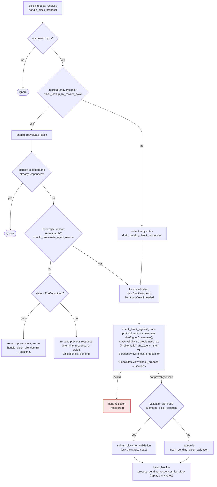

### Title
Rejection-then-acceptance weight double-count in the miner's signer tally - (File: `stacks-node/src/nakamoto_node/stackerdb_listener.rs`)

### Summary
The miner-side `StackerDBListener` that tallies signer responses for a proposed block uses two *different* dedupe sets to guard against double-counting a signer's weight: `gathered_signatures` for `BlockResponse::Accepted` and `responded_signers` for `BlockResponse::Rejected`. Because the `Accepted` branch never checks `responded_signers`, a signer that first rejects a block and later legitimately re-evaluates and accepts the *same* `signer_signature_hash` has its weight counted into `total_weight_rejected` *and* `total_weight_approved` — a rejection literally recounted as an acceptance in the miner's aggregate tally.

### Finding Description
In `stacks-node/src/nakamoto_node/stackerdb_listener.rs`, the event loop processes `SignerMessageV0::BlockResponse` variants for a given `block_sighash`:

- On `BlockResponse::Accepted`, weight is added to `total_weight_approved` only if the slot isn't already present in `gathered_signatures`, and `responded_signers` is then unconditionally inserted: [1](#0-0) 

- On `BlockResponse::Rejected`, weight is added to `total_weight_rejected` only if `responded_signers.insert(slot_id)` returns `true` (i.e., this is the *first* time this slot is recorded in `responded_signers`, regardless of message kind): [2](#0-1) 

The two guards are asymmetric:
- Accept → Reject (same signer, same block): the reject handler's `responded_signers.insert(slot_id)` returns `false` (already inserted by the earlier Accept), so the reject weight is correctly *not* added again. This direction is safe.
- Reject → Accept (same signer, same block): `responded_signers` already contains the slot from the earlier reject, but the Accept handler never consults `responded_signers` — it only checks `gathered_signatures`, a map the reject path never touches. So the Accept handler adds the signer's weight to `total_weight_approved` even though that same weight is already permanently counted in `total_weight_rejected` (nothing ever decrements `total_weight_rejected`).

This is reachable without any majority or special access: the stacks-signer protocol itself permits a signer to reject a proposal and later accept the identical block once the rejection reason becomes stale/re-evaluable, via `should_reevaluate_reject_reason` / `should_reevaluate_block` in the signer's own proposal-handling logic: [3](#0-2) 

A miner can trigger this on a single signer (e.g. one whose validation transiently fails with a re-evaluable reason such as `ConnectivityIssues`/`SortitionViewMismatch`, or whose local conflict view is momentarily stale) by re-proposing the same block after the transient condition clears, causing that one signer to broadcast `Rejected` and then, on reproposal, `Accepted` for the same `signer_signature_hash`.

### Impact Explanation
`signer_coordinator.rs::get_block_status` uses `total_weight_approved` and `total_weight_rejected` as if they were disjoint partitions of the same fixed `total_weight` to decide whether to push a block (≥ `weight_threshold`) or abort as rejected (`total_weight_rejected + weight_threshold > total_weight`): [4](#0-3) 

Because a single signer's weight can land in both buckets, the sum `total_weight_approved + total_weight_rejected` can exceed the real total weight of distinct opinions, and in particular `total_weight_approved` can be inflated by weight that was already counted as a rejection. This breaks the aggregated-weight vs. verified-accepts equality this consensus-critical threshold relies on: the node can conclude 70% "approved" weight has been reached and push/broadcast a block even though the true distinct approving weight (excluding the double-counted rejecting-then-accepting signer) is lower than intended. This matches the accepted "Critical" impact class: a rejection recounted as an acceptance, corrupting the miner's threshold decision.

### Likelihood Explanation
No majority, no other signer's key, and no auth-token access are required — only one signer flipping its own vote for the same block, which the signer protocol legitimately permits and a miner can induce by re-proposing the same block after a transient/re-evaluable rejection reason clears. This is squarely within the "one-slot miner plus gossip" trigger class specified in scope.

### Recommendation
Use a single per-(block, slot) response record (or check `responded_signers` in the `Accepted` branch, and if already present due to a prior `Rejected`, subtract the previously counted rejection weight from `total_weight_rejected` before adding to `total_weight_approved`, or refuse to flip the tally at all and instead track the latest verdict per slot with weight counted exactly once, updating both totals atomically when a signer's response changes).

### Proof of Concept
1. Miner proposes block `B`. Signer `S` (some non-trivial weight `w`) rejects `B` for a re-evaluable reason (e.g., a transient `ConnectivityIssues`/`SortitionViewMismatch`), which the node's `stackerdb_listener` records: `responded_signers.insert(S)` succeeds, `total_weight_rejected += w`.
2. Condition clears (e.g., node catches up, conflict goes stale) and `S`, per `should_reevaluate_reject_reason`, re-evaluates the identical `signer_signature_hash` and now sends `Accepted`.
3. In the listener's `Accepted` handler, `gathered_signatures` does not yet contain `S`'s slot (never touched by the reject path), so `total_weight_approved += w` executes — `w` is now counted in both `total_weight_approved` and `total_weight_rejected`.
4. If aggregate approvals from other signers plus this double-counted `w` reach `weight_threshold`, the miner in `signer_coordinator::get_block_status` treats the block as accepted and pushes it, even though the real distinct approving weight was `w` short of the threshold. [5](#0-4) [6](#0-5)

### Citations

**File:** stacks-node/src/nakamoto_node/stackerdb_listener.rs (L386-465)
```rust
                    SignerMessageV0::BlockResponse(BlockResponse::Accepted(accepted)) => {
                        let BlockAccepted {
                            signer_signature_hash: block_sighash,
                            signature,
                            metadata,
                            response_data,
                        } = accepted;
                        let tenure_extend_timestamp = response_data.tenure_extend_timestamp;
                        let read_count_extend_timestamp =
                            response_data.tenure_extend_read_count_timestamp;

                        let (lock, cvar) = &*self.blocks;
                        let mut blocks = lock.lock().expect("FATAL: failed to lock block status");

                        let Some(block) = blocks.get_mut(&block_sighash) else {
                            info!(
                                "StackerDBListener: Received signature for block that we did not request. Ignoring.";
                                "signature" => %signature,
                                "signer_signature_hash" => %block_sighash,
                                "slot_id" => slot_id,
                                "signer_set" => self.signer_set,
                            );
                            continue;
                        };

                        let Ok(valid_sig) = signer_pubkey.verify(block_sighash.bits(), &signature)
                        else {
                            warn!(
                                "StackerDBListener: Got invalid signature from a signer. Ignoring."
                            );
                            continue;
                        };
                        if !valid_sig {
                            warn!(
                                "StackerDBListener: Processed signature but didn't validate over the expected block. Ignoring";
                                "signature" => %signature,
                                "signer_signature_hash" => %block_sighash,
                                "slot_id" => slot_id,
                            );
                            continue;
                        }

                        if Self::fault_injection_ignore_signatures() {
                            warn!("StackerDBListener: fault injection: ignoring well-formed signature for block";
                                "signer_signature_hash" => %block_sighash,
                                "signer_pubkey" => signer_pubkey.to_hex(),
                                "signer_slot_id" => slot_id,
                                "signature" => %signature,
                                "signer_weight" => signer_entry.weight,
                                "total_weight_approved" => block.total_weight_approved,
                                "percent_approved" => block.total_weight_approved as f64 / self.total_weight as f64 * 100.0,
                                "total_weight_rejected" => block.total_weight_rejected,
                                "percent_rejected" => block.total_weight_rejected as f64 / self.total_weight as f64 * 100.0,
                            );
                            continue;
                        }

                        if !block.gathered_signatures.contains_key(&slot_id) {
                            block.total_weight_approved = block
                                .total_weight_approved
                                .saturating_add(signer_entry.weight);

                            info!("StackerDBListener: Signature Added to block";
                                "signer_signature_hash" => %block_sighash,
                                "signer_pubkey" => signer_pubkey.to_hex(),
                                "signer_slot_id" => slot_id,
                                "signature" => %signature,
                                "signer_weight" => signer_entry.weight,
                                "total_weight_approved" => block.total_weight_approved,
                                "percent_approved" => block.total_weight_approved as f64 / self.total_weight as f64 * 100.0,
                                "total_weight_rejected" => block.total_weight_rejected,
                                "percent_rejected" => block.total_weight_rejected as f64 / self.total_weight as f64 * 100.0,
                                "weight_threshold" => self.weight_threshold,
                                "tenure_extend_timestamp" => tenure_extend_timestamp,
                                "read_count_extend_timestamp" => read_count_extend_timestamp,
                                "server_version" => metadata.server_version,
                            );
                        }
                        block.gathered_signatures.insert(slot_id, signature);
                        block.responded_signers.insert(slot_id);
```

**File:** stacks-node/src/nakamoto_node/stackerdb_listener.rs (L486-518)
```rust
                    SignerMessageV0::BlockResponse(BlockResponse::Rejected(rejected_data)) => {
                        let (lock, cvar) = &*self.blocks;
                        let mut blocks = lock.lock().expect("FATAL: failed to lock block status");

                        let Some(block) = blocks.get_mut(&rejected_data.signer_signature_hash)
                        else {
                            info!(
                                "StackerDBListener: Received rejection for block that we did not request. Ignoring.";
                                "signer_signature_hash" => %rejected_data.signer_signature_hash,
                                "slot_id" => slot_id,
                                "signer_set" => self.signer_set,
                            );
                            continue;
                        };

                        let rejected_pubkey = match rejected_data.recover_public_key() {
                            Ok(rejected_pubkey) => {
                                if rejected_pubkey != signer_pubkey {
                                    warn!("StackerDBListener: Recovered public key from rejected data does not match signer's public key. Ignoring.");
                                    continue;
                                }
                                rejected_pubkey
                            }
                            Err(e) => {
                                warn!("StackerDBListener: Failed to recover public key from rejected data: {e:?}. Ignoring.");
                                continue;
                            }
                        };

                        if block.responded_signers.insert(slot_id) {
                            block.total_weight_rejected = block
                                .total_weight_rejected
                                .saturating_add(signer_entry.weight);
```

**File:** docs/signer-flows.md (L164-204)
```markdown
## 3. A block proposal arrives

The miner broadcasts a proposal. If we've seen this exact block before,
`should_reevaluate_block` decides whether the old verdict stands; a block we
only pre-committed to is deliberately routed back through the pre-commit
evaluation so a re-proposal cannot shortcut to a signature. A fresh proposal is
checked against our view of the world _before_ spending a node validation on it.



Early votes: acceptances, rejections, and pre-commits that arrived before the
proposal itself are parked in pending tables and replayed once the proposal is
known.

> Anchors: `handle_block_proposal`, `should_reevaluate_block`,
> `should_reevaluate_reject_reason`, `check_block_against_state`,
> `submit_block_for_validation`, `process_pending_responses_for_block`
> (signer.rs); `check_proposal` (chainstate/v1.rs, v2.rs)

```

**File:** stacks-node/src/nakamoto_node/signer_coordinator.rs (L509-545)
```rust
            if block_status
                .total_weight_rejected
                .saturating_add(self.weight_threshold)
                > self.total_weight
            {
                info!(
                    "{}/{} signer weight votes to reject block",
                    block_status.total_weight_rejected, self.total_weight;
                    "signer_signature_hash" => %block_signer_sighash,
                );
                counters.bump_naka_rejected_blocks();

                // Only act on failed txids that a blocking minority (>30% weight) agrees on
                let blocking_minority = self.total_weight.saturating_sub(self.weight_threshold);
                let mut temporarily_excluded_txids = HashSet::new();
                let mut permanently_excluded_txids = HashSet::new();
                for (txid, info) in &block_status.failed_txids {
                    if info.total_weight > blocking_minority {
                        // Do not perma ban txids that only a small minority of signers reported as problematic
                        // But make sure its removed from the next block proposal
                        if info.problematic_weight > blocking_minority {
                            permanently_excluded_txids.insert(txid.clone());
                        } else {
                            temporarily_excluded_txids.insert(txid.clone());
                        }
                    }
                }

                return Err(NakamotoNodeError::SignersRejected {
                    temporarily_excluded_txids,
                    permanently_excluded_txids,
                });
            } else if block_status.total_weight_approved >= self.weight_threshold {
                info!("Received enough signatures, block accepted";
                    "signer_signature_hash" => %block_signer_sighash,
                );
                return Ok(block_status.gathered_signatures.values().cloned().collect());
```
