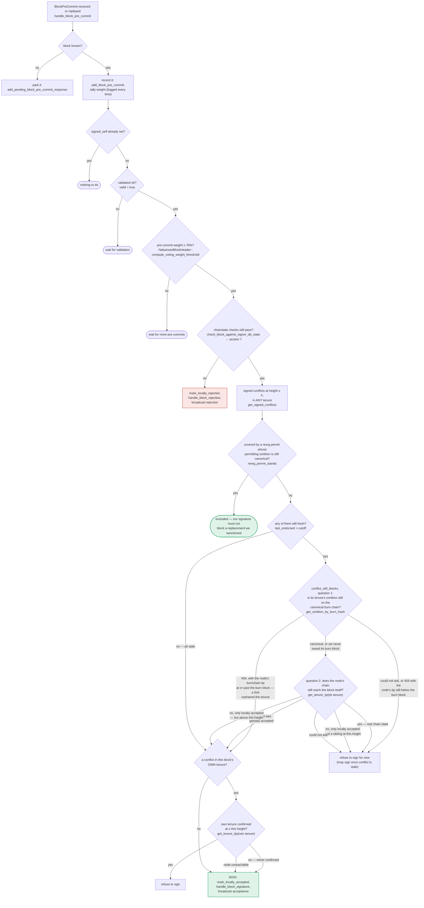

### Title
Unvalidated peer signature is persisted to the signature store before pre-commit/chainstate checks, letting it later count toward the 70% signing threshold - (File: stacks-signer/src/v0/signer.rs)

### Summary
This is analogous to the PoolTogether `drawManager` finding in spirit: a piece of state (`drawManager`) was written unconditionally before any validity/authorization check, and later privileged logic (`withdrawReserve`, `closeDraw`) trusted that state as if it had been validated. In `stacks-signer`, `store_and_process_block_signature` persists a peer's block-acceptance signature to the signer DB unconditionally, *before* the chainstate/conflict checks that `handle_block_pre_commit` performs, and the later signature-tally logic re-reads all persisted signatures without re-checking whether the corresponding block ever passed those checks.

### Finding Description
`store_and_process_block_signature` [1](#0-0)  stores an incoming peer's `BlockAccepted` signature immediately:

```rust
if !self.signer_db.add_block_signature(block_hash, signer_address, signature)... { return; }
if signer_address != &self.stacks_address && !self.signer_db.has_committed(block_hash, signer_address)... {
    self.handle_block_pre_commit(stacks_client, sortition_state, signer_address, block_hash);
    return;
}
```

The signature is written to the DB (`add_block_signature`) unconditionally, regardless of the block's local validity/chainstate outcome. Only *after* that write does the code decide whether the sender is "outdated" (never sent a real pre-commit) and, if so, route the event into `handle_block_pre_commit` for the actual chainstate/conflict re-check documented in the pre-commit flow [2](#0-1) . That re-check can conclude the block is invalid/conflicting and call `mark_locally_rejected` [3](#0-2) , but the peer signature already sitting in the `block_signatures` table is never retracted.

Later, when signature tallying is re-triggered for the same `block_hash` (e.g., by a different, legitimate signer's acceptance for the same hash), `store_and_process_block_signature` recomputes weight purely from `get_block_signatures(block_hash)` [4](#0-3) , with **no check of `block_info.state`** (only `block_info.signed_group.is_some()` is checked at line 2468). This means a rejected/invalid block's already-stored, never-revoked peer signature is folded back into `total_signature_weight` and can help push the tally past `min_weight`, causing this signer to `mark_locally_accepted` and `broadcast_signed_block` [5](#0-4)  for a block that this signer had itself determined was invalid/conflicting.

The equality broken is the same class flagged in the report: state is written as if validated ("signature accepted, contributes to threshold") when it was in fact never authorized/validated for that outcome ("locally rejected"), exactly mirroring `drawManager` being assigned before the zero-address/authorization check, later trusted by `onlyDrawManager`-gated functions.

### Impact Explanation
If exploitable, this breaks the core signer invariant that only validated, unrejected blocks accumulate toward the 70% signature/broadcast threshold. A stale/invalid signature counted this way could contribute to broadcasting a block this signer itself flagged as conflicting or invalid, which maps to the "Critical" bucket (a rejection recounted as an acceptance / signer acting on a stale, unvalidated signature toward finalization).

### Likelihood Explanation
I could not fully confirm this within the available tool budget: I was unable to read `add_block_signature`, `get_block_signatures`, and `has_committed` in `stacks-signer/src/signerdb.rs` to verify (a) whether `add_block_signature` is gated on `block_info.valid`/state, and (b) whether `get_block_signatures` filters by current block state before the weight tally in `store_and_process_block_signature` is computed. The signer-flows doc (section 6) describes the intended "outdated peer" fallback as tallying only pre-commit weight, but the code path shown does not visibly guard the already-persisted signature from being reused in a later weight computation for that same hash. Given this residual uncertainty about `signerdb.rs` internals, I cannot assert this at high confidence without further verification of those functions.

### Recommendation
Verify in `stacks-signer/src/signerdb.rs` whether `get_block_signatures`/`add_block_signature` are filtered by `block_info.state`. If they are not, either (a) delay `add_block_signature` until after `handle_block_pre_commit`'s chainstate re-check succeeds for signers with no prior pre-commit, or (b) have `store_and_process_block_signature` check `block_info.state` (e.g., skip/purge signatures for blocks in `LocallyRejected`/`GloballyRejected`) before computing `total_signature_weight`.

### Proof of Concept
Not confirmed end-to-end due to inability to inspect `signerdb.rs` implementations of `add_block_signature`/`get_block_signatures` in this session; the trace above (lines 2454–2537 of `stacks-signer/src/v0/signer.rs`) is the strongest reachable path found, but requires that verification step to prove the concrete safety break.

### Citations

**File:** stacks-signer/src/v0/signer.rs (L1345-1366)
```rust
        if let Some(block_rejection) =
            self.check_block_against_signer_db_state(stacks_client, &block_info.block)
        {
            warn!(
                "{self}: Reached the pre-commit threshold for a block, but it no longer passes the chainstate checks. Rejecting.";
                "signer_signature_hash" => %block_hash,
                "block_height" => block_info.block.header.chain_length,
                "reject_code" => %block_rejection.reason_code,
                "reject_reason" => &block_rejection.reason,
            );
            if let Err(e) = block_info.mark_locally_rejected() {
                if !block_info.has_reached_consensus() {
                    warn!("{self}: Failed to mark block as locally rejected: {e:?}");
                }
            };
            self.signer_db
                .insert_block(&block_info)
                .unwrap_or_else(|e| self.handle_insert_block_error(e));
            self.handle_block_rejection(&block_rejection, sortition_state);
            self.send_block_response(&block_info.block, block_rejection.into());
            return;
        }
```

**File:** stacks-signer/src/v0/signer.rs (L2442-2467)
```rust
    /// Store the block acceptance signature and check if we have reached a consensus decision on the block because of it. If we have, update the block state accordingly and broadcast the block if accepted.
    fn store_and_process_block_signature(
        &mut self,
        stacks_client: &StacksClient,
        sortition_state: &mut Option<SortitionsView>,
        block_info: &mut BlockInfo,
        signer_address: &StacksAddress,
        signature: &MessageSignature,
    ) {
        let block_hash = &block_info.signer_signature_hash();
        // signature is valid! store it.
        // if this returns false, it means the signature already exists in the DB, so just return.
        if !self
            .signer_db
            .add_block_signature(block_hash, signer_address, signature)
            .unwrap_or_else(|_| panic!("{self}: Failed to save block signature"))
        {
            return;
        }

        // If this isn't our own signature and we haven't seen a pre-commit from this signer yet, try treating it as a pre-commit in case the caller is running an outdated version
        if signer_address != &self.stacks_address && !self.signer_db.has_committed(block_hash, signer_address).inspect_err(|e| warn!("Failed to check if pre-commit message already considered for {signer_address:?} for {block_hash}: {e}")).unwrap_or(false) {
            self.handle_block_pre_commit(stacks_client, sortition_state, signer_address, block_hash);
            return;
        }

```

**File:** stacks-signer/src/v0/signer.rs (L2472-2496)
```rust
        // do we have enough signatures to broadcast?
        // i.e. is the threshold reached?
        let signatures = self
            .signer_db
            .get_block_signatures(block_hash)
            .unwrap_or_else(|_| panic!("{self}: Failed to load block signatures"));

        // put signatures in order by signer address (i.e. reward cycle order)
        let addrs_to_sigs: HashMap<_, _> = signatures
            .into_iter()
            .filter_map(|sig| {
                let Ok(public_key) = Secp256k1PublicKey::recover_to_pubkey_without_validating_low_s(
                    block_hash.bits(),
                    &sig,
                ) else {
                    return None;
                };
                let addr = StacksAddress::p2pkh(self.mainnet, &public_key);
                Some((addr, sig))
            })
            .collect();

        let signature_weight = self.signer_weights.get(signer_address).unwrap_or(&0);
        let total_signature_weight = self.compute_signature_signing_weight(addrs_to_sigs.keys());
        let total_weight = self.compute_signature_total_weight();
```

**File:** stacks-signer/src/v0/signer.rs (L2503-2537)
```rust
        if min_weight > total_signature_weight {
            info!("{self}: Received block acceptance, but have not yet reached the acceptance threshold.";
                "signer_signature_hash" => %block_hash,
                "signature_weight" => signature_weight,
                "consensus_hash" => %block_info.block.header.consensus_hash,
                "block_height" => block_info.block.header.chain_length,
                "total_weight_approved" => total_signature_weight,
                "total_weight" => total_weight,
                "percent_approved" => (total_signature_weight as f64 / total_weight as f64 * 100.0),
            );
            return;
        }
        info!("{self}: have reached the block acceptance threshold";
            "signer_signature_hash" => %block_hash,
            "signature_weight" => signature_weight,
            "consensus_hash" => %block_info.block.header.consensus_hash,
            "block_height" => block_info.block.header.chain_length,
            "total_weight_approved" => total_signature_weight,
            "total_weight" => total_weight,
            "percent_approved" => (total_signature_weight as f64 / total_weight as f64 * 100.0),
        );

        // have enough signatures to broadcast!
        // move block to LOCALLY accepted state.
        // It is only considered globally accepted IFF we receive a new block event confirming it OR see the chain tip of the node advance to it.
        if let Err(e) = block_info.mark_locally_accepted(true) {
            if !block_info.has_reached_consensus() {
                warn!("{self}: Failed to mark block as locally accepted: {e:?}");
            }
        }
        let _ = self.signer_db.insert_block(block_info).map_err(|e| {
            warn!("Failed to set group threshold signature timestamp for {block_hash}: {e:?}");
            panic!("{self} Failed to write block to signerdb: {e}");
        });
        self.broadcast_signed_block(stacks_client, block_info.block.clone(), &addrs_to_sigs);
```

**File:** docs/signer-flows.md (L229-270)
```markdown
## 5. Pre-commit threshold → signature

The only place the signer produces a block signature by counting votes.
Pre-commits from peers (and our own) accumulate; at ≥70% weight the signer
decides whether to follow through. Between validation and threshold, we may have
signed a _different_ block at the same height, possibly in another tenure, so
the world must be re-checked before the signature leaves the box.


